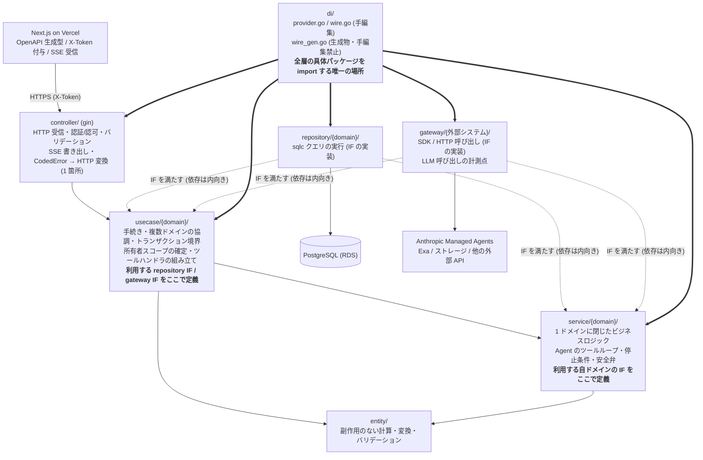

# 本番アーキテクチャ (v0.2 骨格)

> 本書が回答する本番観点: **A-1, A-4, A-6, O-1, O-2, O-3, O-4, O-6, D-1, D-2, D-3, D-5, D-6, D-7** (部分回答を含む)
> 前提とする事実: [poc-inventory.md](../analysis/poc-inventory.md) / [gap-analysis.md](../analysis/gap-analysis.md) /
> 層構成の決定と実測: [requirements-layering.md](../../aidlc-docs/inception/productionization/requirements-layering.md) §2 (F1〜F15) /
> 決定の一次ソース: [questions-layering.md](../../aidlc-docs/inception/productionization/questions-layering.md) (Q-L1〜Q-L11 の回答)
> **可観測性 (O-1〜O-7) の SSOT は [observability.md](observability.md)**。本書は層配置と計測点の所在のみを規定する
> **本書は骨格 (v0.2)**。[未解決の分岐 Q-1 の残り (データ引き継ぎ範囲)・Q-8 (フラグ方式)](../analysis/gap-analysis.md) が決まるまで、
> データモデル (§4) とリリース計画 (§6) は確定しない。確定した節から `design-reviewer` を通す。
> 必須観点の ID 一覧: [08-production-gates.md](../../.claude/rules/08-production-gates.md)

## 1. 現状 (PoC / v2)

[gap-analysis.md](../analysis/gap-analysis.md) の G-1〜G-8 を前提とする。要点のみ:

- PoC は**認証なし・単一テナント・net/http 直書き・ローカル起動**。移植は書き直しになる
- v2 は**gin + 3 層 + sqlc/wire + JWT 認証 + ECS デプロイ**の本番基盤を持つ
- PoC の資産で本番に持ち込む価値が高いのは **LLM 層の設計** (Managed Agents + custom tools +
  台帳パターン + SSE 4 ターン) と、**プロンプト資産**、**振る舞いの仕様 (テスト・AIDLC 産物)**

### 1.1 層構成の設計を左右する v2 の実測 (出典付き)

| # | 事実 | 出典 |
|---|---|---|
| F1 | v2 の**層違反はゼロ** (`usecase/` の `gin.Context` 依存 0 件 / `controller/` の repository 直接参照 0 件) | `hassan-v2-backend/docs/refactoring-plan.md:546` |
| F3 | **にもかかわらず UseCase にロジックが溜まり重複した** — `hassan-v2-backend/usecase/idea/web_search.go` **1381 行** (うち `EnsureValuesFromCitedURL` の 150 行が重複)、`hassan-v2-backend/usecase/business_plan/detailed/brush_up_business_plan_detailed.go` **919 行** (`brushPestel` / `brushMarket` / `brushCompetitor` / `brushHypothesis` / `brushLegal` / `brushEvaluationSummary` の 6 関数が「プロンプト構築 → LLM → JSON 抽出 → パース → OGP 付与 → 保存」をほぼ同一骨格で重複) | 実測 `wc -l` + `hassan-v2-backend/docs/refactoring-plan.md:66`〜`:67` |
| F4 | 「`fmt.Errorf` 禁止」は規約 (`hassan-v2-backend/CLAUDE.md:43`) だが、非テストコードに **約 113 件**残存 (prompt 49 / dify 29 / azuredi 12 / aws 6 / hassanresend 4 / auth 3 ほか)、`errors.New` 7 件 | `hassan-v2-backend/docs/refactoring-plan.md:62` / `:544` |
| F5 | Controller の `err.(*constants.CodedError)` 直接型アサーションが **8 ファイル 61 箇所**のコピペ。判定方法も `errors.As` と直接アサーションで不統一で、**直接アサーションはラップされた `CodedError` を取りこぼす** | `hassan-v2-backend/docs/refactoring-plan.md:545` / `:384` |
| F6 | v2 は**外部サービス側で IF を定義し、UseCase が型エイリアスで直接使用**する (「アダプター層は作らない」)。実測: `usecase/` 配下の型エイリアス **20 箇所** | `hassan-v2-backend/CLAUDE.md:34` + 実測 (例: `hassan-v2-backend/usecase/business_plan/interfaces.go:27` の `type LLMService = llm.Service`) |
| F7 | 一方で **Repository の IF は UseCase 層で定義**している (= repository については依存性逆転が成立している) | `hassan-v2-backend/CLAUDE.md:33` |
| F8 | v2 は **`service/` 追加レイヤーを明示的に禁止**している (「禁止: `helper/` フォルダ、`utils.go`、過度な抽象化 (`internal/`/`service/` 追加レイヤー)」) | `hassan-v2-backend/CLAUDE.md:39` |
| F9 | v2 に **golangci-lint 設定が無く**、CI は `go test` のみ = **層規約の機械強制が存在しない** | `hassan-v2-backend/docs/refactoring-plan.md:57`〜`:58` + 実測 (リポジトリ直下に `.golangci*` が無い) |
| F10 | v2 の LLM 抽象は **メソッド 11 本すべてが `ctx` を取らず**、用途別に `IdeaService` / `ResearchService` が継承で膨らんでいる。**usage を載せられる戻り型は 1 つだけ** | `hassan-v2-backend/llm/interface.go` (全 45 行) |
| F11 | 監査ログ・アクティビティログの書き込みエラーを `_ =` で**無言破棄**。実測 **6 ファイル 17 箇所** — ただし**監査ログの破棄は `usecase/` の 4 ファイル 14 箇所のみ**で、`controller/` 側 3 箇所は `controller/middleware.go:29` の `io.ReadAll` と `controller/business_plan.go:155,174` の SSE `WriteString` (クライアント切断で正常系でも起きる) であり監査ログではない (`refactoring-plan.md:143` が `Warnw` として `Errorw` の監査ログと区別している)。**§3.9③ の対象は 14 箇所**、SSE 書き込み失敗は O-5 の領域 | `hassan-v2-backend/docs/refactoring-plan.md:123`〜`:129` の列挙を計数 (例: `hassan-v2-backend/usecase/idea_board/activity_log.go:25`) |
| F12 | タイムアウト (`5*time.Minute` / `7*time.Minute` / `60*time.Second`)・リトライ間隔・サービスドメイン URL の直書きが散在 | `hassan-v2-backend/docs/refactoring-plan.md:64` |
| F14 | LLM プロバイダ 4 種 (openai / gemini / claude / perplexity) で HTTP/JSON 送受信処理が重複 | `hassan-v2-backend/docs/refactoring-plan.md:68` |

**F1 + F3 の含意 (本書の層設計の出発点)**: **v2 は層の規約は守られたのに、層の中身が肥大した**。
したがって「層を 1 つ増やす」だけでは不足で、**肥大の逃げ場 (§3.9④⑤) と機械強制 (§3.5 / §5 の D-2)**
まで設計して初めて完成する。

## 2. 設計判断

| # | 論点 | 採用案 | 却下案と理由 |
|---|---|---|---|
| D-A | アプリ構造 | **クリーンアーキテクチャ 4 層: Controller → UseCase → Service → Repository** (ユーザー指定。[design_memo.md](design_memo.md)) に、**`entity/` (副作用のない計算) と `gateway/` (外部システムのアダプタ) を層として加える**。**本設計は Clean Architecture と DDD のハイブリッドであり、意図的な逸脱を 2 点持つ** (§3.1) | (a) v2 の 3 層のまま: ユーザー指定の Service 層が無い。**v2 は `service/` 追加レイヤーを明示禁止している** (F8) が、v2 は層違反ゼロ (F1) にもかかわらず 1381 行 / 919 行までロジックが溜まった (F3) — **層の規約だけでは肥大を防げなかった**ので、v3 は層の追加と機械強制 (§3.5 / §3.9④) を同時に入れる。(b) PoC 構造の踏襲: UseCase 層が無く、認証・テナント絞り込み・トランザクションの置き場が生まれない。(c) 層を増やさず UseCase 内のファイル分割だけで凌ぐ: F3 の 919 行はまさにファイル分割の結果であり、抑止力にならなかった |
| D-A' | Service 層の責務 | **Service = 1 ドメイン (集約) に閉じたビジネスロジック**。パッケージは**ドメイン名で切る** (`service/conversation/` `service/asset/` `service/theme/`)。型名は**振る舞いで命名**し `XxxService` を使わない (例: `conversation.Runner` / `asset.Extractor` / `plan.Composer`)。**UseCase = ユースケース単位の手続き・複数ドメインの協調・トランザクション境界**。境界の決め方は §3.4、依存規則は §3.5 | (a) **再利用の有無を配置基準にする案** (旧 D-A' の定義): 再利用は結果であって設計基準にならず、**ドメインを跨ぐ Service** が生まれて L-2 (`service/A` → `service/B` 禁止) と両立しない。最初の 1 つ目は必ず単独呼び出しになるため基準として機能しない。(b) Service を薄い委譲層にする: 層が増えるだけで責務が生まれず、v2 との差分がコストだけになる。(c) 外部サービス連携を Service に置く (旧 D-A' の前半): → **D-A''' で `gateway/` に移す** |
| D-A'' | トランザクションの受け渡し | **UseCase が `tx` を張り、引数で渡す** (v2 の `XxxWithTx` 規約の延長)。詳細は §3.7 (L-6) | (a) `context.Context` に `tx` を載せる: v2 に前例が無く、トランザクション内で動くことが型に現れない。(b) Service / ツールハンドラが独自に `Begin` する: 台帳と生成物が別トランザクションに割れ、失敗時に巻き戻せない (BE-10 / BE-11 の再発形) |
| D-A''' | 外部 API の置き場と IF の所有権 | **外部システムの呼び出しは `gateway/<外部システム>/` に置く** (`gateway/anthropic/` `gateway/exa/` 等。Repository と同格の adapter 層)。**IF は利用側 (usecase / service) のパッケージで定義し、gateway は実装のみを持つ**。IF の粒度は §3.6 | (a) **v2 方式 = 外部パッケージ側で IF を定義し UseCase が型エイリアスで直接使う** (F6。20 箇所): 利用側が外部パッケージの型に直接依存するため、差し替え時に UseCase の公開 IF が壊れ、テストのモック境界も外部パッケージ側が決めることになる。**v3 の変更は新方式の発明ではない** — v2 は **Repository の IF を既に UseCase 層で定義しており (F7)、外部サービスだけが逆になっている**。本決定はその依存性逆転を gateway にも揃えるだけである。(b) Service に外部呼び出しを置く (旧 D-A'): D-A' で Service を 1 ドメインに閉じたため、同じ外部 API を複数ドメインが使うと Service が跨いで L-2 に反する |
| D-A'''' | 層規約の適用範囲と機械強制 | **依存規則 L-1〜L-6 (§3.5) を CI で機械強制する** (golangci-lint の depguard)。**適用は v3 新規ドメインのみ** — v2 から移植する認証・アカウント等は v2 の 3 層規約を維持する ([design_memo.md](design_memo.md):94)。対象パス一覧は §3.5.2。**`repository/` は v3 新規ドメインのみドメイン別パッケージに分割する** (`repository/theme/` 等)。**理由 (2026-07-30 に差し替え)**: **`di/` の配線から「どの Service にどのドメインの実装を渡しているか」が一目で読めるようにするため**である (L-3 の担保 2。§3.5.1 の「L-3 の担保 (3 段)」)。**depguard による L-3 の検査を根拠にしない** — L-4 の機械強制により `service/**` は `repository` を一切 import しなくなるため、L-3 は import グラフに現れない | (a) レビューで守る: F9 (lint 設定なし) の状態で F4 の 113 件が溜まった。人手のレビューは規約違反の検出手段として実績がない (**ただし L-3 だけは import グラフに現れないため、3 段の担保のうち 2 段がレビューになる** — §3.5.1)。(b) リポジトリ全体に適用: 移植時に「動いているコードの再設計」を強制し、F4 の 113 件と F6 の型エイリアス 20 箇所の書き換えが移植の前提条件になる。(c) `repository/` を v2 と同じフラット構成に保つ: `repository.NewRepository()` 1 個が全ドメインのクエリを持つため (v2 は `repository/` 31 ファイルが 1 パッケージ)、**`di/` の配線を見てもどのドメインを渡しているか分からず L-3 の担保 2 が成立しない**。(d) `repository/` を全面分割: 移植コードの import パス書き換えが移植の前提条件になる |
| D-B | LLM 層 | **Dify を廃止** (ユーザー決定)。**Managed Agents (PoC 方式) を `service/conversation.Runner` (ツールループ) + `gateway/anthropic` (SDK 呼び出し) の 2 層で実装**し、UseCase から呼ぶ (§3.8) | (a) Dify に寄せる: **廃止決定により却下**。(b) Controller から直接呼ぶ (PoC 同様): テナント境界とコスト計測の差し込み口が無くなる |
| D-B' | Managed Agent と直接 API の使い分け | **エージェント性 (複数ターン・ツール使用・自律的な判断) が要る処理のみ Managed Agent。単発の変換・抽出・要約は LLM API を直接呼ぶ** (ユーザー決定)。判定基準: ①ツールを使うか ②複数ターン回るか ③出力が次の入力を決めるか — **1 つでも Yes なら Agent、全部 No なら直接 API** | (a) 全部 Agent 化: 単発変換に Agent リソース管理 (発行・更新・ID 管理) のコストがかかり、D-6 の事故面が広がる。(b) 全部直接 API: PoC で検証した会話フローの制御 (台帳・ツール連携) を自前実装することになる |
| D-B'' | 直接 API の呼び出し口 | **v2 の `hassan-v2-backend/llm` の構造 (プロバイダ抽象 + モデル列挙 + 用途別許可リスト) は踏襲するが、インターフェースは v3 で再設計し、実装は `gateway/<プロバイダ>/` に置く** (D-A''')。実測 (`hassan-v2-backend/llm/interface.go`): **メソッド 11 本すべてが `ctx` を取らず**、戻り型も用途ごとに別で **usage を載せられる戻り型は 1 つだけ**。したがって「フィールドを足す」では済まない。v3 の要件: **①全メソッドが `ctx` を第 1 引数に取る** (安全弁の実行時間上限・キャンセルが効くために必須) **②共通メタ (usage 4 種 / `stop_reason` / provider / model / duration) を全応答が返す共通エンベロープを持つ** **③未知モデルはエラーにする** (v2 は `default` で暗黙に OpenAI へ)。**使用モデルは移植時に見直す** (ユーザー指定)。**②と §3.6 の「IF は 1〜3 メソッド」は両立する** — ②は**戻り型**の統一、§3.6 は**メソッド集合の分割**であり直交する (共通エンベロープを返す小さな IF を複数持つ形になる) | (a) Anthropic SDK を各所で直接呼ぶ: プロバイダ切り替えとモデル見直しのたびに全箇所修正。(b) **v2 の抽象をそのまま持ち込み usage を足すだけ**: 戻り型が用途別に分かれているため計測が全メソッドに行き渡らず、`ctx` が無いので安全弁 (実行時間上限) が原理的に効かない — **O-2 / AC-2.1 / AC-2.2 を満たせない**。(c) 巨大な IF 1 本にまとめる: F10 (11 メソッド・`ctx` なし・用途別サブ IF が継承で膨らむ) の再現になり、利用側が使わないメソッドまでモックする |
| D-C | ツール実行の権限 | **custom tool の実行は「認証済みユーザーの操作」として扱う**。**UseCase が所有者スコープをクロージャに束縛したハンドラを Runner に注入する** (§3.8)。Runner は触るドメインのパッケージを知らない | (a) プロンプトで「他人のデータを読むな」と指示する: LLM の遵守に依存する設計は本番で成立しない。(b) **Service 内のツールディスパッチャが所有者スコープを引数で受け取る (旧 D-C)**: ツールは他ドメイン (asset / plan / idea) のデータを触るため L-2 / L-3 に違反する。加えてスコープを引数にすると **Runner (= LLM 出力を扱う層) がスコープを組み替えられる余地**が残り、A-6 の強制が Runner の実装の正しさに依存する |
| D-D | LLM 計測 | **1 回の LLM 呼び出しの計測は `gateway/<プロバイダ>` の単一関門**、**ターン単位の集計 (ツール呼び出し回数・累積トークン・安全弁の打ち切り判定) は `service/conversation.Runner`** (§3.8)。**個別の機能実装は計測コードを書かない**。なお [observability.md](observability.md) の O-C 却下案 (b)「プロキシ/ゲートウェイを挟む」は**別プロセスの LLM プロキシ**を指しており、本書の `gateway/` (同一プロセス内のパッケージ層) とは**別物**である | (a) 経路ごとに実装 (PoC 方式): 発散経路だけ計測されている現状と同じ穴が再発する (G-5)。(b) **Service 層の単一ラッパ 1 箇所 (旧 D-D)**: 外部 API 呼び出しが gateway に移った (D-A''') ため、Service に置くと直接 API 経路が別の関門になり、O-2 の計測点が 2 箇所に割れる。(c) ツールループごと gateway に入れる: 停止条件と安全弁は**業務ルール**であり、差し替え可能な外部アダプタに置くとプロバイダ実装ごとに重複する (F14 で HTTP/JSON 送受信が 4 重複したのと同じ轍) |
| D-E | プロンプト管理 | **リポジトリ内のファイルを正とし、Agent 発行を CI/デプロイ手順に組み込む**。**テンプレートファイルは `prompts/<domain>/` に集約し、構築ロジックは `service/<domain>/` に置く** | (a) Anthropic コンソールで直接編集: コードとの乖離が検知できず BE-8 / BE-10 が本番障害になる。(b) テンプレートを構築ロジックと同じ場所に散らす: D-6 の schema ↔ handler ↔ prompt の 3 者一致検査が走査すべきパスが散り、検査が漏れる。(c) 構築ロジックを `entity/` に置く: 「どのバージョンのデータをプロンプトに渡すか」はドメインの業務ルール (BE-1 の再発防止点) なので、副作用のない計算の置き場ではない |
| D-F | フロントエンド | **Next.js on Vercel** (ユーザー指定) + OpenAPI からの型生成。PoC の UI は設計入力として扱い再実装する | (a) PoC の Vite SPA をそのまま持ち込む: 認証・ルーティング・型生成が二重化する。(b) v2 frontend への相乗り: ホスティングが Vercel 指定のため別デプロイ単位になる |
| D-G | インフラ管理 | **全て IaC**。役割分担確定 (ユーザー決定 2026-07-29。Q-7=B): **Terraform = 基盤 (VPC / ALB / RDS / IAM / Secrets / ECS クラスタ)、ecspresso = ECS サービス定義 + タスク定義 + リリース** (tfstate 連携で Terraform リソースを参照)。v2 の「イメージタグを自リポへ commit」する運用は廃止し CI 内でレンダリングする。v2 稼働中インフラの import はしない (新規構築)。AWS ECS + PostgreSQL (RDS) | (a) v2 と同じ ecspresso + タスク定義 JSON のみ: サービス定義以外 (VPC・RDS・IAM・Secrets) がコード化されず、環境の再現性が上がらない。(b) Terraform で全て (リリース含む): リリースごとに plan/apply が走り、tfstate ロックでインフラ変更とアプリリリースが互いをブロックする。(c) GitHub Actions 公式 ECS アクション: ツールは減るが、サービス定義の管理が宙に浮き (Terraform 側で `ignore_changes` 等の工夫が要る)、明示的ロールバック手段も自作になる |
| D-H | 開発手法 | **TDD (UT 必須) + CI で UT / lint を機械強制 + GitHub issue 駆動** (ユーザー指定) | (a) 実装後テスト: PoC で移植する振る舞いは受入基準が既にあるため、テスト先行の障壁が低い |
| D-I | リポジトリ構成 | **backend / frontend / infra の 3 分割** (ユーザー決定) | (a) モノレポ: CI の条件分岐と Vercel のビルド対象指定が増える。(b) backend + infra 同居: デプロイ順序は連動するが、権限 (AWS 変更権限) を分けにくい |
| D-J | リリース方式 | **最終的に v3 が v2 を全面置き換える** (ユーザー決定)。**進め方の確定 (2026-07-29。Q-3=b)**: v3 第 1 リリース = PoC 由来機能セット (テーマ・アセット・会話型アイデア創出)。**リリース後は v2 との併用期間を設け、v2 既存機能を順次 v3 へ移植してから v2 を廃止する** (ストラングラー型)。v3 の資源 (インフラ・DB・スキーマ) は全て新規で v2 と共有しない (Q-1=C 方向) | (a) 全機能同等まで作ってから一斉切替: リリースが最も遅く、全機能を同時に本番品質へ引き上げるリスクが最大。(b) 恒久的な併存: 二重運用が続く — 併用はあくまで移行期間に限る |

> **未確定**: Q-1 の残り (データ引き継ぎの要否と範囲 — 事業判断待ち)・フラグ方式 (Q-8)。§4 §6 はこれらの回答後に確定する。
> **回答済み**: Q-1=C 方向確定 (資源は全て新規。2026-07-29)・Q-3=b (PoC 由来機能セットで第 1 リリース → v2 併用 → 順次移植。D-J / D-7 に反映) /
> Q-7=B (D-G に反映) / Q-9=A (D-B に反映) / Q-5 (D-J と D-7 に反映) /
> **Q-L1〜Q-L11 (層構成の粒度・範囲・値。Q-L1〜Q-L10 は 2026-07-29、Q-L11 は 2026-07-30)** → D-A / D-A' / D-A''' / D-A'''' / D-C / D-D / D-E と §3 に反映。

## 3. 構成

> **本節が回答する ID**: **A-4, A-6, O-2, O-3, O-4, O-6, D-6** / 対応 AC: **AC-5.1, AC-1.3, AC-2.1, AC-2.3, AC-2.5,
> AC-6.1〜AC-6.19**。各小節の冒頭に個別の対応を記す。

### 3.1 位置づけ: Clean Architecture + DDD のハイブリッド

> 本節が回答する ID: なし (層集合の前提) / 対応 AC: **AC-6.1**

本設計は **Clean Architecture (以下 CA) と DDD のハイブリッド**である。教科書との差を実装者が
毎回議論しないよう、**意図的な逸脱を 2 点明記する**。

| # | 逸脱 | CA の原型 | v3 でそうする理由 |
|---|---|---|---|
| 1 | **`service/` という層を置く** | CA の 4 層は Entities / Use Cases / Interface Adapters / Frameworks で、`service/` は存在しない | ユーザー指定 ([design_memo.md](design_memo.md):29) であり、実体は **DDD の Domain Service** (1 集約に閉じた業務ロジックで、エンティティに置くと不自然なもの) に相当する。**v3 はロジックの入口が HTTP と Agent の custom tool の 2 つある**ため、エンドポイント単位の UseCase だけでは業務ロジックの置き場が足りない ([design_memo.md](design_memo.md):95) |
| 2 | **Service が Repository / gateway を呼ぶ (副作用を持つ)** | CA では Entities 層は純粋で、副作用 (DB / 外部 API) は Use Cases 層が担う | 1 ドメインに閉じた業務ロジックの多くは「自ドメインのデータを読んで判断する」形になる。副作用を全部 UseCase に集めると F3 (1381 行 / 919 行) の再現になる。**純粋な計算は `entity/` に分離する**ことで、CA の「純粋な内側」は `entity/` が担う |

**v2 との関係を明記する**: v2 は **`service/` 追加レイヤーを明示的に禁止している** (F8。
「過度な抽象化」として `internal/`・`service/` を列挙)。v3 がこれを覆すのは、
**v2 で層規約が守られながら (F1) 中身が肥大した (F3)** という実測結果に基づく。
したがって v3 は「層を足す」だけで終わらせず、**依存規則の機械強制 (§3.5) と
肥大化の逃げ場 + lint (§3.9④⑤)** を同時に導入する。この 3 点セットが欠けると v2 と同じ結果になる。

### 3.2 構成図 (依存方向)

> 本節が回答する ID: なし (依存方向の定義) / 対応 AC: **AC-6.10**



**図の読み方 (4 点。誤読を防ぐために図の直下に置く)**:

1. **実線の矢印 = Go の import 方向**。`controller` → `usecase` → {`service`, `entity`} の一方向のみで、逆流はない (L-1)
2. **点線の矢印 = 依存性逆転**。`repository/` と `gateway/` は **IF を満たす側**で、
   IF は**利用側 (usecase または service) のパッケージで定義する** (F7 の v2 の repository 方式を gateway にも揃える。D-A''')。
   Go はインターフェースを暗黙に満たすため、**実装パッケージが IF のパッケージを import することも無い** —
   点線は「型の契約を誰が所有するか」を表す
3. **太線の矢印 = `di/` からの配線** (組み立て)。**具体パッケージ (`repository/*` / `gateway/*` / `service/*` /
   `usecase/*` / `controller`) を import してよいのは `di/` だけ**である。
   `di/` が実装を IF に代入して依存グラフを組み立てる (§3.3 の `di` 行)
4. **`usecase` / `service` は `repository` / `gateway` の具体パッケージを一切 import しない**。
   現行の直列図 (Controller → UseCase → Service → Repository) は「UseCase が Repository の実装に依存する」と
   誤読されるため差し替えた。**機械強制は 2 方向**: (a) `repository/*` と `gateway/*` が上位層を import しないこと
   (b) **`usecase/**` / `service/**` が `repository` / `gateway` を import しないこと** — `di/**` は検査対象に
   含めないため誤検知は起きない (L-4 / L-5。§3.5.1)。
   **v2 は既にこの形で動いている** (実測 2026-07-30): `usecase/` から
   `hassan-v2-backend/repository` を import しているファイルは **0 件**、`controller/` からも **0 件**で、
   具体パッケージを import するのは `hassan-v2-backend/di/wire.go` だけである
   (同ファイルの自リポジトリ import 29 件のうち `usecase` 系 20 件・`repository` / `controller` / `entity` /
   `auth` / `llm` / `ogp` / `prompt` / `hassanresend` / `aws` が各 1 件)

### 3.3 責務表

> 本節が回答する ID: **A-4, A-6, O-2** / 対応 AC: **AC-5.1, AC-6.2, AC-6.4, AC-6.5**

| 層 | パッケージ | 責務 | 禁止事項 |
|---|---|---|---|
| Controller | `controller/` | HTTP 受信・認証/認可・バリデーション・ステータス判定 (401/403/404)・SSE 書き出し・**`CodedError` → HTTP ステータス変換 (単一箇所)** | ビジネスロジック、**Service / Repository / gateway の直接使用** (L-1 の依存連鎖どおり **UseCase のみを呼ぶ**。Service を直接呼ぶと所有者スコープの確定とトランザクション境界を飛ばせてしまう) |
| UseCase | `usecase/<domain>/` | ユースケース単位の手続き・**複数ドメインの協調**・トランザクション境界・**所有者スコープの確定**・**ツールハンドラの組み立てと注入** (§3.8)・利用する IF の定義 | `*gin.Context` への依存、外部 SDK の型を公開 IF に露出させること (L-5)、Controller への依存 |
| **Service** | `service/<domain>/` | **1 ドメイン (集約) に閉じたビジネスロジック**・Agent のツールループと停止条件・安全弁 (O-3)・ターン単位の集計 (O-2)・SSE イベントへの変換・**自ドメイン**の台帳の read / write-through・プロンプト構築 | **他ドメインの Service を呼ぶこと (L-2)**、**他ドメインの Repository を読み書きすること (L-3)**、トランザクションの開始/コミット (L-6)、HTTP への依存、UseCase への依存、外部 SDK の直接呼び出し |
| **entity** | `entity/` | **副作用のない計算・変換・バリデーション**・ドメイン型の定義 (`ContractID` / `AccountID` の専用型を含む) | SQL 実行、外部 API 呼び出し、他層 (`usecase` / `service` / `repository` / `gateway`) への依存 |
| Repository | `repository/<domain>/` (v3 新規) / `repository/` (v2 移植分。§3.5.2) | SQL 実行 (sqlc 生成クエリ)・entity 変換・**採番と一意制約をメソッド内に閉じる** (BE-11) | ビジネスロジック、複数 Repository の協調、上位層 (`usecase` / `service`) への依存 |
| **gateway** | `gateway/<外部システム>/` | 外部 SDK / HTTP の呼び出し・レスポンスの正規化・**LLM 呼び出し 1 回ごとの計測値 (usage 4 カウンタ / `stop_reason` / provider / model / duration) の生成** (O-2) | ビジネスロジック (停止条件・安全弁)、DB アクセス、**明細の永続化** (L-4 により repository を呼べない。永続化は呼び出し元が行う。§3.8.3)、上位層への依存 |
| **di** | `di/` (`provider.go` / `wire.go` / `wire_gen.go`) | **全層の具体パッケージを import して依存グラフを組み立てる唯一の場所**。IF (利用側で定義) に実装 (`repository/*` / `gateway/*`) を代入する。v2 の構成を踏襲 (`hassan-v2-backend/di/` の 3 ファイル。`make wire` で生成 — `hassan-v2-backend/CLAUDE.md:14`) | **ビジネスロジック**、**条件分岐による実装の切り替え** (環境ごとの差し替えは `config` の設定値で行い、配線そのものを分岐させない — 分岐すると「本番でどの実装が動いているか」がコードから読めなくなる)、**`wire_gen.go` の手編集** (`hassan-v2-backend/di/wire_gen.go:1` が `// Code generated by Wire. DO NOT EDIT.`。生成物の再生成漏れは CI が検出する。§5 の D-2) |

**型名の規約 (D-A')**: Service の型名は `XxxService` を避け、**振る舞いで命名する**。
確定している 3 例: **`conversation.Runner`** (Agent のターン実行) / **`asset.Extractor`** (アセット抽出) /
**`plan.Composer`** (企画書の組み立て)。`XxxService` を許すと名前が責務を語らないため、
「とりあえず Service」の受け皿になり、1 ドメインに閉じるという定義が崩れる。
**ディレクトリ名は `service/` のままでよい** (層としての位置を示すため)。

### 3.4 層配置の判断基準 (D-A' の確定)

> 本節が回答する ID: なし (配置基準) / 対応 AC: **AC-5.1, AC-6.2, AC-6.5**

**上から順に当てはめ、最初に Yes になった層に置く**。

| 問い | Yes → | No → |
|---|---|---|
| HTTP リクエスト / レスポンスの形に依存するか | **Controller** | 次の問いへ |
| DB のトランザクションを開始・コミットするか / **複数ドメインを跨いで協調するか** | **UseCase** | 次の問いへ |
| 外部システム (LLM / 検索 / ストレージ) の SDK・HTTP を呼ぶか | **gateway** | 次の問いへ |
| SQL を実行するか | **Repository** | 次の問いへ |
| **1 ドメインに閉じた業務判断があるか** (自ドメインのデータ読み書きを伴ってよい) | **Service** | 次の問いへ |
| 副作用が無いか (純粋な計算・変換・バリデーション) | **entity** | ここに到達したら配置を設計し直す (どれにも当てはまらない処理は責務が混ざっている) |

補助的な原則:

- **UseCase は「1 エンドポイント = 1 ファイル」** (`hassan-v2-backend/CLAUDE.md:38` を踏襲)。
  手続きの順序と失敗時の巻き戻しを持つ。複数で使うヘルパーは同じ `usecase/<domain>/` 内の機能名ファイルへ分離する
- **Service はドメイン単位で切る**。呼び出し元が 1 つでも構わないが、**2 つのドメインの知識を持つ Service は作らない** —
  跨ぐ協調は UseCase の責務である (L-2)
- **`service/A` から `service/B` を import することを禁止する** (L-2)。
  他ドメインのロジックが必要なら、**UseCase が両方を呼んで結果を引き渡す**
- **Service が触れる Repository は自ドメインのみ** (L-3)。他ドメインのデータは **UseCase が取得して引数で渡す**。
  **read-only の横断参照も例外にしない** — 例外を認めると L-2 が Repository 経由で実質無効化され
  (他ドメインのロジックを呼ぶ代わりにテーブルを直接読む形になる)、かつ depguard は
  「読み取りだけかどうか」を静的に判定できないため機械強制がメソッド命名規約に頼ることになる
- **`service` → `usecase` は禁止**。トランザクションは UseCase が張ったものを `tx` 引数で引き継ぐ (§3.7)

### 3.5 依存規則 L-1〜L-6 と適用範囲

> 本節が回答する ID: **D-2** (+ **O-2** の適用範囲) / 対応 AC: **AC-6.3, AC-6.14, AC-6.19, AC-6.22**

#### 3.5.1 規則

**採用するパッケージング**: layer-first (`controller/` `usecase/<domain>/` `service/<domain>/`
`repository/<domain>/` `gateway/<外部システム>/` `entity/`)。
**却下案**: domain-first (`<domain>/{controller,usecase,...}`) — v2 の既存構造と揃わないため、
移植コードとの二重構造になる。v2 は層違反ゼロ (F1) で既存構造が機能しており、
実装者・レビュアーの学習コストと既存資産の再利用が勝る。

| ID | 規則 | 由来 | CI 強制の形 (depguard) |
|---|---|---|---|
| L-1 | 依存方向は `controller` → `usecase` → {`service`, `repository` の IF, `gateway` の IF} → `entity`。**逆流禁止** | §3.1 / v2 の禁止依存 (F1) | 各層パッケージの deny list (`entity/*` は他層すべてを deny) |
| L-2 | **`service/A` → `service/B` の import 禁止** | D-A' | `service/*` から `service/*` を deny (自パッケージのみ許可) |
| L-3 | **`service/<domain>` が扱えるデータは自ドメインのみ**。他ドメインのデータは UseCase が取得して引数で渡す。**加えて sqlc 生成パッケージを import できるのは `repository/**` だけ** (下の「sqlc 生成パッケージの扱い」) | D-A' | **depguard では表現できない** (下の「L-3 の担保 (3 段)」)。**sqlc 生成パッケージの deny だけは depguard で行う** (`usecase/**` / `service/**` / `controller/**` / `entity/**` から deny) |
| L-4 | **`service` / `usecase` → `gateway` は可**。ただし**依存するのは利用側が定義した IF であり、`gateway/<外部システム>` の具体パッケージを import しない** (§3.2 の図の読み方 3・4 / §3.6)。**具体パッケージを import するのは `di/` だけ**。**`gateway` → `service` / `usecase` / `repository` は禁止** | D-A''' | **両方向を depguard で deny する**: (a) `gateway/*` から上位層と `repository/*` を deny (b) **`usecase/**` / `service/**` から `<module-path>/repository` と `<module-path>/gateway` を全面 deny** (`L4-L5-no-concrete-adapters`)。**`di/**` は `files` に含めないため誤検知は起きない** — 具体パッケージの import は `di/` に集約されるからである (§3.3 の `di` 行。v2 の実測: `usecase/` からの `repository` import は 0 件) |
| L-5 | **外部 SDK・gateway 実装の型を `usecase` / `service` の公開 IF に露出させない** (F6 の型エイリアス方式の禁止) | D-A''' | `usecase/*` / `service/*` から SDK パッケージを deny (IF は利用側で定義するので import 不要) + **L-4 の (b) と同一規則**で gateway 実装パッケージを deny |
| L-6 | **`tx` は UseCase が張り、引数で渡す**。Service / ツールハンドラには **`Begin` / `Commit` / `Rollback` を持たない narrow IF** として渡す (§3.7 の 2)。**`pgx.Tx` をそのまま渡さない** | §3.7 (D-A'') | **① 型で担保**: 利用側が定義する 3 メソッドの narrow IF (`Exec` / `Query` / `QueryRow` 相当) のみを引数型にする。**`pgx.Tx` (実型) は `Begin(ctx) (Tx, error)` / `Commit(ctx) error` / `Rollback(ctx) error` を公開している** (`hassan-v2-backend/vendor/github.com/jackc/pgx/v5/tx.go:122`・`:124`・`:130`・`:137`) ため、`pgx.Tx` を渡すと「呼べない」が成立しない。**② depguard**: `service/**` から接続プール (`github.com/jackc/pgx/v5/pgxpool`。v2 の実例: `hassan-v2-backend/repository/asset_usage_history.go:7`) の import を deny (プールの入手経路を塞ぐ)。**③ 残余の検査**: narrow IF は SQL を実行できるため、「Service / UseCase が SQL を直接実行しない」(§3.3) は **D-2 の検査 ⑨** で見る。depguard は import パス単位で、型やメソッド呼び出しは deny できない |

#### L-3 の担保 (3 段。depguard では表現できない)

**L-4 を機械強制した結果、`service/**` は `repository` を一切 import しなくなる** (IF は利用側で定義するため。
§3.6)。したがって **「自ドメインの repository のみ」という制約は import グラフに現れず、depguard では
検査できない** — `di/` が `repository/asset` の実装を `service/theme` の IF に配線してしまえば L-3 は破れるが、
その配線は import 制約の外側にある。**担保を次の 3 段に置く**:

| # | 担保 | 何を見るか |
|---|---|---|
| 1 | **Service が宣言する repository IF のメソッドが自ドメインのものだけであること** | レビュー観点 (`code-reviewer.md` の L-3)。`service/theme` の IF に `GetAssetByID` のような他ドメインの操作が現れていないか。**IF は 1〜3 メソッド (§3.6) なので目視で判定できる粒度に収まる** |
| 2 | **`di/` の配線レビュー** — どのドメインの実装をどの Service に渡しているか | レビュー観点。`di/wire.go` の provider 定義で、`service/theme` に `repository/theme` 以外が渡っていないか |
| 3 | **A-4 の所有者スコープ CI 検査** (既存。[auth.md](auth.md) §6.4) | 越境した場合の**実害** (他テナントのデータ到達) を捕まえる最終防壁。すべてのクエリが所有者条件を持つため、越境しても他テナントのデータは返らない |

**`repository/` をドメイン別パッケージに分割する根拠がここで変わる** (D-A''''): 分割の理由は
「L-3 を depguard で検査するため」**ではなく**、**「`di/` の配線から所有関係が一目で読めるようにするため」**である。
フラット構成 (v2 の `repository/` 31 ファイル 1 パッケージ) では `repository.NewRepository()` 1 個が
全ドメインのクエリを持つため、**配線を見てもどのドメインを渡しているか分からず担保 2 が成立しない**。
**Q-L8=B (v3 新規ドメインのみドメイン別分割) の決定自体は維持する** — 変わるのは根拠だけである。

**違反した PR はマージできない** (golangci-lint のジョブが必須チェック。§5 の D-2)。
L-1〜L-6 を表現する depguard の規則は **`templates/backend-repo/.golangci.yml` の 18 規則**であり
(L-ID と規則名は 1 対 1 ではない — 1 つの L-ID を複数規則で表現している箇所がある)、
**全 18 規則それぞれについて、違反サンプルで CI が落ちることを実装リポで確認する**
([plan-layering.md](../../aidlc-docs/inception/productionization/plan-layering.md) §3 の AC-6.14 行)。
**規則を追加したら、この規則数と `.golangci.yml` 冒頭の逆流方向対応表を同じ PR で更新する**。
違反サンプルには**次の 2 つを必ず含める** (どちらも実際に穴として指摘された経路である):

1. **`service/theme` → `usecase/asset`** (L-2 を `usecase` 経由で迂回する経路。`L1-service-no-upper-layers` が塞ぐ)
2. **`service/theme` → sqlc 生成パッケージ** (L-3 を生成クエリ経由で迂回する経路。
   `L3-no-sqlc-outside-repository` が塞ぐ。下の「sqlc 生成パッケージの扱い」)
3. **`service/theme` → `repository/theme`** (自ドメインでも**具体パッケージへの直接依存は禁止** —
   IF は利用側で定義する。`L4-L5-no-concrete-adapters` が塞ぐ。**`di/` からの同じ import は落ちないこと**も
   併せて確認する = 誤検知が無いことの検証)

#### sqlc 生成パッケージの扱い (L-3 / L-5 の適用)

**sqlc の生成パッケージは「全ドメインの全クエリを含む 1 パッケージ」**である (v2 では
`hassan-v2-backend/db/rdb`)。`repository/` をドメイン別に分割しても、この 1 パッケージが
無制約で残ると **`service/theme` から `rdb.New(tx).GetAssetByID(...)` の形で他ドメインへ到達でき、
L-2 / L-3・§3.3 の「SQL 実行は Repository」・A-4 / A-6 の所有者条件・BE-11 の採番の閉じ込めが
その経路で一斉に無効化される**。D-A'''' が `repository/` を分割した理由 (import 制約で機械強制する)
そのものが崩れるため、次を規則として確定させる。

| # | 規則 | 担保 |
|---|---|---|
| 1 | **sqlc 生成パッケージを import できるのは `repository/**` だけ**。`usecase/**` / `service/**` / `controller/**` / `entity/**` / **`gateway/**`** から deny する (**`gateway/**` は §3.3 が gateway の禁止事項に「DB アクセス」を挙げ、[observability.md](observability.md) の O-C が「gateway は DB を触れない」を明細の永続化点の根拠にしているため。併せて `L4-gateway-no-upper-layers` の deny に `database/sql` / `github.com/jackc/pgx/v5` を含める**) | `.golangci.yml` の **`L3-no-sqlc-outside-repository`** (主たる担保) |
| 2 | **生成された enum・モデル型・クエリ params 構造体を上位層の契約に出さない**。**enum とドメイン型は `entity/` で定義し、Repository が生成型から変換して返す**。これは **L-5 (外部の型を公開 IF に露出させない) と同じ論理**であり、**sqlc の生成物も「外部の型」として扱う** (§3.6) | 1 の deny + `code-reviewer.md` の L-5 観点 |
| 3 | **backstop**: deny を除外設定で回避した場合に備え、**D-2⑨ の検査対象に「sqlc 生成パッケージの import 自体」を含める** (二重検出) | `ci.yml` の `D-2⑨` |
| 4 | **適用は v3 新規ドメインのみ** (Q-L3=A)。**v2 移植分は現状維持**とし、`.golangci.yml` の除外パスに置く | §3.5.2 の区分表 |

**v2 の実測 (2026-07-30。この方向が既定で発生することの証拠)**:
`hassan-v2-backend/db/rdb` を **`repository/` 以外から import しているファイルは 44 件**
(`usecase/` 39 / `controller/` 3 / `entity/` 1 / `auth/` 1。vendor・テストを除く)。
ただし **`rdb.New(` の `repository/` 外の出現は 0 件**で、実際の用途は**生成された型の参照**である:
enum (`hassan-v2-backend/usecase/mfa/reset_totp.go:26` の `rdb.MfaTypeEnumTotp`、
`hassan-v2-backend/controller/company.go:222` の `rdb.LanguageTypeEnum`)、
モデル型 (`hassan-v2-backend/usecase/repository_interfaces.go:37` の `[]rdb.Account`)、
クエリ params 構造体 (`hassan-v2-backend/usecase/repository_interfaces.go:235` の
`rdb.UpdateAdminAccountPasswordByIDParams`)。
**`usecase/repository_interfaces.go` は Repository IF の定義ファイル (F7) なので、
生成型が UseCase の公開 IF にそのまま露出している** — 規則 2 が狙うのはこの形である。
v2 でクエリ実行まで漏れていないのは規約ではなく偶然であり、v3 は import の段階で塞ぐ。

#### 3.5.2 適用範囲 (2 つの層規約の併存)

[design_memo.md](design_memo.md):94 の決定により、**同一リポジトリに 2 つの層規約が並ぶ**。
depguard は**パス単位で規則を切り替えられる**ため機械強制は成立するが、
**どのパッケージがどちらの規約か**を一覧で持たないと曖昧になる。以下を正とする。

| 区分 | 対象パス | 適用する規約 |
|---|---|---|
| **v3 新規ドメイン** (第 1 リリースの機能セット = D-J: テーマ / アセット / 会話型アイデア創出とその生成物) | `usecase/{theme,asset,conversation,idea,plan}/**`<br>`service/**`<br>`repository/{theme,asset,conversation,idea,plan}/**` | **4 層 + entity + gateway**。L-1〜L-6 を depguard で強制 |
| **共通層** (ドメイン区分を持たない) | `entity/**` / `gateway/**` / `controller/**` / **`config/**`** (設定値の SSOT。§3.9②) | L-1 / L-4 / L-5 を全体に適用 (`entity` は他層と外部パッケージを import しない・`gateway` は上位層を import しない)。**ドメイン集合の突き合わせ (下の D-2⑦) の対象から除外する** |
| **v2 移植分** | `usecase/` の上記以外のドメイン (認証・アカウント等) と `repository/*.go` (フラット構成のまま) | **v2 の 3 層規約** (`hassan-v2-backend/CLAUDE.md:26`〜`:34`)。`service/` パッケージを作らない。**L-2 / L-3 / L-5 と肥大化 lint (§3.9④) の強制対象外**。**sqlc 生成パッケージの import 制約も対象外** (v2 は 44 ファイルが import している) |

**運用ルール (一覧を腐らせないため)**:

- **本表に無いパッケージを新設する PR は、本表への追記を同一 PR に含める**。
  追記漏れは「新規ドメインが除外側に落ちて無検査になる」形の事故になるため、**機械で検出する**。
  ただし **CI は設計リポ (本書) を読めない**ので、実装リポには**本表の機械可読な写しを置く**:

  | 場所 | 役割 |
  |---|---|
  | 本書 §3.5.2 の表 | **決定の正** (どのドメインがどちらの規約か) |
  | `templates/backend-repo/layering-scopes.yml` (実装リポにコピーして使う) | **CI 検査の入力**。`v3_domains` / `ported_domains` の 2 リストのみを持つ |
  | `templates/backend-repo/.golangci.yml` | depguard 規則・lint 対象パスの実体 |

  **D-2 の検査 ⑦** (`scripts/check-layer-scopes.sh`) は 3 つの集合を扱う:
  ①`service/` `usecase/` `repository/` 配下の**実ディレクトリ集合** (`common_layers` を除く)
  ②`layering-scopes.yml` の `v3_domains` / `ported_domains`
  ③`.golangci.yml` の `L2-service-no-cross-domain-<domain>` 規則名・`L5-no-external-sdk` の対象パス・
  `exclusions` のパス正規表現・`L3-no-sqlc-outside-repository` の対象に現れるドメイン名。

  **比較は非対称にする** (対称に突き合わせると、**移植分は ③ に載せてはいけない**ため
  `ported_domains` が非空になった瞬間に必ず落ちる)。**次の 3 条件をすべて検査する**:

  | # | 条件 | 検出できる事故 |
  |---|---|---|
  | 1 | ① == (`v3_domains` ∪ `ported_domains`) | ドメインを新設して `layering-scopes.yml` に登録し忘れた |
  | 2 | ③ == `v3_domains` | v3 新規ドメインを `.golangci.yml` に登録し忘れた / 逆に余分な登録が残っている |
  | 3 | `ported_domains` のどのドメイン名も ③ に**現れない** | 移植分を誤って強制対象に入れた (Q-L3=A に反する) |

  加えて `service/<未登録ドメイン>` は depguard の `L2-service-unregistered-domain` でも落ちる (二重の網)。
  **本書の表と `layering-scopes.yml` の同期は、雛形が本リポジトリ内にあるため機械照合できる**
  (照合の実装は §8 の残課題)。**機械化できないのは実装リポへ切り出した後の写しだけ**で、
  そちらは D-2⑦ が実ディレクトリとの一致を見る
- 移植ドメインの割り当ては**移植計画で確定し本表に追記する** ([plan.md](../../aidlc-docs/inception/productionization/plan.md) の移植タスク)。
  現時点で確定しているのは上表の 3 区分の**規則**であり、移植ドメインの網羅列挙は未確定 (§8 の残課題)
- **移植分でも LLM 呼び出しは `gateway/` 経由を必須とする** (**決定**。ユーザー決定 2026-07-30。出典:
  [questions-layering.md](../../aidlc-docs/inception/productionization/questions-layering.md) **Q-L11=A-1**)。
  **層構成は v2 の 3 層のまま据え置き、変えるのは LLM を呼ぶ箇所だけ**。
  したがって「gateway を通らない LLM 呼び出しを残さない」ことが**移植の受入条件**になる。
  根拠: **O-2 (全 LLM 呼び出しの計測) は移植ドメインの LLM 経路にも掛かる** (実例: ナレッジの埋め込み生成
  `POST /knowledge-files` は [API/README.md](API/README.md) §4 が計測対象 3 本の 1 つに数えている)。
  加えて v2 の `llm/` は**そもそも usage を載せられない**ため ([v2-llm-inventory.md](../analysis/v2-llm-inventory.md))、
  移植先で計測しようとした時点で gateway 相当が必要になる
- **移植分の外部サービスパッケージ (v2 の `llm/` / `prompt/` / `ogp/` / `microcms/`) を `gateway/` へ
  再配置する単位は未確定** (§8 の残課題)。上の決定が確定させたのは「LLM 呼び出しは gateway を通す」
  という条件であり、パッケージの分割単位は移植計画で決める

### 3.6 インターフェースの定義場所と粒度

> 本節が回答する ID: なし / 対応 AC: **AC-6.4, AC-6.6**

- **IF は利用側のパッケージで定義する** (D-A''')。UseCase が使う IF は `usecase/<domain>/` に、
  Service が使う自ドメインの IF は `service/<domain>/` に置く。**gateway / repository は IF を定義しない**
- **IF は小さく (1〜3 メソッド)、利用側が必要な分だけ定義する**。
  **実装 1 : IF N を正常とする** — 同じ gateway 実装が、利用側ごとに別の小さな IF を満たす形でよい
- **却下案**: gateway ごとに 1 本の大きな IF — **F10** (`hassan-v2-backend/llm/interface.go` の
  **11 メソッド・`ctx` なし**・用途別サブ IF が継承で膨らむ) の再現になり、
  利用側は使わないメソッドまでモックする必要が出る
- D-B'' の共通エンベロープ (戻り型の統一) と本節は両立する (D-B'' 内に明記)
- **「外部の型」には sqlc の生成物も含める** (§3.5.1 の「sqlc 生成パッケージの扱い」の規則 2)。
  生成された enum・モデル型・クエリ params 構造体は **`repository/` の内側に閉じ**、
  **上位層へは `entity/` で定義した型に変換して返す**。理由は L-5 と同じ:
  生成物のスキーマ変更 (カラム名・enum 値の変更) が UseCase / Service の公開 IF を壊すのを防ぐ。
  v2 は Repository IF の定義ファイルに生成型を露出させており
  (`hassan-v2-backend/usecase/repository_interfaces.go:37` の `[]rdb.Account`・
  `:235` の `rdb.UpdateAdminAccountPasswordByIDParams`)、これは踏襲しない

### 3.7 トランザクションの受け渡し機構 (D-A''。L-6)

> 本節が回答する ID: なし / 対応 AC: **AC-5.1** (BE-10 / BE-11 の構造的な潰し込み)

「`service` → `usecase` は禁止」と「トランザクションは UseCase が張る」を両立させるため、
**v2 の `XxxWithTx` 規約を踏襲する** (`hassan-v2-backend/CLAUDE.md:30`「UseCase 層が `db.Begin()`〜
`Commit()` を管理。Repository は `XxxWithTx` を提供するのみ」。実例:
`hassan-v2-backend/usecase/repository_interfaces.go:21` が `tx pgx.Tx` を引数で受け取る)。具体的には:

1. **UseCase がトランザクションを開始し、`tx` を Service / ツールハンドラの引数として渡す**
   (`runner.RunTurn(ctx, tx, handlers, input)`)。**`tx` をシグネチャに出す = トランザクション内で
   動くことが型に現れる**
2. **`pgx.Tx` の実型をそのまま渡さず、利用側が定義した narrow IF として渡す** (C-L6「IF は小さく、
   利用側が定義する」と同じ原則)。**理由**: `pgx.Tx` インターフェースは
   **`Begin(ctx) (Tx, error)` / `Commit(ctx) error` / `Rollback(ctx) error` を公開している**
   (実測: `hassan-v2-backend/vendor/github.com/jackc/pgx/v5/tx.go:122` が `type Tx interface {`、
   `:124` が `Begin`、`:130` が `Commit`、`:137` が `Rollback`)。
   したがって `pgx.Tx` を渡したままでは「Service はコミットを**呼べない**」が型として成立せず、
   **BE-10 / BE-11 の防御 (ターン全体で 1 トランザクション・巻き戻し可能) が実装者の注意に戻る**。
   利用側 (`usecase/<domain>` または `service/<domain>`) に置く IF は次の 3 メソッドだけを持つ:

   ```go
   // service/conversation/tx.go (利用側で定義する。Begin / Commit / Rollback を含めない)
   type Tx interface {
       Exec(ctx context.Context, sql string, args ...any) (pgconn.CommandTag, error)
       Query(ctx context.Context, sql string, args ...any) (pgx.Rows, error)
       QueryRow(ctx context.Context, sql string, args ...any) pgx.Row
   }
   ```

   `pgx.Tx` はこの IF を**暗黙に満たす**ので変換コードは不要。
   sqlc が生成する `DBTX` と同形なので、Repository 側の `XxxWithTx` の引数型もこれで足りる。
   **`Begin` / `Commit` / `Rollback` は UseCase の内部 (`pgx.Tx` を保持する範囲) にのみ存在する**。
   **限界の明示**: Go では渡された値の実体が `pgx.Tx` である以上、
   `if t, ok := tx.(pgx.Tx); ok { t.Commit(ctx) }` の**型アサーションで実型に戻す抜け道は残る**。
   narrow IF は**事故防止 (ヘルパー関数の中で誤って Commit する形の封鎖) であって封鎖ではない** —
   **型アサーションを書かない限り境界を動かせない**という保証であり、
   書いた場合は**レビューで重大指摘**とする (`code-reviewer.md` の L-6 観点)。
   加えて **D-2⑨ の検査対象に `.(pgx.Tx)` / `.(*sql.Tx)` の型アサーション検出を含める**
3. **Service は `tx` を Repository の `XxxWithTx` メソッドへそのまま渡す**。
   Service は `Begin` / `Commit` / `Rollback` を**呼べない** (2 の IF に存在しない)。
   **narrow IF は SQL を実行できる**ため、「Service / UseCase が SQL を直接書かない」(§3.3 の責務) は
   型では守れない — **D-2 の検査 ⑨ (`repository/**` 以外の全対象 = `service/**`・
   `usecase/<v3 新規ドメイン>/**`・`controller/**`・`entity/**`・`gateway/**` からの
   `Exec` / `Query` / `QueryRow` 呼び出しの検出)** で守る
4. **採番・一意制約を伴う書き込みは Repository のメソッドとして提供する**
   (例: `InsertPlanTabVersionWithTx` が内部で次の版番号を採る)。
   **BE-11 (バージョン採番のサイレント失敗) の再発防止は「採番を 1 つの SQL / メソッドに閉じる」**ことで達成する。
   Insert の失敗は握り潰さず `CodedError` で返す
5. **トランザクション不要な読み取り** (ツールが参照するだけ) は `tx` なしのメソッドを使う
6. **台帳 (ledger) は読み手と書き手を同じ IF に対で定義する** (`service/conversation` 内の
   `LedgerStore` に読み取りと追記の両方を置く)。**BE-10 (台帳への write-through 欠落)** は
   「読む側だけ実装されて書く側が無い」形で起きたため、IF レベルで対にする

> **なぜ「Service が UseCase を呼ぶ」を採らないか**: 呼べば依存が循環し (UseCase → Service → UseCase)、
> DI とテストのモック境界が壊れる。**`tx` を引数で渡す方式なら依存は一方向のまま**で、
> 「トランザクション境界は UseCase が持つ」も守れる。
> ツールが生成物を書く場合も、**ハンドラ自体が UseCase 側の関数**なので (§3.8)、
> Service から UseCase を呼ぶ形にはならない。

### 3.8 Agent 実行の内部構造と LLM 計測点

> 本節が回答する ID: **A-6, O-2, O-3, O-4, D-6** / 対応 AC: **AC-1.3, AC-2.1, AC-2.3, AC-6.7, AC-6.8, AC-6.9, AC-6.16, AC-6.21**

#### 3.8.1 3 つの構成要素と注入の形

```
usecase/conversation/            ← ドメインを知っている層
  send_message.go
    ① 所有者スコープ (contractID / accountID) を確定           …… A-4
    ② pgxTx = db.Begin()  ← pgx.Tx の実型を持つのはこの関数の中だけ  …… L-6
    ③ handlers = ToolHandlers(scope, deps)                      …… tool_registry.go
    ④ runner.RunTurn(ctx, pgxTx, handlers, input)
         引数の型は conversation.Tx (narrow IF)。pgx.Tx が暗黙に満たす
    ⑤ Commit / Rollback + gateway が返した計測値の記録
  tool_registry.go
    ToolHandlers(scope Scope, deps Deps) map[string]conversation.ToolHandler
      - 9 tools の名前 → ハンドラの対応表を組み立てる
        (PoC の tool 名は `claude_managed_agents/cmd/devui/conversation.go:774`〜`:790` の 9 分岐)
      - scope は **クロージャに束縛** して閉じ込める (引数にしない)   …… A-6 の束縛点
      - 他ドメイン (asset / idea / plan) のデータは、この層で定義した
        repository IF 経由で読む → L-2 / L-3 に触れない
      - 戻り値に入れる型は entity/toolresult の宣言のみを使う      …… BE-12 (§3.8.5)

service/conversation/            ← ドメインは conversation のみ知る層
  tx.go       type Tx interface { Exec(...); Query(...); QueryRow(...) }
                ← Begin / Commit / Rollback を持たない narrow IF (§3.7 の 2)
  runner.go   type ToolHandler = func(ctx context.Context, tx Tx, args json.RawMessage) (any, error)
              RunTurn(ctx, tx Tx, handlers map[string]ToolHandler, input) (TurnResult, error)
    - ツールループ: gateway のイベントを受け tool_use → handlers[name](ctx, tx, args)
    - 停止条件と安全弁 (ツール呼び出し回数 / 累積トークン / 実行時間) の判定   …… O-3
    - ターン単位の集計 (ツール回数・累積 usage・打ち切り理由)                 …… O-2
    - 台帳への write-through (自ドメイン repository のみ)                     …… BE-10 / L-3
    - SSE イベントへの変換 (agent 発話・ツール進捗)                           …… BE-7
    - ハンドラ戻り値は entity/toolresult.Result として解釈する (§3.8.5)      …… BE-12
    - **asset / idea / plan / theme のパッケージを import しない** (depguard で強制)

gateway/anthropic/               ← 外部システムのアダプタ層
  session.go / stream.go
    - SDK 呼び出し・セッション作成・SSE 受信・イベント型の正規化
    - usage 4 カウンタ (input / output / cache_read_input / cache_creation_input) と
      `stop_reason` を **CallMeta として戻り値に載せる**                       …… O-2 / D-B''②
    - **全 LLM 呼び出しの単一関門**。直接 API 経路も `gateway/<プロバイダ>` を通る
```

**この構造が満たすこと (AC-6.7)**:

| 要求 | 満たし方 |
|---|---|
| Runner のシグネチャが型依存を持たない | `ToolHandler` は `ctx` / **`conversation.Tx` (Runner のパッケージで定義した narrow IF)** / `json.RawMessage` / `any` のみで構成され、**ドメイン型を含まない**。`Tx` はドメイン型ではないので L-6 (トランザクション内で動くことが型に現れる) と両立し、**`Begin` / `Commit` / `Rollback` を持たない**ので Service がトランザクション境界を動かせない (§3.7 の 2) |
| ハンドラ戻り値の構造が未定義にならない | 戻り値は `any` のままだが (C-L9 の「型依存を持たない関数の集合」を守るため)、**入れてよい値は `entity/toolresult` で 1 箇所に宣言した型に限る**。読み手・書き手・テストが同じ宣言を使う (§3.8.5。BE-12) |
| Runner が触るドメインのパッケージを import しない | Runner が知るのは自ドメイン (`conversation`) の台帳 IF だけ。他ドメインへの経路は**注入された関数の中にしか無い** |
| パッケージ循環が発生しない | `usecase/conversation` → `service/conversation` の一方向のみ。ハンドラは値として渡るため、Service から UseCase への import は生じない |

**`tx` を引数に出し、所有者スコープはクロージャに束縛する理由 (Q-L7=B)**:

- **`tx` をクロージャに隠すと、どのハンドラが書き込みトランザクション内で動くかがコードから読めず、
  BE-10 (台帳 write-through 欠落) / BE-11 (採番のサイレント失敗) を型で防げない** (§3.7 の原則 1)
- **所有者スコープを引数にすると、Runner (= LLM 出力を扱う層) がスコープを組み替えられる余地が生まれ、
  A-6 の強制が「Runner の実装が正しいこと」に依存してしまう**。クロージャ束縛なら、
  Runner がスコープを差し替える手段が型として存在しない

#### 3.8.2 A-6 (LLM のテナント越境) の強制点

> 対応 AC: **AC-1.3, AC-6.8**

| 段階 | 場所 | 内容 |
|---|---|---|
| **束縛** | `usecase/conversation/tool_registry.go` (**1 箇所のみ**) | 認証済みリクエストから確定した所有者スコープ (`ContractID` / `AccountID` の専用型) をハンドラのクロージャに閉じ込める |
| **検証** | 各ハンドラが呼ぶ Repository のクエリ条件 | LLM が渡した ID は**必ず所有者条件付きのクエリ**に渡す。所有者引数の無い単一取得メソッドは CI で禁止する ([auth.md](auth.md) §6.4) |
| **応答** | 各ハンドラ | 所有者不一致 (0 件) は**「該当なし」として LLM に返す**。**エラー内容から他テナントのリソースの存在を推測させない** |
| **観測** | Runner のターン集計 | 所有者不一致の発生をツール名・件数・`request_id` として warn ログ + メトリクスに出す (実装バグと越境試行を無言にしない。[observability.md](observability.md) §4.3) |

**構造的な保証**: Runner は他ドメインのパッケージを import しないため、
**注入されたハンドラを経由しない限りドメインデータへ到達できない**。
「ディスパッチャがスコープを引数で受け取り、正しく使うことを期待する」旧設計 (D-C の却下案 b) と違い、
**越境の経路がパッケージ依存として存在しない**。

#### 3.8.3 LLM 計測点と初期スコープ

> 対応 AC: **AC-2.1, AC-2.2, AC-6.16, AC-6.20** (本節は AC-6.20 の architecture.md 側。
> [observability.md](observability.md) 側の先送り明記は同 AC の 1./2. が定める)。
> フィールド定義の SSOT は [observability.md](observability.md) §4.2

| 項目 | 担当層 | いつ実装するか |
|---|---|---|
| **1 呼び出しの計測値の生成** (provider / model / usage 4 カウンタ / `stop_reason` / duration を `CallMeta` として戻り値に載せる) | **`gateway/<プロバイダ>`** (単一関門) | **初期実装** |
| **ターン単位の集計** (ツール呼び出し回数・累積トークン・打ち切り理由) | **`service/conversation.Runner`** | **初期実装** |
| **安全弁** (ツール呼び出し回数 / 累積トークン / 実行時間の打ち切り。O-3) | **`service/conversation.Runner`** (しきい値は `config`。§3.9②) | **初期実装** |
| **明細の永続化** (append-only) | **`usecase/<domain>`** が `CallMeta` を受け取り、**自分が定義した記録用 Repository IF** 経由で永続化する (実装の代入は `di/`)。**gateway は永続化しない** (L-4 により `repository` を import できない) | **v3 第 1 リリース前** |
| **コスト算出・アカウント/テーマ単位の集計・アラート** | 未確定 (テーブル確定後) | **v2 併用期間中** (先送り) |

**初期実装と先送りの線引きの理由 (Q-L6 / Q-L10=B)**:

- **記録先は後から 1 箇所に足せるが、戻り型が usage を載せられない状態は後付けできない** —
  v2 は OpenAI 実装のみ usage を詰め `stop_reason` を公開型に持たないため、計測が原理的に不可能である
  ([v2-llm-inventory.md](../analysis/v2-llm-inventory.md))。よって**型と安全弁は初期実装**
- **明細は append-only なので、取り損なった期間は後から遡って補完できない** — 本番で課金が発生し始めた
  時点で明細が無いと、後日のコスト分析・請求根拠が永久に失われる。よって**第 1 リリース前**
- **集計・コスト算出・アラートは既存の明細から後付けできる**ため **v2 併用期間中**に回す。
  既存の **AC-2.1 / AC-2.2** はこの線引きで満たす (削除・改番しない)

#### 3.8.4 tool 名の文字列キーと入出力スキーマに対する検査 (D-6 / BE-8 / BE-12)

> 対応 AC: **AC-6.9, AC-6.21** (検査 4・5 が AC-6.21 の 4 点目)

ハンドラを関数注入すると tool 名が**文字列キー**になり、戻り値が `any` になるため、
対応漏れとフィールド不一致がコンパイル時に検出できない。
**起動時チェックと CI 検査の 2 段で検出する**。検査対象は **5 種** (1〜3 は引数側 = BE-8、
**4〜5 は戻り値側 = BE-12**):

| # | 不一致 | 検出 |
|---|---|---|
| 1 | schema にある tool 名に**ハンドラが無い** | **起動時チェック**で `map` のキー集合と schema を突き合わせ、不一致なら**起動失敗** (BE-5 の「依存欠如でも動く」を作らない) |
| 2 | ハンドラがあるのに**schema に無い** | 同上 |
| 3 | schema の**引数名とハンドラのパースキーが不一致** | **CI 検査** (`scripts/check-tool-contract.sh`)。schema・ハンドラ・`prompts/<domain>/` の説明の**3 者一致** (D-6) を同じスクリプトで見る |
| **4** | **ハンドラが `entity/toolresult` 以外の型 (匿名 struct / `map[string]any` / 手組みの `json.RawMessage`) を戻り値に入れている** | **一次担保はコンパイラ** — `Result.Payload` が marker interface なので同パッケージ外の型は代入できない (§3.8.5 の規約 2)。**CI 検査は backstop** (同スクリプト): `Result` を経由せず `any` に直接値を詰める形を検出する |
| **5** | **読み手が、書き手の型に存在しないフィールド (または異なる型) を参照している** | **CI 検査** (同スクリプト)。読み手・書き手がともに `entity/toolresult` の同じ型を参照していることを検査する。**PoC ではこれが実害になった** (§3.8.5 の実例) |

**BE-8 / BE-12 はどちらも「機能が黙って死ぬ」形で現れる** (LLM の引数が捨てられても、
還流したフィールドが空でもテストは通る) ため、人手のレビュー観点には落とさない。
実行結果はデプロイのゲートにする (§5 の D-6)。

#### 3.8.5 ツール結果のフィールド契約 (BE-12)

> 対応 AC: **AC-6.21** (および AC-6.9) / 頻出パターン:
> [feedback_review_patterns.md](../../.claude/rules/feedback_review_patterns.md) の **BE-12**

**PoC で実際に起きたこと** (出典): 読み手
`claude_managed_agents/cmd/devui/conversation_plan_grounding.go:100`〜`:103` の
`deepDiveSummaryFields` は `finding` と `notes:string` を期待するが、書き手
`claude_managed_agents/cmd/devui/conversation_tools_deepdive.go:168`〜`:176` の
`deepDiveToolResult` に **`finding` は存在せず、`notes` は `[]string`** である。
**読み手・書き手・テストが別々にスキーマを持っていたため、還流したフィールドが黙って空になった**。
テストが合成 JSON を手書きしていたので、契約違反はテストでも検出されなかった。

**v3 の規約** (これを構造で潰す):

| # | 規約 | 理由 |
|---|---|---|
| 1 | **ツール結果の型は `entity/toolresult/` に 1 箇所だけ宣言する** (ツール 1 本ごとに 1 型 + 共通エンベロープ `Result`)。`entity/` に置くのは、**書き手 (`usecase/conversation` のハンドラ) と読み手 (`service/conversation.Runner`) の両方が import できる唯一の層**だから (L-1 の最内側。§3.5.1) | `usecase` 側に置くと Runner が読めず (L-1 の逆流禁止)、`service` 側に置くとハンドラが Service を import することになる |
| 2 | **`ToolHandler` の戻り値は `any` のままだが、入れてよい値は 1 の型に限る**。**匿名 struct / `map[string]any` / 手組みの `json.RawMessage` を戻り値に入れることを禁止**する。**この禁止をコンパイラに強制させる**: エンベロープの `Payload` フィールドの型を **`entity/toolresult` が定義する marker interface** (`type Payload interface { isToolResultPayload() }`) にし、**非公開メソッドを持たせて同パッケージの型だけが満たせる**ようにする — `map[string]any` や匿名 struct は代入時にコンパイルエラーになる | `any` は C-L9 の「Runner が型依存を持たない」ための措置であり、**値の構造が未定義でよいことを意味しない**。**C-L9 が縛るのは `ToolHandler` のシグネチャだけで、エンベロープ内部の `Payload` の型は C-L9 の対象外**なので、marker interface 化は C-L9 からの逸脱にならない (ユーザー判断も不要) |
| 3 | **結果を読む側はすべて 1 の型定義から読む** — ①台帳への write-through ②SSE イベントへの変換 ③後続ツールの入力 (還流) ④生成物の永続化。**読み手が独自の構造体を定義することを禁止**する | PoC の実害はまさに「読み手が独自の構造体を定義した」ことで起きた |
| 4 | **Runner はツールごとの型を知らない** — 共通エンベロープ `Result` (`ToolName` / `Summary` (SSE 表示用) / `Payload Payload`) だけを扱い、`Payload` を**解釈せずに**台帳へ追記し、`Summary` を SSE に載せる。ツールごとの型を読むのは還流先の**ハンドラ (usecase)** である | Runner がツールごとの型を分岐すると、ツール追加のたびに Service を編集することになり、C-L9 の「Runner は触るドメインを知らない」が崩れる。marker interface (規約 2) なら Runner は `Payload` の中身を知らずに持ち回せる |
| 5 | **テストは合成 JSON を手書きしない** — 1 の型を組み立てて `json.Marshal` した値を使う。**手書きの JSON リテラルを禁止**する | 合成 JSON を手書きすると、型を変えてもテストが通り続け、契約違反が隠れる (BE-12 の観測事実) |
| 6 | **§3.8.4 の検査 4・5 で機械強制する** (`scripts/check-tool-contract.sh`)。schema の出力記述・書き手の型・読み手の参照フィールドの 3 者一致を見る | 「実装時に気をつける」では BE-12 が再発する (静かに壊れる種類の欠陥) |

### 3.9 横断規約

> 本節が回答する ID: **O-4, O-6, D-2** / 対応 AC: **AC-2.3, AC-2.5, AC-6.11, AC-6.12, AC-6.13, AC-6.15, AC-6.17**

#### ① 層境界で返すエラー型の契約

**層境界では `constants.NewCodedError(...)` で作った `CodedError` を返すことを必須とする。
パッケージ内部での文脈追加は `fmt.Errorf("...: %w", err)` を許可し、境界で包み直す** (Q-L1=B)。

| 境界 | 返す型 |
|---|---|
| `gateway/*` → 利用側 (usecase / service) の公開関数 | **`CodedError`** (LLM 起因の失敗は下表のコードで区別) |
| `repository/*` → 利用側の公開関数 | **`CodedError`** |
| `service/*` → `usecase` の公開関数 | **`CodedError`** |
| `usecase/*` → `controller` の公開関数 | **`CodedError`** |
| パッケージ内部の非公開関数間 | `fmt.Errorf("...: %w", err)` 可 (境界の公開関数が `CodedError` に包み直す) |

- **CI 検査の対象は「層境界を越える公開関数の戻り値」に絞る**。全面禁止を採らない理由:
  v2 は全面禁止を規約にしながら **F4 の 113 件**が溜まり、規約として機能しなかった。
  検査対象を小さくして機械強制を成立させる方を採る
- **Controller の HTTP ステータス変換は単一箇所に集約し、判定は `errors.As` を使う**。
  v2 は `err.(*constants.CodedError)` を **8 ファイル 61 箇所**にコピペし、
  しかも `errors.As` と直接アサーションで不統一で、**直接アサーションはラップされた `CodedError` を
  取りこぼす** (F5)。v3 は変換関数 1 本のみを許可し、他ファイルでの型アサーションを CI で禁止する。
  **所在は `controller/errresp.go` に固定する** (D-2④ の検査が除外パスとして参照するため、
  ファイル名を設計側で決めておく。変える場合は検査の除外パスも同じ PR で変える)
- エラーコードの分類は v2 の体系を踏襲する (`hassan-v2-backend/CLAUDE.md:47`
  「汎用エラーは `CategoryGeneral`、ドメイン固有は該当カテゴリへ」)

**LLM 起因の失敗の区別 (O-4 / AC-6.17 / BE-6 / BE-8)**。**握り潰しを禁止する**:

| 失敗 | 判別 | 伝え方 |
|---|---|---|
| 出力の切り詰め | `stop_reason == max_tokens` | gateway が `CallMeta` に常に `stop_reason` を載せる。**応答が成功扱いでも** warn ログ + メトリクスに出す ([observability.md](observability.md) §4.3 の F-1) |
| JSON パース失敗 | 構造化出力のパースエラー | 専用コードの `CodedError`。部分結果を「成功」として返さない |
| タイムアウト / キャンセル | `ctx` の期限切れ (D-B''①) | 専用コードの `CodedError` |
| 安全弁による打ち切り | Runner の判定 (§3.8.3) | **エラーではなく正常終了**として扱い、理由を SSE イベントとターン集計 (`outcome`) に載せる |
| ツール引数の不整合 | ハンドラのパース失敗 / schema 不一致 | 専用コードの `CodedError`。§3.8.4 の検査と対で扱う |

#### ② 設定値の SSOT

**`config` パッケージを唯一の置き場とする** (BE-2 / F12 の再発防止。v2 は
`5*time.Minute` / `7*time.Minute` / `60*time.Second`・リトライ間隔・サービスドメイン URL が散在)。

| 種類 | 例 | 環境で変わるか |
|---|---|---|
| タイムアウト | HTTP サーバ / LLM 呼び出し / 1 ターンの実行時間上限 | 変わらない (値は同一) |
| リトライ回数と間隔 | 外部 API のリトライ | 変わらない |
| 使用モデル | 用途別の既定モデルと許可リスト (D-B'') | **変わる** (dev で安価なモデルを使う場合) |
| LLM 呼び出しパラメータ | `MaxTokens` (BE-6 の切り詰め対策として出力規模に余裕を持たせる) | 変わらない |
| **安全弁のしきい値 (O-3)** | ツール呼び出し回数 / 累積出力トークン / 1 ターンの実行時間 (初期値は [observability.md](observability.md) §4.4) | 変わらない (**再デプロイなしで変更できる形にする**) |
| 生成数の既定値と上限 | アイデア生成件数など (BE-2) | 変わらない |
| 外部サービスのエンドポイント / ログレベル | API のベース URL、zap のレベル | **変わる** (env var / Secrets Manager から読む。D-1 / D-5) |
| 単価テーブルの版 | [observability.md](observability.md) の O-H | 変わらない |

- **同じ値を Go / FE / `prompts/` の 3 箇所に持たない** (BE-2)。
  FE が必要とする上限値は **API レスポンスに含めて配る** (FE にハードコードしない)。
  プロンプトが必要とする値は**テンプレート引数として注入**する (テンプレート内に数値を書かない)
- 環境で変わる値は env var / Secrets Manager を**`config` が読む**。
  他のパッケージが `os.Getenv` を直接呼ぶことを禁止する (CI 検査対象。§5 の D-2)

#### ③ 監査ログ書き込み失敗時の挙動 (O-6 への回答)

**別トランザクションの best-effort とし、失敗時は WARN ログ + メトリクスを必須とする** (Q-L2=B)。

- **`_ =` による無言破棄を禁止する**。v2 は **6 ファイル 17 箇所**で無言破棄しており、
  そのうち**本節の対象となる監査ログの破棄は `usecase/` の 4 ファイル 14 箇所**である (F11。
  残る `controller/` 3 箇所は `io.ReadAll` と SSE `WriteString` で、SSE は O-5 の領域)
  (`usecase/` 4 ファイル 14 箇所 + `controller/` 2 ファイル 3 箇所。F11。
  例: `hassan-v2-backend/usecase/idea_board/activity_log.go:25`)
- **本処理は成功させる** — 監査ログ基盤の一時障害でユーザー操作 (アイデア生成・企画書保存) が
  失敗するのは可用性の損失が大きい。**v2 の問題は「別トランザクションだったこと」ではなく
  「失敗が見えないこと」**なので、観測可能にすれば O-6 の要求を満たす
- **例外は設けない** — 「認証・権限に関わる操作だけ本処理も失敗させる」という区別は本増分では作らない
  (必要性が観測された時点で追加する)
- 監査ログ Repository のメソッドは **`tx` を取らない**形で提供する (本処理の `tx` に相乗りしない)。
  呼び出し側は戻り値を必ず受け取り、失敗を warn として記録する。
  記録対象と項目は [observability.md](observability.md) §4.5 が SSOT
- **メトリクス基盤 (出力手段) は第 1 増分で必要になる**。Q-L2=B が「WARN ログ + **メトリクス**必須」を
  定めているため、**監査ログ失敗のメトリクスは初期実装**である。同様に**初期実装が要るメトリクス**は
  次の 3 つ: ①監査ログ書き込みの失敗 (本項) ②LLM 起因の失敗 5 分類
  ([observability.md](observability.md) §4.3) ③ツール引数の所有者不一致 (§3.8.2 の観測行)。
  **[observability.md](observability.md) §6.1 が v2 併用期間中へ先送りしているのは
  「利用量・コスト系のメトリクス」(O-D の集計メトリクス / O-H の単価テーブル / AL-4) だけ**であり、
  **失敗系の warn メトリクスは先送りの対象ではない** — 両者を混同すると
  「メトリクス基盤ごと第 2 増分」と読めてしまい、O-4 / O-6 / A-6 の観測が初回リリースで欠落する

#### ④ 肥大化を締める lint (F3 の再発防止)

**重複検出を主役に据え、行数は補助とする** (Q-L4=E)。

| linter | 設定 | 狙い |
|---|---|---|
| **`dupl`** (主) | しきい値 **150 トークン** | v2 の実害を直接狙う — `web_search.go` の 150 行重複と `brushXxx` 6 関数の同一骨格 (F3) はどちらも重複として検出される |
| `cyclop` | 複雑度 **15** | 長さではなく分岐の多さを締める |
| `funlen` (補助) | **150 行 / 80 ステートメント** | 明確な外れ値のみを落とす |

**行数を主役にしない根拠** (実測 2026-07-29。`hassan-v2-backend/usecase/` 配下の非テスト関数
**573 個**の分布 — 80 行以上 **40 個 (7.0%)** / 100 行以上 28 / **150 行以上 21 (3.7%)** /
200 行以上 14 / 300 行以上 3。出典:
[questions-layering.md](../../aidlc-docs/inception/productionization/questions-layering.md) Q-L4):
**UseCase は手続きなので行数は自然に伸びる**。80 行で締めると
`hassan-v2-backend/usecase/research_sheet/handle_create_sheet.go:57` の `Execute` (**385 行**) や
`hassan-v2-backend/usecase/business_plan/detailed/web_research.go:55` の `Execute` (**356 行**) のような
「順に呼ぶだけの長い手続き」を大量に誤検知する (どちらも実測。関数長であってファイル長ではない —
ファイルは 676 行 / 427 行)。**ファイル行数は制限しない** —
別ファイルへ移すだけで回避でき、抑止力にならない。

設定ファイルは `templates/backend-repo/.golangci.yml` に置き、CI から参照する (§5 の D-2)。

**対象パスは「v3 で新規に書くコード全体」とする** — §3.5.2 の「v3 新規ドメイン」区分に加え、
**共通層 (`controller/**` / `gateway/**` / `entity/**` / `config/**`) も対象に含める**。
除外するのは **v2 移植分だけ** (`usecase/<移植ドメイン>` と `repository/*.go` のフラット構成)。
**共通層を除外しない理由は、重複の実害が観測されたのがまさにその 2 箇所だから**である:

- **`gateway/**`**: F14 — LLM プロバイダ 4 種で HTTP/JSON 送受信が重複した
  (`hassan-v2-backend/docs/refactoring-plan.md:68`)。v3 ではこのコードが `gateway/` に移るため、
  `gateway/` を除外すると **`dupl` が最も効くべき場所を外す**ことになる
- **`controller/**`**: F5 — `CodedError` → HTTP 変換が 8 ファイル 61 箇所にコピペされた
  (`hassan-v2-backend/docs/refactoring-plan.md:545`)。D-2④ の grep は型アサーションの**所在**を見るが、
  **変換ロジック自体の重複は `dupl` が見る**

**`nolint` を書いてよい唯一のケース** (design-reviewer の軽微 C 指摘 2026-07-30):
`gateway/<プロバイダ>` の**リクエスト/レスポンス構造体の定義**が形として似ていても、
**プロバイダごとに独立して変わるため共通化するとかえって壊れる**ことがある。
この場合に限り `//nolint:dupl // <理由>` を許可する — **理由の記述を必須**とし、
**理由が「重複しているが共通化したくない」以上の内容を持たない場合はレビューで差し戻す**。
`nolint` そのものを禁止すると、型的に共通化できない重複で**手詰まりになり lint を丸ごと外す動機が生まれる**。
逆に `service/` / `usecase/` の**手続きの重複に `nolint` を書くことは認めない** (それは §3.9⑤ の抜け道で解く対象)。

#### ⑤ 「跨ぎは UseCase」の抜け道 (溢れたものの置き場)

L-2 / L-3 により UseCase が太る。**逃げ場を先に固定する**:

| 溢れたものの性質 | 置き場 |
|---|---|
| 副作用のない計算・変換・バリデーション | **`entity/`** |
| 外部 API 呼び出し | **`gateway/<外部システム>/`** |
| 1 ドメインに閉じた業務ロジック | **`service/<domain>/`** |
| 手続きの断片 (複数ドメインを跨ぐ協調の一部) | **`usecase/<domain>/` 内のファイル分割** (`hassan-v2-backend/CLAUDE.md:38` の「複数で使うヘルパーは機能名ファイルへ分離」を踏襲) |
| プロンプトのテンプレート文字列 | **`prompts/<domain>/`** (テンプレートファイル) + **`service/<domain>/`** (構築ロジック。D-E) |

**禁止: 「共通 Service」の新設**。ドメインに属さない Service は D-A' の定義に反し、L-2 の抜け道になる。
ドメインを持たない処理は上表のいずれか (多くは `entity/` か `gateway/`) に必ず収まる。

### 3.10 代表ユースケースの層配置例: 会話の 1 ターン

> 本節が回答する ID: **A-1, A-4, A-6, O-2, O-3** / 対応 AC: **AC-5.1, AC-6.18**

`POST /conversations/{id}/messages` — ユーザー発話を受けて Agent が 0〜N 回ツールを呼び、
生成物を保存しながら SSE で流す (PoC の `/api/conversation` に相当)。
**各ステップが L-1〜L-6 に違反しないことを確認して配置している**。

| # | 処理 | 層 | 理由 / 該当規則 |
|---|---|---|---|
| 1 | トークン検証・ロール判定 | Controller | HTTP ヘッダに依存 (A-1) |
| 2 | パスパラメータ / ボディのバリデーション | Controller | HTTP の形に依存 |
| 3 | SSE ヘッダの書き出しとイベント送出 | Controller | `http.ResponseWriter` に依存 |
| 4 | **所有者スコープ (`ContractID` / `AccountID`) の確定** | UseCase | 以降すべての経路に渡す前提値 (A-4) |
| 5 | 会話セッションの取得と所有者検証 | UseCase → `repository/conversation` | 取得は Repository (所有者条件付きクエリ)、**「他人のものなら 404」の判断は UseCase** ([auth.md](auth.md) §6.6) |
| 6 | 会話履歴・台帳の読み出し | UseCase → `repository/conversation` | 手続きの入力を揃える |
| 7 | **ツールハンドラ表の組み立て** (スコープをクロージャ束縛、`tx` は引数) | UseCase (`tool_registry.go`) | **A-6 の束縛点**。他ドメインの Repository を参照するのはこの層だけ (L-2 / L-3 を守る唯一の形) |
| 8 | **ツール引数の所有者検証** | UseCase が注入したハンドラ → `repository/<該当ドメイン>` | LLM が渡した ID を所有者条件付きクエリに渡す。0 件は「該当なし」(A-6 / AC-1.3)。**Service を経由しない** |
| 9 | ツール実装のデータ読み出し | 同ハンドラ → `repository/<該当ドメイン>` | 所有者で絞り込んだクエリ。Runner はこの経路を持たない |
| 10 | **Agent 実行 (ツールループ・停止条件・安全弁)** | **Service** (`conversation.Runner`) | 業務ルール。プロバイダ実装ごとに重複させない (D-D の却下案 c)。O-3 |
| 11 | Anthropic API 呼び出し・SSE 受信・usage / `stop_reason` の抽出 | **gateway** (`gateway/anthropic`) | 外部 SDK は gateway (L-4)。**全 LLM 呼び出しの単一関門** (O-2) |
| 12 | 市場調査・深掘りの外部検索 | **gateway** (`gateway/exa`。ハンドラまたは Service から呼ぶ) | 外部 API は gateway (L-4) |
| 13 | 台帳への write-through | **Service** (`conversation.Runner`) → `repository/conversation` | **自ドメインのみ** (L-3)。読み手と書き手を同じ IF に対で置く (BE-10) |
| 14 | 生成物 (アイデア / 企画書) の永続化と採番 | UseCase が注入したハンドラ → `repository/{idea,plan}` | 採番と一意制約は Repository のメソッドに閉じる (BE-11)。`tx` はハンドラ引数で受け取る (§3.7) |
| 15 | SSE イベントへの変換 (agent 発話 / ツール進捗) | **Service** (`conversation.Runner`) | ストリーム処理。**除外リスト方式で既知プレフィックスのみ捨て、空行も本文として通す** (BE-7) |
| 16 | LLM 出力の数値化・整形 (市場規模レンジのパース等) | **entity** | 副作用が無い。**UT 必須** (FE-6 と同型の誤抽出を防ぐ) |
| 17 | ターン集計値の受け取りと明細の記録 | UseCase (記録は `repository`) | gateway は永続化しない (L-4)。明細永続化は第 1 リリース前 (§3.8.3) |
| 18 | 失敗時の会話状態の巻き戻し | UseCase | トランザクション境界の責務 (L-6) |
| 19 | エラーの HTTP / SSE 表現への変換 | Controller | **`CodedError` → ステータスの変換は単一箇所** (§3.9①) |

**この配置で迷いやすい 4 点** (実装時の判断を先に固定する):

1. **ツールがデータを書く場合** (`generate_plan` が企画書を保存する等) — **ハンドラは UseCase 側の関数**なので、
   受け取った `tx` を Repository の `XxxWithTx` に渡して書く。採番・一意制約は Repository のメソッドに閉じる。
   **Service が UseCase を呼ぶ形にはならない** (§3.7)
2. **ハンドラが他ドメインのデータを読む場合** — **UseCase 側で定義した Repository IF を使う**。
   `service/conversation` に置くと L-3 違反になる。Service に「他ドメインも読める入口」を作らない
3. **ツールループ中の部分コミット** — **ターン全体で 1 トランザクション**を既定とする。
   長時間トランザクションが RDS の接続と vacuum に与える影響が問題になる場合の分割案は
   「台帳のみ逐次コミット / 生成物はターン末」だが、**採否は §8 の残課題**
   (先送り先: [operations.md](operations.md))
4. **SSE の途中でエラーが出た場合** — Controller は既に 200 を返し始めているため、
   **エラーイベントを SSE で送って正常終了させる** (HTTP ステータスでの表現は不可)。
   UseCase は「失敗した」を `CodedError` で返し、Controller がイベント化する

## 4. データモデル (**確定 — SSOT は [data-model.md](data-model.md)**)

[gap-analysis.md](../analysis/gap-analysis.md) の G-4 のとおり、PoC と v2 で
themes / assets / ideas / 企画書 の概念が重複していた。**Q-1 の方向確定 (v3 は全て新規・v2 の DB に
相乗りしない) を受けて、2026-07-30 に [data-model.md](data-model.md) を起草し本節の項目を確定した**
(テーブル 40 + 例外 12 / 設計判断 DM-1〜DM-20 / 採番と冪等性 / 台帳 / 派生物の無効化 /
マイグレーション方式と投入順序)。**本節は索引であり、定義は同書が持つ**。

**同書で確定した項目** (以下は「決めるべきこと」の一覧として残す — 各項目の答えは同書にある):

- 所有者カラム (`account_id` = 個人 / `contract_id` = 契約) の付与方針 — **機能テーブルは全件必須・親を辿らず 1 段で到達する** (A-3。判断と v2 の分布は [auth.md](auth.md) §2.2 / §6.3。**`company_id` は v2 に存在しないカラムであり新設しない**)。**例外 (除外リスト) は理由が 2 種類ある** — (a) 所有者列を持たない / (b) `account_id` は持つが `contract_id` を持たない。**件数は本書に転記しない** (2026-07-31 に廃止 — DR-9。この集合は 2 日で 3 回動いた。現行値は `make check-table-counts` の出力が正)。**列挙の SSOT は [data-model.md](data-model.md) §4.1.2 の 2 表**で、[auth.md](auth.md) §6.3 の機械検査がこれを入力にする (2026-07-30 更新)
- PoC 固有テーブル (`conversation_sessions` / `plan_tab_versions` / `function_tree_l*` 等) の扱い
- **LLM 利用量明細テーブル** (append-only。フィールド要件は [observability.md](observability.md) §4.2。
  第 1 リリース前に必要 — §3.8.3)
- 既存 v2 データのバックフィルと後方互換 (DR-3) — **ここだけは未確定** (Q-1 のデータ引き継ぎ範囲と Task-2f 待ち。[data-model.md](data-model.md) §6.4 の DM-A2)
- マイグレーション方式 (psqldef か golang-migrate か。D-4) — **比較表と選定基準は [data-model.md](data-model.md) §6.1 が SSOT** (推奨 psqldef。回答待ち = DM-A1)
- **`repository/<domain>/` のドメイン別分割** (D-A''''。**分割の根拠は `di/` の配線可読性** = L-3 の担保 2。
  §3.5.1 の「L-3 の担保 (3 段)」) に合わせた `db/queries/` と sqlc 出力先の構成 —
  **1 パッケージにするか複数に分けるかは本節 (データモデル増分) で決める**。
  **ただし「上位層 (`usecase` / `service` / `controller` / `entity`) は sqlc 生成パッケージを import しない」
  という規則は §3.5.1 で本増分に確定済み**であり、出力先構成がどちらになっても変わらない
  (規則を後回しにすると、パスが決まった時点で既に依存が広がって後戻りできなくなる —
  v2 は `repository/` 以外の 44 ファイルが `db/rdb` を import している)。
  **`repository/<domain>/` の分割は sqlc の出力先構成とは独立に成立する** — 生成パッケージが
  1 つでも、`repository/<domain>/` が生成クエリをラップする形にすれば `di/` の配線は
  ドメイン単位で読める (L-3 の担保 2 が成立する)

## 5. 本番観点への回答

| ID | 状態 | 回答 / 先送り先 |
|---|---|---|
| A-1 認証方式 | 回答 | v2 の `X-Token` + HS256 JWT + `AuthRequiredMiddleware` を踏襲 (JWT ライブラリのみ `golang-jwt/jwt/v5` へ差し替え) → **[auth.md](auth.md) §6.1 が SSOT**。**踏襲に伴う条件は同 §6.8〜§6.11**: 署名鍵の新規発行と複数鍵ローテーション (§6.8) / 有効期間 7 日 + **手動ロック API による即時失効と社内管理者による回復経路** (§6.9) / 認証フローの乱数を `crypto/rand` に統一 (§6.10) / 応答マスク・レート制限・429 (§6.11)。**認証系 API は v3 で実装する** (同 §9.3 Q-A8) |
| A-2 ロール | 回答 | 本増分は一般ユーザー (`AuthRoleUser`) のみ。管理者・`AuthRoleConsultant` は対象外 (先送り先を明記) → [auth.md](auth.md) §6.2。契約内の管理者/メンバー区別を使うかは [auth.md](auth.md) §9 Q-A2 |
| A-3 テナント境界 | 回答 | **機能テーブルは**所有者カラム (`account_id` / `contract_id`) 必須・到達 1 段 → [auth.md](auth.md) §6.3。**アイデンティティ基盤テーブルの例外列挙も同節が SSOT**。どのテーブルを作るかは §4 (Q-1 待ち) |
| A-4 絞り込みの層 | 回答 | UseCase が所有者スコープを確定し、**Repository のクエリ条件で強制**。所有者引数の無い単一取得メソッドを CI で禁止 (v2 は `GET /themes/:id` で実際に漏れている) → [auth.md](auth.md) §6.4 / §5-1。**例外は [auth.md](auth.md) §6.4 が定める許可リストの種別に限り** (2026-07-31 現在 **7 種**。①未認証経路 ②所有者を決定するクエリ ③グローバル一意性の bool 検査 ④マスタ参照 ⑤頂点テーブル ⑥契約検証付きの一意キー引き ⑦全契約横断の運用操作)、**許可リスト + CODEOWNERS 承認で管理する** (検査を緩める方向へ一般化しない)。**旧記述「2 種のみ」は 2026-07-31 に是正** — 種別③〜⑦を読んだ実装者が「許可されない例外」と判断して停止する / 勝手に分類する余地があった。**CI 検査の対象は読み取り系 4 種 + 書き込み系 (`Update*` / `Delete*`)** で、`INSERT` は §6.3 の必須列で担保する (同 §6.4)。**リソース単位ロール (viewer に 403) の判定は同 §6.4 の「第 3 のパターン」**が定める。層配置は §3.3 / §3.10 |
| A-5 ステータスコード | 回答 | [API/README.md](API/README.md) §2.5 のエンドポイント類型別の適用一覧 (判定規則の SSOT は [auth.md](auth.md) §6.6) |
| A-6 LLM の越境 | 回答 | **§3.8.2** — 束縛は `usecase/conversation/tool_registry.go` の 1 箇所 (クロージャ)、検証は Repository のクエリ条件、応答は「該当なし」。Runner は他ドメインを import しないため**越境経路がパッケージ依存として存在しない** |
| A-7 共有・公開 | **参照 (本書は SSOT ではない)** | **共有は既に稼働している** — v2 の `sharing_settings` によるアイデアカテゴリ共有と `idea_boards` の契約共有 (`docs/analysis/v2-auth-tenancy.md`)。よって旧記述「初期増分では共有機能を持たない」は**取り下げる**。共有範囲・失効・ロール移行は `docs/design/auth.md` と `docs/design/API/idea-boards.md` を SSOT とする |
| O-1 構造化ログ | 回答 (SSOT は [observability.md](observability.md) §4.1) | zap の JSON ログ (v2 と同じ) を使うが、**リクエストログを共通ミドルウェアで全環境に出す**。**v2 からは継承できない** — v2 は prod でリクエストログを出さず、アカウント ID も個別実装 (`hassan-v2-backend/router/router.go:50`)。リクエスト/アカウント/セッション ID を必須フィールドにする |
| O-2 LLM 計測 | 回答 (層配置は本書 §3.8.3 / フィールドは [observability.md](observability.md) §4.2) | **計測値の生成は `gateway/<プロバイダ>` の単一関門、ターン集計は `service/conversation.Runner`** (D-D)。**初期スコープの線引き**: 型 (usage 4 カウンタ + `stop_reason`) と安全弁は**初期実装** / **明細の永続化は v3 第 1 リリース前** (append-only で後から遡れないため) / **コスト算出・集計・アラートは v2 併用期間中** (既存明細から後付けできるため) — 先送りの理由と先送り先は §3.8.3。**v2 からは継承できない** — v2 は OpenAI 実装のみ usage を詰め、読み出しは 1 箇所、DB 保存なし ([v2-llm-inventory.md](../analysis/v2-llm-inventory.md))。既存 **AC-2.1 / AC-2.2** はこの線引きで満たす |
| O-3 コスト上限 | 回答 | **課金上限による拒否は設けない** (ユーザー決定 C-12)。可視化 + しきい値アラートで運用する。別途**暴走の安全弁** (1 ターンのツール呼び出し回数・トークン・実行時間の打ち切り) を `service/conversation.Runner` に実装し、**しきい値は `config` に置く** (§3.9②)。初期値は [observability.md](observability.md) §4.4 |
| O-4 失敗の可観測性 | 回答 (分類の SSOT は [observability.md](observability.md) §4.3) | **エラー型の契約として具体化した** (§3.9①): `stop_reason == max_tokens` / JSON パース失敗 / タイムアウト / ツール引数不整合を**判別可能なコードで区別し、握り潰さない**。安全弁の打ち切りは正常終了として別扱い。前提の `stop_reason` は D-B''② で LLM 抽象に必須化 |
| O-5 SSE | **未回答 (本書)** | 切断・再接続・タイムアウトの仕様は UI 設計と同時に決める。**打ち切り・keep-alive・異常終了の検知は [observability.md](observability.md) §4.3 F-5 / §4.4 で回答済み** |
| O-6 監査ログ | **回答** | **§3.9③** — 別トランザクションの best-effort + **失敗時の WARN ログ + メトリクスを必須**とし、`_ =` による無言破棄を禁止する (v2 は 6 ファイル 17 箇所。F11)。例外 (認証・権限操作だけ本処理も失敗させる) は本増分では設けない。記録対象と項目は [observability.md](observability.md) §4.5 が SSOT |
| O-7 アラート | **参照 (本書は SSOT ではない)** | 通知先を含む設計は [observability.md](observability.md) §4.6 (AL-1〜AL-7)。**通知の形と環境差は [operations.md](operations.md) §7.5 が SSOT** (prod = 2 トピック / critical は Slack + メール、dev = 1 トピック)。**宛先の具体値のみ未確定** (同節の `[Answer]`) |
| D-1 環境 | 部分 | local / dev / prod の 3 環境 (ユーザー指定)。**環境間の変更の切り分け** (dev の未リリース変更を prod に出さない) は運用設計で確定。環境で変わる設定値の持ち方は §3.9② |
| D-2 CI ゲート | **回答** | build / vet / **UT** / 型チェック / **lint** / **生成物 (sqlc・wire) の再生成漏れ** / **OpenAPI 定義の再生成漏れ** / **A-1 認証適用・A-4 所有者スコープ・D-6 3 者一致・`math/rand` 禁止 の検査** (ユーザー指定: CI で UT と lint を機械強制)。**本増分で追加する検査**: ①**depguard による L-1〜L-6** (§3.5.1。規則ごとに違反サンプルで落ちることを確認) ②**層境界の公開関数の戻り値が `CodedError` であることの検査** (§3.9①。`fmt.Errorf` は内部のみ許可) ③**外部パッケージ型の型エイリアス検出** (L-5。F6 の再発防止。**module 内パッケージへのエイリアスは対象外** — L-5 が禁じるのは外部 SDK・gateway 実装・sqlc 生成物の型のみ) ④**`errors.As` 以外の `CodedError` 型アサーションの禁止** (変換関数 `controller/errresp.go` 以外。F5) ⑤**`dupl` (150) / `cyclop` (15) / `funlen` (150 行 80 文)** (§3.9④) ⑥**`config` 以外での `os.Getenv` 禁止** (§3.9②) ⑦**層規約の対象パスの登録漏れ検査** (§3.5.2。実ディレクトリ集合 = 登録済みドメイン集合 を突き合わせる) ⑧**監査ログ戻り値の `_ =` 破棄の検出** (§3.9③) ⑨**Repository 以外での SQL 到達経路の検出** — (a) `repository/**` 以外の全対象 (`service/**`・`usecase/<v3 新規ドメイン>/**`・`controller/**`・`entity/**`・**`gateway/**`**) からの `Exec` / `Query` / `QueryRow` 呼び出し (§3.7 の 3。narrow IF で防げない残余。**対象は `.golangci.yml` の `L3-no-sqlc-outside-repository` の `files` と一致させる** — `ci.yml` の `targets` が SSOT の実体) (b) **sqlc 生成パッケージの import** (§3.5.1 の「sqlc 生成パッケージの扱い」の規則 3。depguard を回避された場合の backstop) (c) **`.(pgx.Tx)` / `.(*sql.Tx)` の型アサーション** (narrow IF から実型へ戻す抜け道。§3.7 の 2)。**①〜⑨ と `math/rand` 禁止検査は `templates/backend-repo/.github/workflows/ci.yml` のステップと 1 対 1 で対応させ、ステップ名に検査 ID (`D-2①` 〜 `D-2⑨`) を書く** (宣言と実物のずれを grep で照合できるようにするため)。**違反した PR はマージできない**。雛形: `templates/backend-repo/.github/workflows/ci.yml` と `templates/backend-repo/.golangci.yml` ほか 3 リポ分。**単純なパターン照合で足りる検査 (③④⑥⑧⑨) は雛形の CI に実装済み**、**構文解析が必要な検査 (②⑦) はスクリプト本体を実装リポで用意する** (雛形は未実装なら落ちるステップを配置し、無言のスキップにしない)。`math/rand` 禁止検査の定義は [auth.md](auth.md) §6.10-3 が SSOT |
| D-3 デプロイ手順 | 部分 | BE: GitHub Actions → ecspresso → ECS (Terraform との役割分担は D-G で確定 2026-07-29)。FE: Vercel。**手動ロールバックは `ecspresso rollback` を CI から実行する形で標準化する** (v2 に無かった明示的手段 — [v2-deploy-observability.md](../analysis/v2-deploy-observability.md)。手順の詳細は運用設計で確定) |
| D-4 マイグレーション | **未回答** | psqldef 推奨 (v2 準拠)。**DB 更新の自動化要望あり** ([design_memo.md](design_memo.md)) — 適用を CI/デプロイに組み込むか、承認付き手動かを Q-8 / Q-1 と同時に確定 |
| D-5 シークレット | 回答 | `.env` 自動書き換え方式は不採用。**Secrets Manager / SSM から ECS task 定義の `secrets` で注入する**。**v2 からは継承できない** — v2 は `secrets` 未使用で `.env` を Docker イメージに焼き込み、dev/prod で同一イメージを共有している (実測: [v2-deploy-observability.md](../analysis/v2-deploy-observability.md))。**JWT 署名鍵については [auth.md](auth.md) §6.8 が SSOT** — v2 の `env/*.env` は git 追跡下にあるため**値を移設せず新規発行**し、**検証時に複数鍵を許容してローテーション可能にする** |
| D-6 Agent ライフサイクル | **回答** | プロンプト・tool schema をリポジトリの正とし、**Agent の発行/更新をデプロイ手順の一部にする** (アプリのリリースより前に実行。雛形: `templates/backend-repo/.github/workflows/deploy.yml`)。テンプレートは `prompts/<domain>/` に集約 (D-E) し、**schema ↔ handler ↔ prompt の 3 者一致検査**と**起動時のハンドラ対応漏れ検査**を置く (**§3.8.4**)。**検査スクリプト本体は実装リポで用意する** (`scripts/check-tool-contract.sh`。未実装なら CI が落ちる = 無言のスキップにしない) |
| D-7 段階リリース | **回答** | 進め方 (ユーザー決定 2026-07-29。同日更新): **①インフラ (dev) を先行構築 → ②アプリ開発と並行して dev へ継続デプロイし検証 → ③PoC 由来機能セットの完成後に v3 を本番リリース → ④v2 との併用期間中に v2 既存機能を順次移植し、完了後に v2 を廃止** (D-J)。本番向けフィーチャーフラグは初回リリースまで不要だが、**dev へ継続デプロイする間「未完成機能を dev で隠す」用途のフラグは要る** (Q-8 待ち)。④では機能単位の本番リリースが発生し、**移植ドメインを §3.5.2 の表へ追記していく**。**④の併用期間はセキュリティ上の残存リスク期間でもある** — v2 の既知欠陥 (IDOR・リセットトークンの乱数・ロック解除の越境) は**v2 側を改修しない方針** (ユーザー決定 2026-07-29) のため、**v2 廃止の完了をもって消える**。**併用期間中に v2 と v3 が資格情報を共有・同期する場合は v2 側の侵害が v3 に及ぶ** — 共有・同期の有無は [auth.md](auth.md) §10.2 **R-1** で決める (認証系を v3 が持つため `accounts` は同一ではなく二重化される。詳細と出典: 同 §9.3 Q-A3) |
| D-8 IaC の管理範囲 | **回答** | Q-7=B 確定 (D-G)。**Terraform = 基盤** (VPC / ALB / RDS / IAM / Secrets / ECS クラスタ) / **ecspresso = ECS サービス定義・タスク定義・リリース**。tfstate 連携で Terraform 側のリソース ID を参照。apply の実行主体・tfstate の保管場所は [infrastructure.md](infrastructure.md) で確定 |

## 6. 移行と運用 (未確定 — Q-1 の残り (データ引き継ぎ範囲) 待ち)

決まり次第、次を書く: 既存データのバックフィル手順 / **併用期間の扱い (確定済みの前提: v3 第 1 リリース後に v2 と併用し順次移植 — D-J。書くべきは「どの機能をどの順で移すか」「併用中に v2 側で更新され続けるデータへの追随」「同一ドメインを両系で同時に触らせない切替単位」)** / ロールバック / Agent 再発行を含むデプロイ手順 / 障害時の縮退運転。

**層構成に関する移行の前提** (本増分で確定): 移植コードは **v2 の 3 層規約のまま移す** (§3.5.2)。
移植のたびに **①§3.5.2 の対象パス表と `layering-scopes.yml` の `ported_domains` へ追記する
②その PR で depguard 設定を同時に更新する ③「gateway を通らない LLM 呼び出しを残さない」ことを
受入条件にする** (O-2 / Q-L11=A-1)。

**移植時に発生する作業 (sqlc 生成型の切り離し)**: v2 は **`repository/` 以外の 44 ファイル**が
`hassan-v2-backend/db/rdb` を import しており (実測 2026-07-30。`usecase/` 39 / `controller/` 3 /
`entity/` 1 / `auth/` 1)、内容は enum・モデル型・クエリ params 構造体の参照である
(§3.5.1 の「sqlc 生成パッケージの扱い」に出典付きの実例)。
**移植分は現状維持で持ち込む** (`.golangci.yml` の除外パスに置く) が、
**そのドメインを v3 の 4 層へ作り替える段では enum とドメイン型を `entity/` へ移す作業が発生する**。
この作業量を移植計画の見積りに含める (§8 の残課題)。

## 7. 実装リポへの引き渡し

- ハーネス雛形: `templates/` (backend / frontend / infra の 3 セット) (CLAUDE.md 雛形・実装/レビューエージェント・pre-commit・CI)
- **影響レイヤーと依存順序** (本増分の層構成を実装リポへ落とすとき):
  1. `entity/` (ドメイン型 `ContractID` / `AccountID`・純粋計算) → 2. `gateway/` の IF と実装 (計測値の戻り型を先に固める。後付け不可) →
  3. `repository/<domain>/` (sqlc 出力の分割) → 4. `service/<domain>/` (`conversation.Runner` を含む) →
  5. `usecase/<domain>/` (ツールハンドラ表・トランザクション境界) → 6. `controller/` (エラー変換 1 箇所・SSE)
- **並列可能**: `.golangci.yml` (depguard **18 規則** + `dupl` / `cyclop` / `funlen`) と CI 検査スクリプト群は
  上記 1〜6 と並列に着手できる (層の実装内容に依存しない)
- 参照すべき v2 既存実装:
  - 認証・ロール: `hassan-v2-backend/auth/middleware.go`, `hassan-v2-backend/auth/client.go`
  - 層構造とエラー規約: `hassan-v2-backend/CLAUDE.md:26`〜`:47` (層の責務 `:26`〜`:30` / IF 配置 `:33`〜`:34` /
    UseCase のファイル分割 `:38` / `service/` 禁止 `:39` / エラー規約 `:43`〜`:47`)
  - Repository IF を UseCase 層で定義する形 (F7 の実例): `hassan-v2-backend/usecase/repository_interfaces.go:21`
    (`tx pgx.Tx` を引数で渡す `XxxWithTx` の形)
  - **踏襲しない実装**: 外部サービスの型エイリアス (`hassan-v2-backend/usecase/business_plan/interfaces.go:27`。
    v3 は IF を利用側で定義する — D-A''')、Controller の `CodedError` 型アサーションのコピペ (F5)、
    監査ログの `_ =` 破棄 (`hassan-v2-backend/usecase/idea_board/activity_log.go:25`)
  - デプロイ: `hassan-v2-backend/stacks/prod/ecspresso.yml`, `hassan-v2-backend/.github/workflows/prod-deploy.yml`
- 参照すべき PoC 実装 (振る舞いの正):
  - 会話フロー: `claude_managed_agents/cmd/devui/conversation.go`, `conversation_tools.go`, `conversation_ledger.go`
  - tool 名の一覧 (9 件): `claude_managed_agents/cmd/devui/conversation.go:774`〜`:790`
  - SSE 変換: `claude_managed_agents/cmd/devui/conversation_stream.go` (BE-7 の修正済み実装)
  - usage 4 カウンタの受け取り: `claude_managed_agents/internal/stream/processor.go:65`〜`:68`
  - 利用量: `claude_managed_agents/internal/agent/diverge/orchestrator.go`
  - **移植しない実装**: 依存が nil のとき機能を落とさずエラー JSON を返す形
    (`claude_managed_agents/cmd/devui/conversation_tools.go` の DB 未接続フォールバック) —
    **依存欠如は起動時に fail-fast させる** (BE-5)

## 8. 残課題 / 要確認

- ~~**Service 層の責務境界 (D-A')**~~ → **確定 (2026-07-29。Q-L1〜Q-L10。Q-L11 は 2026-07-30)**: Service = 1 ドメインに閉じた
  ビジネスロジック (D-A')、外部 API は `gateway/` (D-A''')、依存規則 L-1〜L-6 と適用範囲 (§3.5)、
  代表ユースケースの層配置 (§3.10)。残るのは実装リポでの depguard 設定と検査スクリプトの実装
- **ツールループ中のトランザクション粒度** — 既定は「ターン全体で 1 トランザクション」(§3.10 の迷いやすい点 3)。
  長時間トランザクションが RDS の接続と vacuum に与える影響が問題化した場合の分割案
  (台帳のみ逐次コミット / 生成物はターン末) の採否は**運用設計** ([operations.md](operations.md)) で決める
- **§3.5.2 の表と `layering-scopes.yml` の照合が未実装** — 対象パス表の機械可読な写しを雛形に置いた
  (§3.5.2。CI は設計リポを読めないため写しが必要)。**雛形は本リポジトリ内にあるので設計リポ側の
  同期は機械照合できる** — `make check` (doc-lint の拡張か新しい make ターゲット) に
  「§3.5.2 の表のドメイン集合 == `templates/backend-repo/layering-scopes.yml` のドメイン集合」の
  照合を追加する。**本増分では未実装** (`scripts/` は本タスクの編集対象外)。
  切り出し後の実装リポ側の写しは D-2⑦ が実ディレクトリとの一致を見る
- ~~**ツールハンドラ戻り値の型をどうするか**~~ → **解決 (2026-07-30)**: 戻り値は `any` のまま
  (C-L9 の「型依存を持たない関数の集合」を維持) だが、**エンベロープの `Payload` を
  `entity/toolresult` の marker interface にすることで規約①② がコンパイラ強制になる** (§3.8.5 の規約 2)。
  **C-L9 が縛るのは `ToolHandler` のシグネチャのみで `Payload` の型は対象外**なので逸脱にならず、
  ユーザー判断も不要。CI 検査 (§3.8.4 の 4) は backstop に格下げされ、
  **BE-12 の担保が `check-tool-contract.sh` の実装品質に全面依存する状態は解消した**
  (規約③⑤ — 読み手が独自構造体を作らない / テストが合成 JSON を手書きしない — は検査に依存する)
- **sqlc 生成型の切り離し作業 (移植時)** — v2 は `repository/` 以外の 44 ファイルが `db/rdb` を
  import している (§6)。移植分は除外パスで現状維持とするが、**4 層へ作り替える段で enum と
  ドメイン型を `entity/` へ移す作業が発生する**。この作業量は移植計画の見積りに含める
- **sqlc の出力先構成 (1 パッケージか複数か)** — データモデル増分へ申し送り (§4)。
  **「上位層は生成パッケージを import しない」規則は本増分で確定済み**なので、
  どちらになっても層規約は変わらない
- **移植ドメインの区分一覧** — §3.5.2 の表は「規則」と v3 新規ドメインを確定させたが、
  **v2 移植ドメインの網羅列挙は移植計画で確定する**。表への追記が漏れると新規ドメインが
  無検査側に落ちるため、追記を PR の条件にしている (§3.5.2 の運用ルール)
- **移植分の外部サービスパッケージの再配置単位** — v2 の `llm/` / `prompt/` / `ogp/` / `microcms/` を
  `gateway/` へどの単位で移すかは未調査
  ([requirements-layering.md](../../aidlc-docs/inception/productionization/requirements-layering.md) §10)。
  **O-2 の受入条件 (gateway を通らない LLM 呼び出しを残さない) は決定済み**
  ([questions-layering.md](../../aidlc-docs/inception/productionization/questions-layering.md) Q-L11=A-1)
- ~~**Terraform と ecspresso の役割分担 (D-G)**~~ → **確定 (2026-07-29。Q-7=B)**: Terraform = 基盤 /
  ecspresso = サービス・タスク定義とリリース。v2 インフラの import はしない (D-G 参照)。
  残るのは `docs/design/infrastructure.md` への具体化 (Task-3e) のみ
- **インフラ構成要素の洗い出し** — VPC / ALB / RDS / Secrets / CloudWatch / WAF 等の要否
  ([design_memo.md](design_memo.md) の未確定事項: 「その他インフラ何が必要か一覧化して確認する」)
- **Dify 廃止の移行方針 (Q-9)** — v2 の Dify 依存 (`hassan-v2-backend/dify` 9 ファイル + 参照 14 ファイル) を
  機能ごとに「v3 で Managed Agent 化 / v2 に残して直接 API へ差し替え / 廃止」に振り分ける
- **使用モデルの見直し (D-B'')** — 「使用モデルは見直す」というユーザー指定に対し、
  処理ごとの推奨モデルと選定基準 (品質 / レイテンシ / 単価) を決める。**移植時の判断材料として要**
- **Q-1〜Q-9 (`aidlc-docs/inception/productionization/questions.md`)** — §4 §6 の前提
- O-5 / O-7 は本書では未回答 (実体は [observability.md](observability.md) §4.3 / §4.4 / §4.6 で回答済み。
  本書は層配置のみを規定する)。A-2 / A-5 は [auth.md](auth.md) で回答済み (残る確認事項は [auth.md](auth.md) §9)
- **可用性の非機能要件が未定** — v2 の prod は **desiredCount 1 / コンテナヘルスチェック無し** で稼働している
  ([v2-deploy-observability.md](../analysis/v2-deploy-observability.md) の抜き取り検証)。v3 のタスク数・
  ヘルスチェック・許容ダウンタイムを明示的に決める必要がある (v2 を踏襲すると単一障害点を引き継ぐ)
- **仮定**: v3 は v2 の既存ユーザー基盤 (accounts / companies) をそのまま使う前提で設計している。
  別基盤になる場合、§3 の認証層と §5 の A-1/A-3 が変わる
- **仮定**: 会話型フロー (PoC の `/api/conversation`) が v3 の中心機能である。
  Q-3 の回答次第で移植スコープと増分計画が変わる
- **仮定**: §3.5.2 の「v3 新規ドメイン」は D-J の第 1 リリース機能セット (テーマ / アセット /
  会話型アイデア創出とその生成物 = idea / plan) と一致する前提で設計した。
  ナレッジ / アイデアボード / お知らせ / 設定 ([API/README.md](API/README.md) の 6 ドメイン) を
  第 1 リリースに含める場合、§3.5.2 の区分と depguard の対象パスが変わる
- **全面切替 (D-J) の含意**: v3 は最終的に v2 の全機能を置き換える。第 1 増分のスコープ (Q-3) と
  最終的な移植範囲は別物として計画する必要がある — 第 1 増分の設計が「会話型だけ」で閉じても、
  データモデル (§4) は最終形を見据えて決めないと 2 度目の移行が発生する
