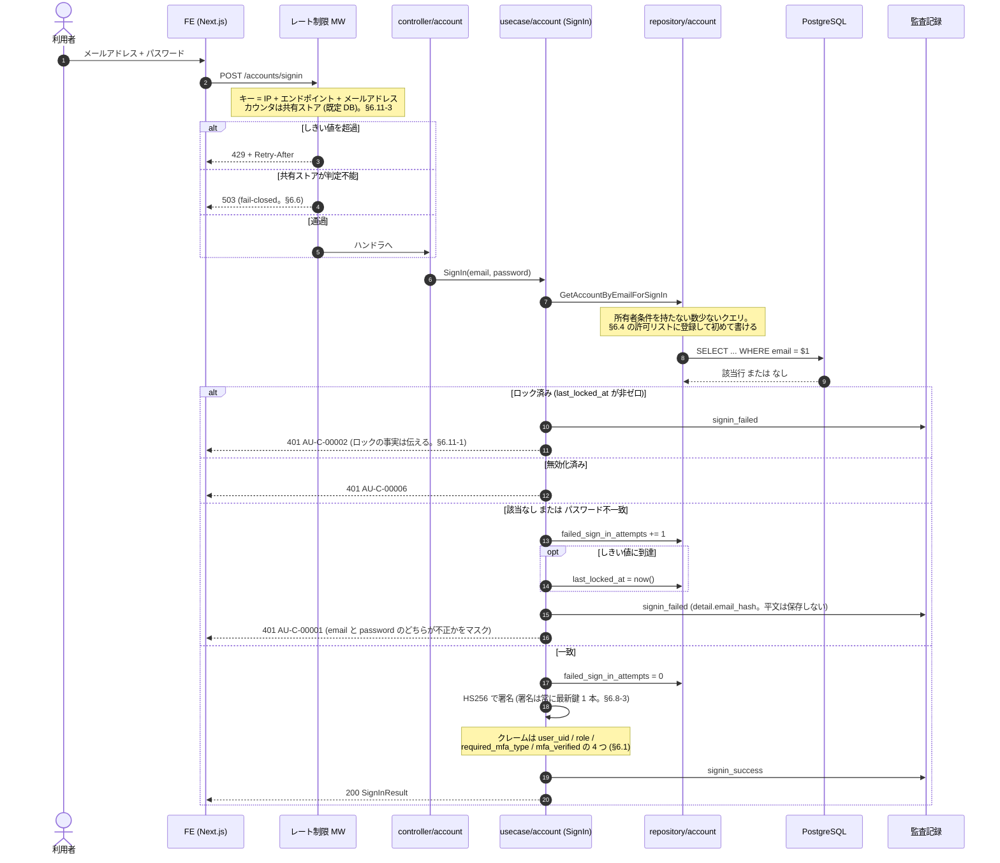
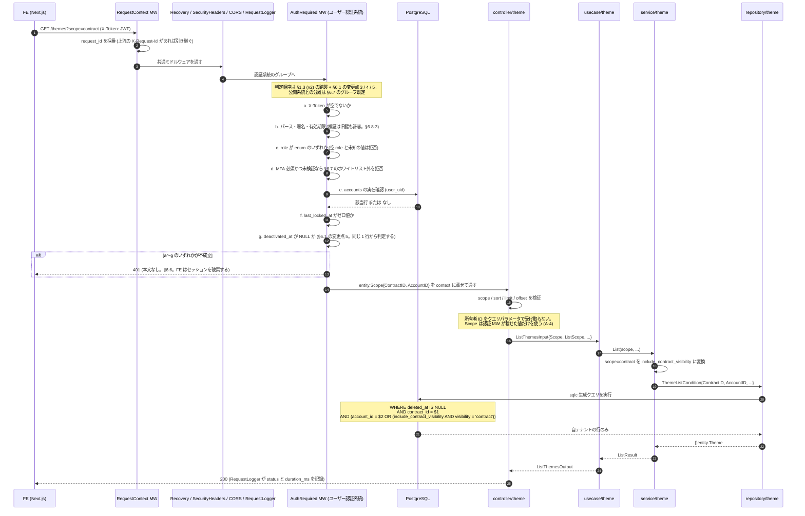

# 認証・認可・テナント境界 (v2 の事実と v3 の採用方針)

> 本書が回答する本番観点: **A-1, A-2, A-3, A-4, A-5, A-7 + D-5 (部分)**。
> A-6 は [architecture.md](architecture.md) **§3.8.2 (ツール実行の所有者スコープ強制点)** が正 (本書 §6.5 から参照)。
> **D-5 (シークレット管理) は §6.8 が認証固有部分のみ**を扱う — 保管方式そのものの SSOT は
> [architecture.md](architecture.md) §5 の D-5 行であり、本書は**署名鍵の新規発行とローテーション方式**を確定する。
> **参照 (本書では決めない)**: D-2 (§6.7 / §6.10 の CI 検査 → SSOT は architecture.md §5 D-2 行)、
> D-8 (§6.11-3 の WAF との関係)、O-4 / O-6 / O-7 (§6.9 / §6.11-4 の観測対象 → SSOT は
> [observability.md](observability.md))

## 0. 本書の位置づけ

- **v3 の認証・認可・テナント設計の判断 (§6 / §7) はこのファイルが SSOT**。
  他の設計書は判断を再掲せず本書を参照する
- **v2 の実装事実の一次資料は [../analysis/v2-auth-tenancy.md](../analysis/v2-auth-tenancy.md)**
  (`docs/analysis/` = 現状の事実)。本書 §1〜§5 は**設計判断に必要な範囲の整理**であり、
  両者は独立に一次ソース (Go コード / SQL) を読んで確認され、**事実として一致している**。
  より広い事実 (v3 が流用しうる既存機構の稼働状況・reset_password 系の詳細など) は同ファイルを見る
- v3 の**アプリ構造 (4 層 + `entity/` / `gateway/` の計 6 パッケージ層)** と **LLM ツールの越境防止 (A-6)** は
  [architecture.md](architecture.md) が SSOT。本書はその認証・認可部分を詳細化する
- PoC (`claude_managed_agents`) 側の「認証なし」という事実は
  [../analysis/gap-analysis.md](../analysis/gap-analysis.md) G-1 が SSOT
- **§1〜§4 は v2 の実装事実** (出典付き)、**§5 は v2 で発見した欠陥**、
  **§6 は v3 の設計判断**、**§7 は本番観点への回答**

調査範囲: `hassan-v2-backend` の `auth/` `router/` `controller/` `usecase/` **`repository/`** `db/` `util/` 配下
(`repository/` は §5-11 のように「所有者条件が SQL に到達するか」を判定するのに必要)。
`hassan-v2-frontend` は**トークン保管方法に限り**調査済み (§6.9 の該当節)。
`.worktrees/` `.claude/worktrees/` `vendor/` は対象外 (本体のみを正とした)。
**未調査**: MFA の TOTP 検証ロジック内部 (時刻ずれの許容幅・リプレイ防止)、メール送信経路、
**AWS 側 (WAF / ALB) のレート制限設定** — v2 は IaC が無くコンソール手作業で構築されているため
リポジトリからは原理的に確認できない (§6.11-3 の断定範囲に注記)。

---

## 1. v2 の認証機構 (事実)

### 1.1 トークンは 3 系統宣言され、実際に使われているのは 2 系統

| ヘッダ名 | 定義 | 用途 | 検証関数 |
|---|---|---|---|
| `X-Token` | `hassan-v2-backend/auth/middleware.go:15` | 一般ユーザー | `ParseToken` (`hassan-v2-backend/auth/client.go:70`) |
| `X-Admin-Token` | `hassan-v2-backend/auth/middleware.go:16` | 管理者 (社内) | `ParseAdminToken` (`hassan-v2-backend/auth/client.go:99`) |
| `Auth-Token` | `hassan-v2-backend/auth/middleware.go:17` | **参照箇所なし (デッドコード)** | — |

`Auth-Token` に対応する `PrivateAPIAuthToken` は構造体フィールド (`hassan-v2-backend/auth/client.go:17`) と
DI (`hassan-v2-backend/di/provider.go:117`) で配線されているが、**middleware から読まれていない**。
`grep` で本体コードに参照は無かった (テスト・worktree を除く)。

**ユーザー用と管理者用は別の署名鍵**: `JWT_KEY` / `ADMIN_JWT_KEY`
(`hassan-v2-backend/di/provider.go:30-31`。どちらも `required`)。

### 1.2 JWT クレームと署名

```go
// hassan-v2-backend/auth/client.go:32-38
type JwtClaims struct {
    UserUid         string   `json:"user_uid"`          // accounts.id (UUID)
    Role            AuthRole `json:"role"`              // "User" / "Consultant"
    RequiredMfaType string   `json:"required_mfa_type"` // companies.mfa_type
    MfaVerified     bool     `json:"mfa_verified"`
    jwt.StandardClaims                                  // ExpiresAt のみ設定
}
```

| 項目 | 値 | 出典 |
|---|---|---|
| 署名アルゴリズム | HS256 (共通鍵) | `hassan-v2-backend/auth/client.go:66` |
| alg 混同攻撃対策 | 検証時に `SigningMethodHMAC` を確認 | `hassan-v2-backend/auth/client.go:72-74` |
| 有効期限 (ユーザー) | **7 日** | `hassan-v2-backend/usecase/account/sign_in.go:112` |
| 有効期限 (MFA 検証後の再発行) | **7 日** | `hassan-v2-backend/usecase/mfa/verify_totp.go:76` |
| 有効期限 (管理者) | **7 日** | `hassan-v2-backend/auth/client.go:94` |
| リフレッシュトークン | **無い** | 発行経路は sign_in と verify_totp の 2 箇所のみ (`GetSignedString` の呼び出し元) |
| 失効 (revoke) の仕組み | **無い** (ブラックリスト等なし)。ロックは DB 側の `last_locked_at` で毎リクエスト判定 | `hassan-v2-backend/auth/middleware.go:70` |

ライブラリは `github.com/dgrijalva/jwt-go` (`hassan-v2-backend/auth/client.go:11`)、
バージョンは `v3.2.0+incompatible` (`hassan-v2-backend/go.mod:11`)。

- **リポジトリ内で検証できる事実**: vendor 同梱の README は 2016 年リリースの 3.0.0 系統のままで、
  そこで予告されている 4.0.0 は存在しない。CI バッジは Travis CI を指している
  (`hassan-v2-backend/vendor/github.com/dgrijalva/jwt-go/README.md`)
- **外部事実 (本リポジトリでは検証不能・要確認)**: 上流リポジトリはアーカイブされ、後継が
  `golang-jwt/jwt` に移管されたと理解している。**v3 で差し替えを決める前に最新状況を確認すること**
  ([../analysis/v2-auth-tenancy.md](../analysis/v2-auth-tenancy.md) も同点を未確認として挙げている)

v3 の判断は §6.1。

### 1.3 `AuthRequiredMiddleware` の判定順序

`hassan-v2-backend/auth/middleware.go:23-86`。上から順に評価し、**失敗は全て 401**。

| 順 | 判定 | 失敗時 | 行 |
|---|---|---|---|
| 1 | `X-Token` ヘッダが空でないか | 401 | `:26-30` |
| 2 | JWT のパース・署名・期限 | 401 (Info ログ) | `:32-38` |
| 3 | MFA 必須かつ未検証なら、パスが `/mfa` 以外を拒否 | 401 | `:40-47` |
| 4 | `claim.Role` が `""` または `User` か | 401 | `:51`, `:79-83` |
| 5 | `UserUid` が UUID としてパースできるか | 401 | `:52-58` |
| 6 | `accounts` に存在するか (DB 参照) | 401 | `:59-69` |
| 7 | `last_locked_at` がゼロ値か (未ロック) | 401 | `:70-74` |
| 8 | 通過 → context に `AuthenticatedRole` / `AuthenticatedAccount` を格納 | — | `:75-76` |
| 9 | イベントログを記録 (対象パスのみ) | 継続 (Warn ログのみ) | `:78`, `:166-179` |

補足:

- **判定 4 は `claim.Role == ""` を許容する** (`:51`)。role クレームを持たない旧トークンとの後方互換
- **判定 6 が毎リクエスト DB を引く**。ステートレス JWT ではなく「JWT + アカウント実在確認」の混成
- 判定 9 のイベントログは認証ミドルウェア内で作られる (`:172`)。対象パスの判定は
  `hassan-v2-backend/auth/event_mapper.go:12` の `GetEventTypeFromRequest`。
  失敗しても認証は通す (監査ログの欠落が起きても気付けない — O-6 に関わる)

### 1.4 MFA

- 必須かどうかは**会社単位**: `companies.mfa_type` (`hassan-v2-backend/db/schema.sql` の
  `companies` 定義。`mfa_type_enum NOT NULL DEFAULT 'none'`)
- sign_in 時点のトークンは `MfaVerified: false`
  (`hassan-v2-backend/usecase/account/sign_in.go:110`)
- `/mfa/totp/verify` 成功時に `MfaVerified: true` の**新しいトークンを再発行**
  (`hassan-v2-backend/usecase/mfa/verify_totp.go:70-79`)
- 未検証トークンで `/mfa` 以外を叩くと 401 (`hassan-v2-backend/auth/middleware.go:41-46`)。
  **パスの前方一致判定**であり、ルート単位のホワイトリストではない

### 1.5 管理者系 (社内向け)

| ミドルウェア | 内容 | 出典 |
|---|---|---|
| `AdminAuthRequiredMiddleware` | `X-Admin-Token` → `ParseAdminToken` → UUID → `admin_accounts` 実在確認 → context 格納 | `hassan-v2-backend/auth/middleware.go:88-131` |
| `CheckSuperAdminRole` | `admin_auth_role_id` が SuperAdmin でなければ拒否 | `hassan-v2-backend/auth/middleware.go:153-163` |

ユーザー側との差 (**いずれも v2 の非対称性**):

- 管理者トークンのクレームは `uid` と `exp` のみ (`hassan-v2-backend/auth/client.go:92-95`)。ロール情報を含まず、
  毎回 DB から `admin_auth_role_id` を読む
- **管理者にはロック判定 (`last_locked_at` 相当) が無い**。ユーザー側の判定 7 に対応する処理が
  `AdminAuthRequiredMiddleware` に存在しない
- `CheckSuperAdminRole` は権限不足を **401 で返す** (`hassan-v2-backend/auth/middleware.go:157`)。認証済みで
  権限が足りないケースなので 403 が適切 (§5-3)

### 1.6 認証ミドルウェアを通らない経路 (公開エンドポイント)

`hassan-v2-backend/router/router.go` の全ルートを走査した結果、認証ミドルウェアが付かないのは以下。

| パス | 行 | 保護手段 |
|---|---|---|
| `GET /alive` | `:56` | なし (ヘルスチェック) |
| `GET /swagger/*any`, `GET /` | `:34-38` | **`AppEnv != "prod"` のみ登録** (`:32`) |
| `POST /accounts/signup` | `:75` | 招待リンク前提 (要確認: §8) |
| `POST /accounts/signin` | `:76` | 認証そのもの |
| `GET /accounts/signup-links/:id` | `:78` | リンク ID の秘匿性 |
| `POST /accounts/reset-password` | `:79` | メール到達性 |
| `POST /accounts/reset-password/:hash` | `:80` | hash の秘匿性 (`reset_password_requests`) |
| `POST /webhook/microcms/news` | `:192` | **HMAC 署名検証** (`X-MICROCMS-Signature`。`hassan-v2-backend/controller/webhook.go:39`) |
| `POST /admin/signin` | `:195` | 認証そのもの |
| `GET /admin/accounts/register/password/check` | `:199` | トークン検証 (下記の順序依存に注意) |
| `POST /admin/accounts/register/password` | `:200` | 同上 |

### 1.7 適用方式そのものに構造的な穴がある

**ミドルウェアは原則ルート個別指定**。約 90 のルートが第 1 ハンドラとして
`app.AuthClient.AuthRequiredMiddleware(auth.AuthRoleUser)` を書いている
(`hassan-v2-backend/router/router.go:62-237`)。`Group.Use()` はわずか 3 箇所:

| 行 | グループ | ミドルウェア |
|---|---|---|
| `hassan-v2-backend/router/router.go:201` | `adminAccountRoute` | `AdminAuthRequiredMiddleware` |
| `hassan-v2-backend/router/router.go:214` | `adminCompanyRoute` | `AdminAuthRequiredMiddleware` |
| `hassan-v2-backend/router/router.go:230` | `mfaRoute` | `AuthRequiredMiddleware(AuthRoleUser)` |

**gin の `Group.Use()` は「それ以降に登録されたルート」にしか適用されない**。
`adminAccountRoute` では `.Use()` が `:201` にあり、`:199-200` の 2 ルートはその**前**に
登録されている。したがってこの 2 本には管理者認証がかからない。
§1.6 の表ではこれを「公開エンドポイント」として扱った (パスワード登録フローなので意図的と読めるが、
**意図が順序という形でしか表現されていない**)。

この方式のリスク: 新しいルートを追加するとき、**ミドルウェアの書き忘れが素通りとして現れる**。
機械的な検出手段は v2 に無い (テスト・lint での強制は未発見)。

---

## 2. テナント境界 (事実)

### 2.1 境界の頂点は `contracts`

```
contracts (契約 = テナント)
├── companies.contract_id     (1 契約に会社情報)
└── accounts.contract_id      (1 契約に複数ユーザー)
     └── 各機能テーブル.account_id
```

`accounts` と `companies` はどちらも `contract_id` を持ち、`ON DELETE CASCADE` で
`contracts` に紐づく (`hassan-v2-backend/db/schema.sql` の `accounts` / `companies` 定義)。
**ユーザー個人単位 (`account_id`) と契約単位 (`contract_id`) の 2 段のスコープが併存する**。

### 2.2 所有者カラムの分布 — 全テーブルが持つわけではない

`hassan-v2-backend/db/schema.sql` の `CREATE TABLE` 36 件を機械集計した結果:

| 所有者カラム | 件数 | テーブル |
|---|---|---|
| `account_id` | 17 | `account_mfa_configs`, `themes`, `assets`, `idea_hassans`, `business_plan_favorites`, `business_plans_detailed`, `business_plan_detailed_histories`, `reset_password_requests`, `research_chats`, `asset_usage_histories`, `activity_logs`, `research_titles`, `research_conversation_histories`, `read_news_accounts`, `news_email_logs`, `company_missions`, `event_logs` |
| `contract_id` | 5 | `accounts`, `companies`, `sharing_settings`, `idea_boards`, `idea_board_phases` |
| `company_id` | **0** | — |
| どちらも無し | 14 | `contracts`, `auth_roles`, `admin_auth_roles`, `admin_accounts`, `ideas`, `business_plans`, `business_plan_chats`, `business_plan_chat_messages`, `business_plan_histories`, `consultant_accounts`, `signup_links`, `register_admin_password_requests`, `asset_documents`, `research_sheet_contents` |

**`company_id` というカラムは v2 スキーマに存在しない**。所有権は
`account_id` (個人) と `contract_id` (契約) の 2 種類で表現される。
`idea_boards` は `contract_id` + `create_account_id` の両方を持ち、**契約内での共有**を表す。

> ルート `CLAUDE.md`・[architecture.md](architecture.md) §4・`.claude/rules/08-production-gates.md` A-3 は
> 所有者カラムを「`account_id` / `company_id`」と記述しており、また A-3 は
> 「v2 の既存テーブルは全て所有者列を持つ」と書いている。**どちらも本節の集計と一致しない**。
> 訂正が必要な箇所は §8 に一覧化した。

### 2.3 所有権チェーンは最大 4 段

所有者カラムを持たないテーブルは、親を辿って `account_id` に到達する。

| テーブル | 到達経路 | 段数 |
|---|---|---|
| `themes` | `account_id` | 1 |
| `idea_hassans` | `account_id` | 1 |
| `ideas` | `idea_hassan_id` → `idea_hassans.account_id` | 2 |
| `research_sheet_contents` | `conversation_id` → `research_titles.account_id` | 2 |
| `business_plans` | `idea_id` → `ideas` → `idea_hassans.account_id` | 3 |
| `business_plan_chats` | `business_plan_id` → `business_plans` → `ideas` → `idea_hassans` | 4 |
| `asset_documents` | **到達経路が無い** | — |

出典はいずれも `hassan-v2-backend/db/schema.sql` の各 `CREATE TABLE` の外部キー制約。

**`asset_documents` は `id` / `file_text` / `created_at` / `updated_at` の 4 カラムのみで、
所有者へ辿る外部キーを一切持たない**。

`assets` との関連についても、**`asset_documents.id` は `assets.id` とは対応しない**
(当初「命名から対応する設計と推測」と書いていたが、呼び出し側を読んで否定された):

- `hassan-v2-backend/usecase/asset/generate_assets_operations.go:92` で
  **`uuid.New()` により新規生成した UUID** を `id` として `CreateAssetDocument` に渡す
- 同 `:98` でその UUID を文字列として呼び出し元へ返し、**クライアントが `document_id` として持ち回る**
- 後続の説明生成 (`同:102-108`) は**クライアントから渡された `document_id`** をパースして
  `GetAssetDocumentByID` を引く

したがって `asset_documents` は「どのアカウントのものか」をスキーマでもコードでも辿れない、
**クライアント提示の UUID だけで引ける本文テーブル**。所有者チェックも無い (§5-7)。
アセット本文 (`file_text`) がテナント境界の完全な外にあるため、v3 で最も注意すべき箇所 (§6.3)。

---

## 3. 認可 (所有者による絞り込み) の実装層 — v2 は 3 パターンが混在

認証情報の取得は **Controller 層に閉じている**。`auth.GetAuthenticatedAccount`
(`hassan-v2-backend/auth/middleware.go:138`) の参照は `hassan-v2-backend/controller/` 配下 19 ファイルのみで、
`hassan-v2-backend/usecase/` には出現しない (UseCase へは `AccountID` を Input 構造体で渡す)。

絞り込みの実装場所は統一されていない。

| パターン | 場所 | 実例 |
|---|---|---|
| **A. Repository のクエリ条件** | SQL の `WHERE` / `JOIN` | `ListThemesByAccountID` は `WHERE account_id = $1` (`hassan-v2-backend/db/queries/theme.sql:16`)。`GetBusinessPlanByID` は 3 段 JOIN の上で `WHERE bp.id = $1 AND a.contract_id = $2` (`hassan-v2-backend/db/queries/business_plan.sql:70`) |
| **B. UseCase の read-then-compare** | 取得後に Go 側で比較 | `hassan-v2-backend/usecase/theme/delete_theme.go:32`、`hassan-v2-backend/usecase/theme/update_theme.go:44`、`hassan-v2-backend/usecase/business_plan/get_business_plan.go:55` (共有判定込み) |
| **C. チェック無し** | — | §5-1 |

`hassan-v2-backend/db/queries/` 30 ファイルのうち 22 ファイルが `account_id` に言及する
(= 8 ファイルは所有者に触れないクエリを含む)。

パターン B は「取得してから捨てる」ため、**存在の有無が応答時間や分岐に漏れる**余地がある。
またパターン A/B の選択がクエリごとの判断に委ねられているため、C (漏れ) が混入しても
機械的には検出されない。

---

## 4. ステータスコードの使い分け (事実)

| 層 | 401 | 403 | 404 |
|---|---|---|---|
| 認証ミドルウェア | **全ての失敗** (§1.3 の 1〜7、`CheckSuperAdminRole` の権限不足も含む) | 使わない | 使わない |
| Controller | — | `forbidden()` (`hassan-v2-backend/controller/controller.go:58`) | `notFound()` / `notFoundWithMessage()` (`同:42`, `:50`) |

403 の実使用箇所: `hassan-v2-backend/controller/asset.go:120`,
`hassan-v2-backend/controller/company.go:532`,
`hassan-v2-backend/controller/business_plan_detailed.go:366`,
`hassan-v2-backend/controller/idea_board.go:565`,
`hassan-v2-backend/controller/event_logs.go:48`,
`hassan-v2-backend/controller/sharing_settings.go:38` ほか
(`asset.go` は 6 箇所)。エラー定義側にも `IdeaBoardForbidden`
(`hassan-v2-backend/constants/errors_idea_board.go:9`) がある。

**「他人のリソースを触ろうとした」ケースに 403 と 404 のどちらを返すかは統一されていない**。
`asset.go` は 403、`get_theme_by_id.go` は所有者判定自体が無い (§5-1)。

---

## 5. v2 に存在する欠陥 (v3 で構造的に潰す対象)

事実として観測されたもののみを挙げる。**v2 側の修正は本リポジトリの担当外**だが、
v3 の設計がこれらを再現しないことを §6 で担保する。

### 5-1. `GET /themes/:id` に所有者チェックが無い (IDOR)

3 層すべてでチェックが欠落している:

| 層 | 出典 | 内容 |
|---|---|---|
| Repository | `hassan-v2-backend/db/queries/theme.sql:1-2` | `SELECT * FROM themes WHERE id = $1;` — 所有者条件なし |
| UseCase | `hassan-v2-backend/usecase/theme/get_theme_by_id.go:30-50` | `input.AccountID` を受け取るが、**`CountIdeaAndBusinessPlanByThemeID` の集計にしか使わず** `theme.AccountID` と比較しない |
| Controller | `hassan-v2-backend/controller/theme.go:100-121` | `authAccount.ID` を Input に詰めるだけ |

同じ `hassan-v2-backend/usecase/theme/` 内の `delete_theme.go:32` / `update_theme.go:44` は比較しているため、
**「実装者が書き忘れると素通りになる」構造**であることが裏付けられる。
`themes.id` は連番の整数 (`hassan-v2-backend/controller/theme.go:102` で `strconv.Atoi`) なので ID の推測は容易。

これは §3 の「パターン B を各 UseCase の裁量に委ねる」設計の帰結であり、
v3 で A-4 を「後で足す」にできない直接の根拠。

### 5-2. `AuthRoleConsultant` がデッドコードかつ、渡すと認証が骨抜きになる

- 定義は `hassan-v2-backend/auth/client.go:29`。**router からの参照は 0 件**
  (全ルートが `AuthRoleUser` を渡す)
- `AuthRequiredMiddleware` の `switch role` には `case AuthRoleUser` **しか無い**
  (`hassan-v2-backend/auth/middleware.go:49-84`)。`AuthRoleConsultant` を渡した場合、
  トークン検証と MFA 検証は行われるが、**アカウント実在確認・ロック確認・context への格納が
  すべてスキップされ、`c.Abort()` も呼ばれないまま次のハンドラへ進む**
- その状態で `GetAuthenticatedAccount` を呼ぶと、`c.Get` が返す nil に対する型アサーション
  (`hassan-v2-backend/auth/middleware.go:140`) で **panic** する

現状の router では到達しないが、`AuthRoleConsultant` を使う新ルートを 1 行足した瞬間に
認証欠落 or panic になる。**enum が網羅されていない switch** という形の時限爆弾。

### 5-3. 権限不足に 401 を返す

`CheckSuperAdminRole` は認証済み管理者の権限不足に 401 を返す
(`hassan-v2-backend/auth/middleware.go:157`)。クライアントは 401 を「再ログインが必要」と
解釈するのが通例のため、UI 側で無駄な再認証フローを誘発する。

### 5-4. 管理者にロック判定が無い

§1.5 参照。ユーザー側の `last_locked_at` 判定 (`hassan-v2-backend/auth/middleware.go:70`) に相当する処理が
`AdminAuthRequiredMiddleware` に存在しない。権限の強い経路の方が判定が緩い。

### 5-5. 認証ミドルウェアの適用が個別指定に依存

§1.7 参照。付け忘れが素通りとして現れ、機械検出手段が無い。

### 5-6. 本番でリクエストログが二重に無効化されている

`RequestLoggerMiddleware` は prod で `r.Use()` から外れており
(`hassan-v2-backend/router/router.go:50-54`)、さらにミドルウェア内部でも
`GO_ENV == "prod"` ならログ出力前に return する
(`hassan-v2-backend/controller/middleware.go:36`)。
リクエスト ID (`X-Request-ID`) の付与自体は継続するが、**本番ではアクセスログが残らない**。
O-1 (構造化ログ) の設計時に前提としないこと。

### 5-7. `asset_documents` はクライアント提示の UUID だけで読める

§2.3 のとおり `asset_documents` は所有者を辿る手段を持たず、
`hassan-v2-backend/db/queries/asset_documents.sql:4-5` の取得クエリは
`SELECT * FROM asset_documents WHERE id = $1` で所有者条件が無い。
呼び出し側 (`hassan-v2-backend/usecase/asset/generate_assets_operations.go:102-108`) も
**クライアントから渡された `document_id` をパースしてそのまま引く**だけで、
`accountID` を引数に受け取っていながら所有者判定に使っていない。

`themes` の §5-1 と同じ構造の欠落。ただし ID が連番でなく UUID v4 なので、
実際の悪用には UUID の入手が必要 (**§5-1 より深刻度は低いが、構造は同じ**)。
アセット本文という機微データを扱う経路であり、v3 では §6.3 の
「本文テーブルにも所有者カラムを置く」で構造的に潰す。

### 5-8. パスワードリセットのトークンが暗号論的乱数で生成されていない

**認証の迂回経路にある欠陥**。JWT 側をどれだけ固めても、ここが破られれば任意アカウントを乗っ取れる。

| 事実 | 出典 |
|---|---|
| `util/util.go` の import は `math/rand` のみ。**非 vendor コードに `crypto/rand` の import は 0 件** (`grep -rn "crypto/rand" --include="*.go"`, vendor・worktree 除外) | `hassan-v2-backend/util/util.go:5` |
| `RandStringRunes(n)` は `rand.Intn` で 62 文字の英数字集合から n 文字を選ぶ | `hassan-v2-backend/util/util.go:20-28` |
| パスワードリセット要求がこれで 32 文字の hash を生成し、メールで送る (`reset_password_requests` は 1 時間有効) | `hassan-v2-backend/usecase/account/request_reset_password.go:59`, `:62` |
| `GenerateSecureToken` も同ファイルの import 構成から `rand.Read` = **`math/rand.Read`**。名前に反して暗号論的でない。用途は **2 つ**: ①管理者作成時のダミー一時パスワード (`:64`。`:62-63` にその旨の NOTE があり `:68` で bcrypt にかける) と ②**管理者パスワード登録メールのトークン** (`:90`。`:95` に「有効期限は1週間」の NOTE)。**②の方が深刻** | `hassan-v2-backend/util/util.go:30-36` ← `hassan-v2-backend/usecase/admin_account/create_admin_account.go:64`, `:90` |
| `rand.Seed` の呼び出しは非 vendor コードに無い。Go バージョンは 1.24.3 (実行イメージも `golang:1.24.3-alpine`: `hassan-v2-backend/stacks/ecs.Dockerfile:1`) | `hassan-v2-backend/go.mod:3` |

**深刻度の限定 (ローカルの Go ツールチェーンで検証済み。go1.24.2 の標準ライブラリを読んだ結果)**:

| 確認したこと | 出典 (ローカル Go: `$(go env GOROOT)/src`) |
|---|---|
| `math/rand` のトップレベル関数の既定 source は `runtimeSource` (固定シードではない)。固定シード (`Seed(1)`) になるのは **`GODEBUG=randautoseed=0` のときだけ** | `math/rand/rand.go:321-337` |
| **`rand.Seed()` は Go 1.24 では no-op**。`GODEBUG=randseednop=0` でない限り即 return する (コメントにも明記) | `math/rand/rand.go:398-403` |
| `runtimeSource` はランタイムの乱数源を使い、その実装は **ChaCha8** ベース | `runtime/rand.go:11`, `:30`, `:153` |

したがって「**トークンが完全に予測可能**」という最悪ケースには**当たらない** (Go 1.24 の既定において)。
また「プロセス内で `rand.Seed` が呼ばれたら壊れる」という懸念も **Go 1.24 の既定では成立しない**
(no-op のため)。

**それでも v3 で `math/rand` を使わない理由**は予測可能性ではなく次の 3 点:

1. **安全性が GODEBUG 環境変数に依存する** — `randautoseed=0` を設定した環境では固定シード
   (`Seed(1)`) になり、**全リセットトークンが再現可能な系列**になる。アプリケーションコードの外側
   (デプロイ設定) が暗号強度を決めてしまう
2. **`math/rand` の保証範囲外の使い方である** — ChaCha8 という実装は Go の内部実装であり、
   `math/rand` の API 契約が暗号論的安全性を保証しているわけではない。将来の実装変更に対して
   このコードは無防備
3. **`crypto/rand` を使えば上記のどちらも考えなくてよい** — 回避コストが実質ゼロ

**v3 での対応は §6.10**。

### 5-9. パスワードリセット要求でメールアドレスの登録有無が判別できる

サインインは**意図的に**「email か password のどちらかが不正」とマスクしている
(`hassan-v2-backend/usecase/account/sign_in.go:97-98`。`:97` のコメントが意図を明記し `:98` が返却) が、
パスワードリセット要求は未登録メールに `AccountNotFoundByEmail` を返す
(`hassan-v2-backend/usecase/account/request_reset_password.go:52`)。
**片方だけマスクしても列挙は成立する**。v3 での対応は §6.11。

### 5-10. アカウントをロックする手段が「サインイン失敗」以外に無い

**§6.9 の失効設計に直結する事実**。`last_locked_at` に時刻を**設定**する経路は
`UpdateFailedSignInAttempts` の 1 本だけで (`hassan-v2-backend/db/queries/account.sql:56-64`。
サインイン失敗回数がしきい値を超えた場合の副作用)、**管理者が任意のアカウントをロックする経路は無い**。

`last_locked_at` を扱う SQL は全 4 箇所で、内訳は次のとおり (`grep -rn "last_locked_at" db/queries/*.sql`):

| 種別 | クエリ | 出典 |
|---|---|---|
| **設定 (ロック)** | `UpdateFailedSignInAttempts` — サインイン失敗の副作用のみ | `hassan-v2-backend/db/queries/account.sql:60-62` |
| 解除 | `DeleteLastLockedAt` (email 指定) | `hassan-v2-backend/db/queries/account.sql:70` |
| 解除 | `UnlockAccountByID` (id 指定) | `hassan-v2-backend/db/queries/account.sql:77` |
| 参照 | SELECT | `hassan-v2-backend/db/queries/account.sql:98` |

router 側のロック関連ルートも**解除の 2 本だけ**:
`POST /accounts/unlock` (`hassan-v2-backend/router/router.go:82`) と
`POST /admin/accounts/unlock` (`同:211`)。

**帰結**: v2 には「トークン漏洩が疑われるアカウントを即座に遮断する」手段が実質存在しない。
毎リクエストのロック判定 (§1.3 判定 7) という**受け側の機構はあるのに、それを発火させる側が無い**
(BE-10 の「読む側と書く側を対で設計する」の逆パターン)。**v3 での対応は §6.9**。

### 5-11. ロック解除 API がテナント境界を越える

`POST /accounts/unlock` (`hassan-v2-backend/router/router.go:82`) は**契約管理者かどうかしか検証せず、
対象アカウントが自分の契約に属するかを検証しない**。

| 層 | 実装 | 出典 |
|---|---|---|
| Controller | `authAccount.AuthRoleID.IsAdmin()` で**ロールのみ**確認し、403 で弾く。対象は `BindJSON` した email | `hassan-v2-backend/controller/account.go:896-900` |
| UseCase | `input.Email` をそのまま Repository へ渡す。契約の照合なし | `hassan-v2-backend/usecase/account/delete_last_locked_at.go:30` |
| Repository | `DeleteLastLockedAt(ctx, email)` — email だけで UPDATE | `hassan-v2-backend/repository/account.go:258-259` |
| SQL | `WHERE email = $1` — 所有者条件なし | `hassan-v2-backend/db/queries/account.sql:66-71` |

**任意の契約の管理者が、他契約のロックされたアカウントを解除できる**。
`08-production-gates.md` A-4 が名指しする「所有者 ID をパラメータで受け取る API では、
その所有者が呼び出し元と同じ契約に属することの検証を必須にする」の違反例であり、
構造は §5-1 (`themes` の IDOR) と同じ。

**§5-10 と合わせると、ロック機構は「発火させる手段が無く、解除は他契約からできる」状態**。
§6.11 でロック機構を踏襲すると決める際、**解除側を設計しないと同じ穴が v3 に入る**。
**v3 での対応は §6.11-2**。

### 5-12. MFA コード不一致が 500 で返る

`VerifyTotp` の UseCase は `apperror.TotpCodeNotMatch()` を正しく返すが
(`hassan-v2-backend/usecase/mfa/verify_totp.go:59`)、**Controller が `CodedError` の分岐を持たず
全エラーを `internalServerError` へ流す** (`hassan-v2-backend/controller/mfa.go:80`〜`:83`。
`CreateTotp` = `同:45`〜`:48` / `ResetTotp` = `同:113`〜`:116` も同じ)。

**帰結**: **利用者の打ち間違いと障害が区別できない**。さらに**一般ユーザーの MFA (`companies.mfa_type` による必須化。§1.4)**
に対する総当たりが「5xx の山」として現れ、**O-4 / O-7 のアラートが意味を失う**。
(**2026-08-10 の AA-D-22 で社内管理者の MFA は無くなったが、一般ユーザー側の MFA は残る**ため §5-12 / §5-13 は取り下げない。)
**v3 での対応は §6.6** (401 + `CodedError`)。

### 5-13. MFA 検証の失敗がロックカウンタに加算されない

失敗回数の加算 SQL `UpdateFailedSignInAttempts` (`hassan-v2-backend/db/queries/account.sql:57`〜`:64`。
`WHERE email = $2`) の**非テスト呼び出し元は `hassan-v2-backend/usecase/account/sign_in.go:91` の 1 箇所だけ**で、
そこは**パスワード検証失敗の枝**である。`usecase/mfa/` 配下に加算は 1 件も無く、
`usecase/mfa/verify_totp.go:56`〜`:60` は失敗時に activity log を書くだけで DB を更新しない。

**帰結**: **MFA コードの試行は事実上無制限**である。§5-12 と組み合わさると、
総当たりが「観測されず・数え上げられず・止まらない」状態になる。
**v3 での対応は §6.11-3 の対象②** (§6.2 の成立条件は AA-D-22 で消滅したため、ユーザー側 MFA の試行上限として残る)。

---

## 6. v3 の設計判断

前提: ルート `CLAUDE.md` のハイブリッド方針により、**認証・テナントは v2 準拠**。
逸脱には却下案と理由を書く ([architecture.md](architecture.md) §2 の D-A〜D-F と整合)。

> **前提 (ユーザー決定 2026-07-30。§9.3 Q-A8)**: **認証系エンドポイントは v3 で実装する**
> (「基本 v2 でできていたことは v3 で実装する」)。したがって §6.8〜§6.11 の対策は
> すべて v3 に実装先を持つ。
> **この決定は [API/settings.md](API/settings.md) の D-ST-1 / D-ST-7 (v2 の認証 API を再利用し
> v3 に複製しない) を覆すもの**であり、同書側の更新が必要 (§10)。
> 併用期間中のアカウント基盤の二重化という新たな論点が生じている (§10 の申し送り)。

### 6.1 認証方式は v2 を踏襲する (A-1)

**採用**: `X-Token` ヘッダ + HS256 JWT + gin ミドルウェア。クレーム構成
(`user_uid` / `role` / `required_mfa_type` / `mfa_verified`) も v2 と同一にする。

> **将来の変更予定 (2026-08-29。本書 §10.3 の受信欄 R-FE-1 ②)**:
> 同書の **FE-D が段階移行へ反転**し、**段階2 (時期未定) で FE は JWT を HttpOnly Cookie に閉じる**。
> **その時点で BE の認証ミドルウェアは「`X-Token` ヘッダ」に加えて「Cookie」からトークンを
> 読めるようにする必要がある** (同書 §2.0 の段階2 作業 1)。
> **本増分 (段階1) では変更しない** — FE はヘッダで送る。
> **段階2 に着手する増分で、本節と §6.6 (401 の判定) と §6.7 (系統別検査) を同じ差分で改訂する**
> ことを申し送る。**Cookie 対応と CSRF 対策は同じ PR で入れる** (片方だけだと穴が開く。同書 §6.3.3)。

- **却下 (a) OIDC / Cognito 等への移行**: 併用期間中は FE が v2 と v3 の両方を叩くため、
  トークン体系を変えると FE が二重実装になる。**鍵の値は共有しない** (§9.3 Q-A1 で確定) が、
  **形式 (HS256・クレーム構成) は v2 と同一に保つ**ため FE の扱いは 1 通りで済む
- **却下 (b) クレームに `contract_id` を追加**: DB を引かずにテナント判定できるが、契約変更が
  トークン有効期限 (**v3 は 1 日**。§6.9-3) の間反映されない。v2 が毎リクエスト DB を引く設計 (§1.3 判定 6) を維持する

**v2 から変える点** (いずれも理由付きの逸脱):

| # | 変更 | 理由 |
|---|---|---|
| 1 | JWT ライブラリを `golang-jwt/jwt/v5` にする | v2 は `dgrijalva/jwt-go v3.2.0+incompatible` = 2016 年の 3.0.0 系統で止まっている (`hassan-v2-backend/go.mod:11`)。**上流がアーカイブ済みかは外部事実として要確認** (§1.2) だが、いずれにせよ 10 年前のバージョンを新規実装の基盤にしない。トークン形式 (HS256・クレーム構成) は互換なので FE への影響なし |
| 2 | `Auth-Token` / `PrivateAPIAuthToken` を**移植しない** | §1.1 のとおり v2 で未使用。死んだ設定を持ち込むと D-5 (シークレット管理) の棚卸しが濁る |
| 3 | `switch role` を**全 enum 網羅 + default で拒否**にする | §5-2 の再発防止。未知のロールは 401 で落とす |
| 4 | **空の `role` クレームを拒否する** | v2 は `claim.Role == "" \|\| claim.Role == AuthRoleUser` で空を許容する (`hassan-v2-backend/auth/middleware.go:51`)。role クレームを持たない旧トークンとの後方互換。**v3 は自ら発行したトークンのみを検証する** (鍵を共有しないため v2 発行トークンは署名検証で落ちる。§9.3 Q-A1) ので、後方互換の空 role 許容は**無条件に不要**。前提確認も要らない |
| 5 | **`deactivated_at IS NOT NULL` のアカウントを拒否する** (**2026-08-29 追加**) | v3 は削除を無効化で表す (`accounts.deactivated_at` = [data-model.md](data-model.md) §4.2 の DM-A5) ため、**v2 の判定 6・7 (実在確認・ロック確認) だけではアクセスを止められない**。判定は §1.3 の判定 6 で引いた行に対して行い (**`GetAccountByIDForAuth` の選択列に `deactivated_at` を足すだけ** — クエリ本数は増えない)、**401 + `AU-T-00006`** ([API/auth-accounts.md](API/auth-accounts.md) §3.1.1) を返す。**サインイン側の拒否 (`AU-C-00006`) だけでは不足**であることは実装リポ hassan-v3 の issue #107 が示した (無効化済みメンバーの招待受諾で新しいトークンが発行され得た — 同書の **AA-D-32**)。**却下案**: トークンを発行する経路 (`POST /accounts/signin` / `POST /accounts/signup` / `POST /mfa/totp/verify`) ごとに無効化判定を書く — 発行経路が増えるたびに同じ穴が開き、**漏れが「無効化したはずの利用者が使い続けられる」形でしか現れない**。使用側の 1 箇所で判定すれば経路の増減に依存しない |

### 6.2 ロールは「一般ユーザー」のみを対象とする (A-2)

**採用**: v3 の新機能 (テーマ・アセット・会話型アイデア創出) は
`AuthRoleUser` = `accounts` に属する一般ユーザーのみが利用する。
管理者 (`X-Admin-Token` 系) と `AuthRoleConsultant` は**本増分の対象外**。

**例外 1 件 (ユーザー決定 2026-07-30)**: **社内管理者によるアカウントロック解除
(`POST /admin/accounts/unlock` 相当) は本増分の対象に含める**。

- **理由**: これが無いと**契約内管理者が全員ロックされた場合に製品内の回復手段が存在しない**
  (§6.9 の「回復経路」を参照)。v2 は社内管理者用の解除経路を持っており
  (`hassan-v2-backend/router/router.go:211` → `usecase/admin_account/unlock_account_by_admin.go:26`
  → `hassan-v2-backend/db/queries/account.sql:73-78`。対象は `accounts` テーブル、**ID 指定**)、
  Q-A2 の原則「v2 でできていたことは満たす」に照らしても落とせない
- **含める範囲は「解除 + 到達に必要な最小の付随機構」** — 解除 API だけでは
  `X-Admin-Token` を入手できないため到達できない。v2 の最小構成を踏まえ、次の 3 つを含める:

  | 含めるもの | v2 の対応実装 | 備考 |
  |---|---|---|
  | ロック解除 API (全契約横断) | `hassan-v2-backend/router/router.go:211` | 本例外の目的 |
  | 社内管理者のサインイン (`POST /admin/signin`) | `同:195` (**公開エンドポイント**。`:194` は `r.Group("/admin")`) | **公開エンドポイントが 1 本増える** — §6.7 のホワイトリストに載せ、§6.11-3 のレート制限対象にする |
  | **一般アカウントの MFA リセット** (社内管理者が実行) | `同:217` | **2026-07-31 追加** ([API/auth-accounts.md](API/auth-accounts.md) の AA-Q2 = (a) 本増分に含める。ユーザー回答)。**この経路が無いと、MFA 必須の契約で契約内管理者が全員デバイスを失ったときに製品内の回復手段が存在しない** — §6.9 がロックについて解いた「回復経路が無い」と同型の穴になる。エンドポイントは `POST /admin/accounts/{account_id}/mfa/reset` |
  | 管理者アカウントの初期投入 | v2 は `同:206` (`CreateAdminAccount`) + `:199-200` (パスワード登録。公開) | **⚠️ 2026-08-29 に一部反転した (例外 3 件目 = AA-D-29)** — **`POST /admin/admins` (作成) は本増分の対象に入った**。**移行スクリプトによる投入は「最初の 1 人」に限って引き続き必要** (作成 API 自体が SuperAdmin の `X-Admin-Token` を要求するため、**最初の SuperAdmin だけは API では作れない**)。**⚠️ 2026-08-29 中に AA-Q15 = (c) のオーナー回答で再度反転し、パスワード登録リンク (`:199-200`) も移植することになった** ([API/auth-accounts.md](API/auth-accounts.md) の **AA-D-30**) — **公開エンドポイントが 6 → 8 本に増える** (下の §6.7 / §6.11-3)。**初期パスワードという概念そのものが無くなり**、作成 API は登録リンクを発行してメールを送るだけで、**パスワードは本人しか知らない**。**同日の起草時に一度採った「サーバが生成して 201 応答で 1 度だけ返す」は却下側へ移した** (却下理由は AA-D-29 の (c))。**旧記述**「v3 では API を作らず、移行スクリプトによる投入とする (`admin_accounts` の作成 API を持つと社内管理者機能が実質全部入りになるため)」は、**v2 フロントエンドに現に配線された画面があることを確認せずに書かれていた** (§10.3 の受信欄 = 実装リポ issue #181)。**2026-08-10 の AA-D-22 で MFA が無くなったため「初回 TOTP 登録の強制」は消えた**。**最初の 1 人 (ブートストラップ) の扱いは 2026-08-29 に具体化した**: 移行スクリプトは **パスワードを直接投入せず、`admin_accounts` 行と `register_admin_password_requests` 行 (`token_hash`) を作り、平文トークンをスクリプトの標準出力に 1 度だけ出す** — 運用者がそのトークンで `POST /admin/password-registrations` を叩いてパスワードを設定する。**これにより API 経路と ブートストラップ経路でパスワードの設定手続きが 1 本になり、`crypted_password` を直接書く経路が どこにも無くなる** (却下: スクリプトが `crypto/rand` でパスワードを生成して配布する — **平文パスワードが運用チャネル (Slack・メール) に載る**うえ、bcrypt を作る経路がスクリプトにも要る)。**§6.10 の生成規約が適用されるのは登録トークンの生成**であり、パスワード自体は本人が選ぶ。運用手順は [operations.md](operations.md) |

  それ以外の管理者機能 (社内向けの利用状況閲覧・CSV 出力) は**引き続き対象外**
- **例外 2 件目 (ユーザー決定 2026-08-25 = [API/auth-accounts.md](API/auth-accounts.md) の AA-D-26)**:
  **社内管理者による契約管理 (`POST` / `GET /admin/contracts`、`GET` / `PUT /admin/contracts/{contract_id}`) を
  本増分の対象に含める**。

  - **理由**: 同書 §6.3 の仮定 2 が「契約と会社の作成経路は移行スクリプトのみ」と置きつつ、
    「**v3 で新規契約を獲得する運用が必要になると本増分の対象に戻る**」と後続条件を明記していた。
    オーナーが「新規契約を作る手段は必要」と判断したことでこの条件が発火した。
    **API を作らない場合、契約獲得のたびに人間が本番 DB へ直接 INSERT することになり、
    承認機構 (H-2) の外側に書き込み経路が常設される**
  - **含める範囲**: 作成・一覧・詳細・更新の 4 本。**契約の削除は含めない**
    (v2 の `ON DELETE CASCADE` による物理削除は AA-D-13 の「削除せず無効化」と一貫しないため。
    契約の終了は `end_date` の更新で表す)
  - **権限は SuperAdmin 限定** (2026-08-25。403 = R-4)。v2 のルーティングは `POST /admin/companies` に
    `CheckSuperAdminRole` を掛けていない (`同:220`) が、**v2 自身のコード内ドキュメントは
    「Admin: 管理画面における Read 機能を利用可能」と宣言しており** (`hassan-v2-backend/entity/admin_auth_role.go:7-10`)、
    **v2 の実装がその宣言に反していた**。**代償**: v2 の実挙動より権限が狭くなる
    (C-16 に対する意図的な後退。根拠は [API/auth-accounts.md](API/auth-accounts.md) の AA-D-26 却下 (d))

    > **⚠️ 2026-08-26 に本行の理由を 1 つ削除した (オーナー判断)**。旧版は上記に加えて
    > 「**本節が MFA リセット・ロック解除を SuperAdmin 限定にしているのと揃える**」と書いていたが、
    > **その前提は成立していなかった** — 本節 (§6.2) は例外 1 件の含める範囲を列挙するだけで
    > ロールによる制限を課しておらず、**§10.2 の R-3 ④「MFA リセットの実行者を SuperAdmin に限る」は
    > 2026-08-10 の AA-D-22 で取り下げ済み**である。2026-08-26 にオーナーが
    > 「**MFA リセットなどは Admin ができて良い**」と判断し、下の「ロールによる制限の範囲」で確定させた。
    > **AA-D-26 の結論 (契約管理 4 本を SuperAdmin 限定にする) は変わらない** — 上に残した
    > v2 のコード内ドキュメントの宣言が独立した理由として成立するため。
    > 検出元は実装リポ hassan-v3 の issue #18 / PR #126 (§10.3 の受信欄)

  - **系統は増えない** — 既存の `X-Admin-Token` 系統に route が 4 本増えるだけで、
    §6.7 の系統宣言 (3 系統) は変わらない。**AA-D-22 の反転で得た「系統を増やさない」性質は保たれる**
- **例外 3 件目 (オーナー判断 2026-08-29 = [API/auth-accounts.md](API/auth-accounts.md) の AA-D-29)**:
  **社内管理者アカウントの作成 (`POST /admin/admins`) と権限変更 (`PUT /admin/admins/{admin_account_id}`) を
  本増分の対象に含める**。

  - **理由**: 上の「管理者アカウントの初期投入」行が「API を作らない」とした根拠は
    「**社内管理者機能が実質全部入りになる**」という範囲の判断であり、**v2 での使用実態を確認していなかった**。
    実装リポ hassan-v3 の issue #181 の調査で、**この 2 本は v2 フロントエンドの
    `/admin/admin-setting/new` · `/edit` 画面から現に呼ばれており、画面はヘッダーナビから到達可能**である
    ことが判明した (出典は [API/auth-accounts.md](API/auth-accounts.md) §2.7)。**C-16 の対象**である
  - **含める範囲**: 作成・権限変更の 2 本。**削除 (`同:208`) と権限ロール一覧 (`同:210`) は含めない** —
    **v2 フロントエンドに呼び出し元が無く (死にコード)、配線されていない実装を仕様の根拠にしない**
  - **権限は SuperAdmin 限定** (403 = R-4)。**v2 も該当 5 本すべてに `CheckSuperAdminRole()` を掛けている**
    (`同:206-210`) ため、**例外 2 件目 (契約管理) と違って C-16 の後退が無い** — v2 の実挙動どおりに揃えるだけ
  - **系統は増えない** — 既存の `X-Admin-Token` 系統に route が 3 本増えるだけで (**作成・権限変更に加え、
    2026-08-29 の AA-D-30 でパスワード登録リンクの再発行 1 本**)、§6.7 の系統宣言 (3 系統) は変わらない
  - **公開エンドポイントは 2 本増える** (**2026-08-29 の AA-Q15 = (c) 回答 = AA-D-30**。当初は
    「増えない」としていたが反転した): `POST /admin/password-registrations/lookup` と
    `POST /admin/password-registrations`。**v2 の `同:199-200` の置き換え**であり、
    **トークンはクエリではなくボディで受ける** (AA-D-4)。§6.7 のホワイトリストと
    §6.11-3 の対象①に載せる。**エンドポイント単位の一覧は
    [API/auth-accounts.md](API/auth-accounts.md) §2.1 / §2.4 が正** (DR-9)
  - **初期パスワードという概念は持たない** (**2026-08-29 に確定 = AA-Q15 の回答**)。作成 API は
    `admin_accounts` 行と登録要求を 1 トランザクションで作り、**本人がリンクからパスワードを設定する**。
    **秘密の生成・保存形は §6.10-1 と AA-D-5④ に従う** (`crypto/rand` 32 バイト → base64url を
    **アプリ側で生成**し、DB には SHA-256 ダイジェスト = `token_hash` のみを保存する)。
    **したがって §6.10 の生成規約が適用されるのはサーバ (登録トークンの生成) であり、
    パスワードそのものは本人が選ぶ** (強度要件は同書 AA-Q7)。
    **忘れた場合の回復は SuperAdmin による登録リンクの再発行**
    (`POST /admin/admins/{admin_account_id}/password-registrations`) — v3 に社内管理者向けの
    パスワードリセット経路は無い (v2 にも無い)

- **例外 4 件目 (オーナー判断 2026-08-29 = [API/auth-accounts.md](API/auth-accounts.md) の AA-D-33)**:
  **社内管理者が自分の氏名・メール・パスワードを変える 3 本
  (`PUT /admin/admins/me` / `/me/email` / `/me/password`) を本増分の対象に含める**。

  - **理由**: 例外 3 件目と**同じ型の見落とし**である — **v2 フロントエンドに配線済みの 3 画面がある**
    (`hassan-v2-frontend/src/app/admin/settings/account/{name,email,password}/edit/page.tsx`。
    入口はヘッダーナビの「設定」で、**`admin` ロール向けの `ADMIN_HEADER_ITEMS` にも含まれる** —
    `hassan-v2-frontend/src/components/layouts/header/admin-header-link.tsx:31`-`:36`)。
    加えて **例外 3 件目を SuperAdmin 限定にした結果、`admin` ロールの社内管理者は
    自分の氏名・メールを変える手段が製品内に一切無くなる**という後退が生じていた
  - **権限はロール判定を課さない** (`admin` でも可)。**v2 の実挙動どおり**
    (`hassan-v2-backend/router/router.go:202-204` は `AdminAuthRequiredMiddleware` のみ) であり、
    **C-16 の後退が無い**。**対象は常に呼び出し元本人**で、**パスにもボディにも対象 ID を置かない**
    (v2 は氏名変更でボディの `id` を検証せずに使っており、**任意の社内管理者の氏名を書き換えられる** =
    同書の **V2-D7**)
  - **公開エンドポイントは増えない** (3 本とも `X-Admin-Token` 必須)。
    **§6.11-3 の対象② (認証済みのレート制限) に 2 本増える** — メール変更とパスワード変更は
    資格情報を再提示させるため (AA-D-10②)
  - **監査記録は行わない** — v2 の `hassan-v2-backend/auth/event_mapper.go` は社内管理者経路を通らず
    前例が無いため、AA-D-23 / AA-D-24 のスコープ限定に従う (再開の入口は同書 §6.1 の AA-Q14)
- **社内管理者のロールによる制限の範囲は「契約管理」と「他の管理者アカウントの管理」** (**2026-08-26 / 2026-08-29 のオーナー判断**。**自己管理 (例外 4 件目) は含まない**。
  **エンドポイント単位の一覧と本数は [API/auth-accounts.md](API/auth-accounts.md) §2.4 が正** — DR-9)。
  社内管理者系統のうち、**ロール判定 (403) を課すのは上の例外 2 件目 (契約管理) と例外 3 件目 (他の管理者アカウントの管理) のみ**で、
  **例外 1 件目の①群 (ロック解除・一般アカウントの MFA リセット・アカウント検索・管理者一覧・自分の情報) と、
  ④群 (自分自身の氏名・メール・パスワードの変更 = 2026-08-29 の AA-D-33) は
  `admin` ロールでも実行できる**。エンドポイント単位の一覧は
  [API/auth-accounts.md](API/auth-accounts.md) §2.4 が正。

  | 操作の性質 | ロール | 理由 |
  |---|---|---|
  | **契約を作る・変える** (契約管理。例外 2 件目) | **SuperAdmin 限定** | **課金に直結し不可逆**な商用上の意思決定であり、v2 自身の「Admin: Read 機能を利用可能」宣言に照らして書き込みを許さない |
  | **社内管理者アカウントを作る・権限を変える** (例外 3 件目 = AA-D-29) | **SuperAdmin 限定** | **全契約横断の権限を持つ主体を増やす操作**であり、`admin` に許すと**権限の自己増殖経路**になる。**v2 も `CheckSuperAdminRole()` を掛けている** (`同:206-210`) ため、契約管理と違って**この行には C-16 の後退が無い** |
  | **自分自身の氏名・メール・パスワードを変える** (④群 = AA-D-33) | **`admin` でも可** | **自分自身の記録の変更**であり、他者の権限を変えない。**v2 も `hassan-v2-backend/router/router.go:202-204` は `AdminAuthRequiredMiddleware` のみでロール判定を持たない**ため、**C-16 の後退が無い**。**SuperAdmin 限定にすると `admin` ロールの社内管理者は自分の氏名・メールを変える手段が製品内に無くなり、漏洩を疑ったときにパスワードを即座に変えられない** (§6.9 の「即時遮断手段が無い」と重なる) |
| **既存顧客のアクセスを回復する** (①群) | **`admin` でも可** | **これらを本増分に含めた目的そのものが「製品内の回復手段が存在しない」穴を塞ぐこと**である (上の例外 1 件目の理由 / §6.9)。実行者を SuperAdmin に絞ると**回復経路がより少ない人数に依存する**ことになり、§10.2 R-7 ②が「SuperAdmin を 2 名以上運用する前提」を運用手順へ申し送っている状況を悪化させる。回復操作は既存契約の資格情報を元に戻すだけで、新しい商用上の義務を発生させない |

  **代償**: v2 の「Admin: Read 機能を利用可能」という宣言に対して、**①群では書き込みを許す**ことになる
  (宣言と実挙動の食い違いを v2 から引き継ぐ形になる)。**契約管理では宣言に揃えたのに①群では揃えない**
  という非対称を意図的に選んでいる — 揃えると回復経路が細くなり、**本節の例外 1 件目を認めた理由自体を損なう**ため。
  なお v2 の実挙動 (`CheckSuperAdminRole` 無し = Admin でも解除できた) と一致するので、
  **①群については C-16 の後退が無い**。
- **社内管理者にサインイン失敗ロックも MFA も設けない** (**2026-08-10 のユーザー決定で反転 = AA-D-22**)。

  > ### 反転の記録 (2026-07-30〜08-05 の決定を差し替えた。**却下した案が旧採用案である**)
  >
  > **旧採用案 (却下)**: 「ロックを設けない代わりに **MFA を必須にする**」。
  > **却下理由**: **社内管理者用の MFA は v2 に実体が無く、v3 の新規実装になる** — 器 (`admin_mfa_configs`)・
  > トークンの `mfa_verified` クレーム・ミドルウェアの判定・登録/検証/リセットの 3 経路がすべて新規で、
  > **9 月末までの増分に対して費用が見合わない**とユーザーが判断した (`hassan-v2-backend/db/schema.sql:68-77`
  > の `account_mfa_configs.account_id` は `accounts` への FK であり `admin_accounts` に流用できない)。
  >
  > **この反転で失うもの (先送りではなく、本増分では受け入れるリスク)**:
  >
  > | # | 失うもの | 現れ方 |
  > |---|---|---|
  > | 1 | **社内管理者はパスワード 1 要素のみで認証される** | 管理者パスワードを知る者が**全契約横断のロック解除**と**一般アカウントの MFA リセット**に到達できる。v3 で最も強い権限がパスワード 1 枚の背後にある |
  > | 2 | **ロックも試行上限も無い** | §5-4 が指摘した「`AdminAuthRequiredMiddleware` にロック判定が無い」は **v2 と同じまま残る** |
  >
  > **残す緩和策 (これだけは落とさない)**: `POST /admin/signin` は §6.11-3 の**未認証レート制限の対象**であり、
  > **IP + エンドポイント + メールアドレス単位**で制限される。**この 1 本が唯一の総当たり対策になる**ため、
  > **§6.11-3 の対象から `POST /admin/signin` を外す変更は、本決定を無効化する**。
  >
  > **再開する場合の入口**: [API/auth-accounts.md](API/auth-accounts.md) §6.1 の **AA-Q9**。
  > 旧設計が要求していた 3 点 (MFA 試行上限・MFA コード不一致を 401・しきい値の順序) は、
  > **MFA を導入する時点で同時に戻すこと** — 片方だけ戻すと「ロックも無い・試行上限も無い」状態になる。

  > ### 旧設計 (MFA 必須) の付随決定 — **AA-D-22 で丸ごと無効化した** (2026-08-10)
  >
  > 以下は「社内管理者に MFA を必須にする」を前提とした決定群であり、**本増分では効力を持たない**:
  > 初回登録の窓を閉じる手当て / `admin_mfa_configs` の新設 / トークンへの `mfa_verified` クレーム追加 /
  > `AdminAuthRequiredMiddleware` の MFA 判定 / 登録・検証フローの移植 / MFA デバイス紛失時の回復 (SuperAdmin によるリセット)。
  >
  > **ただし §5-12 / §5-13 として §5 に登録した v2 の欠陥は取り下げない** — 一般ユーザー側の MFA は残るため、
  > **MFA コード不一致を 401 で返す** (§6.6) と **MFA 検証失敗を失敗回数に加算しない扱い** は
  > ユーザー側の設計としてそのまま有効である。
  >
  > **社内管理者の初期投入**: MFA が無くなったため「投入から初回 TOTP 登録までの窓」という概念自体が消えた。
  > 投入は引き続き**移行スクリプトで行い、API を作らない** (本節の表)。
  > **投入したパスワードの強度と配布方法が唯一の防御になる** — §6.10 の生成規約 (`crypto/rand`) を必ず適用する。


  **追加の層** (**2026-08-10 の AA-D-22 / AA-D-23 で①以外が弱くなった**):
  ①`POST /admin/signin` を §6.11-3 のレート制限対象に含める — **本増分ではこれが唯一の総当たり対策** /
  ②サインイン試行の成否を監査記録に残す (O-6)。**社内管理者のサインインは AA-D-23 で記録対象から外れた**ため、
  本増分では**一般ユーザー側のみ**である /
  ③**社内管理者系エンドポイントを WAF の IP 許可リストで社内からのみ到達可能にする** —
  [infrastructure.md](infrastructure.md) が **prod の ALB に WAF をアタッチする決定 (INF-L)** を
  既に持っているため、**追加コンポーネントなしでルール 1 本の追加で済む**。
  **旧記述「MFA を主たる防御とし、IP 制限は多層防御として併用する」は AA-D-22 で成立しない** —
  MFA が無くなったため、③ (WAF の IP 許可リスト) を入れられるかが本増分の防御の厚みを決めた。
  ~~**[frontend.md](frontend.md) FE-Q7 のとおり、FE を Vercel に置くと ALB が見る送信元 IP が
  Vercel の Function になり③が成立しない**~~ →
  **2026-08-29 に前提が変わった (= 本書 §10.3 の受信欄 R-FE-1 ③)**:
  同書の **FE-D が段階移行へ反転**し、**段階1 では管理者画面もブラウザから直接 BE を叩く**
  ため、**ALB が見る送信元 IP は運用者の実 IP のままで、③ は技術的に成立する** (同書 §11.3.2)。
  **ただし下の決定 (③ を入れない) は覆さない** — あれは「技術的に不可能だから」ではなく
  **本増分のスコープとして落とした**ユーザー決定である。**再提案するときは「入れるか入れないか」
  だけの判断になる**。**段階2 (Cookie 化 + サーバ経由) へ移る時点では逆に、
  ③ を入れていると管理者が製品から締め出される**ので、同書 §2.0 の段階2 作業 5 と一緒に扱う。

  > ### 決定 (2026-08-10。ユーザー): **本増分では管理者エンドポイントの追加保護を行わない**
  >
  > **①だけが残る** — `POST /admin/signin` の未認証レート制限が**唯一の防御**である。
  > **受け入れるリスク**: 同エンドポイントは公開系統 ([API/auth-accounts.md](API/auth-accounts.md) §2.1) で
  > **インターネットから到達可能**なまま、パスワード 1 要素のみで、ロックも試行上限も監査記録も無い。
  > 突破時の到達範囲は**全契約横断のロック解除・アカウント検索・一般アカウントの MFA リセット**。
  > **「URL を公開しない」を防御に数えない** — 到達性が変わらないため。
  > **したがって次の 2 つは本増分で外してはいけない** (外すと防御がゼロになる):
  > ①`POST /admin/signin` の §6.11-3 レート制限 ②[observability.md](observability.md) §4.6 の **AL-7**
  > (レート制限の発動スパイク) — **AL-7 が唯一の検知手段**である。
  > **再検討の契機**: 社内管理者の機能が増える増分、または AL-7 が実際に鳴ったとき。
- **却下案 (運用手順書の DB 直更新に委ねる / 時間経過による自動解除)**: **§6.9 の回復経路の節に集約した**
  (2026-07-31。同じ 2 案がラベルだけ変えて 2 箇所に書かれていたため — ルート `CLAUDE.md`
  「同じ事実を 2 箇所に書かない」。却下 (c)(d) を参照)

その他:

- **先送り先**: 管理者向けの利用状況閲覧・コスト確認が必要になった増分で設計する
  (O-3 のコスト集計 UI が管理者向けになる可能性が高い)
- **却下**: `AuthRoleConsultant` を復活させて役割分担する案。§5-2 のとおり実装が存在せず、
  v2 で一度も使われていない。**使われていない enum を設計の前提にしない**
- `accounts.auth_role_id` (`hassan-v2-backend/db/schema.sql` の `accounts` 定義) による
  契約内の管理者/メンバー区別は v2 に既存 (`RequestUserNotAdmin` が
  `hassan-v2-backend/controller/sharing_settings.go:38` で使われている)。
  **v3 で使う範囲は §9.3 Q-A2 で確定** (v2 で管理者限定だった操作のみ)

### 6.3 所有者列を 1 段で持つ。境界はテーブル単位で宣言する (A-3)

**採用**:

1. v3 が新規に作る**機能テーブル**は、**所有者列を 1 段で直接持つ** (`NOT NULL` + FK)。
   §2.3 のような多段チェーンを作らない。**どちらの列を持つかはテーブル単位で宣言する**:

   **2026-07-30 更新 (DM-2 による規約強化)**: [data-model.md](data-model.md) の DM-2 が
   「**機能テーブルは `contract_id` を必須とし、個人境界のものは `account_id` を追加で持つ**」に強化した。
   本節はそれを SSOT として反映する:

   | 境界 | 持つ列 | 使う場面 |
   |---|---|---|
   | **契約スコープ** | `contract_id` (+ 作成者を表す `create_account_id`) | 契約内で共有する (`idea_boards` の前例。v2 の `idea_board_phases` は `contract_id` のみを持つ — `hassan-v2-backend/db/schema.sql:615-625`) |
   | **個人スコープ** | **`contract_id` + `account_id`** | 作成者本人だけが読み書きする (テーマ・アセット・会話セッション)。**`account_id` だけを持つ形は採らない** — 契約単位の集計・移管・テナント越境検査が 1 段で書けなくなるため |

   **`contract_id` が全機能テーブルで必須**である一方、**`account_id` は個人境界のものだけが持つ**。
   要件は「**`contract_id` が 1 段で存在し、個人境界かどうかが `account_id` の有無から一意に読めること**」。
   実際の適用 (44 テーブルの内訳 = 個人境界 35 / 契約境界 9) は
   [data-model.md](data-model.md) §4.1.1 が持つ。

   **`NOT NULL` + FK の例外**: **append-only の記録テーブル** (`llm_call_records` 等) は
   `account_id` を「所有者」ではなく**発生時の実行者の記録**として持ち、**FK を張らない**
   (アカウント削除で明細が消える / 削除できなくなるのを避ける。
   判断と却下案は [data-model.md](data-model.md) §4.10)。**この例外は所有者列の例外ではない**。
2. **本文・添付を格納するテーブルにも所有者列を置く**。
   §2.2 の `asset_documents` (所有者不明のまま本文を保持) を再現しない
3. **機械検査**: **除外リスト**に無いテーブルが **`contract_id` を持たない**状態を CI で検出する。
   **除外リストの実体は [data-model.md](data-model.md) §4.1.2 の 2 表が SSOT** であり、
   **本節に件数を転記しない** (2026-07-31 改訂 — DR-9。この件数は 2026-07-30 に 9 件・
   2026-07-31 に 8 件・同日 `admin_mfa_configs` の追加で 9 件・**2026-08-10 の AA-D-22 による削除で 8 件**と動き続けている集合であり、
   転記すると必ずずれる。**現行値は `make check-table-counts` の出力が正**)。
   **除外の理由は 2 種類ある**: **(a) 所有者列をまったく持たない** / **(b) `account_id` は持つが
   `contract_id` を持たない** (`account_mfa_configs` / `reset_password_requests`。
   **認証系で契約が確定する前に引かれる**ため)。
   **`contract_id` を持つ `accounts` / `companies` / `signup_links` は除外リストに入れない** (検査を通る)
   (D-2 のマージ条件)。**2026-07-30 更新** — [data-model.md](data-model.md) の DM-2 が
   「**機能テーブルは `contract_id` を必須とし、個人境界のものは `account_id` を追加で持つ**」に
   規約を強化したため、検査も「どちらも持たない」から「`contract_id` を持たない」に強めた。
   **検査の入力となる例外は下記の「所有者列を持たないテーブル」だけ**である
   (所有者列は持つがクエリ側で所有者条件を掛けられないテーブルは §6.4 の許可リストの対象であり、
   **本検査の例外ではない** — [data-model.md](data-model.md) §4.1.2 が 2 表に分けて列挙する)

**例外: アイデンティティ・テナント基盤テーブル** (§9.3 Q-A8 により v3 が持つことになった。
下記は**有限の列挙であり、ここに無いテーブルに例外を認めない**):

| テーブル (相当) | 所有者カラムを持てない理由 |
|---|---|
| `contracts` | **テナント境界の頂点**。所有者にあたる上位が存在しない (§2.1) |
| `accounts` | **自分が所有者**。`accounts.id` が所有者 ID そのものであり、自テーブルに `account_id` を置く意味がない。ただし `contract_id` は持つ (v2 と同じ) |
| `companies` | 契約に属する会社情報。`contract_id` を持つ (v2 と同じ)。個人所有ではない |
| `auth_roles` | ロール定義のマスタ。テナントに属さない |
| `admin_accounts` / `admin_auth_roles` | **社内管理者**のアカウントとロール定義 (§6.2 の例外により v3 が持つ)。契約に属さない — 全契約を横断する運用主体である |
| `register_admin_password_requests` | 社内管理者のパスワード登録要求。未認証経路から `token_hash` で引く (**2026-08-29 = AA-D-30②**。列は v2 の `token` から改名) |
| 認証フローの一時レコード (`reset_password_requests` / `signup_links` 相当) | **未認証経路から引かれる**。`reset_password_requests` は `account_id` を持てる (v2 も持つ) が、**引くときの条件は hash であって所有者ではない** — クエリ側の例外は §6.4 の許可リストで扱う |
| `auth_rate_limit_counters` | **未認証エンドポイントのカウンタ**であり、契約・アカウントが確定する前に書く (§6.11-3)。**所有者列を持たない** = 本検査の例外 (2026-07-30 追加。[data-model.md](data-model.md) §4.1.2) |
| `account_mfa_configs` | **`account_id` を持つ**ため「所有者列が無い」型の例外ではない。**本検査 (スキーマ側の `contract_id` 必須) の例外**であり、**§6.4 の許可リストには載せない** — §6.4 の SQL 検査は所有者条件 (`account_id` を含む) の有無を見るため、`WHERE account_id = $1` を持つクエリは**検査を通り登録が不要**である (**2026-07-31 訂正**。従来「許可リスト側で扱う」と書いていたのは誤り)。誤って「所有者列が無い」側に数えると `accounts` / `companies` / `signup_links` まで検査対象外になる — [data-model.md](data-model.md) §4.1.2 の 2 表分割を参照 |
| **`signup_links`** | **v3 では `contract_id NOT NULL` + FK を持つ**ため**本検査の例外ではない (検査を通る)** — **2026-07-31 の DM-A4=B (ユーザー回答) で反転した** ([data-model.md](data-model.md) §4.2 / §8.1)。参考: v2 は所有者列を 1 つも持たない (`id uuid` / `email` / `expired_at` / `created_at` / `updated_at` の 5 列のみ — `hassan-v2-backend/db/schema.sql:342`)。**未認証経路 (サインアップ時にトークンで引く) のみ §6.4 の許可リスト種別①で例外化する** (`GetSignupLinkByTokenHash`) |

**新規テーブルを追加するときの判定**: 上の列挙に該当しなければ機能テーブルであり、1〜3 が適用される
(= `account_id` か `contract_id` のいずれかを 1 段で持つ)。
**列挙を増やす変更は認証系レビューの対象**とする (§6.4 の許可リスト運用と同じ)。
**この列挙は確定である** (2026-07-31)。前提だった §10.2 R-1 (アカウント基盤の扱い) は
[data-model.md](data-model.md) §6.5 の **DM-A3 = 推奨 5 点すべてで回答済み**であり
(①v3 を正とする ②RL-3 の最初に移行 ③移行中は v2 のアカウント更新系を数分停止
④資格情報は 1 回コピーのみで同期しない ⑤切り戻しは v2 を使う)、
**v3 が持つアイデンティティ基盤テーブルは [data-model.md](data-model.md) §4.2 で確定している**。

- **却下 (a) 親テーブル経由で辿る (v2 の `business_plans` 方式)**: JOIN が 3〜4 段になり、
  クエリごとに書き忘れが生じる (§5-1 の温床)。ストレージの節約より境界の単純さを取る
- **却下 (b) PostgreSQL の RLS (Row Level Security) で強制**: 境界違反を DB で機械的に潰せるが、
  v2 に前例が無く sqlc 生成コードとの併用 (セッション変数の設定タイミング) が
  接続プールと絡んで検証コストが高い。**A-4 のコード側強制で代替する**

`company_id` は v2 に存在しないカラムであり (§2.2)、**v3 でも新設しない**。

### 6.4 絞り込みは Repository のクエリ条件で強制する (A-4)

**採用**: 所有者スコープは **UseCase で確定し、Repository のクエリ引数として必ず渡す**
([architecture.md](architecture.md) §5 の A-4 回答を詳細化)。

| 層 | 責務 |
|---|---|
| Controller | `GetAuthenticatedAccount` から `account_id` / `contract_id` を取り出し、UseCase の Input に詰める。**認証情報を Controller の外へ context 経由で渡さない** (v2 と同じ) |
| UseCase | スコープを決定 (個人スコープか契約スコープか) し、Repository メソッドの引数に渡す。取得後の read-then-compare を**主たる防御にしない** (**ただしリソース単位ロールの判定は下記「第 3 のパターン」で明示的に許可する**) |
| Repository | 単一取得系も含め、**すべての読み取り・更新・削除クエリが所有者条件を `WHERE` に持つ** (`Get*` / `List*` / `Count*` / `Search*` / `Update*` / `Delete*`。**`INSERT` は §6.3 の必須列で担保する**)。`WHERE id = $1` だけのクエリを作らない。**例外は下記「許可リスト」に列挙したものだけ** |
| Service | **LLM ツール実行時のスコープを組み替えられない** — ツールハンドラは UseCase が注入する関数であり、Service (`service/conversation.Runner`) は他ドメインのパッケージを import しない。強制点の詳細は [architecture.md](architecture.md) §3.8.2 (A-6) |
| gateway | 外部 SDK / HTTP 呼び出しのみ。**所有者スコープの判断を持たない** (スコープは呼び出し元が確定済みの値として渡す。[architecture.md](architecture.md) §3.3) |

**却下 (a) UseCase の read-then-compare を*テナント境界の*主たる防御とする (v2 パターン B)**: §5-1 の実例のとおり
書き忘れが素通りになる。取得できてしまう経路を残さない方が安全。
**却下の範囲は「テナント境界 (契約) の判定」に限る** — **リソース単位ロール (viewer / editor) の判定は
却下対象ではない**。下記「第 3 のパターン」を参照。

> ### 第 3 のパターン: テナント境界で絞った後にリソース単位ロールを Go 側で判定する (2026-07-31 追加)
>
> **背景 (この節が無いと設計が壊れる)**: [API/README.md](API/README.md) §2.5 の R-2 は
> **アイデアボードで viewer に 403 / 非メンバーに 404** を要求している (403 を返すエンドポイントは 8 本)。
> この 2 つを区別するには **メンバーシップを `WHERE` に入れてはいけない** — 入れると viewer も 0 件になり
> 404 に落ちる。v2 も実際にこの形である: `usecase/idea_board/list_idea_boards.go:28` が
> `ListIdeaBoardsByContractID` (`WHERE contract_id = $1`) で取得し、`:44` の `if b.HasAccess(input.AccountID)` で
> 絞る。**却下 (a) をそのまま読むとこの実装が禁止され、R-2 の 403 設計が静かに壊れる**
> (ユーザーには「共有されたのに見えない」= 共有機能の不具合として現れ、認可の設計ミスとは気付かれない)。
>
> **採用**: 次の 3 条件を**すべて**満たす場合のみ、read-then-compare を許可する。
> これは新方針ではなく、**下記許可リストの種別⑥ (一意キーで引いた直後に契約検証を行うクエリ) が
> 既に作っている「登録条件付きで許可する」枠の適用拡大**である:
>
> | # | 条件 |
> |---|---|
> | 1 | **テナント境界は必ず `WHERE` で絞る** (`WHERE contract_id = $1`)。Go 側の比較に委ねてよいのは**契約内でのロール**だけであり、**契約の境界そのものは絶対に SQL 側**である |
> | 2 | ロール判定を **`entity/` の単一メソッドに集約する** (v2 の `HasAccess` 相当)。UseCase / Controller に `if` を散らさない。**判定関数は 1 ドメインに 1 つ**とし、呼び出し側は真偽値を受け取るだけにする |
> | 3 | **その判定関数に表駆動の UT を必須にする** (owner / editor / viewer / 非メンバー / 他契約 の 5 ケース。他契約は 1 で弾かれるため「到達しない」ことの確認)。**UT の存在を D-2 のマージ条件に含める** ([testing.md](testing.md) §10 の存在検査に登録する) |
>
> **なぜこれで §5-1 が再発しないか**: §5-1 (`GET /themes/:id` の IDOR) は**契約の境界を Go 側の比較に
> 委ねて書き忘れた**事故である。条件 1 が「境界は必ず SQL」を保つため、Go 側に残るのは
> **契約内のロール**だけになり、書き忘れても**他テナントには到達しない** (見えるのは同一契約内のリソース)。
> 影響は「共有されていないボードが見える」に限定され、テナント越境にはならない。
>
> **却下: メンバーシップを `WHERE` に入れて 404 に統一する**: [API/README.md](API/README.md) §2.5 の R-2 と
> [API/idea-boards.md](API/idea-boards.md) D-IB-11 / §3.1 が**403 を明示的に要求**しており、
> 「共有されているが編集権限が無い」状態をユーザーに伝えられない。

**却下 (b) Controller でチェックする**: 一覧取得の絞り込みが表現できず、
N 件取得してから捨てる実装になる。

**機械強制** (これが無いと上記は「気をつける」に留まる — DR-5):

- 単一取得系リポジトリメソッドの命名を `GetXxxByIDAndAccountID` 相当に統一し、
  所有者引数を持たない `GetXxxByID` を**作らない**。
- **CI 検査の対象は読み取り系と書き込み系の両方** — `db/queries/*.sql` の
  **`-- name: Get*` / `List*` / `Count*` / `Search*`** (読み取り) と
  **`-- name: Update*` / `Delete*`** (書き込み) に所有者条件があるかを検査する
  (検査スクリプトは実装リポで用意する)。
  **`Get*` だけを見る形にしない** — v2 で実測された越境は一覧・集計系にも現れており
  (`aidlc-docs/reviews/productionization/review-auth-api.md` の重大 6 が指摘した F-15)、
  単一取得のみの検査では検出できない。
  **書き込み系を含める理由 (2026-07-31 に拡張。旧版は読み取り 4 種のみだった)**:
  **v2 で実測された越境 §5-11 そのものが UPDATE である** —
  `DeleteLastLockedAt` = `UPDATE accounts … WHERE email = $1`
  (`hassan-v2-backend/db/queries/account.sql:66`〜`:71`)。読み取り 4 種の検査では**1 件も検出できない**。
  加えて **§6.9 のテナント検証 (手動ロック / 解除) 自体が UPDATE の `WHERE id = $1 AND contract_id = $2` に
  依存している**ため、書き込み系を対象外にすると「§5-11 の再発防止」の担保が実装者の注意力に戻る (DR-5)。
  書き込み系の越境は読み取りより被害が重い (他契約のロック解除 / MFA 削除 / メンバー削除は**他テナントの状態を変える**)。
  例外は同じ許可リストで受ける (**種別⑦が社内管理者の全契約横断操作を既に受けられる**ので新種別は不要)
- **`INSERT` は SQL 検査の対象外とし、§6.3 の「所有者列を必須列として持つ」で担保する** —
  `WHERE` を持たない `INSERT` を検査対象にすると全件が引っかかるため。
  **対象外にする理由をここに書くことで「無言の省略」にしない** (DR-2)。
  ただし **`INSERT ... SELECT` は読み取りを含むため検査対象**とする
- **所有者 ID の生成経路を 2 本に限る** (重大 6 への構造的対応。
  `aidlc-docs/reviews/productionization/review-auth-api.md` の重大 6 の原案どおり):
  専用型 (`AccountID` / `ContractID`。§6.4 末尾) は次の 2 経路でのみ生成できる。
  **リクエストパラメータの文字列から直接キャストする経路を作らない**。

  | 経路 | 生成方法 | 用途 |
  |---|---|---|
  | ① 認証コンテキスト由来 | 認証ミドルウェアが検証した `user_uid` / `contract_id` から生成 | 呼び出し元自身のスコープ |
  | ② **契約検証を通したコンストラクタ** | `NewAccountIDInContract(raw string, caller ContractID) (AccountID, error)` — **指定された所有者が呼び出し元と同じ契約に属することを検証してからでないと型が作れない** | **所有者 ID をパラメータで受け取る API** (契約内共有の一覧・メンバー指定の操作など) |

  **②が必要な理由 (F-15 の機構)**: v2 の `ListThemesByAccountID` は
  `WHERE account_id = $1` を**持っている** (`hassan-v2-backend/db/queries/theme.sql:16-22`) ため、
  上記の SQL 検査を**通ってしまう**。実際の越境は呼び出し側にあり、
  `hassan-v2-backend/usecase/theme/list_themes.go:56-62` は指定された `accountID` を
  `GetAccountByID` で**存在確認しただけ** (`account == nil` のみ) でクエリに渡している —
  **その所有者が呼び出し元と同じ契約に属するかを検証していない**。
  A-4 が言う「**存在確認は所有権の検証にならない**」がこれである。
  **①だけでは②の経路 (パラメータで受け取る API) を塞げない** ため、2 本目を規約として立てる。
  §6.9 の手動ロック / 解除 API は `account_id` をパラメータで受け取るため**②の対象**である
- **許可リストによる例外化** (ユーザー決定 2026-07-30。§6.10-3 の `math/rand` 検査と同じ運用):
  認証系のクエリは所有者条件を持てないため、**例外を 1 ファイルに列挙する**。
  裸の `WHERE id = $1` を無条件に許す方向へ検査を緩めない (それは上記の重大 6 を恒久化する)

  | 項目 | 決定 |
  |---|---|
  | 許可される種類 | **7 種に限る** (下表)。**これに当てはまらないものは許可リストに載せない** |
  | 記載形式 | `ファイルパス + クエリ名 + 種別 + 理由` を必須項目にする (`scripts/allowed-unscoped-queries.txt` 相当。実装リポで用意)。**種別⑥は「契約検証を行う箇所 (ファイル:関数)」も必須項目**にする。**種別⑦は「呼び出しを許す系統」も必須項目**にする (下記) |
  | 追加の承認 | **`CODEOWNERS` で当該ファイルにレビュアーを設定し、PR 承認を要する**。追加が無言で通る状態にしない |
  | 運用 | **許可リストに載る = 認証系レビューの対象**。認証系以外のドメインからの追加申請は原則却下する |
  | 却下 (検査対象ディレクトリから認証系パッケージを除外する案) | 境界が物理的で明快だが、**そのパッケージに機能テーブルのクエリが混ざった時点で無言の穴になる** (検出手段が無い)。許可リストは例外が 1 箇所に集まり、増えたら気づける |

  **許可される 7 種**:

  | 種別 | 内容 | v2 の実例 |
  |---|---|---|
  | ① 未認証経路から引くクエリ | サインインの email 引き・パスワードリセットの hash 引き・招待リンク ID 引き | `hassan-v2-backend/usecase/account/sign_in.go:58`、`reset_password.go:40`、`sign_up.go:59` |
  | ② 所有者を決定するクエリ | 認証ミドルウェアがトークンの `user_uid` からアカウントを引く処理。**一般ユーザー側と社内管理者側の 2 本** | `hassan-v2-backend/auth/middleware.go:59` / `hassan-v2-backend/db/queries/admin_accounts.sql:1-7` (`GetAdminAccountByID`) |
  | ③ **グローバル一意性の検査** | email の重複確認。**テナントを跨いで一意であることを保証するため、スコープを掛けられない**。**bool のみを返す形に限る** (下記) | `GetAccountByEmail` の呼び出し元のうち重複確認が目的のもの (`hassan-v2-backend/usecase/account/create_account.go:42` / `update_email.go:51` / `update_account_by_admin.go:54` 付近) |
  | ④ マスタ参照 | テナントに属さない定義テーブルの参照 (`auth_roles` / `admin_auth_roles`) | — |
  | ⑤ 頂点テーブルの参照 | `contracts` を ID で引く (所有者にあたる上位が無い。§6.3) | — |
  | ⑥ **一意キーで引いた直後に契約検証を行うクエリ** | グローバル一意キー (email 等) からレコードを取得し、**取得直後に「呼び出し元と同じ契約に属すること」を検証する**もの。**レコードを返すため、③と違って bool にできない** | `hassan-v2-backend/usecase/account/create_signup_link.go:45` → `:54` (`account.ContractID != input.ContractID` で拒否) → `:75` (`account.Name` を使う)。**v2 のこの実装は正しいパターン** |
  | ⑦ **全契約横断の運用操作** | 社内管理者 (`X-Admin-Token`) が全契約を対象に実行する操作。**契約スコープを掛けないことが目的**であり、認可はミドルウェアの系統 (§6.7) で担保する。**登録には「呼び出しを許す系統」列が必須** (下記の追加制約) | ロック解除 (`hassan-v2-backend/db/queries/account.sql:73-78` = `WHERE id = $1`) |

  > ### ⑦の追加制約: 同じ操作の 2 経路をクエリ名で分ける (2026-07-31 追加)
  >
  > **問題 (実例)**: ロック解除・MFA リセットは**契約内管理者経路と社内管理者経路の 2 本**があり
  > (§6.9 の実行者 2 経路)、**同じ行を更新する**。ここで社内管理者用の `UnlockAccountByID`
  > (`WHERE id = $1`) を許可リストに載せると、**許可リストは呼び出し元を制約しないため
  > 契約内管理者経路が誤ってそれを呼んでも SQL 検査も許可リスト検査も通る** →
  > **§5-11 (ロック解除がテナント境界を越える) がそのまま復活する**。
  >
  > **決定**:
  >
  > | # | 規約 |
  > |---|---|
  > | 1 | **クエリ名で系統を区別する** (`GetAccountByEmailForSignIn` に採ったのと同じ手)。`UnlockAccountByIDForAdmin` (⑦。載せる) / **`UnlockAccountByIDInContract`** (`WHERE id = $1 AND contract_id = $2`。載せない) のように**別名の 2 本**にする。**括弧書きの注記で区別しない** — 注記はクエリ名に入らないため実装リポでは 1 本になる |
  > | 2 | **許可リストに「呼び出しを許す系統」列を必須にする** — 値は §6.7 の 3 系統のいずれか。**§6.7 の系統検査と突き合わせて機械判定する** (⑦は書き込みであり、系統は `X-Admin-Token` の有無で判定できる)。**③に呼び出し元を書かせる案を却下した理由 (レコードを返す経路が残る) は⑦には当てはまらない** |
  > | 3 | **`contract_id` を持たないテーブルを触る契約内管理者経路は 2 段にする** — `account_mfa_configs` は `account_id` のみを持つため (`WHERE ... AND contract_id = $2` が**構造的に書けない**)、**①親 (`accounts`) を `WHERE id = $1 AND contract_id = $2` で引き、0 件なら 404 ②その戻り値から作った `AccountID` (§6.4 ②のコンストラクタを通した型) でのみ子を操作する**。この 2 段を UseCase の必須手順とする |

  **③の追加制約 (ユーザー決定 2026-07-30)**: 一意性の**確認だけ**が目的のクエリは
  **存在有無 (bool) のみを返す形に分離する** — `ExistsAccountByEmail(email) bool`。
  **レコードを返す `GetAccountByEmail` を「重複確認のため」という理由で認証済み経路に置かない**。

  - **理由**: 許可リストは「そのクエリを許可する」だけで**呼び出し元を制約しない**。
    レコードを返すクエリを③として許可すると、**認証済み経路からの無スコープ読み取りが常設される**。
    **返す情報を bool に落とせば越境の余地そのものが消える**
  - **③に落とせない呼び出し元は⑥として登録する** — レコードの中身が必要な処理
    (招待リンク発行は `account.ContractID` で契約検証し `account.Name` をメールに使う) は
    bool にできない。**⑥の登録条件は「取得直後の契約検証を実装に含めること」**であり、
    検証を伴わない⑥の登録は認めない (許可リストのレビュー観点)
  - **サインインとパスワードリセット要求は①**として別クエリに分ける
    (`GetAccountByEmailForSignIn` 相当。未認証経路専用であることを命名で示す)
  - **却下 (許可リストに「呼び出し元パッケージ」も書かせて CI で照合する案)**:
    照合は可能だが、**レコードを返す経路が残る**ため許可リストの記述ミス 1 行で越境が通る。
    ③で落とせるものは落とし、落とせないものだけ⑥で契約検証を義務付ける方が強い
- **所有者 ID は専用型で受け渡す** (ユーザー決定 2026-07-28。[design_memo.md](design_memo.md) 決定ログ):
  `type ContractID uuid.UUID` / `type AccountID uuid.UUID` を定義し、Service / Repository の
  引数型に使う。裸の `uuid.UUID` を渡せなくすることで、**渡し忘れと両者の取り違えをコンパイル
  エラーにする**。SQL 側の CI 検査 (上記) が「クエリに所有者条件があるか」を守り、
  専用型が「呼び出し側で正しい値が渡るか」を守る — 防御の対象が異なるため両方採用する。
  却下 (裸の uuid のまま CI 検査のみ): `GetXxxByIDAndAccountID(id, accountID)` の引数順を
  取り違えても型が同じなら通ってしまい、CI 検査では検出できない
- 上記の CI 検査は D-2 (CI ゲート) のマージ条件に含める

### 6.5 LLM ツールの越境防止 (A-6)

[architecture.md](architecture.md) **§3.8.2** が SSOT。同節が定める強制点は 2 箇所に分かれる —
**束縛 = `usecase/conversation/tool_registry.go` (所有者スコープをハンドラのクロージャに閉じ込める。1 箇所のみ)** /
**検証 = 各ハンドラが呼ぶ Repository のクエリ条件**。本書からの補足:

- ツールへ渡すスコープは §6.4 の UseCase が確定した `account_id` を使う。
  **LLM が引数で渡した ID を所有者の根拠にしない**
- **検証の実体は §6.4 の Repository 規約と同一である** — ハンドラが呼ぶクエリも
  「すべてのクエリが所有者条件を `WHERE` に持つ」に従う。したがって §6.4 の機械強制
  (所有者条件を持たない `Get*` クエリの CI 検査 + 所有者 ID の専用型) がツール経路にもそのまま効く
- ツール実行時のスコープ違反は「そのリソースは存在しない」として扱い、
  エラー本文に他テナントの存在を示す情報を含めない (§6.6 の 404 方針と揃える)
- **所有者不一致の発生そのものを観測対象にする** — ツール名・件数・`request_id` を warn ログと
  メトリクスに出す ([observability.md](observability.md) §4.3)。無言にすると
  「スコープの渡し忘れ (実装バグ)」と「越境の試行」の両方が検知できない

### 6.6 401 / 403 / 404 の使い分け (A-5)

**採用**: 下表を全エンドポイントの規約とする。個別エンドポイントの一覧は
[API/README.md](API/README.md) §2.5 (ドメイン別ファイルは同 §3 から索引) が担うが、**判定規則の SSOT は本節**。

| 状況 | コード | 本文 | 備考 |
|---|---|---|---|
| `X-Token` が無い / 不正 / 期限切れ | **401** | なし | v2 と同じ (§1.3)。**FE はセッションを破棄する** (分類 T) |
| アカウントが存在しない / ロック済み | **401** | なし | v2 と同じ |
| MFA 必須かつ未検証 | **401** | なし | **§6.7 のホワイトリストに載せたルートのみ許可** (**2026-07-31 訂正** — 旧記述「`/mfa` 配下のみ許可」は v2 のパス前方一致であり、**§6.7 が「`/mfa` を接頭辞に持つ別ルートを足すと MFA 未検証で到達できる」を理由に明示的に却下した方式**である。同一文書に 2 つの判定方式を併記しない)。**社内管理者側の 4 系統目 (MFA 未検証で可) も同じ規則**で扱う |
| **公開エンドポイントの資格情報エラー** (サインイン / 管理者サインイン / 招待受諾など) | **401** | **`CodedError` (本文あり)** | **本表の唯一の 401 本文例外** (**2026-07-31 追加**。[API/auth-accounts.md](API/auth-accounts.md) AA-D-9 / R-AA-2 ①)。**FE はセッションを破棄せずフォーム内エラーとして表示する** (分類 C) — 資格情報の不一致は「セッションが切れた」ではないため。**コード値域の SSOT は同書 §3.1.1**。マスクの規則は §6.11-1 |
| **MFA コードが不正** | **401** | **`CodedError` (本文あり。分類 C)** | **2026-07-31 追加**。**v2 は 500 を返す** (§5-12。`hassan-v2-backend/controller/mfa.go:80`〜`:83`) — 引き継がない。**500 のままだと総当たりが 5xx の山として現れ O-4 / O-7 が機能しない** (§6.2 の成立条件 2) |
| **MFA コードの試行超過** | **429** | `CodedError` | **2026-07-31 追加**。§6.11-3 の対象②。**旧 §6.2 の成立条件 1** (**AA-D-22 で消滅**。ロックを設けない判断が成立するための必須条件) |
| ロールが不足 (認証済み) | **403** | `CodedError` | **v2 の `CheckSuperAdminRole` (401) から変更** (§5-3) |
| 他テナントのリソースを指定 | **404** | `CodedError` | **存在を漏らさないため 403 にしない** |
| 自テナントだが操作権限が無い | **403** | `CodedError` | 契約内管理者限定の操作 (アカウントの手動ロック / 解除は §6.9 で確定。それ以外は §9 Q-A2 次第)。**リソース単位ロール (ボードの viewer) もここに入る** — 判定方法は §6.4 の「第 3 のパターン」 |
| リソースが実在しない | **404** | `CodedError` | 上と区別できないのが正しい状態 |
| **レート制限の超過** | **429** | `CodedError` | §6.11-3 で制限を設ける決定に対応。**403 で返さない** (権限の問題ではなく再試行可能な一時的拒否)。`Retry-After` ヘッダを付ける。未認証エンドポイントでも返る唯一の 4xx である点に注意 |
| **レート制限の判定不能 (fail-closed)** | **503** | `CodedError` | **2026-07-31 追加** (§6.11-3 で新設したのに本表に行が無かった = 4 巡目 M3)。共有ストア障害で判定できない場合は**拒否する**。**429 ではない** — 利用者の試行超過ではなくサーバ側の判定不能であり `Retry-After` の意味も異なる。判定不能は warn ログ + メトリクスに出す (O-4) |

**却下**: 他テナントのリソースに 403 を返す案 (v2 の `asset.go` 系)。403 は
「そのリソースは存在する」ことを教える。ID が連番の場合に列挙で境界を探れる (§5-1 参照)。

**帰結**: §6.4 で Repository が所有者条件を `WHERE` に入れるため、他テナントのリソースは
「0 件」として返る。UseCase は 0 件を `NotFound` 系 `CodedError` に変換するだけでよく、
**テナント境界に関する 403 と 404 の取り違え (v2 の頻出バグ) が構造的に起きない**。

> **この帰結の適用範囲 (2026-07-31 に限定した)**: 上の「構造的に起きない」は
> **テナント境界の判定に限る**。**契約内のリソース単位ロール** (ボードの viewer に 403 / 非メンバーに 404。
> [API/README.md](API/README.md) §2.5 の R-2 = 403 を返す 8 本) は **Go 側の判定が必要**であり、
> 「0 件 → 404」では表現できない (メンバーシップを `WHERE` に入れると viewer も 404 に落ちる)。
> **判定方法は §6.4 の「第 3 のパターン」が SSOT** — 境界は SQL・契約内ロールは `entity/` の単一メソッド +
> 表駆動 UT。旧版は限定なしで断定しており、**実装者をメンバーシップの `WHERE` 化へ誘導して
> R-2 の 403 設計を壊す余地があった**。

### 6.7 ミドルウェアの適用漏れを機械的に防ぐ (§5-5 への対応)

**採用**: ルート定義は**認証必須をグループ既定にする**。

- `r.Group()` の直後に `.Use(AuthRequiredMiddleware(...))` を書き、
  **公開エンドポイントだけを別グループに切り出す**。§1.7 の順序依存 (`:199-201`) を
  グループの分離で表現する
- **v3 は 3 系統を持つ** (§6.2 の例外により社内管理者系が入ったため)。
  **2026-08-10 に 4 → 3 へ改訂**: 社内管理者に MFA を課さないと決めたため (**AA-D-22**)、
  4 番目の「社内管理者認証 (MFA 未検証で可)」系統が消滅した。
  **実装ブランチ `feat/6` の `16da244` が既に 3 系統で実装しており、本改訂で設計と実装が一致する**
  (スケジュールの P-5 = 差し戻し不要と確定)。
  **ホワイトリストは「パス → 要求する認証系統」の宣言**とし、
  CI はルート定義と宣言の**系統単位の一致**を検査する:

  | 系統 | ミドルウェア | 該当ルート |
  |---|---|---|
  | **公開** | なし | `POST /accounts/signin` / `signup` / パスワードリセット 2 本 / `GET /accounts/signup-links/:id` / **`POST /admin/signin`** (§6.2 の例外で追加) / **`POST /admin/password-registrations/lookup`・`POST /admin/password-registrations`** (**2026-08-29 の AA-D-30 で追加**。社内管理者の初回パスワード設定。**`/admin/admins` 配下に置かない** — v2 は同一グループに公開 2 本と認証必須を同居させ `.Use()` の順序で公開性を表現していた = §1.7 の順序依存) / ヘルスチェック。**v2 の `POST /webhook/microcms/news` (HMAC 署名検証。`hassan-v2-backend/router/router.go:192`) は v3 に持ち込まない** — お知らせの受信は v2 backend が担い続ける ([API/news.md](API/news.md))。**ホワイトリストは有限列挙なので「来ない」ことを 1 行書く** |
  | **ユーザー認証** | `AuthRequiredMiddleware(AuthRoleUser)` | 上記と管理者系を除く全ルート。**契約内管理者による操作もこの系統である** — ロック / 解除 (§6.9 の実行者 2 経路のうち契約内側)・**メンバーの MFA リセット** (§9.3 Q-A2 の 9 操作の 1 つ)・メンバー管理。ロールの判定は系統ではなく `AuthRole` で行う |
  | **社内管理者認証** | `AdminAuthRequiredMiddleware` 相当 (**MFA 判定なし**。2026-08-10 の AA-D-22) | **主体を明示する (2026-07-31 改訂)**: **社内管理者による全契約横断のロック解除** / **社内管理者による一般アカウントの MFA リセット** / **アカウント検索** / **管理者一覧** / **自分の情報** (§6.2)。~~社内管理者自身の MFA リセット~~ は **AA-D-22 で消滅**。**契約内管理者による同名の操作はここに載せない** (上のユーザー認証行) |

  > **同名の操作を系統で読み分ける (2026-07-31 追加)**: 「ロック解除」「MFA リセット」は
  > **契約内管理者経路と社内管理者経路の 2 本の実体を持つ** (§6.9 の実行者 2 経路)。
  > **この表は CI が系統単位の一致を検査する入力**なので、主体を書かないと誤登録を誘発する:
  > 契約内管理者の解除を社内管理者系統に登録すると**通常運用の手段が消え**、
  > 逆に社内管理者の解除をユーザー認証系統に登録すると
  > **本節が下で警告している「契約ユーザーが他テナントのアカウントを解除できる」が成立する**。
  > **クエリ名でも経路を分ける** (§6.4 の⑦の追加制約)。

- **プリフライト `OPTIONS` は CORS ミドルウェア (認証ミドルウェアより前) で終端し、`204/200` を返して
  abort する。系統宣言の対象外であり、CI の系統一致検査も `OPTIONS` を数えない**
  (2026-08-29 追加。[frontend.md](frontend.md) §16.2-8 の 8-e = **R-FE-1** ④ を受けた)。
  **段階1 ([frontend.md](frontend.md) §2.0) では全 BE 呼び出しに `X-Token` が付くため、
  すべての要求に `OPTIONS` が先行する** (同書 §6.1.1 の R-5 / §12.3)。
  終端しないと認証ミドルウェアが `OPTIONS` を 401 で弾き、**ブラウザが本要求を送らないため
  FE の画面が 1 つも動かない**。しかも `fetch` は拒否理由をアプリに渡さないため
  「通信に失敗しました」に丸められる (同書 §9 のネットワーク失敗行) = **最も切り分けにくい障害**である。
  **v2 も同じ形** — `if c.Request.Method == "OPTIONS" { c.Status(200); c.Abort() }` を
  CORS ミドルウェア内に置き、認証より前に終端している
  (`hassan-v2-backend/router/router.go:256-259` = `localCors` / `:273-276` = `cors`)。
  §6.13.1 のシーケンス図の **M2 (CORS) で終端し、AT 検証に到達しない**
- **「認証あり / なし」だけを検査する形にしない** — それだと
  **社内管理者 API をユーザー認証グループに登録しても検出できない**。
  ロック解除は全契約横断で作用するため (§6.9)、ユーザー認証で登録された瞬間に
  **契約ユーザーが他テナントのアカウントを解除できる**。v2 の実害も同じ場所で起きている
  (`hassan-v2-backend/router/router.go:199-201` の順序依存。§1.7)
- **却下**: v2 のルート個別指定を踏襲する案。約 90 行の反復であり、
  追加時の書き忘れが素通り (= 気付けない障害) として現れる

**MFA 未検証時に許可するルートも同じ方式にする** (§1.4 への対応): v2 は
「パスが `/mfa` で始まるか」の前方一致で判定するため (`hassan-v2-backend/auth/middleware.go:41-46`)、
将来 `/mfa` を接頭辞に持つ別ルートを足すと **MFA 未検証のまま到達できる**。
v3 は許可ルートを**ホワイトリストとして 1 箇所に列挙**し、前方一致判定を使わない。

- **却下**: パス前方一致の踏襲。ルート名の付け方という**設計と無関係な要因で境界が動く**

### 6.8 署名鍵の保管とローテーション (A-1 / D-5 の認証固有部分)

**前提**: HS256 は署名と検証に同一の鍵を使う対称鍵方式 (§6.1)。v3 でも**署名する側 (サインイン /
MFA 検証の UseCase) と検証する側 (ミドルウェア) は同一のバックエンドプロセス**であり、
鍵が第三者に配られる構成にはならない。したがって HS256 の踏襲自体は妥当。

一方で**守るべき秘密が `JWT_KEY` 1 本に集約される**という帰結を持つ。この鍵が漏れると
`user_uid` と `mfa_verified: true` を任意に設定したトークンを偽造でき、
**認証・MFA・テナント境界のすべてが同時に無効化される** (アカウント実在確認 (§1.3 判定 6) は
偽造トークンでも通る)。

**採用**:

1. **保管先は Secrets Manager / SSM** (ユーザー決定 2026-07-29) — ECS task 定義の `secrets` で注入する。
   **保管方式の SSOT は [architecture.md](architecture.md) §5 の D-5 行**。本節は再掲せず、
   「認証鍵も同じ経路に載せる」ことのみを確定させる。
   v2 の `.env` を Docker イメージへ焼き込む方式 (実測:
   [../analysis/v2-deploy-observability.md](../analysis/v2-deploy-observability.md)) は
   **イメージを取得できる範囲すべてに偽造能力が渡る**ため継承しない
2. **v3 の鍵は新規発行する。v2 の鍵の値を移設しない** — v2 の
   `env/.dev.env` `env/.local.env` `env/.prod.env` は **git の追跡下にある**
   (`git ls-files env/` で 3 件。`hassan-v2-backend/.gitignore` に除外エントリなし。
   **内容は秘密ファイルのため未読**だが、`JWT_KEY` の読み込み経路は
   `hassan-v2-backend/di/provider.go:30` で必須指定されている)。
   したがって **v2 の鍵はリポジトリ履歴にアクセスできる範囲すべてに露出しているものとして扱う**。
   Secrets Manager へ移す際に**値を作り直す**ことで、保管方式の改善が実質を持つ
   (露出済みの値を Secrets Manager に入れても偽造可能性は消えない)
3. **ローテーションは「検証時に複数鍵を許容する」方式を採る** — 新鍵で署名し、
   旧鍵でも一定期間検証を通す。**却下 (全ユーザー再ログインを許容して即切替する案)**:
   実装は単純だが、ローテーションの実行にユーザー影響が伴うため
   「漏洩を疑っても替えられない」という v2 と同じ状態 (下記) に戻る。
   複数鍵検証の追加コストは、検証時に鍵の配列を順に試すだけで小さい。
   **署名は常に最新鍵 1 本で行う** (どれで署名するかを実行時に選べる設計にしない)
4. **ユーザー用 (`JWT_KEY`) と管理者用 (`ADMIN_JWT_KEY`) の鍵を分ける v2 の構成を維持する**
   (`hassan-v2-backend/di/provider.go:30-31`)。片方の漏洩がもう片方に波及しない

**なぜローテーション手順を設計時点で持つ必要があるか**: v2 には手順が無い (未発見)。
鍵を差し替えると既存の全トークンが即座に無効化されるため無計画には実行できず、
**結果として「漏洩を疑っても鍵を替えられない」状態になっている**。3 の複数鍵検証は
この状態を作らないための設計である。

- **却下 (a) RS256 等の公開鍵方式へ変更**: 検証する側に偽造能力が渡らない利点があるが、
  v3 では署名者と検証者が同一プロセスであり、その利点が発生しない。
  鍵管理の対象が秘密鍵 + 公開鍵に増える分だけ複雑になる。
  **将来 v3 の外に検証だけを行う系統 (別サービス・エッジ) を作る場合は再検討する**
- **却下 (b) `Auth-Token` / `PrivateAPIAuthToken` の移植**: §6.1 の変更点 #2 で既に不採用。
  死んだシークレットは D-5 の棚卸しを濁らせる

### 6.9 トークンの有効期間と失効 (A-1)

**事実の確認**: v2 のアクセストークンは有効期限 7 日 (§1.2)、リフレッシュトークンなし、
**ログアウトエンドポイントも未発見** (`router/` `controller/` `usecase/` `auth/` を
`signout` / `logout` / `revoke` / `session` で検索して 0 件。**「未発見」であり
「存在しないことの証明」ではない**が、router の全ルートを走査した §1.6 の一覧にも該当ルートは無い)。
したがって**発行後 7 日間、トークンを無効化する手段がクライアント側にもサーバ側にも無い**。

失効の代替手段となりうる機構は v2 にある: ミドルウェアが**毎リクエスト `accounts` を引き、
`last_locked_at` を判定する** (§1.3 判定 6・7)。アカウントがロックされていれば、
発行済みトークンは次のリクエストで弾かれる。
**ただしそのロックを発火させる手段が v2 に無い** (§5-10。設定経路はサインイン失敗の副作用 1 本のみ)。
**受け側だけがあって書き込み側が無い**ため、この機構は現状では失効手段として機能しない。

**採用** (ユーザー決定 2026-07-29):

1. **毎リクエスト DB 確認による失効経路を維持する** (§6.1 却下 (b) と整合)
2. **アカウントの手動ロック API を v3 で新設する** — §5-10 の欠落を埋める。
   これが 1 の機構を実際に使えるものにし、**「トークン漏洩時に即座に遮断する」手段を成立させる**
3. **アクセストークンの有効期間は 1 日にする** (**2026-08-29 のユーザー決定で 7 日 → 1 日に短縮**。
   旧決定は「2 により即時遮断が可能になるため 7 日を据え置く」だった)。
   **短縮の理由**: [frontend.md](frontend.md) の **FE-D が段階移行へ反転**し、
   **段階1 では BE の JWT がブラウザの JS から読める** (同書 §2.0)。
   XSS 1 件で漏れたトークンが有効な時間を**7 日から 1 日へ縮める**のが、
   段階1 で採れる最も直接的な緩和である。
   **さらに前提が 2 つ崩れている**: ①旧決定の根拠だった **手動ロック API は本増分の実装スコープ外**
   (下の AA-Q13 受信欄) なので「即時遮断できるから期間は長くてよい」が成立しない
   ②同受信欄のとおり、**残る遮断手段は署名鍵ローテーション (全ユーザー再サインイン) だけ**である。
   **リフレッシュトークンは導入しない** (却下 (b) を参照 — 短縮と併せて成立するかを同項で再検討した)。
   **代償**: 利用者は最短 1 日ごとに再サインインする。**FE は期限切れの 401 を日常的な事象として扱う**
   ([frontend.md](frontend.md) §5.2.3)。**next-auth の `maxAge` も 1 日に合わせる** (同節)。
   **社内管理者トークンは本決定の対象外**である (7 日のまま。
   [API/auth-accounts.md](API/auth-accounts.md) §2.4)。**短縮するかは [frontend.md](frontend.md) の FE-Q10 で確認中** —
   段階1 では `X-Admin-Token` も同じくブラウザに露出するため、**同じ論点が立つ**

#### 手動ロック / 解除 API の設計 (2 の詳細)

| 項目 | 決定 |
|---|---|
| 操作 | ロック (`last_locked_at` に現在時刻) / 解除 (`NULL` + `failed_sign_in_attempts` を 0) |
| 実行者 | **2 経路ある** (下表)。契約内管理者の経路は v2 の解除 API と同じロール条件 (`hassan-v2-backend/controller/account.go:897`) を踏襲する |
| 対象の指定 | **`account_id` で指定する。email で指定しない** — v2 の解除 API が email を素通しして越境した原因 (§5-11) を構造的に避ける |
| テナント検証 | **必須**。対象アカウントが呼び出し元と同じ `contract_id` に属することを検証する。§6.4 の方針どおり **Repository のクエリ条件** (`WHERE id = $1 AND contract_id = $2`) で強制し、read-then-compare を主たる防御にしない |
| スコープ違反時 | **404** (§6.6。他契約のアカウントの存在を漏らさない) |
| 監査 | ロック / 解除は**誰がどのアカウントに対して行ったかを監査記録に残す** (O-6。SSOT は [observability.md](observability.md)) |
| 失効の即時性 | ロック後、対象アカウントの**次のリクエスト**から 401 になる (§1.3 判定 7 の経路) |
| **ガード: 最後の契約内管理者** | **ロックされていない契約内管理者が 1 名になる操作を拒否する** (403)。v2 は同じ性質の制約を削除と降格に持っている (`hassan-v2-backend/usecase/account/delete_account.go:47-54` が**最後の管理者の削除**を拒否 — `:47` で `IsAdmin()` を判定し `:52-54` で `adminCount <= 1` を拒否、`hassan-v2-backend/usecase/account/update_account_by_admin.go:64` が最後の管理者の降格を拒否) ため、**逸脱ではなく踏襲**。**ただし v2 のカウントクエリはロック状態を見ない** — `CountAdminsByContractID` は `WHERE contract_id = $1 AND auth_role_id = 1` (`hassan-v2-backend/db/queries/account.sql:80-81`) なので、管理者 3 名の契約で 2 名を順にロックすればカウントは 3 のまま全員ロックに到達する。**移植時に `AND last_locked_at IS NULL` を加える**。**加えて `AND deactivated_at IS NULL` も加える** (v3 の削除は無効化のため、無効化済み管理者をカウントに含めると素通りする — [API/auth-accounts.md](API/auth-accounts.md) の DM-A5)。**さらに、このガードは [API/auth-accounts.md](API/auth-accounts.md) §3.4 の AA-D-31 が定める `LockContractAdminsForGuardInContract` (行ロック + 1 トランザクション化) を PUT (降格) / DELETE (削除) と共通の判定手段として使う** — 3 経路 (本ロック・降格・削除) が同一の行集合をロックしない限り、並行実行下で「有効な契約内管理者が 0 名」に到達する TOCTOU が残る (実装リポ issue #108 で検出。R-AA-35 の受信) |
| **自分自身のロック** | **禁止する** (403)。自分のトークンが漏れた場合の対処は「パスワード変更 + 他の管理者によるロック」であり、自分をロックすると解除もできなくなる |
| **ロック状態の可視化** | メンバー一覧で**各アカウントのロック状態を返す** — 「ロックされたことを管理者が知る経路」が無いと解除操作に到達できない (BE-10 の読む側)。v2 は `ListAccountsForAdmin` が `last_locked_at` を返している (`hassan-v2-backend/db/queries/account.sql:98`) ため移植対象に含まれる。仕様は §10.2 R-3 |

**実行者の 2 経路**:

| 経路 | 実行者 | テナント検証 | 対象範囲 | 用途 |
|---|---|---|---|---|
| **契約内管理者** | `accounts` に属する契約内管理者 (`auth_role_id`) | **必須** — 対象が呼び出し元と同じ `contract_id` に属すること。違反は 404 | 自契約のアカウントのみ | 通常運用 (漏洩時の遮断・失敗ロックの解除) |
| **社内管理者** | `admin_accounts` (`X-Admin-Token`) | **行わない** (全契約横断が目的) | **全契約のアカウント** | 契約内管理者が全員ロックされたときの回復のみ (§6.2 の例外)。**ロック操作は持たず解除だけ** |

**社内管理者経路の追加要件**: ①実行者は `admin_accounts.id` として監査記録に残す
(O-6。§10.2 の申し送り) / ②**この経路は解除専用**でロックはできない
(回復手段がロックアウト手段を兼ねない) / ③§6.7 の系統別検査で
**ユーザー認証グループに登録されていないこと**を機械的に担保する
(誤って登録されると契約ユーザーが全テナントのアカウントを解除できる)

#### ロックからの回復経路 (escape hatch)

**ロックは時間経過で解けない** — ミドルウェアは `last_locked_at` が非ゼロなら無条件に 401 を返す
(`hassan-v2-backend/auth/middleware.go:70`)。v3 もこの挙動を踏襲する (§6.11-2)。
したがって**解除操作に到達できなくなる経路を潰しておく必要がある**。

契約全体がロックアウトされうる経路は 3 つある:

| # | 経路 | 対策 |
|---|---|---|
| 1 | **攻撃**: 契約内管理者の email を知る第三者が、失敗サインインをしきい値回数だけ送る (`hassan-v2-backend/db/queries/account.sql:56-64` は **email 指定**で失敗回数を加算する)。§6.11-3 のレート制限は**試行速度を落とすがロック成立自体は防がない** (ロックしきい値の方が小さい) | 下記 (a) + (b) |
| 2 | **事故**: 管理者がパスワードを忘れてしきい値回数失敗する (最も起きやすい) | 同上 |
| 3 | **内部**: 手動ロック API で契約内管理者が他の管理者を含む全員をロックする | 上表の「最後の契約内管理者」ガード + 「自分自身のロック禁止」 |
| 4 | **社内管理者のロックアウト** (回復経路そのものが使えなくなる) | **サインイン失敗によるロックは発生しない** — §6.2 の決定により社内管理者にロック列を持たない。手動ロック API の対象も `accounts` のみ。**ただし MFA 必須化により「MFA デバイスの紛失」が新しい到達不能経路になる** → 他の SuperAdmin による MFA リセットで回復する (§6.2)。**SuperAdmin が 1 名でデバイスを失った場合のみ運用手順の対象** (§10.2 R-3) **(2026-08-10 補足: AA-D-22 で MFA も課さないため、社内管理者は締め出しの経路自体を持たない。下の「MFA デバイスの紛失」は成立しない)** |

**採用 (ユーザー決定 2026-07-30。(a) と (b) の両方を採る)**:

- **(a) 最後の管理者を守るガード** (上表の 2 行)。経路 3 を塞ぎ、経路 1・2 でも
  「管理者が 1 名の契約」がロックアウトされる確率を下げる
- **(b) 社内管理者によるロック解除経路を v3 に持つ** (§6.2 の例外)。
  **ガードだけでは経路 1・2 を塞げない** — 管理者が複数いても全員が失敗ロックされうるため、
  製品外 (DB 直更新) に頼らない回復手段が必要。
  **この経路自身がロックアウトされないこと**が成立条件であり、それを
  「社内管理者にはロックを設けない」(§6.2) で担保している (経路 4)
- **却下 (c) 運用手順書の DB 直更新に委ねる**: 本番で SQL を手打ちする運用を常設の回復手段に
  することになる。承認・監査・誤操作のリスクが恒久化し、O-6 の監査記録にも残らない
- **却下 (d) 時間経過による自動解除**: v2 の恒久ロック挙動からの逸脱。
  ロックが自然に解けると総当たり試行を再開でき、ロック機構の目的と衝突する

- **却下 (a): トークンのブラックリスト (`jti` + 失効テーブル) を持つ案** — 個別トークン単位の
  失効ができるが、**手動ロック API があればアカウント単位の即時遮断で漏洩時の要件を満たせる**。
  v2 のクレームに `jti` が無いためトークン形式の変更も伴い (§6.1 の「形式は互換」方針から外れる)、
  失効チェックのための DB 参照も増える。
  **この却下は 2 (手動ロック API の新設) が実装されることを前提とする** — 2 を落とすと
  この却下理由は成立せず、漏洩時に**最大 1 日** (2026-08-29 に 7 日から短縮。3) 対処できない状態になる

  > ### ⚠️ 前提が崩れた (2026-08-10 = AA-Q13 の受信欄)
  >
  > **[API/auth-accounts.md](API/auth-accounts.md) §6.1 の AA-Q13 で、手動ロック API が本増分の実装スコープから外れた**
  > (設計は確定させたまま実装しない)。**したがって上の却下 (a) の前提は本増分では成立しない**。
  >
  > | # | 帰結 | 現れ方 |
  > |---|---|---|
  > | 1 | **製品内に即時遮断手段が存在しない** | トークン漏洩・退職者・不正アクセスに対して、**最大 1 日** (JWT 有効期間。**2026-08-29 に 7 日から短縮した** = 3) **対処できない**。**短縮は緩和であって遮断手段ではない**。**⚠️ 2026-08-29 の追記 (§6.1 の変更点 5)**: **`DELETE /accounts/{account_id}` (無効化) は即時遮断になった** — ミドルウェアが `deactivated_at` を判定するようになったため。**ただし手動ロックの代替にはならない** — 無効化は **[data-model.md](data-model.md) §4.2 の DM-A5 補足 5・7 により不可逆に近い** (メールアドレスが永久に占有され、再有効化 API が無く運用 SQL でしか戻せない) ため、**「一時的に止めたい」用途では選べない**。本項は「**可逆な**即時遮断手段が存在しない」に読み替える |
  > | 2 | **社内管理者の `DELETE /admin/accounts/{id}/lock` は代替にならない** | **解除専用**であり、ロックする手段ではない (§6.9 の実行者 2 経路のうち書く側が両方とも本増分に無い) |
  > | 3 | ~~**DM-A5 (無効化のみ) と組み合わさる**~~ → **解消 (2026-08-29)** | **旧記述**: 「無効化したメンバーの既存トークンは失効しないため、**無効化後も最大 1 日アクセスできる**」。**[data-model.md](data-model.md) §4.2 の DM-A5 補足 2 を改訂し、認証ミドルウェアが `deactivated_at` を判定する**ことにしたため (§6.1 の変更点 5 / [API/auth-accounts.md](API/auth-accounts.md) の **AA-D-32**)、**無効化は次のリクエストから反映される**。**本項は帰結ではなくなった**が、1 (可逆な即時遮断手段が無い) は残る |
  > | 4 | **FE 側の安全性の根拠も失効する** | 旧 FE-D は「XSS で漏れても手動ロックで遮断できる」を、ブラウザに JWT を渡さない判断の裏付けに使っていた。**2026-08-29 に [frontend.md](frontend.md) の FE-D が反転し、段階1 では JWT がブラウザに出る** ([frontend.md](frontend.md) §2.0) ため、**この帰結は「裏付けが弱い」ではなく「露出面が増えたのに遮断手段が無い」に変わった**。緩和は 3 の有効期間短縮 (7 日 → 1 日) のみ |
  >
  > **本増分で受け入れるリスクとして明示する** (先送りではない)。**運用での代替**: 漏洩が判明した場合は
  > **§6.8 の署名鍵ローテーションで全トークンを一括失効させる** — アカウント単位ではなく全ユーザーの再サインインを伴う、
  > 粒度の粗い手段しか無いことを運用手順に書くこと (是正要求 = §10.2 の **R-8**)。
  > **再開の入口**: AA-Q13。**手動ロックを実装した時点でこの受信欄ごと削除する**。
- **却下 (b): リフレッシュトークンの導入** (**2026-08-29 に論点を分割した** — 旧記述は
  「有効期間を短縮 + リフレッシュトークン導入」を 1 つの却下案として扱っていたが、
  **短縮の方は 3 で採用した**ため、却下されているのは**リフレッシュトークンの導入だけ**である)。
  **却下理由**: リフレッシュトークンの保管・失効管理という新しい設計対象が増え、
  FE の改修も要る (v2 と v3 で FE が二重実装になる懸念 — §6.1 却下 (a) と同じ論点)。
  **短縮だけを採ったことの帰結**: **1 日ごとに再サインインが必要になる** —
  リフレッシュトークンがあれば無停止で更新できるが、**本増分ではその複雑さを受け入れない**。
  **再検討の契機**: ①再サインインの頻度が運用上の苦情になったとき
  ②段階2 (Cookie 化) に移るとき — Cookie ならブラウザに JWT が出ないため、
  **有効期間を戻す (延ばす) 選択肢も同時に復活する**

#### FE のトークン保管状況 (調査結果。**2026-08-29 に判断が反転した**)

当初「未調査」としていた点を確認した。**v2 FE はトークンを localStorage に置いていない**。

| 事実 | 出典 |
|---|---|
| 認証は **NextAuth v4** (`next-auth ^4.24.13`)。session strategy は `jwt`、maxAge は 7 日 (BE の JWT 期限と一致) | `hassan-v2-frontend/package.json:62`、`hassan-v2-frontend/src/lib/auth.ts:10`, `:126-132` |
| BE の `X-Token` は **NextAuth の session cookie の中**に格納される (`session.user.token`) | `hassan-v2-frontend/src/lib/auth.ts:135` (session コールバック), `:146` (jwt コールバック) |
| HTTPS 環境では cookie 名 `__Host-next-auth.session-token`、**`httpOnly: true` / `secure: true` / `sameSite: 'lax'`** | `hassan-v2-frontend/src/lib/auth.ts:17-27` |
| ただし各コンポーネントが `useSession()` の `session.data?.user.token` を `X-Token` ヘッダに詰めている = **トークン値はクライアント JS から読める** (例: `hassan-v2-frontend/src/features/idea/components/idea-step-form/index.tsx:316`) | 同上 |

**評価**: cookie が HttpOnly なので cookie 自体は JS から読めないが、
**`/api/auth/session` 経由でトークン値が JS に露出する**ため、XSS があれば持ち出せる。
localStorage 直置きより良いが「XSS で漏れない」わけではない。
**旧評価 (2026-07-30)**: 「手動ロックによる即時遮断が入るため、有効期間の短縮より優先度は低い」。

**2026-08-29 に旧評価の前提が 2 つとも崩れた**:

| # | 崩れた前提 | 現在 |
|---|---|---|
| 1 | 「v3 の FE は BE 呼び出しをサーバ側に寄せるので、トークン値がブラウザ JS に出ない」 | **[frontend.md](frontend.md) の FE-D が段階移行へ反転** (同書 §2.0)。**段階1 では v2 と同じくトークン値がブラウザ JS から読める**。理由は AWS WAF の Geo Match ルールを成立させるため |
| 2 | 「手動ロックによる即時遮断が入る」 | **手動ロック API は本増分の実装スコープ外** (AA-Q13。上の受信欄) |

**したがって §6.9-3 で有効期間を 7 日 → 1 日に短縮した**。
**v3 の FE 設計との対応関係** (SSOT は [frontend.md](frontend.md) §2.0):
**段階1 = v2 と同じ露出面 + 1 日の有効期間** / **段階2 = HttpOnly Cookie に閉じてブラウザ JS から読めなくする**。
**段階2 は BE の認証ミドルウェアを Cookie 読み取りに対応させる変更を伴う** (§6.1 の `X-Token` 踏襲からの逸脱)
ため、**その増分で本節と §6.1 を改訂する**。

### 6.10 認証フローの乱数生成は `crypto/rand` に統一する (§5-8 への対応)

**採用**:

1. **パスワードリセット・招待・その他「秘密として送られる文字列」の生成は
   すべて `crypto/rand` を使う**。v3 では乱数生成を 1 つのユーティリティに集約し、
   認証フローから `math/rand` を参照しない
2. **v2 の `util.RandStringRunes` と `GenerateSecureToken` を移植しない**
   (`hassan-v2-backend/util/util.go:22-36`)。特に後者は**名前が実装と矛盾している**ため、
   移植すると「安全な生成をしているつもりで安全でない」状態が v3 に運ばれる
3. **CI で `math/rand` の import を検査する** — これが無いと (1)(2) は「気をつける」に留まる
   (DR-5)。検査の定義を次のとおり確定する:

   | 項目 | 決定 |
   |---|---|
   | 検査範囲 | **リポジトリ全体の非 vendor Go ファイル** (`math/rand` と `math/rand/v2` の import を検出)。**「認証パッケージのみ」にしない** — v2 の欠陥は汎用の `util/util.go` にあり、非 vendor で `math/rand` を import するファイルは**そこ 1 件だけ**だった (`grep -rln '"math/rand"' --include="*.go"`, vendor 除外)。認証パッケージに限定した検査では**この実例を 1 件も検出できない** |
   | 既定 | **検出したら CI を落とす** (allowlist に無い限り) |
   | 許可リストの所在 | 検査スクリプトと**同じリポジトリの 1 ファイル**に置き、`パス + 理由` を必須項目にする (`scripts/allowed-math-rand.txt` 相当。実装リポで用意する) |
   | 許可リストへの追加 | **PR レビューでの承認を要する** (`CODEOWNERS` で当該ファイルにレビュアーを設定する)。追加が無言で通る状態にしない |
   | 併せて検査するもの | 秘密文字列を生成する関数名に `Secure` 等の語を含みながら `crypto/rand` を使っていないケース (§5-8 の `GenerateSecureToken` 型の矛盾) は**機械検査が難しい**ため、検査ではなく **1 の「乱数生成を 1 ユーティリティに集約する」構造**で防ぐ |

   この検査は D-2 のマージ条件に含める ([architecture.md](architecture.md) §5 の D-2 行に登録済み)。

- **却下: `math/rand` のまま Go のバージョン依存の安全性に依拠する案** — §5-8 のとおり
  安全性が **GODEBUG 環境変数 (`randautoseed`)** に左右され、かつ `math/rand` の API 契約が
  暗号論的安全性を保証しているわけではない。**アプリケーションコードを読んでも安全かどうかが
  判定できない**のが決定的な理由 (BE-8 と同じ「黙って死ぬ」性質)

**注記**: v2 のリセットトークンは**乱数以外の設計は妥当** — 1 時間の有効期限
(`hassan-v2-backend/usecase/account/request_reset_password.go:62`)、期限確認
(`hassan-v2-backend/usecase/account/reset_password.go:49`)、**使用後の削除**
(`同:85`) が揃っている。招待リンクも期限確認と使用後削除がある
(`hassan-v2-backend/usecase/account/sign_up.go:49-50`, `:87`)。**この 3 点は v3 も踏襲する**。

### 6.11 認証エンドポイントの応答とレート制限 (§5-9 への対応)

**採用**:

1. **認証・パスワードリセット系のエンドポイントは、アカウントの存在有無で応答を変えない**。
   パスワードリセット要求は**メールアドレスが未登録でも成功応答を返す** (§5-9 の
   `AccountNotFoundByEmail` を返す挙動を継承しない)。
   v2 のサインインも同じ方針で **email と password のどちらが不正かをマスクしている**
   (`hassan-v2-backend/usecase/account/sign_in.go:97-98`)。

   **ただし v2 はロックだけは区別して返している** — `AccountLocked`
   (`hassan-v2-backend/usecase/account/sign_in.go:74`) / `AccountHasBeenLocked` (`同:95`)。
   **v3 もこれを踏襲する**:

   | 状況 | 応答 | 理由 |
   |---|---|---|
   | email / password が不正 | **マスクする** (どちらが不正かを示さない) | アカウントの存在を漏らさない |
   | **アカウントがロックされている** | **ロックされていることを伝える** (専用の `CodedError`) | §6.9 の回復経路で最も起きやすいのは「管理者がパスワードを忘れて失敗ロックされる」(経路 2)。**本人がロックを知らないと管理者へ連絡する契機を失い、回復経路に到達しない**。ロックの事実は「そのメールアドレスが登録済み」を意味するが、**ロックはしきい値回数の失敗を要する**ため列挙の手段としては非効率であり、回復可能性を優先する |
   | ロックが成立した瞬間 | **通知メールは送らない** (2026-08-15 訂正。旧: 登録済みアドレスにロック通知メールを送る) | v2 に前例の無い機能として一度実装した (`aillio-dev-org/hassan-v3` issue #35 / PR #62) が、プロダクトオーナーが不要と判断し撤回した。本人がロックに気付く経路は、次回サインイン試行時の応答 (上表の行。ロックの事実を伝える) に一本化する |
2. **アカウント単位のロックは v2 の機構を踏襲する。ただし発火側と解除側を対で設計する** —
   踏襲するのは `failed_sign_in_attempts` の加算としきい値超過での `last_locked_at` 設定
   (`hassan-v2-backend/db/queries/account.sql:56-64`。しきい値はパラメータ化されている)。
   これによりサインイン**単一アカウントへの総当たりは防げる**。
   ただし v2 の実装をそのまま踏襲すると 2 つの穴が入るため、次を設計に含める:

   | v2 の状態 | v3 の設計 |
   |---|---|
   | 手動ロックの経路が無い (§5-10) | **手動ロック API を新設する** (設計は §6.9) |
   | 解除 API が email 指定でテナント検証なし (§5-11) | **解除 API も `account_id` 指定 + `contract_id` 検証**にする (同じく §6.9 の表) |
   | **ロックは時間経過で解けない** — ミドルウェアは `last_locked_at` が非ゼロなら無条件に 401 (`hassan-v2-backend/auth/middleware.go:70`) | **この挙動は踏襲する** (自動解除は §6.9 却下 (d))。**したがって解除操作に到達できない状態を作らないことが必須要件になる** — 回復経路の設計は §6.9 |
   | ロック状態を管理者が知る経路が API に無い | メンバー一覧でロック状態を返す (§6.9 の表 / §10.2 R-3) |

   **「ロックを踏襲する」は書く側 (失敗回数)・発火側 (手動ロック)・解除側 (解除 API)・
   到達不能時の回復側 (社内管理者による解除) の 4 つを揃えて初めて成立する** (BE-10)

3. **ロックでは防げない濫用に対する制限を設ける** — アカウント単位のロックは
   **多数アカウントに 1 回ずつ試行するパスワードスプレー**と
   **同一アドレスへのリセットメール連投**を防がない。

   | 項目 | 決定 |
   |---|---|
   | 実装層 | **アプリケーションミドルウェアで持つ** (BE 側)。環境非依存で**単体テストが書ける**ことを理由に選ぶ |
   | **カウンタの保管先** | **共有ストアに置く。既定は DB (RDS)**。**プロセス内メモリにしない** — [infrastructure.md](infrastructure.md) が **prod の `desiredCount` を 2 で確定**しており (INF-E)、[API/README.md](API/README.md) の J-6 も同じ前提で「ジョブ実行 goroutine と SSE 接続が同一プロセスにいることを前提にしない」を採用している。プロセス内カウンタだと**実効しきい値がタスク数倍になり、デプロイごとにリセットされる** — §6.11-3 が防ぐと宣言したパスワードスプレーに対して最も効かない形になる。**DB を既定にする理由**: インフラの構成要素が増えない (ElastiCache は新規コンポーネント)。**ElastiCache は代替**として残す — **再検討の契機**: 認証エンドポイントのレイテンシが問題化した場合、または書き込み量が RDS の負荷として観測された場合。採用する場合は [infrastructure.md](infrastructure.md) の管理要素に追加が必要 (§10.2 R-6)。**却下 (プロセス内 + タスク数で補正)**: タスク数の変更が暗黙にしきい値を変えるため、スケール操作がセキュリティ設定の変更になる |
   | **共有ストア障害時の挙動** | **fail-closed** (レート制限の判定ができない場合はリクエストを拒否し、**429 ではなく 503** を返す)。**却下 (fail-open)**: ストア障害中にレート制限が静かに無効化され、総当たりの窓が開く。**握り潰さないこと** (O-4) が要件であり、判定不能を warn ログ + メトリクスに出す。**ただし fail-closed は認証エンドポイントを全断させる**ため、[observability.md](observability.md) のアラート対象に含める (§10.2 R-6) |
   | 対象① (未認証) | サインイン / パスワードリセット要求 / 招待受諾など**未認証で叩けるエンドポイント**。キーは IP + エンドポイント、およびリセット要求はメールアドレス単位も併用。**`POST /admin/signin` を含む** (§6.2)。**社内管理者のパスワード登録 2 本 (`POST /admin/password-registrations/lookup` / `POST /admin/password-registrations`) も含む** (2026-08-29 の AA-D-30。**対象の全件と本数は [API/auth-accounts.md](API/auth-accounts.md) §3.7 が正** — DR-9)。**MFA 未登録の管理者アカウントへのサインインも同じ対象** (§6.2 の「初回登録の窓を閉じる」3) |
   | **対象① の「IP」の解決方法 (2026-08-29 追加。実装リポ `aillio-dev-org/hassan-v3` の issue #37 で `blocked-by-design` として起票された)** | **ALB を信頼境界とする** — `gin` の `SetTrustedProxies` に **VPC / ALB の CIDR を明示設定**し、その上で `c.ClientIP()` が返す値を IP キーに使う。**`SetTrustedProxies` を設定しない (= gin の既定である全プロキシ信頼) 形は採らない**: その場合 `c.ClientIP()` は**クライアントが送った `X-Forwarded-For` の左端をそのまま返す**ため、**攻撃者はリクエストごとに別の IP を名乗ってカウンタのバケットを分割でき、上限に到達しない** — 対象① の制限が事実上無効になる。**CIDR は環境で異なる非秘密の環境値 1 件**として [operations.md](operations.md) §3.3 の**分類② のインフラ由来** (ECS タスク定義の `environment`。値は Terraform の出力を tfstate から解決する — [infrastructure.md](infrastructure.md) の **INF-P** / §4.2) に置き、読み出しは `config` パッケージのみ ([architecture.md](architecture.md) §3.9②)。**local は空値とし、空は「プロキシを 1 つも信頼しない」と解釈する** (`c.ClientIP()` は TCP 接続元を返す。**空を「全部信頼」と読み替えない**)。**dev / prod で値が空または未設定ならプロセスを起動しない** ([operations.md](operations.md) §4.1 の「依存が欠けたら起動時に失敗させる」= BE-5 と同じ線。**起動できてしまうと、制限が無効な状態で稼働する**)。**却下 (b) `X-Forwarded-For` を右から N 番目の固定位置で読む**: **INF-L で prod の ALB への WAF アタッチが確定**しており、前段に CloudFront 等が増えると **N が変わる**。段数の変更はインフラ側の変更だけで起こせる一方、アプリは誤った位置を無言で読み続ける (ずれを検知する手段が無い)。**却下 (c) IP キーを廃止してメールアドレスキーだけにする**: 対象① が防ぐと宣言した**パスワードスプレー (多数アカウントに 1 回ずつ試行する) はメールアドレス単位のカウンタでは 1 件も上限に達しない**。同じ理由で「WAF のレートベースルールに委ねる」も本表の WAF 行が既に却下している (環境差でテスト不能になる)。**前提の確認 (実装リポ issue #37 の作業)**: gin の `SetTrustedProxies` 未設定時の既定が全プロキシ信頼であることは、**採用バージョンの実装で確認してから配線する**。**同時に `gin.Engine.RemoteIPHeaders` の既定 (`X-Forwarded-For` のみで `X-Real-IP` は既定で見ない) も確認する** — `SetTrustedProxies` で信頼プロキシを絞っても、`RemoteIPHeaders` に含めるヘッダを増やすと別の偽装経路になり得るため、**本設計は `X-Forwarded-For` 以外のヘッダを追加しない**ことを前提にする (追加する場合は本節の改訂が要る) |
   | **対象② (認証済み。2026-07-31 追加)** | **資格情報・ワンタイムコードを検証する認証済みエンドポイント** — `POST /mfa/totp/verify` / `POST /mfa/totp/reset` / **パスワード再入力を伴う操作** (`PUT /accounts/me/password` の `old_password` / `PUT /accounts/me/email`)。**社内管理者の自己管理 2 本 (`PUT /admin/admins/me/password` / `PUT /admin/admins/me/email`) も同じ理由で対象**に含める (2026-08-29 の **AA-D-33**④。**対象の全件と本数は [API/auth-accounts.md](API/auth-accounts.md) §3.7 が正** — DR-9)。**キーは `account_id` / `admin_account_id` + エンドポイント** (認証済みなので主体が特定でき、IP を使う必要がない)。**この対象は 2026-08-10 の AA-D-22 で §6.2 の成立条件ではなくなった (社内管理者に MFA が無いため)。**ユーザー側の MFA の総当たり対策として引き続き必要**** — 旧版は対象を「未認証で叩けるエンドポイント」と定義しており、**認証済みの `/mfa/totp/verify` が構文上 1 つも入らなかった** (§5-13 と合わせて MFA が無制限に試行できる状態だった) |
   | しきい値の関係 | **ロックしきい値 < MFA 試行上限 (対象②) < 未認証レート制限しきい値 (対象①)** (§10.2 R-4 の制約に第 3 のしきい値として加える)。**MFA 試行はサインイン失敗回数と別カウンタで数える** — 同一にすると MFA の打ち間違いがサインインロックを引き起こし §6.9 の回復経路が過剰に発動する |
   | 超過時の応答 | **429** (§6.6 に規約を追記済み) |
   | しきい値の定義場所 | ロックしきい値・トークン有効期間と**同じ設定 SSOT に置く** (BE-2 の「設定値が 3 層に散る」を再発させない)。具体的な保持場所は実装リポの設定設計で決めるが、**コード・FE・環境変数に分散させないこと**を制約として渡す |
   | WAF との関係 | **却下しない (追加防御として残す)**。ボリューム型攻撃は WAF / ALB の方が適するため、[architecture.md](architecture.md) §5 の D-8 で WAF の要否を確定する際に**アプリ側制限の上位防御として検討する**。ただし**アプリ側制限を WAF に置き換える形にはしない** (環境差でテスト不能になる) |

   **v2 に制限が無いことの断定範囲**: `hassan-v2-backend` のコード検索
   (`rate limit` / `throttle` / ミドルウェア一覧) では**アプリ層に制限を発見できなかった**。
   一方 **AWS 側 (WAF / ALB) の設定は IaC が存在せずコンソール手作業で構築されているため
   (`../analysis/v2-deploy-observability.md`)、リポジトリからは原理的に確認できない**。
   したがって「v2 に制限が無い」ではなく「**アプリ層には無い。インフラ層は未確認**」が正確な事実。
   v3 の判断 (アプリ層で持つ) はこの未確認部分に依存しない

4. **制限の発動とロック操作を観測可能にする** — 429 の発生件数・スパイクと、
   手動ロック / 解除の実行を記録する。**SSOT は [observability.md](observability.md)**
   (O-4 失敗の可観測性 / O-6 監査ログ / O-7 アラート)。本節は「何を観測対象にするか」を
   渡すだけで、記録形式とアラートしきい値は同書で確定する

- **却下: 「未登録のメールアドレスです」とユーザーに伝える案** (v2 の現挙動)。
  UX 上の親切さと引き換えに**登録済みアドレスの列挙**を許す。
  リセットメールが届かない場合の案内文で代替する

### 6.12 共有・公開の扱い (A-7)

**2026-07-31 新設**。それまで本節は存在せず、§7 の A-7 行が「対象外 (暫定)。
[architecture.md](architecture.md) §5 と同じ判断」と書いていたが、
**その architecture.md 側は当該判断を明示的に取り下げている** (同 `:791`)。
結果として **A-7 の判断を持つ文書が 1 つも無い**状態 (循環参照) になっていた。
一方で下流 6 文書が既に具体設計を持っており、**判断は事実上できているのに SSOT が宣言していない**だけだった。
本節がその宣言を行う。

**「対象外」が成立しない理由 (実測)**: v2 の `sharing_settings` は稼働中の機能であり、
**契約 × 3 カテゴリ (`idea` / `asset` / `business_plan`) の読み取りスコープを決めるゲートとして
18 の読み取り経路が参照している** (`hassan-v2-backend/usecase/theme/list_themes.go:44` /
`usecase/asset/list_assets.go:72` / `usecase/idea/get_idea.go:60` ほか。
値域の検証は `hassan-v2-backend/entity/sharing_setting.go:38`〜`:47`)。
したがって v3 が「共有機能を持たない」で出すと、切替時に**必ず**次のどちらかが起きる:

| 起きること | 内容 |
|---|---|
| **機能退行** | `is_shared = true` の契約で**同僚のテーマ・アセット・アイデア・企画書が見えなくなる** (ユーザーには「データが消えた」と見える) |
| **一斉公開** | 既定を契約可視にすると、`is_shared = false` の契約 (**v2 の既定は非共有** — [API/README.md](API/README.md) F-16) で**テナント内の他人のアセット本文が一斉に公開される** |

**採用 (4 点。いずれも下流文書が既に持っている設計を SSOT として宣言するもので、新しい実装範囲を増やさない)**:

| # | 決定 | SSOT (詳細はこちら) |
|---|---|---|
| (a) | **`sharing_settings` は v3 に引き継がない**が、**既存値は移行時の `visibility` の初期値として使う** | [data-model.md](data-model.md) DM-9 / [API/themes.md](API/themes.md) TM-1 / [API/assets.md](API/assets.md) AS-M1 |
| (b) | **アイデアボードは v2 の契約内共有と 3 段ロール (owner / editor / viewer) を増分 1 でそのまま引き継ぐ** | [API/idea-boards.md](API/idea-boards.md) D-IB-8 / §3.1 / §4 M-4。403 / 404 の出し分けは §6.4 の「第 3 のパターン」 |
| (c) | **契約内共有の読み取り (`scope=contract`) と `visibility` の書き込みは増分 1 に含める** (**2026-07-31 改訂**。旧案は「書き込み API は増分 2」だった) | 下記「(c) を増分 1 に引き上げた理由」。SSOT は [data-model.md](data-model.md) DM-9 / [API/themes.md](API/themes.md) TM-2 / [API/assets.md](API/assets.md) AS-M2 |
| (d) | **契約外公開 (`open`) は本増分でも後続増分でも持たない** | [API/themes.md](API/themes.md) D-TH-3 の却下と揃える |

**却下 (A-7 全体を対象外にする)**: 上記のとおり `sharing_settings` が 18 の読み取り経路をゲートしており、
切替が**機能退行か一斉公開のどちらかになる**ため、選択肢として成立しない。

**(c) を増分 1 に引き上げた理由 (2026-07-31。C-16 の適用)**: [requirements.md](../../aidlc-docs/inception/productionization/requirements.md) **C-16** 「**v2 に存在する仕様は原則すべて v3 に引き継ぐ。UI の変更は「引き継いだ」に含めるが、利用者ができていた操作を落とす / 後ろ倒しすることは認めない**」により、旧案 (書き込みは増分 2) は成立しない:

| v2 でできていたこと | 出典 | 旧案での帰結 |
|---|---|---|
| **契約単位で共有の ON / OFF を切り替える** | `POST /sharing-settings` → `CreateOrUpdateSharingSettings` (`hassan-v2-backend/router/router.go:188`〜`:189`。`AuthRoleUser` で到達可) | 書き込み API が無いため、**切替後は共有設定を変更できない**。移行時の初期値 (TM-1 / AS-M1) で固定される |
| **共有されたリソースを契約内で見る** | `sharing_settings` を参照する 18 の読み取り経路 (`usecase/theme/list_themes.go:44` ほか) | `scope=contract` が **400** になるため、**移行で `visibility='contract'` を持たせても読めない** — 「共有したのに見えない」= 実質の機能退行 |

**したがって増分 1 に含めるのは次の 3 点**:

1. **`scope=contract` の有効化** (テーマ / アセット / アイデアの一覧・取得)。[API/README.md](API/README.md) D-API-8' の「増分 1 は `mine` のみ・`contract` は 400」を撤回する
2. **`visibility` の書き込み** (`PUT /themes/{id}/visibility` / `PUT /assets/{id}/visibility`)
3. **契約単位の既定値** — v2 は**1 スイッチで契約全体を切り替えられた**ため、per-resource だけにすると「新規作成するリソースを毎回個別に共有する」運用になり、**操作の後退**になる。[API/settings.md](API/settings.md) の `default_asset_visibility` 相当を**テーマ / アセット / アイデアの 3 カテゴリ**に持たせ、**per-resource の `visibility` はその既定の上書き**とする (v2 の 3 カテゴリと 1:1 に対応する)

**粒度が v2 と変わることは C-16 の対象外**である (C-16 は「操作の可否・見える範囲」に適用し、API の形・粒度・画面構成には適用しない)。per-resource は契約単位の**上位互換**であり、3 の既定値により v2 の操作もそのまま表現できる。

**却下 (v2 と同じ契約 × カテゴリの一括 API をそのまま移植する)**: [API/themes.md](API/themes.md) D-TH-3 が「テーマ 1 件ごとの可視性を表現できない」として却下済みであり、per-resource + 既定値で v2 の操作を包含できるため、**捨てる API を新規に作ることになる**。

**失効の扱い**: (b) のボードメンバーからの削除は即時失効 (次リクエストから 404)。
(a) の移行後は `sharing_settings` を参照しない — **移行実行のタイミングは
[operations.md](operations.md) の RL-3 に含まれる**。

### 6.13 認証フローのシーケンス (§6.1〜§6.11 の統合ビュー)

**2026-08-13 新設。本節は新しい決定を持たない** — §6.1〜§6.11 と
[API/auth-accounts.md](API/auth-accounts.md) で確定済みの判断を、時間軸で 1 枚にしたものである。
**判定内容・エラーコード・しきい値の SSOT は各節**であり、図と各節が食い違ったら**各節が正**。
図には合成の出典を注記してあるので、変更するときは注記先の節を先に直す。

**状態遷移 (S1 未認証 / S2 MFA 未検証 / S3 利用可) は
[API/auth-accounts.md](API/auth-accounts.md) §3.2、パスワードリセットと招待は同 §3.3 が図を持つ**。
本節はそれらと軸が異なる「1 リクエストが層をどう通るか」だけを描き、同じ内容を再掲しない。

図中のパッケージ名・関数名は**実装リポ (`aillio-dev-org/hassan-v3`) に実在するもの**に合わせてある
(実装者が図と実物を対応づけられるようにするため)。**どこが実装済みでどこが未実装かは §6.13.3 の表**。

#### 6.13.1 サインイン (公開系統 → トークン発行)



- **エラー応答の書き出しは 1 本に集約されている** — `CodedError` → HTTP ステータスの変換は
  `controller/errresp.go` の変換表のみ、本文 (`code` / `message` / `request_id`) と warn ログと
  `X-Server-Latency` ヘッダの書き込みは `common/httperror` の `Write` のみ (実装リポ実測)。
  図では往路の矢印を省いて `UC-->>FE` と描いているが、実際は Controller を経由する
- **サインインの 401 は本文を持つ** (分類 C)。§6.6 の「401 は本文なし」に対する唯一の例外であり、
  FE はセッションを破棄せずフォーム内エラーとして表示する
- **`required_mfa_type != "none"` の場合、この時点のトークンは `mfa_verified = false`**。
  以降の遷移は [API/auth-accounts.md](API/auth-accounts.md) §3.2

#### 6.13.2 認証済みリクエスト 1 本 (ユーザー認証系統 → 所有者スコープの強制)

`GET /themes?scope=contract` を例にとる (層の通り方はドメインによらず同じ)。



この図が表現している設計上の要点:

| # | 要点 | SSOT |
|---|---|---|
| 1 | **所有者条件は Repository の `WHERE` に入る** — 上位層が絞り込みを忘れても他テナントの行は返らない | §6.4 |
| 2 | **他テナントのリソースは 0 件として返る**ので、403 と 404 の取り違えが構造的に起きない | §6.6 |
| 3 | **判定 e が毎リクエスト `accounts` を引く** — ステートレス JWT ではなく「JWT + アカウント実在確認」の混成。**手動ロック (判定 f) が即時失効の手段になる**のはこの構造による | §6.9 |
| 4 | **無効化 (`DELETE /accounts/{account_id}`) は既存トークンを失効させる** — **判定 g** (`deactivated_at`。2026-08-29 に §6.1 の変更点 5 として追加) が拒否するため、**次のリクエストから 401 + `AU-T-00006`** になる。**旧記述は「失効させない (最大 1 日アクセスが続く)」**だった — 撤回の理由は DM-A5 補足 2 の却下案欄 (実装リポ issue #107) | [data-model.md](data-model.md) §4.2 の DM-A5 補足 2 / [API/auth-accounts.md](API/auth-accounts.md) の AA-D-32 |
| 5 | 公開系統に載るルートは有限列挙であり、認証系統はグループ既定で付く (書き忘れが素通りにならない) | §6.7 |

#### 6.13.3 実装リポの対応箇所と実装状況 (2026-08-13 時点)

**この表は実装リポの実測であり、実装が進めば古くなる** — 状態が食い違ったら実装リポの実体が正。
行番号は書かない (動く実装を指すため。ファイルと識別子で辿る)。

| 図の要素 | 実装リポ (`aillio-dev-org/hassan-v3`) の実体 | 状態 |
|---|---|---|
| 共通ミドルウェア鎖 (M1 / M2) | `backend/common/router/router.go` の `New` の `r.Use(...)` | 実装済み |
| 認証系統のグループ分け (§6.7) | 同 `registerRoutes` (公開グループ = `GET /alive` のみ / ユーザー認証グループ = それ以外) | 実装済み。**公開系統の実体は `/alive` 1 本のみ** — §6.7 が列挙する認証系エンドポイントは未実装 |
| 認証ミドルウェアの判定 a〜g (§6.13.2。**g = `deactivated_at` の判定を 2026-08-29 の AA-D-32 で追加**) | `backend/common/auth/devscope.go` の `DevScopeMiddleware` | **未実装** — `X-Contract-Id` / `X-Account-Id` を**無検証で所有者スコープとして信頼する暫定実装**。安全弁として `APP_ENV != local` では `router.New` が起動を拒否する |
| `entity.Scope` の受け渡し | `devscope.go` の `Scope(c)` / `controller/theme.go` の `auth.Scope(c)` | 実装済み (ミドルウェアを通らない route が自作できない形になっている) |
| Scope の層伝播 (Controller → Repository) | `usecase/theme/list_themes.go` → `service/theme/lister.go` → `repository/theme/theme.go` → `db/queries/theme/theme.sql` | 実装済み |
| エラー応答の 1 本化 | `controller/errresp.go` の `httpStatusByErrorCode` + `common/httperror` の `Write` | 実装済み |
| サインイン (§6.13.1) 一式 | — | **未実装** |
| レート制限ミドルウェア (§6.11-3) | — | **未実装** |
| 監査記録 (O-6) | — | **未実装** |

**認証を実装する PR で同時に外すもの** (実装リポのコード内に明示されている):
`router.New` の `APP_ENV != local` 起動拒否、`CORSMiddleware` の許可ヘッダから
`X-Contract-Id` / `X-Account-Id`、`common/auth/devscope.go` そのもの。

---


---

## 7. 本番観点 (`08-production-gates.md` A) への回答

「対応 AC」は [requirements.md](../../aidlc-docs/inception/productionization/requirements.md) §3.1 の受入基準。

| ID | 状態 | 対応 AC | 回答 |
|---|---|---|---|
| A-1 認証方式 | **回答** | **AC-1.1** / **AC-1.5** | §6.1。v2 の `X-Token` + HS256 JWT を踏襲。JWT ライブラリのみ `golang-jwt/jwt/v5` へ差し替え。**方式の踏襲に伴う条件を §6.8〜§6.11 で確定** (AC-1.5): 署名鍵の保管と複数鍵ローテーション (§6.8。保管方式の SSOT は [architecture.md](architecture.md) §5 D-5 / AC-3.1)、**有効期間 1 日** (2026-08-29 に 7 日から短縮 — §6.9-3) + **手動ロック API による即時失効** (§6.9。**ただし手動ロックは本増分の実装スコープ外** = 同節の AA-Q13 受信欄)、認証フローの乱数生成を `crypto/rand` に統一 (§6.10)、認証エンドポイントの応答・レート制限・観測 (§6.11)、**社内管理者の認証強度** (§6.2。**2026-08-10 の AA-D-22 で「MFA を課さない」に反転** — パスワード 1 要素のみになり、ロックも試行上限も無い。緩和は `POST /admin/signin` の未認証レート制限 1 本のみ) |
| A-2 ロールと適用範囲 | **回答** | **AC-1.1** | §6.2。本増分は一般ユーザー (`AuthRoleUser`) が原則。**例外として社内管理者 (`X-Admin-Token`) 系を含む** — 全契約横断のロック解除・サインイン・**一般アカウントの MFA リセット** (§6.9 の回復経路を成立させるため)。**社内管理者に MFA を課さない** (2026-08-10 の AA-D-22。ロックも試行上限も無いため、**`POST /admin/signin` の未認証レート制限が唯一の総当たり対策**である)。`AuthRoleConsultant` は対象外 |
| A-3 テナント境界 | **回答** | **AC-1.2** | §6.3。**機能テーブルは所有者列 (`account_id` / `contract_id`) を 1 段で持ち、どちらの境界かをテーブル単位で宣言する** (個人 / 契約 / 両方の 3 パターン)。多段チェーンと `company_id` は作らない。**例外はアイデンティティ・テナント基盤テーブルの有限列挙のみ** (同節。**列挙は確定済み** — 実体と件数は [data-model.md](data-model.md) §4.1.2 の 2 表が SSOT で `make check-table-counts` が検算する) |
| A-4 絞り込みの層 | **回答** | **AC-1.2** | §6.4。UseCase が確定し Repository のクエリ条件で強制。**CI 検査は `Get*` / `List*` / `Count*` / `Search*` を対象とし、例外は許可リストの 7 種のみ**。加えて**所有者 ID の生成を 2 経路 (認証コンテキスト由来 / 契約検証を通したコンストラクタ) に限る** — 「存在確認は所有権の検証にならない」を型で担保する (F-15 型の越境への対応) |
| A-5 ステータスコード | **回答** | **AC-1.4** | §6.6 が判定規則の SSOT。他テナント = 404、権限不足 = 403、未認証 = 401、**レート制限超過 = 429** (§6.11-3 の決定に対応)。AC-1.4 が要求する**エンドポイント別の一覧化**は [API/README.md](API/README.md) §2.5 が担う (**429 の反映は同書側の残作業** — §10 に記載) |
| A-6 LLM への越境 | **参照** | **AC-1.3** | [architecture.md](architecture.md) §3 が SSOT。本書 §6.5 で補足 |
| A-7 共有・公開 | **回答** | — (対応 AC なし。**要件側に AC が無いこと自体が課題** → §10.2 R-8) | **§6.12 が SSOT** (2026-07-31 新設)。(a) `sharing_settings` は引き継がず既存値を `visibility` の初期値に使う (b) **アイデアボードは v2 の契約内共有と 3 段ロールを増分 1 で引き継ぐ** (c) テーマ・アセットの `visibility` 列と書き込み API はともに増分 1 (**2026-07-31 に C-16 で改訂** — 旧案は「書き込み API は増分 2」。理由は §6.12 (c) の直後を参照) (d) 契約外公開 (`open`) は持たない。**旧記述「対象外 (暫定)。[architecture.md](architecture.md) §5 と同じ判断」は撤回した** — 参照先の architecture.md が当該判断を取り下げており (同 `:791`)、**A-7 の判断を持つ文書が 1 つも無い循環参照になっていた** |

---

## 8. 既存ドキュメントへ反映した訂正 (完了)

§2.2 の集計は、本書の執筆時点で既存ドキュメントに書かれていた記述と食い違っていた。
**本書を SSOT とし、以下を訂正済み** (2026-07-29)。

| ファイル | 訂正前の記述 | 訂正後 |
|---|---|---|
| ルート `CLAUDE.md` の「認証・テナント」行 | 「`accounts` / `companies` / `contracts` による所有権境界」 | 「`account_id` (個人) / `contract_id` (契約) による所有権境界」+ 本書への SSOT 明示。`companies` は所有者ではなく契約に属する会社情報 |
| `.claude/rules/08-production-gates.md` A-3 | 「所有者カラム (`account_id` / `company_id`)」「v2 の既存テーブルは全て所有者列を持つ」 | `company_id` が v2 に存在しないことと、36 テーブル中 14 が所有者列を持たず親を最大 4 段辿る事実に修正。本書 §2.2 を出典として参照 |
| [architecture.md](architecture.md) §4 | 「所有者カラム (`account_id` / `company_id`) の付与方針」 | `account_id` / `contract_id` に修正。「到達 1 段」を追記し、本書 §2.2 / §6.3 を参照 |
| [architecture.md](architecture.md) §5 の A-1 / A-2 / A-3 / A-4 行 | A-1 は 1 行の要約、A-2 は「未回答」、A-3 は「部分」 | 4 行すべて本書 §6.1 / §6.2 / §6.3 / §6.4 への SSOT 委譲に変更。A-2 は「一般ユーザーのみ」で回答済みに更新 |
| [architecture.md](architecture.md) §8 | 「A-2 / A-5 は requirements と API 設計で確定する」 | A-2 / A-5 は本書で回答済みと明記し、残る確認事項を §9 へ委譲 |

**A-5 については訂正不要だった** — 本書の執筆と並行して `docs/design/API/README.md` が
本書 §6.6 を判定規則の SSOT として参照する形に更新されていた。

---

## 9. 未確定事項

### 9.1 認証設計の確定状況 (2026-07-30)

**本書の設計判断 (§6.1〜§6.11) はすべて確定した**。未回答の `[Answer]` はゼロ。

| 決定 | 内容 |
|---|---|
| 認証方式 (§6.1) | v2 踏襲 (`X-Token` + HS256)。JWT ライブラリのみ `golang-jwt/jwt/v5` へ。空 role は拒否 |
| 認証系 API の所在 (§9.3 Q-A8) | **v3 で実装する**。§6.8〜§6.11 の対策はすべて v3 に実装先を持つ |
| 署名鍵 (§6.8 / Q-A1) | **v3 で新規発行**し Secrets Manager に置く。v2 の値は共有しない。検証は複数鍵を許容 |
| 失効手段 (§6.9) | **有効期間 1 日** (2026-08-29 に 7 日から短縮) + **手動ロック / 解除 API を新設** (契約内管理者限定・`contract_id` 検証必須。**実装は本増分のスコープ外** = AA-Q13) |
| 乱数 (§6.10) | `crypto/rand` に統一 + リポジトリ全体で `math/rand` を CI 禁止 |
| 濫用対策 (§6.11) | 応答マスク + アプリ層レート制限 (超過は 429) + 発動の観測 |
| ロール粒度 (§9.3 Q-A2) | **v2 で管理者限定だった 10 操作のみ**維持。新機能に独自のロール差を作らない (**例外 1 件 = `PUT /settings/eval-criteria`**。2026-08-24 の PV-D5。Q-A2 の改訂注) |

**旧版で「R-1 の決定を待って最終形が確定する」としていた 3 項目は、2026-07-31 にすべて確定した**
(R-1 = アカウント基盤の二重化は [data-model.md](data-model.md) §6.5 の DM-A3 で回答済み):

| 項目 | 状態 |
|---|---|
| §6.3 の例外テーブル列挙 | **確定** — v3 が持つアイデンティティ基盤テーブルは [data-model.md](data-model.md) §4.2 が定義 (**`admin_mfa_configs` は 2026-08-10 の AA-D-22 で削除**)。**件数の転記は廃止**し同 §4.1.2 の 2 表を SSOT にした |
| §6.4 の許可リストの中身 | **確定** — 認証系クエリの実体と種別の割り当ては [API/auth-accounts.md](API/auth-accounts.md) §3.5 が持つ。本節はクエリ名の規約 (種別⑦の系統分離) を定める |
| §9.3 Q-A3 の残存リスク範囲 | **確定** — DM-A3 ④「資格情報は 1 回コピーのみで同期しない」により **v2 側の侵害は v3 に及ばない**。ただし**コピーする中身が v2 由来**である点は残る (§9.3 Q-A3 を参照) |

**実装の着手は待たない** (方式・規約は確定済み)。他の設計書側に残る作業は §10。

### 9.2 未回答

**認証設計に関する未回答はゼロ**。派生した確認事項は §10 (他の設計書への残作業) に移した。

### 9.3 回答済み

- **Q-A8** (認証系エンドポイントを v3 で作り直すか): **v3 で実装する** (ユーザー決定 2026-07-30。
  「基本 v2 でできていたことは実装したい」)。§6 冒頭の前提ブロックに記載。

  **帰結**:

  - §6.8 (鍵の新規発行と複数鍵ローテーション) / §6.9-2 (手動ロック・解除 API) /
    §6.10 (`crypto/rand`) / §6.11-1・§6.11-3 (応答マスク・レート制限) が
    **すべて v3 に実装先を持つ** — 対策が実装可能になった
  - **[API/settings.md](API/settings.md) の D-ST-1 / D-ST-7 を覆す** (v2 の認証 API を再利用し
    v3 に複製しない、という決定)。同書 §5 の再利用一覧 (20 行) と
    [API/README.md](API/README.md) §0 の「対象外: 認証・アカウント基盤の API」も更新が必要 (§10)
  - **新たな論点: 併用期間中のアカウント基盤の二重化**。D-ST-1 の却下理由 (a) が指摘していた
    「同一の `accounts` を 2 つのサービスが書くとパスワードハッシュ・MFA 設定・ロック状態の整合が
    壊れる」は**この決定によって現実の課題になる**。認証設計 (本書) では解けず、
    **データ移行の設計** (AC-3.5 / `plan.md` Task-3a) で扱う必要がある (§10 に申し送り)

- **Q-A1** (v3 の JWT 鍵を v2 と同じ値にするか): **共有しない。v3 は新規発行する**
  (ユーザー決定 2026-07-30 の帰結)。

  **導出**: v2 の鍵は git 追跡下で露出しており (§6.8-2)、かつ **v2 は改修しない** (Q-A3) ため
  ローテーションもできない。共有すれば v3 が露出鍵を使い続けることになる。
  Q-A8 = 「v3 で実装する」により **v3 は自分で JWT を発行できる**ので、共有する必要がない。

  **帰結 (FE 設計への申し送り)**: 併用期間中、**v2 のトークンと v3 のトークンは別物になる**。
  未移植機能を v2 で使う間、FE は**両系統のトークンを保持する**必要がある
  (同一の資格情報で両方の signin を呼び、ユーザーには 1 回のログイン操作として見せる)。
  v2 廃止時点で v2 側のトークンと露出鍵は不要になる。

- **Q-A2** (契約内の管理者/メンバー区別を機能側で使うか): **v2 で実現できていた範囲のみ満たす**
  (ユーザー決定 2026-07-30)。**v3 の新機能 (テーマ・アセット・会話型アイデア創出) に
  独自のロール差を新設しない**。
  **2026-08-24 改訂 (PV-D5)**: 例外 1 件を追加 — **`PUT /settings/eval-criteria` (評価基準の編集) は
  v2 に前例の無い新機能だが契約内管理者限定 (403) とする**。根拠は v4 プロトタイプの要件
  「組織で共有・管理者のみ編集可」(`docs/prototype/hassan_agent_prototype_v4.html:17060`) と
  ユーザー決定 (2026-08-24。[requirements-proto-v4.md](../../aidlc-docs/inception/productionization/requirements-proto-v4.md) §3.4)。
  「新機能にロール差を新設しない」の原則は維持し、**例外はこの 1 本に限る**
  (組織全体の採点規則という性質上、全メンバー編集可にすると基準の同一性 —
  `criteria_version` による過去スコアとの比較可能性 — が崩れやすいため)。
  R-1 の本数は 3 → 4 ([API/settings.md](API/settings.md) §3.1)。

  **v2 で契約内管理者 (`accounts.auth_role_id` の `IsAdmin()`) が要求される操作は 9 件**
  (`IsAdmin()` の判定箇所は **13 件**。同一操作を Controller と UseCase の両方で確認しているもの、
  および 1 ハンドラ内の 2 箇所があるため。`grep -rn "IsAdmin()" controller/ usecase/`。テストを除く):

  | 操作 | ハンドラ / UseCase | 出典 |
  |---|---|---|
  | メンバー作成 | `AccountController.CreateAccount` | `hassan-v2-backend/controller/account.go:104`, `:120` |
  | メンバーの権限変更 | `AccountController.UpdateAccountByAdmin` | `同:423` |
  | メンバー削除 | `AccountController.DeleteAccount` | `同:598` |
  | 招待リンク発行 | `AccountController.CreateSignupLink` | `同:850` |
  | **ロック解除** | `AccountController.DeleteLastLockedAt` | `同:897` |
  | メンバーの MFA リセット | `AccountController.ResetMemberMfa` (**UseCase 側でも再確認**: `hassan-v2-backend/usecase/account/reset_member_mfa.go:46`) | `同:990` |
  | 会社の MFA 方式変更 | `CompanyController.UpdateCompanyMfaType` | `hassan-v2-backend/controller/company.go:531` |
  | 利用状況の分析取得 | `EventLogsController.GetAnalytics` | `hassan-v2-backend/controller/event_logs.go:47` |
  | 共有設定の作成・更新 | `SharingSettingsController.CreateOrUpdateSharingSettings` | `hassan-v2-backend/controller/sharing_settings.go:37` |

  併せて `usecase/account/delete_account.go:47-54` は**最後の管理者の削除を拒否**し (
  `:52-54` の `adminCount <= 1` で判定)、`usecase/account/update_account_by_admin.go:64` は
  **最後の管理者の降格を拒否**する (いずれもロールを「使う」側の制約)。

  **v3 の設計への反映**:

  - 上表の操作を v3 で実装する際は**同じロール条件を維持する** (403 を返す。§6.6)
  - §6.9 の**手動ロック API は上表の「ロック解除」と対になる**ため、同じ契約内管理者限定とする
    (既に §6.9 で確定済み。この決定と整合)
  - **テーマ・アセット・アイデア創出には管理者/メンバーの差を設けない** — 個人スコープ
    (`account_id`) と契約スコープ (`contract_id`) の 2 段のみで表現する (§6.3)。
    v2 に前例が無いロール差を新設しないため、[API/settings.md](API/settings.md) §3.1 の
    「契約内管理者限定の 4 本」以外に R-1 系の 403 は増えない
    (2026-08-24 の PV-D5 で `PUT /settings/eval-criteria` が 4 本目として追加された — 上の改訂注)
  - **上表は契約内ロール (`accounts.auth_role_id`) のみを対象にした集計である** —
    `X-Admin-Token` で保護された**社内管理者の運用経路は含まれていない**。
    「v2 でできていたことを満たす」の観点では社内管理者経路も対象であり、
    **少なくともアカウントロック解除 (`POST /admin/accounts/unlock`) は落とせない**
    (§6.2 の例外として本増分に含めた)。他の社内管理者機能を本増分の対象外とする判断は §6.2

- **Q-A3** (v2 側の既知欠陥を v2 で修正するか): **修正しない** (ユーザー決定 2026-07-29)。
  対象は §5-1 (`themes` の IDOR)・§5-4 (管理者にロック判定なし)・§5-7 (`asset_documents`)・
  §5-8 (リセットトークンの乱数)・§5-9 (メールアドレス列挙)・§5-11 (ロック解除の越境)。
  **例外が 1 件ある (2026-08-29)**: **v2 の CORS 許可オリジン配列への 2 行の追加**
  (`hassan-v2-backend/internal/corsutil/origin.go:10-15`)。**[frontend.md](frontend.md) §12.4 の決定 4** が、
  段階1 (全経路ブラウザ直叩き) で併用期間中の未移植 v2 機能を FE から叩くために必要と判断した。
  **本 Q-A3 の対象 (上記 6 件の欠陥修正) は変わらない** — 例外は許可オリジンの追加に限定され、
  v2 の認証・エラー形式・ミドルウェア構成には触れない。撤去は RL-5 か段階2 移行の早い方。

  **帰結として残るリスクを明示する**:

  - **v3 の設計はこれらを構造的に潰している** (§6.3 / §6.4 / §6.9 / §6.10 / §6.11)。
    v3 側の新規実装には引き継がれない
  - **ただし D-7 の併用期間中 (v2 と v3 が本番で並走する間) は v2 側の経路が残る**。
    Q-A8 の反転により v3 は自前の認証基盤を持ち、**v2 の DB を直接読み書きする案は却下が維持されている**
    ([API/settings.md](API/settings.md) §4 の D-ST-1 却下 (b))。したがって併用期間中の `accounts` は
    **同一ではなく二重化される**。
    **資格情報の共有・同期の有無は 2026-07-31 に確定した** (旧記述は「§10.2 R-1 で決める」だったが、
    R-1 は [data-model.md](data-model.md) §6.5 の **DM-A3 = 推奨 5 点で回答済み**):
    **④資格情報は 1 回コピーのみで同期しない** → **v2 側の侵害 (トークン漏洩・リセット経路の悪用) は
    v3 に及ばない**。
    **ただしこれで §5-8 が閉じるわけではない** — コピーする中身 (パスワードハッシュ) は v2 由来であり、
    **v2 で `math/rand` 経由のリセットトークンによって設定されたパスワードがそのまま v3 に入る**。
    社内管理者については §6.2 の表 (管理者アカウントの初期投入) で**移送しない**と決めたが、
    **一般ユーザーのパスワードは移送する** (全員に再設定を強制すると切替が止まるため)。
    したがって残るリスクは「**v2 期間中に漏洩したリセットトークンで設定されたパスワードが v3 でも有効**」であり、
    これは **v2 廃止では消えない** — 対策は §6.10 の新方式による再設定が全ユーザーに一巡すること。
    **切替後のパスワード一斉失効を行うかは運用判断**として [operations.md](operations.md) へ申し送る (§10.2 R-7)
  - したがって**これらのリスクは「v2 廃止の完了」をもって消える**。
    v2 廃止までの期間を短くすること自体がセキュリティ上の意味を持つ (D-7 への申し送り)

- **Q-A4** (鍵のローテーション方式): **§6.8-3 で決定済み** — 検証時に複数鍵を許容する方式を採る。
  (全ユーザー再ログインを伴う即切替案は却下。理由は同節)

- **Q-A5** (FE のトークン保管場所): **調査で確定** — NextAuth v4 の session cookie
  (`httpOnly` / `secure` / `sameSite: lax`) に格納されており localStorage ではない。
  ただしトークン値は `useSession()` 経由でクライアント JS から読める。
  事実と出典は §6.9 の「FE のトークン保管状況」を参照。

- **Q-A6** (有効期間): **§6.9-3 で決定済み** — **1 日** (**2026-08-29 に 7 日から短縮**。
  旧回答は「7 日据え置き」だった)。短縮の理由は [frontend.md](frontend.md) の FE-D 反転により
  **段階1 で JWT がブラウザ JS から読める**ようになったこと。
  **リフレッシュトークンの導入は引き続き行わない** (§6.9 の却下 (b))。

- **Q-A7** (レート制限の実装層): **§6.11-3 で決定済み** — アプリケーションミドルウェアで持つ。
  WAF は上位の追加防御として D-8 で検討する (アプリ側制限の置き換えにはしない)。

---

## 10. 他の設計書への残作業 (本書の決定から派生)

### 10.1 反映済み (2026-07-29〜30)

| 対象 | 内容 | 根拠 |
|---|---|---|
| [API/README.md](API/README.md) §2.5 | 429 をステータスコード一覧に追加 (本ディレクトリは対象外である旨と理由付き) | §6.6 / §6.11-3 |
| [API/README.md](API/README.md) §0 | 「対象外: 認証・アカウント基盤の API」を **v3 で実装する**方針に更新 | §9.3 Q-A8 |
| [API/settings.md](API/settings.md) §4 / §5 | **D-ST-1 / D-ST-7 の反転**を記録し、§5 を「v3 で作り直す対象の一覧」に読み替え | §9.3 Q-A8 |
| [observability.md](observability.md) | §4.3 に F-6 (レート制限の発動)、§4.5 の記録対象に手動ロック / 解除、§4.6 に AL-7 | §6.11-4 |
| [architecture.md](architecture.md) §5 D-2 行 | `math/rand` 検査の登録 | §6.10-3 |
| [architecture.md](architecture.md) §5 D-7 行 | v2 廃止までが Q-A3 の残存リスク期間であることの申し送り | §9.3 Q-A3 |

### 10.2 他書への残作業 (本書の決定から派生。**送信側**)

**状態列を持たせる** (`.claude/rules/06-delegation-prompts.md`「是正要求の表は状態列を持たせる」)。
**ID は昇順に並べ、詰め直し・再利用をしない** — 新規は末尾に追番で足す
(2026-07-31 に `R-5'` を **R-8** へ改番した。同じ `R-5` が 2 つの別項目を指していたため。
**2026-08-29 に、その `R-8` が再び 2 行に重複していたため observability.md 宛の側を **R-14** へ改番した** —
`R-8` は operations.md 宛の 1 行のみを指す)。

| # | 対象 | 内容 | 状態 |
|---|---|---|---|
| **R-1** | [data-model.md](data-model.md) §6.5 / 移行設計 (AC-3.5 / `plan.md` Task-3a) | **併用期間中のアカウント基盤の二重化**をどう扱うか。**決めること**: ①どちらの `accounts` を正とするか ②いつ移行するか ③移行中の書き込みをどう止めるか ④資格情報を共有・同期するか ⑤ロールバック | **回答済み (2026-07-31)**。SSOT は [data-model.md](data-model.md) §6.5 の **DM-A3 = 推奨 5 点**: ①v3 を正とする ②RL-3 の最初に移行 ③移行中は v2 のアカウント更新系を数分停止 ④**1 回コピーのみで同期しない** ⑤切り戻しは v2 を使う (告知付き)。**本書側への反映も完了** — §6.3 の例外列挙を確定 (件数の転記を廃止)・§9.3 Q-A3 の残存リスクを④に基づき確定 |
| **R-2** | **FE 設計** ([frontend.md](frontend.md)) | 併用期間中、v2 と v3 のトークンが別になる (§9.3 Q-A1)。**両系統のトークンを保持する方式**を決める。併せて §6.9 の「トークン値をブラウザ JS に出さない」検討 (Route Handler 経由) | **後半は回答済み・却下 (2026-08-29)** — [frontend.md](frontend.md) の **FE-D が段階移行へ反転**し、**段階1 ではトークン値をブラウザ JS に出す** (WAF の Geo Match を成立させるため。同書 §2.0)。**「出さない」形は段階2 として設計を保持**している。本書側は §6.9-3 の有効期間短縮 (7 日 → 1 日) で受けた。**前半 (v2 / v3 の両系統トークンの保持方式) は引き続き未対応** |
| **R-3** | [API/auth-accounts.md](API/auth-accounts.md) (`plan.md` Task-3i) | v3 の認証系エンドポイントの**入出力仕様**。**必ず含めること**: ①メンバー一覧でロック状態を返す ②§6.4 の許可リストに載せる認証系クエリの確定 ~~③**社内管理者の MFA フロー**~~ / ~~④MFA リセットの実行者を SuperAdmin に限る~~ (**2026-08-10 の AA-D-22 で③④とも取り下げ**) | **実施済み (2026-07-31)** — [API/auth-accounts.md](API/auth-accounts.md) が 37 エンドポイントで確定。**③のスキーマは [data-model.md](data-model.md) §4.2 に `admin_mfa_configs` として定義済み** (同日追加)。宛先は `settings.md` から `auth-accounts.md` に移った |
| **R-4** | 実装リポの設定設計 | トークン有効期間・ロックしきい値・レート制限しきい値を**同一の設定 SSOT に置く** (BE-2 の再発防止)。**制約: ロックしきい値 < MFA 試行上限 < 未認証レート制限しきい値** (2026-07-31 に第 3 のしきい値を追加。§6.11-3)。逆転すると総当たりが止まる前にロックへ至らない / MFA 試行上限がロックより小さいと新しい DoS 経路になる | **未対応** (実装リポの作業) |
| **R-5** | [architecture.md](architecture.md) §5 D-1 / D-3 | ~~認証系が v3 に入ることで **CORS の論点が消える** ([API/settings.md](API/settings.md) §4.1 の API-Q2)。v2 を触らない方針と整合する副産物として確認する~~ → **2026-08-29 に反転**。[frontend.md](frontend.md) の **FE-D が段階移行へ反転**したことにより、**段階1 では CORS が全経路で必須**になった (ブラウザ → BE のクロスオリジン要求)。**設計は同書 §12.3 が SSOT** (許可オリジンの持ち方 / Preview URL / `Allow-Credentials` / 許可ヘッダ・メソッド / プリフライトの終端 = 本書 §6.7 / `Access-Control-Expose-Headers`)。**本行の旧要求 (論点が消えることの確認) は取り下げる** — [API/settings.md](API/settings.md) §4.1 の API-Q2 も「CORS の論点が消える」を前提にしているため、**同書の該当記述は §12.3 を正として読み替える** (同書の編集は別セッション。本書からは要求として起票しない — [frontend.md](frontend.md) §16.2-8 の 8-e が BE 側の実装要件を既に持つ)。**「読み替え」では足りない部分の追記 (2026-08-29)**: §12.3 が決めているのは **v3 BE の CORS だけ**であり、[API/settings.md](API/settings.md) §4.1 の「**v2 側の変更は不要**」という **v2 についての断定**は §12.3 では判定できない。**この論点は [frontend.md](frontend.md) §12.4 が回答した** (段階1 では v2 の許可オリジンに 2 行の追加が要る = 「v2 は改修しない」= 本書 §9.3 **Q-A3 の明示的な例外**。撤去は RL-5 か段階2 移行の早い方)。**両書への訂正要求は同書 §16.2-8 の 8-k として起票済み** | **反転 (2026-08-29)。v2 側の帰結は [frontend.md](frontend.md) §12.4 / 8-k** |
| **R-6** | [infrastructure.md](infrastructure.md) | **レート制限カウンタの受け皿** (§6.11-3): ①既定は DB (RDS) — **書き込み負荷の見積り**が要る / ②ElastiCache を採る場合は管理要素への追加 / ③**fail-closed 時に認証エンドポイントが全断する**ため共有ストアの可用性要件とアラート (O-7) を定義する。**③の応答は 503** (§6.6 に追加済み) | **未対応** |
| **R-7** | [operations.md](operations.md) | **社内管理者の運用手順** (§6.2): ①**ブートストラップ (最初の 1 人) の手順** — **移行スクリプトは `admin_accounts` 行と `register_admin_password_requests` 行 (`token_hash`) を作り、平文の登録トークンを標準出力に 1 度だけ出す**。運用者はそのトークンで **`POST /admin/password-registrations`** を叩いて**自分でパスワードを設定する** (有効期限は **7 日**。切れたら再実行する)。**`crypted_password` を直接投入する経路も、一時パスワードを帯域外で配布する経路も作らない** (**2026-08-29 に AA-Q15 = (c) / [API/auth-accounts.md](API/auth-accounts.md) の AA-D-30 で確定。旧記述「一時パスワードを `crypto/rand` で生成し帯域外で配布する」は却下された案であり、そのまま運用手順に実装されると平文パスワードが運用チャネルに載る**)。**「初回 MFA 登録の手順」は削除した** — 社内管理者の MFA は 2026-08-10 の AA-D-22 で廃止済み。**RL-2 との前後関係と書くべき 4 点は [API/auth-accounts.md](API/auth-accounts.md) §5 の R-AA-37 が定義元** / ②**SuperAdmin を 2 名以上運用することを前提として明記** / ~~③1 名で MFA デバイスを失った場合に限った回復手順 (DB 直更新の承認フロー)~~ (**2026-08-29 に削除** — 社内管理者の MFA は 2026-08-10 の AA-D-22 で廃止済みであり、デバイス紛失という事象自体が存在しない。①で「初回 MFA 登録の手順を削除した」としながら本行に残っていたのは DR-8 型の取り残し) / ④**切替後に一般ユーザーのパスワード一斉失効を行うか** (§9.3 Q-A3 の残存リスク) | **未対応**。①は 2026-07-31 に要求内容が具体化 (旧版はパスワードの出所・配布方法・窓の閉じ方が欠けていた = 4 巡目 M6) し、**2026-08-29 に新方式 (登録リンク) へ全面的に書き換えた** (同日のレビュー 重大 2 = 「受け皿が却下された案どおりに書かれる」)。**受け皿側の起票は [API/auth-accounts.md](API/auth-accounts.md) の R-AA-37** ([operations.md](operations.md) §10.3 に受信済み)。**③は同日の再レビュー 中 B で削除**（MFA 廃止後も残っていた取り残し） |
| **R-8** | [operations.md](operations.md) | **即時遮断手段が本増分に無いことの運用手順** (§6.9 の AA-Q13 受信欄): ①漏洩・退職時の対処を「§6.8 の署名鍵ローテーションによる全トークン一括失効」として手順化する ②**全ユーザーが再サインインを強いられる**ため、実行判断の基準 (誰が・何を確認したら回す) を決める ③手動ロックを実装した増分でこの手順を差し替える | **未対応** (2026-08-29 に欠落していた状態列を補った) |
| **R-13** | [infrastructure.md](infrastructure.md) / 実装リポの `config` | **信頼プロキシ CIDR の受け渡し** (§6.11-3 の「対象① の『IP』の解決方法」): ①Terraform が VPC / ALB の CIDR を**出力として提供**する ②ecspresso のタスク定義テンプレートが tfstate 経由でそれを `environment` に渡す ③`config` が読み、dev / prod で空なら起動に失敗させる | **①②は実施済み (2026-08-29)** — [infrastructure.md](infrastructure.md) の **INF-P** / §3.4。**③は未対応** (実装リポの作業。issue #37) |
| **R-14** | [observability.md](observability.md) §4.5 (O-6) | **2026-08-29 に R-8 (operations.md 宛) との ID 重複を解消するため R-14 へ改番**。**監査記録の actor が社内管理者を表現できるようにする** — 記録項目「誰が (`account_id`)」では社内管理者 (`admin_accounts.id`) を表せない。actor を「種別 + ID」の形にする。**2026-07-31 追加: 主体が確定しない認証イベント (未登録メールへのサインイン失敗) も記録できる形にする** — [data-model.md](data-model.md) §4.10 が `actor_type='unauthenticated'` + `actor_id IS NULL` を定義済みなので、§4.5 側の記録対象と `action` の値域を揃える | **実施済み (2026-08-29)** — actor の種別 + ID は [data-model.md](data-model.md) §4.10 に反映済み。`action` の値域表は §4.5.1 が SSOT。**認証イベントの記録対象 (何を記録し、何を記録しないか) は §4.5.2 が SSOT** — 未登録メール・存在しない管理者アカウントへの試行は記録し、DB エラー等で主体が確定できない場合は記録しない (実装リポ issue #127 の照会を受けて確定) |

### 10.3 他書から本書への要求 (**受信側**。2026-07-31 新設)

**新設の理由**: §10.2 は「本書の決定から派生した他書への要求」だけを持っていたため、
**他書が本書に対して起票した要求を本書側から追跡できなかった**。
5 巡目レビューで検出された波及漏れ 11 件のうち **7 件がこの「未受信」型**であり、
**本書内の grep では検出できない**構造的な穴だった (DR-8 の受信側)。

| 起票元 | ID | 内容 | 状態 |
|---|---|---|---|
| [data-model.md](data-model.md) §8 | **R-DM-4** ① | 例外列挙への 2 件追加 (`auth_rate_limit_counters` / `account_mfa_configs`) | **実施済み** (§6.3 の例外表) |
| 同 | **R-DM-4** ② | §6.3-1 の表と機械検査を「機能テーブルは `contract_id` 必須・個人境界は `account_id` を追加」へ更新 | **実施済み** (§6.3 の 1〜3) |
| 同 | **R-DM-4** ③ | append-only テーブルの `account_id` に FK を張らない例外の明記 | **実施済み** (§6.3 の 1) |
| 同 | **R-DM-4** ④ | `signup_links` の扱いを DM-A4=B に合わせる | **実施済み (2026-07-31)** — §6.3 の例外表で「検査を通る」に反転。**併せて件数の転記を廃止した** |
| [API/auth-accounts.md](API/auth-accounts.md) §5 | **R-AA-1** | MFA 検証をレート制限の対象に加える | **実施済み (2026-07-31)** — §6.11-3 の対象② + §6.2 の成立条件 1 |
| 同 | **R-AA-2** ① | 公開エンドポイントの資格情報エラーは 401 + `CodedError` 本文 | **実施済み** (§6.6 の例外行) |
| 同 | **R-AA-2** ④ | §6.6 の「`/mfa` 配下のみ許可」を §6.7 のホワイトリスト参照へ | **実施済み** (§6.6) |
| 同 | **R-AA-8** | `account_mfa_configs` を「許可リストで扱う」とした記述の見直し | **実施済み** — §6.3 の該当行を「スキーマ検査の例外であり許可リストには載せない」に訂正 |
| 同 | **R-AA-9** | 系統表にユーザー側の「MFA 未検証で到達可」が無い非対称 | **実施済み** (§6.7 の系統表。**2026-08-10 に 4 → 3 系統へ改訂** = AA-D-22) |
| 同 | **R-AA-12** | §6.2 の列挙に「一般アカウントの MFA リセット」を追加 | **実施済み** (§6.2 の含める範囲表) |
| [API/auth-accounts.md](API/auth-accounts.md) 1 巡目レビュー | **重大 4** | 許可リスト種別⑦に系統列を足し、クエリ名を経路ごとに分ける | **実施済み** (§6.4 ⑦の追加制約) |
| [frontend.md](frontend.md) §2.0 / FE-D | **R-FE-1** | **FE-D の段階移行 (2026-08-29)** による本書への要求 3 点: ①**AT の有効期間を短縮する** (段階1 でトークンがブラウザに出るため) ②**段階2 で BE の認証ミドルウェアを Cookie 読み取りに対応させる**必要があること (= §6.1 の `X-Token` 踏襲を将来変える) を本書に明記する ③**WAF の IP 許可リストは段階1 では成立する** (§6.2 の「追加の層」③ が技術的に不可能ではなくなった。ただし FE-Q7 = 入れない、は不変) ④**CORS / プリフライトの受け入れ** (2026-08-29 追加。同書 §16.2-8 の 8-e ②): **プリフライト `OPTIONS` を認証ミドルウェアより前で終端する**ことを、系統宣言と CI の系統一致検査を持つ本書 §6.7 に書く。**書かないと `OPTIONS` が 401 になり FE の全画面が動かない** | **①実施済み** (§6.9-3 = 1 日) / **②実施済み** (§6.9 の「FE のトークン保管状況」の末尾と §6.1 の注) / **③実施済み** (§6.2 の追加の層③) / **④実施済み (2026-08-29)** (§6.7 のプリフライト行) |
| 同 | **R-FE-2** | **社内管理者トークン (`X-Admin-Token`) の有効期間も短縮するか** — 段階1 では管理者トークンもブラウザに露出する。一般ユーザーが 1 日になったため「一般ユーザーと同じ 7 日」という根拠 (FE-Q8) は失効した | **未対応** — [frontend.md](frontend.md) の **FE-Q10 で確認中**。値の SSOT は [API/auth-accounts.md](API/auth-accounts.md) §2.4 なので、回答が出たら同書と §6.2 を同じ差分で直す |
| **実装リポ hassan-v3 の issue #18 / PR #126** (S-7 レビュー) | **R-IMP-1** | **§6.2 の AA-D-26 の理由にあった「本節が MFA リセット・ロック解除を SuperAdmin 限定にしている」が成立していない** — 本節はロール制限を課しておらず、§10.2 R-3 ④ は AA-D-22 で取り下げ済み。実装が 403 を課すか課さないかで**外部契約が変わる**ため確定が必要 | **実施済み (2026-08-26)** — オーナー判断「MFA リセットなどは Admin ができて良い」により、§6.2 に**「ロールによる制限の範囲は契約管理 4 本だけ」**を新設し、成立していなかった理由を AA-D-26 から削除した (結論は不変)。**波及先も同日修正**: [API/auth-accounts.md](API/auth-accounts.md) §2.4 冒頭 + AA-D-26 却下 (d) / [../analysis/v2-feature-inventory.md](../analysis/v2-feature-inventory.md) の全契約横断ロック解除の行 |
| **実装リポ hassan-v3 の issue #181** (blocked-by-design) | **R-IMP-2** | **§6.2 の「管理者アカウントの初期投入は API を作らず移行スクリプトで投入する」が、v2 の使用実態を確認せずに書かれていた** — v2 フロントエンドには `POST /admin/accounts` (作成) と `PUT /admin/accounts/details` (権限変更) を呼ぶ画面が現に配線されており (`/admin/admin-setting/new` · `/edit`)、**C-16 (v2 にある操作は落とさない) の対象**である | **実施済み (2026-08-29)** — オーナー判断 (issue #181 の案 B) により、§6.2 に**例外 3 件目 (作成・権限変更の 2 本 = AA-D-29)** を新設し、「管理者アカウントの初期投入」行を「**最初の 1 人だけ移行スクリプト・以降は API**」へ改訂した。**削除と権限ロール一覧は v2 FE に呼び出し元が無いため対象外のまま**。ロール制限の表にも行を追加。**波及先**: [API/auth-accounts.md](API/auth-accounts.md) §2.3 / §2.4 / §2.5 / §2.7 / AA-D-29 / §3.7 / §4 / §5 (R-AA-5・R-AA-30・R-AA-31・R-AA-32) / §6.2 (AA-Q15) / §7.2、[API/README.md](API/README.md) §3、[../analysis/v2-feature-inventory.md](../analysis/v2-feature-inventory.md) §3 / §5、[requirements.md](../../aidlc-docs/inception/productionization/requirements.md) の C-16 例外表。**同日中に AA-Q15 も回答済み (オーナー = (c))** — 初期パスワードの受け渡しは **v2 と同じパスワード登録リンク方式**に確定し (同書 **AA-D-30**)、**公開エンドポイントが 6 → 8 本**、**§2.4 の社内管理者が 12 → 13 本** (再発行 1 本)、**`register_admin_password_requests.token` → `token_hash`** の改名が入った。**波及先 (追加分)**: 本書 §6.2 (本行と例外 3 件目) / §6.3 の例外表 / §6.7 の公開系統 / §6.11-3 の対象①、[API/auth-accounts.md](API/auth-accounts.md) §2.0 / §2.1 / §2.5 / §2.6 / §3.3 / §3.5 / §3.7 / §5 (R-AA-33 / R-AA-34) / §7.3、[data-model.md](data-model.md) §4.1.2 / §4.2、[API/README.md](API/README.md) §0 / §2.5 / §3。**未確定は残っていない**。**⚠️ 2026-08-29 の再レビュー (重大 3) で、同じ判定基準 (v2 FE の配線の有無) を隣の 3 本 (`同:202-204` = 自己管理) に適用していなかったことが判明し、オーナー判断で本増分に含めた** (同書 **AA-D-33** / 本書の**例外 4 件目**)。**波及先 (さらに追加分)**: 本書 §6.2 (例外 4 件目・ロール制限表) / §6.11-3 の対象②、[API/auth-accounts.md](API/auth-accounts.md) §1.1 / §1.2 (V2-D7) / §2.3 / §2.4 / §2.5 / §2.6 / §2.7 / §3.1 (AA-D-33) / §3.7 / §4 / §5 (R-AA-25・R-AA-32・R-AA-34・**R-AA-37**) / §6.2 (AA-Q15) / §7、[API/README.md](API/README.md) §0 / §2.5 / §3、[../analysis/v2-feature-inventory.md](../analysis/v2-feature-inventory.md) §3 / §5、[requirements.md](../../aidlc-docs/inception/productionization/requirements.md) の C-16 例外表 |
| **実装リポ hassan-v3 の issue #37** (blocked-by-design) | **R-IMP-3** | **§6.11-3 が「キーは IP + エンドポイント」と定めながら、その「IP」をどう解決するか (信頼プロキシの扱い) を定めていなかった** — gin の `c.ClientIP()` は `SetTrustedProxies` 未設定だとクライアント送出の `X-Forwarded-For` の左端を返すため、**ヘッダを 1 個付けるだけで IP 単位の制限を回避できる**。実装側 (`backend/common/auth/ratelimit.go` の `SubjectFunc`) が判断待ちで停止していた | **実施済み (2026-08-29)** — オーナー判断により **ALB を信頼境界とする案**を採用し、§6.11-3 の表に「対象① の『IP』の解決方法」行を新設した。**波及先**: [infrastructure.md](infrastructure.md) の **INF-P** / §3.4 / §8.1 (D-1 / D-8)、本書 §10.2 の **R-13**。**実装リポ側の残り**: `config` への値の追加と、`X-Forwarded-For` を偽装したリクエストで制限が回避できないことのテスト |

### 10.4 C-16 (v2 の仕様を引き継ぐ) による §6.12 の改訂に伴う是正要求 (2026-07-31)

**§6.12 (c) を「増分 2」から「増分 1」へ改訂した**ことによる波及。**反映済み (2026-08-02 時点)**: [data-model.md](data-model.md) DM-9 / [API/themes.md](API/themes.md) TM-2・D-TH-5・**D-TH-1・§2 の増分列** / [API/assets.md](API/assets.md) AS-M2・**§2 の `visibility` と 400 の条件** / [API/settings.md](API/settings.md) D-ST-3 / **[API/README.md](API/README.md) D-API-8'・§5・§6.1** / **[API/ideas.md](API/ideas.md) (`PUT /ideas/{idea_id}` に `visibility` を追加)** / **[frontend.md](frontend.md) の `scope` UI**。**2026-08-02 の 2 巡目レビューで、判断文だけ直してエンドポイント表・FE・書き込み経路が未反映だったことが判明したため全件を追った**。**下記 2 書は別セッションが編集中のため未反映**であり、要求として残す:

| # | 対象 | 要求 | 状態 |
|---|---|---|---|
| **R-9** | [API/README.md](API/README.md) **D-API-8'** / §3 の `scope` 記述 / §5 の A-7 行 / §5 API-Q3 / 「増分 2 の作業単位」 | **`scope=contract` を増分 1 で有効化する**。「増分 1 は `mine` のみ・`contract` は 400」を撤回し、**増分 2 に残るのはテーマメンバー機能のみ**にする。A-7 行は「回答」に更新し §6.12 を参照する。**API-Q3 は A-7 の判断部分を閉じ、テーマメンバーの権限差 (TH-Q5) の要件確認のみに縮小する** | **実施済み** (2026-08-02)。[API/README.md](API/README.md) の D-API-8' を「増分 1 から有効」に改訂し、§1.4 の `scope` 値域・§2.2・§2.5 の 400 行・§5 の A-7 行・§5 API-Q3・§6.1 の「増分 2 の作業単位」を追随させた。**増分 2 に残るのはテーマメンバー機能のみ**。API-Q3 は A-7 の判断部分をクローズし TH-Q5 の確認だけに縮小した |
| **R-12** | [API/README.md](API/README.md) §3 の総覧 / [frontend.md](frontend.md) §11.1 | **`GET /ideas/csv` の追加に伴う反映** (2026-07-31 の TH-Q1 決着 = v2 の CSV エクスポートを引き継ぐ。仕様は [API/idea-boards.md](API/idea-boards.md) §2.4)。①README §3 の総覧に 1 本追加し**合計値を更新する** (idea-boards の `/ideas` 系は 3 本 → **4 本**) ②frontend.md にエクスポートボタンの配置を追加する (**v2 は発散画面から落とす形。テーマ一覧のヘッダではない** — 2026-07-30 のプロトタイプにボタンが無いのは「テーマ管理ヘッダ」であって、アイデア一覧のエクスポート自体が不要という根拠にはならない) | **対応済み (2026-08-01)**: ①README §3 の総覧 (idea-boards 22 本・小計 79・合計 116) と §3.4 の明細に追加。あわせて §3.2 に不足していたアセット 5 本 (bulk×2 / asset-imports×2 / recent) も反映 ②frontend.md §11.1 の `/ideas` 行にボタン配置と `GET /ideas/csv` を追記 |
| **R-11** | [API/auth-accounts.md](API/auth-accounts.md) **AA-D-15** / §4 の A-7 行 (`:686` 付近) | **根拠の差し替えのみ** (判断内容は妥当なので変えない)。「`GET /contract` (旧 `/contracts/me` — 2026-08-15 の AA-D-25 で改名) から `sharing_settings` を落とす」の根拠が「**§7 の『本増分では共有機能を持たない』と整合させた**」になっているが、**その記述は §6.12 の新設で撤回された**。新しい根拠は「**契約単位の共有既定は [API/settings.md](API/settings.md) の `/settings/workspace` が持ち、per-resource の可視性は各リソースが持つため、契約情報の応答に共有設定を載せる必要が無い**」。§4 の A-7 行の「本書は共有機能を持たない」も同様に書き換える | **未対応のまま「実施済み」と誤記されていた**（本行の旧状態列は R-12 の内容 (README の CSV 集計・frontend.md のボタン) が誤って貼られており、AA-D-15 の根拠差し替え自体は未反映だった。2026-08-03 の独立検証 (`grep -n "visibility.*増分 2" docs/design/API/auth-accounts.md`) で発覚し、同日修正: [API/auth-accounts.md](API/auth-accounts.md) §4 の A-7 行の根拠を上記の新根拠に差し替え、`visibility` の増分表記も「増分 2」→「増分 1」に是正した |
| **R-10** | [frontend.md](frontend.md) §5.4 / §11.1 のルート表 / §14 の A-7 行 | **共有・可視性の UI を増分 1 に含める** (`scope` セレクタと `PUT /visibility` の導線を出す。BE が 400 を返す前提の記述を撤回)。**`/themes/[themeId]/members` は増分 2 のまま** (v2 にテーマメンバーが無いため C-16 の対象外)。**`/settings/workspace` は増分 1 へ前倒し** — v2 の契約単位スイッチの後継であり、**ST-Q8=a (増分 2 へ後ろ倒し) は C-16 の下で再確認が必要** | **未対応** (並行編集) |

**併せてユーザー確認が必要な既存決定** (C-16 より前の決定で、C-16 と衝突する可能性がある。一覧は [requirements.md](../../aidlc-docs/inception/productionization/requirements.md) の「C-16 の承認済み例外」表):
**ST-Q8** (`/settings/workspace` の後ろ倒し) / **LM-Q4** (リサーチシート廃止) / **TH-Q1** (アイデアの CSV エクスポート)。

**運用**: 他書が本書へ是正要求を起票したら、**その ID を本表に 1 行追加してから反映する**
(反映だけして表に載せないと、次のレビューで「未受信」に見える)。
