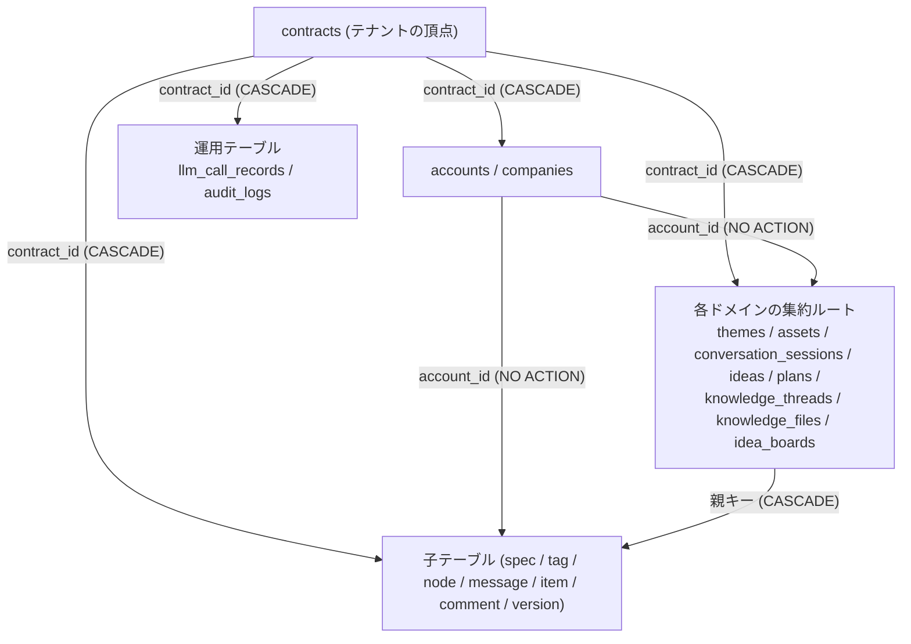

# データモデル (v3 の新規スキーマ)

> 本書が回答する本番観点: **A-3, A-4, D-4** (+ 頻出パターン **DR-3 / BE-1 / BE-4 / BE-10 / BE-11 / BE-12**)
> 対応する受入基準: **AC-1.2** (所有者列) / **AC-3.4** (マイグレーション方式・適用・後方互換・ロールバック)。
> **AC-3.5 (全面切替) のうち「既存データ移行の対象と写像」は本書 §6.4 で未確定として残す** (理由と確定条件は同節)。
> 参照 (本書では決めない): **A-1 / A-2 / A-5 / A-6** ([auth.md](auth.md))・**O-1〜O-7** ([observability.md](observability.md))・
> **D-1 / D-2 / D-3 / D-5 / D-6 / D-7** ([operations.md](operations.md))・**D-8** ([infrastructure.md](infrastructure.md))。
> **D-2** は本書 §7.2 が検査 5 本を追加要求する形で関与する。**D-6 (Managed Agent のライフサイクル) は
> [operations.md](operations.md) §5.2 が SSOT で、本書に Agent 関連テーブルは無い** (Agent ID /
> Environment ID は DB ではなく **SSM Parameter Store** に置く — 同 §3.3 の分類⑤ / §4.5)。
> **無言の省略にしないため所在を明記する**。
> 必須観点 ID の一覧: [../../.claude/rules/08-production-gates.md](../../.claude/rules/08-production-gates.md)

## 0. 本書の位置づけと SSOT 境界

| 事項 | SSOT | 本書の扱い |
|---|---|---|
| **v3 のテーブル・カラム・制約・インデックス** | **本書 §4** | 一次の決定 |
| **キー設計・採番・冪等性・版管理** | **本書 §3 / §4.11** | 一次の決定 |
| **マイグレーション方式 (D-4)・適用単位・ロールバック** | **本書 §6.1〜§6.3** | 一次の決定 (**ツール選定のみ未確定**) |
| **既存データ移行の対象・写像** | **本書 §6.4** | **未確定** (Q-1 のデータ引き継ぎ範囲待ち) |
| 所有者列の規約・境界の宣言方法・クエリ側の強制 | [auth.md](auth.md) §6.3 / §6.4 | **参照する**。本書は各テーブルへの**適用**を書く |
| エンドポイントと入出力項目 | [API/](API/README.md) の各ドメインファイル (一覧は同 §3 の総覧) | **参照する**。本書はそれが要求するデータ構造を定義する |
| 移行の実行位置・承認・DB 適用の運用手順 | [operations.md](operations.md) §6.2 / §7.4 | **参照する**。本書は手順を再定義しない |
| ログ・LLM 明細・監査記録の**項目要件** | [observability.md](observability.md) §4.1 / §4.2 / §4.5 | **参照する**。本書は**テーブルとして具体化**する |
| 層構成・sqlc 生成物の扱い | [architecture.md](architecture.md) §3.5.1 / §3.6 | **参照する**。本書は §3.6 で出力先構成を決める (同 §4 が本書へ委ねた項目) |

**同じ事実を 2 箇所に書かない**。本書が他書の決定を引くときは節番号で参照する。

---

## 1. 現状 (PoC / v2) と確定済みの前提

> 本節が回答する ID: なし (事実の整理) / 前提の出典を集約する

### 1.1 確定している前提 (本書の設計はこれに従う)

| # | 前提 | 出典 |
|---|---|---|
| P-1 | **v3 の資源 (インフラ / DB / スキーマ) は全て新規に作り、v2 の DB・テーブルには相乗りしない** | [questions.md](../../aidlc-docs/inception/productionization/questions.md) Q-1 `[Answer 3]` (= C 方向) |
| P-2 | **データ引き継ぎの要否・範囲 (全件 / 直近のみ / 引き継がない) は事業判断待ち** | 同 Q-1 `[Answer 3]` / `Task-2f` 未完了 ([plan.md](../../aidlc-docs/inception/productionization/plan.md)) |
| P-3 | 移行は **v2 → v3 の一方向コピー**で、**v2 のデータを書き換えない** | [operations.md](operations.md) §6.2 の 2 |
| P-4 | **認証系 API を v3 で実装する** → **併用期間中は `accounts` 相当が v2 と v3 の双方に存在する** | [auth.md](auth.md) §9.3 Q-A8 / §10.2 R-1 |
| P-5 | 機能テーブルは所有者列を **1 段**で持ち、境界 (個人 / 契約) がテーブル定義から一意に読める | [auth.md](auth.md) §6.3 (AC-1.2) |
| P-6 | 絞り込みは **Repository のクエリ条件**で強制する (読み取り系 `Get*` / `List*` / `Count*` / `Search*` を CI 検査) | [auth.md](auth.md) §6.4 (A-4) |
| P-7 | 台帳は **`ledger` JSONB を踏襲**する / Asset は PoC の構造化モデル + テナント列 / `asset_type` と `category` は 2 カラム共存 / `asset_ids bigint[]` をやめ**中間テーブルで正規化** | [design_memo.md](design_memo.md) の「データモデル (保留 — DB 検討中)」節 |
| P-8 | PoC の**生きた型**は v3 の `entity/` へ移す: `PlanTabID` / `IdeaPlan` → `entity/plan`、`Idea` / `IdeaEvaluation` → `entity/idea` | [llm-migration.md](llm-migration.md) §4.3 の X-5 注記 |
| P-9 | 上位層 (`usecase` / `service` / `controller` / `entity`) は **sqlc 生成パッケージを import しない** | [architecture.md](architecture.md) §3.5.1 |

### 1.2 v2 の実装事実 (本書の判断が参照するもの)

| # | 事実 | 出典 |
|---|---|---|
| F-1 | ID 型は**混在**: `contracts` / `accounts` / `companies` は `uuid`、`themes` / `assets` / `ideas` / `idea_boards` は `bigserial` | `hassan-v2-backend/db/schema.sql:5`, `:30`, `:79`, `:94`, `:104`, `:151`, `:599` |
| F-2 | **`accounts.contract_id` を更新するクエリが存在しない** — `db/queries/account.sql` の `UPDATE` 系 7 本 (`UpdateAccountByMember` / `UpdateAccountByAdmin` / `UpdateAccountForAdminPage` / `UpdateEmail` / `UpdateCryptedPassword` / `UpdateIsCompleted` / `UpdateIconURL`) はいずれも `contract_id` を含まない。`grep -rln "SET contract_id" db/queries/` は **0 ファイル** | `hassan-v2-backend/db/queries/account.sql:32`〜`:50` |
| F-3 | **契約スコープの一覧は `accounts` を JOIN して `contract_id` に到達している** (機能テーブルが `contract_id` を持たないため) | `hassan-v2-backend/db/queries/theme.sql:4`〜`:14` (`ListThemesByContractID`) |
| F-4 | 削除方式が**不統一**: `themes` は物理削除 (`DELETE FROM themes WHERE id = $1`)、`assets` は `is_deleted` の論理削除 | `hassan-v2-backend/db/queries/theme.sql:32`〜`:33` / `hassan-v2-backend/db/schema.sql:104`〜`:116` |
| F-5 | `asset_documents` は `id` / `file_text` / `created_at` / `updated_at` の **4 カラムのみ**で、所有者へ辿る FK を一切持たない | `hassan-v2-backend/db/schema.sql:510` ([auth.md](auth.md) §2.3) |
| F-6 | `ideas` は所有者列を持たず `idea_hassan_id` → `idea_hassans.account_id` の **2 段チェーン**。**`is_deleted` 相当のカラムも無い** | `hassan-v2-backend/db/schema.sql:151`〜`:178` ([API/idea-boards.md](API/idea-boards.md) §5 の A-3') |
| F-7 | 配列カラムで関連を持つ箇所がある: `idea_hassans.asset_ids bigint[]` / `ideas.asset_ids bigint[]` / `idea_boards.viewer_account_ids uuid[]` / `editor_account_ids uuid[]` (FK が張れない) | `hassan-v2-backend/db/schema.sql:125`, `:171`, `:604`〜`:605` |
| F-8 | `enum` 型を **6 つ**使っている (`language_type_enum` / `mfa_type_enum` / `event_category_enum` / `event_type_enum` / `activity_log_type` / `conversation_type_enum`) | `hassan-v2-backend/db/schema.sql:3`, `:66`, `:359`, `:372`, `:467`, `:518` |
| F-9 | スキーマ管理は **psqldef** (`db/schema.sql` 1 ファイルを宣言として適用)。**sqlc の入力も同じ `db/schema.sql`** | `hassan-v2-backend/Makefile:24`〜`:26` / `hassan-v2-backend/sqlc.yml:3` |
| F-10 | sqlc の出力は **1 パッケージ** (`db/rdb`) | `hassan-v2-backend/sqlc.yml:6`〜`:11` |
| F-11 | `sharing_settings` は `(contract_id, category)` の PK で契約 × カテゴリの共有 ON/OFF を持つ (**既定は非共有**) | `hassan-v2-backend/db/schema.sql:491`〜`:499` ([API/README.md](API/README.md) F-16) |
| F-12 | `idea_board_phases` は `contract_id` + `UNIQUE (contract_id, name)` + `color_code text NOT NULL DEFAULT '#0455C5'`。**並び順のカラムは無い** | `hassan-v2-backend/db/schema.sql:615`〜`:625` |
| F-13 | ボードの中身は `idea_boards.filter` (jsonb) の**毎回評価**で決まり、アイテムの実体テーブルが無い。memo / phase は `ideas` のカラム | `hassan-v2-backend/db/queries/idea_board.sql:80`〜`:140` / `:64`〜`:67` ([API/idea-boards.md](API/idea-boards.md) §1.0 の V-1 / V-2) |
| F-14 | `activity_logs` は `account_id` + `log_type activity_log_type` (enum) + `log_detail jsonb` | `hassan-v2-backend/db/schema.sql:482`〜`:489` |
| F-15 | `read_news_accounts` は `news_id TEXT` (CMS のコンテンツ ID) + `account_id` の複合主キー | `hassan-v2-backend/db/schema.sql:555`〜`:561` |

### 1.3 PoC の実装事実 (移植元)

| # | 事実 | 出典 |
|---|---|---|
| G-1 | **所有者カラムが 1 つも無い** (単一テナント前提)。store は手書きで sqlc 不使用 | [../analysis/poc-inventory.md](../analysis/poc-inventory.md) §4 |
| G-2 | マイグレーションは **golang-migrate** を起動時に `embed.FS` から自動適用 | `claude_managed_agents/internal/db/postgres.go:53` |
| G-3 | `themes.id` は **TEXT**、`assets.id` は **SERIAL**、`conversation_sessions.id` は **TEXT** (型が混在) | `claude_managed_agents/internal/db/migrations/000016_themes.up.sql:13` / `000002_assets.up.sql:2` / `000032_conversation_sessions.up.sql:10` |
| G-4 | アセットの構造化は 5 テーブル: `asset_specs` / `function_tree_l1` / `function_tree_l2` / `asset_patents` / `asset_tags`。**機能ツリーは L1 / L2 の 2 段固定** | `claude_managed_agents/internal/db/migrations/000005_asset_structured.up.sql:9`〜`:50` / `000010_function_tree_l2_core.up.sql:4` (`is_core`) |
| G-5 | アセットの棚卸し状態は `status` 4 値 (`progress` / `ready` / `error` / `duplicate_pending`) + `error_info jsonb` + `duplicate_of` + `deleted_at` (論理削除) | `claude_managed_agents/internal/db/migrations/000015_asset_status.up.sql:17`〜`:27` |
| G-6 | 版管理は 2 本: `idea_versions` (`UNIQUE (theme_id, idea_num, ver)`) と `plan_tab_versions` (`UNIQUE (theme_id, idea_num, tab_id, ver)`)。**`ver` は `"v1"` / `"v1.3"` の文字列** | `claude_managed_agents/internal/db/migrations/000022_idea_versions.up.sql:20`〜`:33` / `000023_plan_tab_versions.up.sql:24`〜`:38` |
| G-7 | `ver` の採番は **Go 側で全行を読み文字列をパースして最大値 + 1 minor**。コメント自身が「採番と Insert の間のレースは UNIQUE 制約が最終防衛線」と認めている | `claude_managed_agents/internal/db/plan_tab_versions_store.go:170`〜`:205` |
| G-8 | 採番失敗・Insert 失敗は **warn ログのみで継続**する (残りのタブを保存する設計) | `claude_managed_agents/cmd/devui/conversation_tools_plan.go:318` |
| G-9 | `plan_tab_versions.tab_id` に **DB の CHECK 制約を付けない**判断が明記されている (タブ追加時のマイグレーション肥大化を避けるため。検証はアプリ層) | `claude_managed_agents/internal/db/migrations/000023_plan_tab_versions.up.sql:13`〜`:15` |
| G-10 | 派生物の鮮度は **`source_hash` の read-time 照合**で判定する (`idea_evaluations.source_hash`)。空 / 不一致は `stale=true` として評価を返さない | `claude_managed_agents/internal/db/migrations/000027_create_idea_evaluations.up.sql:11`〜`:18` / `claude_managed_agents/cmd/devui/idea_evaluations.go:144` / `claude_managed_agents/cmd/devui/idea_evaluate.go:139` |
| G-11 | 台帳は `conversation_sessions.ledger` JSONB (13 フィールド)。保存は**トランザクション無しの read-modify-write** で `ledger` を**全置換**する | `claude_managed_agents/internal/db/conversation_store.go:148`, `:406` / `claude_managed_agents/cmd/devui/conversation_ledger.go:41`, `:79` |
| G-12 | **会話メッセージ本文を保存するテーブルが無い**。会話履歴は Anthropic の Managed Agent session 側にのみ存在する | [../analysis/poc-conversation-flow.md](../analysis/poc-conversation-flow.md) §5.1 |
| G-13 | `display_title` / `stage` は台帳から**読み取り時に導出**する (カラムを持たない) | `claude_managed_agents/internal/db/conversation_store.go:213`, `:250` |
| G-14 | 台帳に**書き込み経路が無いフィールドが 3 つある** (`Entrypoint` / `Interests` / `RejectedCandidate.Confidence`)。`Interests` は**読み出しが 2 箇所あるのに書き手が無い** | [../analysis/poc-conversation-flow.md](../analysis/poc-conversation-flow.md) §2.1 (BE-10) |
| G-15 | 企画書 grounding の還流で**読み手と書き手のフィールド契約が食い違っている** (読み手が `finding` / `notes:string` を期待し、書き手に `finding` は無く `notes` は `[]string`) | `claude_managed_agents/cmd/devui/conversation_plan_grounding.go:100` / `claude_managed_agents/cmd/devui/conversation_tools_deepdive.go:168` (BE-12) |

### 1.4 概念の対応表 (v2 / PoC / プロトタイプ → v3 のテーブル)

| 概念 | v2 | PoC | v3 のテーブル (§4) |
|---|---|---|---|
| 契約・アカウント・会社 | `contracts` / `accounts` / `companies` | 無し | **同名で v3 に新規作成** (§4.2。二重化は §6.5) |
| テーマ | `themes` (6 カラム) | `themes` (状態機械・タグ付き) | `themes` / `theme_members` (§4.3) |
| アセット | `assets` (+ `asset_documents`) | `assets` + 構造化 5 テーブル | `assets` ほか 10 テーブル (§4.4) |
| 機能分解ツリー | 無し | `function_tree_l1` / `l2` (2 段固定) | **`asset_function_nodes` 1 テーブル (`level` 列)** (§4.4) |
| 会話セッション・台帳 | 無し | `conversation_sessions` (`ledger` JSONB) | `conversation_sessions` ほか 3 テーブル (§4.5) |
| 会話履歴 (発話) | 無し | **DB に無い** (Anthropic 側のみ。G-12) | **`conversation_messages` を新設** (§4.5 / DM-12) |
| アイデア | `ideas` (2 段チェーン・論理削除なし) | `diverge_sessions.ideas` JSONB + `idea_versions` | `ideas` / `idea_versions` / `idea_evaluations` (§4.6) |
| 企画書 | `business_plans` (+ 詳細 4 テーブル) | `plan_tab_versions` (8 タブ) | `plans` / `plan_tab_versions` (§4.6) |
| ナレッジ (RAG) | 無し (類似: `research_titles` 系) | 無し | `knowledge_*` 6 テーブル (§4.7) |
| アイデアボード | `idea_boards` (filter jsonb) / `idea_board_phases` | 無し | `idea_boards` ほか 4 テーブル (§4.8) |
| お知らせの既読 | `read_news_accounts` | 無し | `read_news_accounts` (v2 命名を踏襲。§4.9) |
| 共有設定 | `sharing_settings` (契約 × カテゴリ) | 無し | **持たない** — per-resource の `visibility` 列に置き換える (§4.3 / DM-9) |
| 活動ログ | `activity_logs` (enum) / `event_logs` | 無し | **`audit_logs` 1 本** (§4.10 / DM-15) |
| LLM 利用量 | 無し (usage を載せられない) | 発散経路のみメモリ上 | **`llm_call_records`** (§4.10) |

---

## 2. 設計判断

> 本節が回答する ID: **A-3, A-4, D-4** / 対応 AC: **AC-1.2, AC-3.4**

| # | 論点 | 採用案 | 却下案と理由 |
|---|---|---|---|
| **DM-1** | **主キーの型** | **機能テーブルは `bigint GENERATED BY DEFAULT AS IDENTITY`、アイデンティティ基盤テーブルは `uuid`** (v2 の使い分け F-1 を踏襲)。外部 ID を持つものだけ例外 (`read_news_accounts.news_id` は CMS の `text`) | (a) **UUIDv7 に統一**: 列挙されにくい利点はあるが、**移行で v2 の全 ID を再割り当てすることになり、対応表を全テーブル分作って全 FK を張り替える必要が出る** (写像検証の対象が全テーブルに広がる — [operations.md](operations.md) §6.2 の 3)。列挙への対策は A-4 の所有者条件 + 404 ([auth.md](auth.md) §6.6) で既に構造的に済んでいる。(b) **ULID の文字列 PK** (PoC の `themes.id TEXT` 方式 — G-3): 全 FK が 26 バイトの文字列になり、インデックスサイズと JOIN コストが増える。v2 に前例が無い。(c) `serial` (int4): PoC 方式 (G-3)。21 億で枯渇する列を新規に作る理由が無い |
| **DM-2** | **所有者列の持たせ方** | **すべての機能テーブルが `contract_id NOT NULL` + FK を持つ**。**個人スコープのテーブルは加えて `account_id NOT NULL` + FK を持つ** ([auth.md](auth.md) §6.3 の 3 パターンのうち「両方」を個人スコープの既定にする)。境界の読み方: **`account_id` があれば個人境界 / 無ければ契約境界** (AC-1.2 の「一意に読める」) | (a) **個人スコープは `account_id` のみ** (auth.md §6.3 の最小要件): 契約単位の集計 (`GET /usage-summary`)・契約単位の移行・テナント全削除が**すべて `accounts` を JOIN する形**になり、v2 の F-3 (2 段 JOIN) を再現する。越境検査の形もテーブルごとに変わる。(b) **`contract_id` のみで、個人境界は親を辿って判定**: [auth.md](auth.md) §6.3 の却下 (a) と同じ (多段 JOIN の書き忘れ = §5-1 の温床)。**代償 (受け入れる)**: `account_id` が非正規化されるため所有者移管で全関連テーブルを更新する必要がある → §3.4 の移管 UseCase + CI 照合で塞ぐ |
| **DM-3** | **所有者以外の人物列の命名** | **所有者を表す列名は `account_id` / `contract_id` に限る**。それ以外の役割は接尾を付けて区別する (`create_account_id` / `member_account_id` / `author_account_id` / `actor_id`)。v2 も `idea_boards.create_account_id` でこの形を採っている (`hassan-v2-backend/db/schema.sql:603`) | (a) 役割に関わらず `account_id` を使う: **「`account_id` があれば個人境界」という DM-2 の読み方が壊れ**、AC-1.2 の機械検査 (§3.3) が投稿者列を所有者列と誤認する |
| **DM-4** | **enum の表現** | **`text` + `CHECK` 制約**にする (PoC 方式)。値の一覧は `entity/` の Go 型が SSOT | (a) **v2 の PostgreSQL `enum` 型を踏襲** (F-8): ①値の追加が `ALTER TYPE ... ADD VALUE` になり、**同一トランザクション内で追加した値を使えない**制約が付く ②値の改名・削除は [operations.md](operations.md) §7.4 の破壊的変更 (5) に落ち 3 段階リリースが必要になる ③**sqlc が enum ごとに Go 型を生成し** ([architecture.md](architecture.md) §3.5.1 の実測: `rdb.MfaTypeEnumTotp` が `usecase/` から参照されている)、同 §3.6 の規則 2 (生成型を上位層の契約に出さない) と衝突する。**逸脱の理由はこの 3 点**であり、`CHECK` なら値追加が制約の差し替えで済む |
| **DM-5** | **ユーザー操作による削除** | **すべて論理削除 (`deleted_at TIMESTAMPTZ NULL`)**。物理削除は**契約の削除**と**運用上のデータ廃棄**でのみ起きる | (a) v2 の不統一 (F-4: themes 物理 / assets 論理) の踏襲: テーマの物理削除は配下のアイデア・企画書・**ボードに載ったアイデアとそのコメント**を連鎖で消す。[API/idea-boards.md](API/idea-boards.md) D-IB-7 は「アイデアは論理削除、ボードアイテムは参照を保つ」を前提にしており、両立しない。(b) `is_deleted boolean` (v2 の `assets`): いつ消えたかが残らず、誤削除の調査と復元の判断ができない。**帰結**: [API/themes.md](API/themes.md) D-TH-7 (テーマは物理削除) は**本書の判断と衝突する** → §8 の R-DM-1 で是正要求 |
| **DM-6** | **FK の `ON DELETE`** | **`contract_id` → `CASCADE`** (契約解約でテナントのデータを消す。v2 と同じ) / **`account_id` → `NO ACTION`** / **集約ルート → 子テーブルは `CASCADE`** / **参照 (`primary_asset_id` 等) は `SET NULL`**。**`account_id` の `NO ACTION` には例外が 3 テーブルある** (メンバー削除時の扱いが「移管」ではないもの) — **例外は §3.4.2 の分類②③の有限列挙のみ**とし、それ以外に認めない | (a) `account_id` を `RESTRICT` にする: **RESTRICT は参照行の削除時に即時チェックされる**ため、契約削除の CASCADE で同一文中に子行も消える場合でもエラーになる。`NO ACTION` は文末までチェックが遅延されるので、①アカウント単体の削除は所有物が残っている限り失敗する (移管の強制) ②契約削除の CASCADE とは両立する、の両方が成立する。(b) `account_id` を `CASCADE`: v2 の挙動 (`hassan-v2-backend/db/schema.sql:101` の `themes` / `:116` の `assets` の FK)。**メンバー 1 人の削除で契約の資産 (テーマ・アセット・ボードに載ったアイデア) が消える**。契約内で共有された生成物を個人の退職で失うのは事業データの喪失 |
| **DM-7** | **版管理の `ver`** | **`ver_no INTEGER NOT NULL`** (1 から採番) + 表示ラベルは `entity` が `ver_no` から生成する。`UNIQUE (親キー, ver_no)` | (a) **PoC の文字列 `ver`** (G-6): 採番のために全行を読んで文字列をパースし、パース不能値を無視する防御コードが必要になる (G-7)。`MAX(ver_no)` を SQL で取れなくなるため、採番を 1 つの SQL に閉じる DM-8 が実現できない。(b) タブごとに初期版を変える (`PlanTabDefaultVersions` = 例えば summary が `v1.3`): **表示都合の初期値が DB の採番規則に混入する** |
| **DM-8** | **採番の閉じ込め (BE-11)** | **採番と Insert を Repository の 1 メソッド・1 SQL に閉じる** (`INSERT ... SELECT COALESCE(MAX(ver_no),0)+1 FROM ... WHERE <親キー>`)。競合は `UNIQUE` 違反として検出し **`CodedError` で返す**。UseCase は**同一ターン内で 1 回だけ再試行**し、2 回目の失敗はエラーとして扱う | (a) **PoC 方式 (Go で採番 → Insert)**: 採番と Insert の間にレースが残る (G-7 が明記)。(b) **Insert 失敗を warn ログで継続** (G-8): 「企画書を生成したのに 1 タブだけ保存されていない」が**成功として返る**。DM-8 は失敗を握り潰さない (O-4)。(c) `SELECT ... FOR UPDATE` で親行をロックしてから採番: 正しいが、企画書 8 タブで 8 回ロックを取ることになる。1 SQL の方が短い |
| **DM-9** | **契約内共有の表現** | **per-resource の `visibility` 列 (`private` / `contract`。既定 `private`)** を `themes` / `assets` / `asset_folders` / `ideas` に持つ。**列と書き込み API の両方を増分 1 に含める** (**2026-07-31 改訂** — 旧案は「書き込み API は増分 2」。[requirements.md](../../aidlc-docs/inception/productionization/requirements.md) **C-16** により、v2 の `POST /sharing-settings` でできていた「共有の切り替え」を落とせない。[auth.md](auth.md) §6.12 が理由の SSOT)。**SSOT の書き分け: 列を持つテーブルと値域は本書 (値の一覧は `entity/` の Go 型 — §3.2) / 開放時期と画面での意味は [API/themes.md](API/themes.md) §3.2・[API/assets.md](API/assets.md) §3.2** | (a) **v2 の `sharing_settings` (契約 × カテゴリ) を引き継ぐ** (F-11): テーマ 1 件ごとの可視性を表現できない ([API/themes.md](API/themes.md) D-TH-3)。**ただし既存値は移行時の初期値として使う** (§6.4 の TM-1 / AS-M1 を参照)。(b) 列を増分 2 で追加する: 増分 1 で作られたリソースの既定値決定が増分 2 まで宙に浮き、二重管理になる ([API/themes.md](API/themes.md) §3.2 TM-2) |
| **DM-10** | **配列カラムでの関連** | **中間テーブルで正規化する** (`idea_board_members` / `theme_members` / `asset_ref_urls` / `idea_assets`) | (a) **v2 の配列カラム踏襲** (F-7: `viewer_account_ids uuid[]` / `asset_ids bigint[]`): **FK が張れず**、削除されたアカウント / アセットの ID が残り続ける。所有者条件を含む JOIN も書けないため A-4 の検査が効かない。[design_memo.md](design_memo.md) の指定でもある (P-7) |
| **DM-11** | **台帳 (ledger) の表現** | **`conversation_sessions.ledger JSONB` を踏襲** (P-7) し、**`ledger_schema_version` 列**と**サイズ上限 + 退避テーブル**を加える。型の SSOT は `entity/conversation` の Go 構造体 (§4.11.2) | (a) **13 フィールドを全て列に正規化**: 6 フィールドが配列で、正規化すると 6 テーブル増える。前提チェックの 1 回の読み取りが 7 クエリになる。横断検索の対象でもない (P-7 の判断)。(b) **JSONB のまま無制限に append** (PoC 方式): `research_market` / `deep_dive` の結果が append され続け、1 行の JSONB が単調増加する。台帳は**毎ターン全置換で書き戻す** (G-11) ため、更新コストがセッションの長さに比例して増える。(c) **DB の `CHECK` で JSON 構造を検証**: PostgreSQL は JSON Schema 検証を標準で持たない。検証は Go の型で行う |
| **DM-12** | **会話履歴の所有** | **`conversation_messages` を v3 で新設し、ユーザー発話と agent 発話を保存する** | (a) **PoC 踏襲 (DB に持たない。G-12)**: ①Managed Agent session が archived になると履歴が失われる (PoC はこの経路を自動リトライで扱っている — [../analysis/poc-conversation-flow.md](../analysis/poc-conversation-flow.md) §4.5) ②[design_memo.md](design_memo.md) が FE 仕様に入れると決めた「会話履歴 GET で復元 + 再接続」(O-5) が成立しない ③監査 (O-6) と障害調査で「何を送って何が返ったか」が外部サービス側にしか無い。**外部サービスの状態を SSOT にできない** |
| **DM-13** | **台帳の同時更新** | **ターン開始時に `SELECT ... FOR UPDATE NOWAIT` で会話セッション行を取り、取得できなければ 409** (`ConversationTurnInProgress`)。ターン全体で 1 トランザクション ([architecture.md](architecture.md) §3.10) の中で保持する | (a) **後勝ちを許容** (PoC 方式。同一セッションへの並行リクエストで台帳が上書きされ得る — [../analysis/poc-conversation-flow.md](../analysis/poc-conversation-flow.md) の推測欄): ツール結果が黙って消え、前提チェックが不整合になる。(b) `FOR UPDATE` (NOWAIT なし): 安全弁の実行時間上限が 5 分 ([observability.md](observability.md) §4.4) なので、2 本目のリクエストが最大 5 分待たされる。(c) `ledger_rev` の楽観ロック: 衝突時にターンを最初からやり直すことになり、既に課金された LLM 呼び出しが無駄になる |
| **DM-14** | **派生物の無効化 (BE-4)** | **①生成元の版を FK で持つ (`source_*_version_id`) ②`source_hash` を持ち read 時に照合する ③無効化しても行は消さず `stale` として返す** | (a) **`source_hash` だけを持つ** (PoC 方式。G-10): 「変わったこと」は分かるが「**どの版から生成したか**」が分からない。BE-1 (ブラッシュアップで旧版を参照して数値が食い違う) はこの情報が無いことで起きる。(b) **トリガーで派生物を削除**: ユーザーの生成物 (評価・企画書) が元データの微修正で黙って消える。(c) **`updated_at` の比較で判定**: memo 更新など内容に無関係な更新でも進むため誤検知する。(d) **元データを immutable にする**: ブラッシュアップが仕様上必要 |
| **DM-15** | **監査記録のテーブル** | **`audit_logs` 1 本**。`actor_type` (`account` / `admin_account`) + `actor_id` + `action text` + `target_type` / `target_id` + `request_id` + `detail jsonb` | (a) **v2 の 2 本構成 (`activity_logs` + `event_logs`) を踏襲**: `event_logs` は画面アクセスの計測であり、v3 で必要とされる要件が確認されていない (`GET /usage-summary` の集計は §4.10 の注記のとおり `audit_logs` から出せる)。(b) **`action` を enum にする** (v2 の `activity_log_type`。F-14): 機能追加のたびに `ALTER TYPE` が必要で DM-4 と同じ問題。(c) **`account_id` 単独で actor を表す**: 社内管理者 (`admin_accounts.id`) の操作を記録できない ([observability.md](observability.md) §4.5 / [auth.md](auth.md) §10.2 R-5') |
| **DM-16** | **非同期ジョブの表現** | **ドメインごとに持つ** (`asset_extractions` は独立テーブル / ナレッジは `knowledge_files` の列)。**共通なのは列名と値域の規約**: `status` / `progress` / `failure_code` / `failure_message` / `heartbeat_at` / `idempotency_key` ([API/README.md](API/README.md) §1.3 が状態機械の SSOT) | (a) **単一の `jobs` テーブル + polymorphic な対象参照**: 対象への FK が張れず、所有者列の 1 段化 (DM-2) と両立しない。A-4 の検査もすり抜ける (どのドメインのデータを触るジョブかがスキーマから読めない) |
| **DM-17** | **ジョブの heartbeat** | **専用列 `heartbeat_at TIMESTAMPTZ`** を持つ | (a) **`updated_at` を heartbeat として使う** ([API/README.md](API/README.md) §1.3 の J-3 の記述): 結果の書き込み以外 (メタの更新・再試行フラグ) でも `updated_at` が動くため、**停滞していないジョブを停滞と誤判定する / 逆に停滞を見逃す**。→ J-3 の記述の是正要求を §8 の R-DM-2 に出す |
| **DM-18** | **sqlc の出力構成** | **ドメインごとに出力パッケージを分ける** (`db/queries/<domain>/*.sql` → `db/rdb/<domain>`)。[architecture.md](architecture.md) §4 が本書へ委ねた項目への回答 | (a) **v2 と同じ 1 パッケージ** (F-10): [architecture.md](architecture.md) の L-3 は「sqlc 生成パッケージを import できるのは `repository/**` だけ」を強制するが、**1 パッケージだと `repository/theme` から `rdb.GetAssetByID(...)` に到達できる**。D-A'''' が `repository/` をドメイン別に分割した目的 (import 制約で他ドメインへの到達を塞ぐ) が半分失われる。(b) **DB のスキーマ (namespace) を分ける**: 単一 DB 内での schema 分割は FK と移行を複雑にする。**代償**: sqlc は schema 全体からモデル型を生成するため、出力パッケージごとに同じモデル型が重複して生成される (この挙動は実装リポで sqlc 1.29 に対して確認する — §8 の DM-Q8)。重複型は `repository/` の内側に閉じるので上位層には出ない ([architecture.md](architecture.md) §3.6 の規則 2) |
| **DM-19** | **キーワード検索の実装** | **`ILIKE '%kw%'` + `pg_trgm` の GIN インデックス** | (a) **`to_tsvector` の全文検索**: 日本語は標準の parser で語分割できない。(b) **インデックスなしの `LIKE`** (v2 の `themes.name LIKE` — `hassan-v2-backend/db/queries/theme.sql:13`): 件数が増えると全件走査になる。**明示する限界**: `pg_trgm` は 3 文字未満のキーワードでインデックスが効かない (その場合は所有者条件で絞った上での走査になる)。`pg_bigm` は 2 文字でも効くが RDS での可用性が未確認 (§8 の DM-Q1) |
| **DM-20** | **LLM 明細のパーティション** | **第 1 リリースは単一テーブル** (`created_at` のインデックスのみ)。**行数が 1 億行または保持期間の運用が必要になった時点で月次のレンジパーティションへ移す** (契機を明記する) | (a) **最初から宣言的パーティション**: パーティションの自動作成 (`pg_partman` 等) が新しいインフラ要素になり、[infrastructure.md](infrastructure.md) の管理要素に追加が必要。第 1 リリースの行数見積りが無い状態で運用対象を増やさない |

---

## 3. 構成 (共通規約)

> 本節が回答する ID: **A-3, A-4** / 対応 AC: **AC-1.2**

### 3.1 テナント境界と依存方向



**図の読み方**: 所有者への到達は**常に 1 段**である (`contract_id` / `account_id` を自テーブルに持つ)。
親子の FK は「集約の構造」を表すもので、**所有者判定には使わない** (使うと v2 の 2〜4 段チェーンに戻る)。

### 3.2 共通のカラム規約

| 規約 | 内容 | 却下案 |
|---|---|---|
| PK | 機能テーブル: `id bigint GENERATED BY DEFAULT AS IDENTITY PRIMARY KEY` (DM-1)。中間テーブルは複合 PK | — |
| タイムスタンプ | `created_at timestamptz NOT NULL DEFAULT CURRENT_TIMESTAMP` / `updated_at timestamptz NOT NULL DEFAULT CURRENT_TIMESTAMP`。**更新は SQL 側で `updated_at = CURRENT_TIMESTAMP` を明示する** (v2 と同じ) | トリガーでの自動更新: v2 に前例が無く、sqlc の生成クエリから挙動が読めない |
| 文字列 | `text` を使う (`varchar(n)` を使わない。v2 も大半が `text`) | — |
| 列挙値 | `text` + `CHECK (col IN (...))` (DM-4)。値の SSOT は `entity/` の Go 型 | PostgreSQL の `enum` (DM-4 の却下理由) |
| 論理削除 | `deleted_at timestamptz NULL`。**読み取り系クエリは必ず `deleted_at IS NULL` を含める** (DM-5) | `is_deleted boolean` (削除時刻が残らない) |
| 金額 | `numeric(14,6)` (LLM コストの推定値。浮動小数を使わない) | `double precision` (加算で誤差が積む) |
| JSONB | `jsonb NOT NULL DEFAULT '{}'::jsonb`。**構造の SSOT は `entity/` の Go 型**で、`map[string]any` の直書きを禁止する (§4.11.2) | — |
| 命名 | テーブル・カラムは snake_case・テーブルは複数形 (v2 準拠)。**予約語を避ける** — API の `order` は列名 `sort_order` に写す (§4.8 の注) | — |

### 3.3 所有者列の適用と機械検査 (AC-1.2 / A-3)

**規約は [auth.md](auth.md) §6.3 が SSOT**。本書はそれを各テーブルへ適用し、次の 3 点を追加で確定させる。

| # | 決定 |
|---|---|
| 1 | **機能テーブルは `contract_id uuid NOT NULL REFERENCES contracts(id) ON DELETE CASCADE` を必ず持つ** (DM-2) |
| 2 | **個人スコープのテーブルは加えて `account_id uuid NOT NULL REFERENCES accounts(id)`** (`ON DELETE NO ACTION`。DM-6) を持つ。**契約スコープのテーブルは `account_id` を持たない** (作成者は `create_account_id` — DM-3)。**`ON DELETE` の例外は §3.4.2 の分類②③の 3 テーブルのみ** |
| 3 | **本文・添付・チャンクを格納するテーブルにも所有者列を置く** ([auth.md](auth.md) §6.3 の 2)。v2 の `asset_documents` (F-5) を再現しない |

**機械検査 (CI。[architecture.md](architecture.md) §5 の D-2 に追加する)**:

| # | 検査 | 検出する事故 |
|---|---|---|
| ① | スキーマ定義中の全テーブルが `contract_id` を持つこと。**除外リストは §4.1.2 の (a) 表 6 件 + 同 (b) 表のうち `contract_id` を持たない 2 件 (`account_mfa_configs` / `reset_password_requests`) = 8 件に限る** (2026-07-31 の DM-A4=B で `signup_links` が除外から外れ、同日 `admin_mfa_configs` が (a) に加わった)。**`contract_id` を持つ `accounts` / `companies` / `signup_links` は除外しない** (除外すると将来 `contract_id` が落ちても検出できない)。**この件数は `make check-table-counts` が §4.1.2 の 2 表から実測して照合する** | 新規テーブルの所有者列の付け忘れ |
| ②-1 | ⚠️ **本増分では対象外** (2026-08-10 の DM-Q2 = 削除せず無効化のみ)。**移管 UseCase を作らないため、この検査は「所有者移管 UseCase が存在しないこと」に読み替える** — 旧定義 (「**§3.4.2 の分類① (移管対象。31 件)** の集合 == 移管 UseCase が `UPDATE` するテーブルの集合」) のままだと **31 ≠ 0 で必ず失敗する**。**移管を再開する増分で旧定義に戻す** | 非正規化した `account_id` の更新漏れ (孤立) |
| ②-2 | `account_id` を持つテーブルの集合 == **分類① ∪ 分類② ∪ 分類③ (34 件)** で、**分類②③に属するのは §3.4.2 の有限列挙のテーブルだけ**であること | 「移管しない」を新規テーブルで無言に選ぶこと (②-1 の集合一致が骨抜きになる) |
| ③ | 読み取り系クエリ (`Get*` / `List*` / `Count*` / `Search*`) が所有者条件を持つこと | [auth.md](auth.md) §6.4 の既存検査 (本書は対象テーブルを与えるだけ) |

> **②を 2 本に分けた理由**: 「`account_id` を持つ ⇔ 移管する」を 1 本の集合一致にすると、
> **`llm_call_records` が「本検査②が `UPDATE` を要求し、§7.2 の検査 5 が `UPDATE` を禁止する」状態に
> なり、両方を同時には満たせない** (append-only。§4.10)。分類を先に固定し、**分類①のみ**を
> 移管対象の集合一致に使うことで両立させる。
> 分類②③を有限列挙で縛る②-2 が無いと、「移管しない」の宣言が実装者の裁量になる。

### 3.4 非正規化した `account_id` の維持 (DM-2 の代償への対処)

#### 3.4.1 前提の決定

| # | 決定 |
|---|---|
| 1 | **`accounts.contract_id` を更新する経路を v3 に作らない** (v2 にも無い — F-2)。契約の付け替えが必要になった場合は、非正規化した `contract_id` の再計算を伴う運用作業として設計し直す (§8 の DM-Q2) |
| 2 | ⚠️ **本増分では所有者移管を行わない** (DM-Q2 = 無効化のみ)。**移管 UseCase を作らない**ため §3.3 の検査②-1 は「移管 UseCase が存在しないこと」を見る。**移管を再開する増分では**「専用の UseCase 1 本だけが行う。対象は §3.4.2 の分類①に限る」に戻し、検査②-1 を集合一致へ復活させる |
| 3 | メンバー削除の既定の挙動は **「削除せず無効化のみ」** とする (**2026-08-10 のユーザー回答 = DM-Q2 ①**)。`accounts` の行を**物理削除せず**、**所有物の移管も行わない** — 分類①②③のいずれにも触れない。**v2 は CASCADE で所有物ごと消えていた** (DM-6 の却下 b) ため挙動が変わるが、**契約の資産が失われないという v3 の目的は満たす**。**代償**: `accounts` に無効化を表す列が要る = **§4.2 の「v2 に無い列を足さない」への明示的な例外** (下の DM-A5)。**旧採用案 (却下)**: 「分類①を契約内管理者へ移管 → 分類②を削除 → 分類③は残す → 物理削除」 — 移管対象が最大 29 テーブルに及び、非同期ジョブ・状態テーブル (`account_deletions`)・冪等キー・heartbeat 回収を要する。無効化のみならこれらがすべて不要になる ([API/auth-accounts.md](API/auth-accounts.md) AA-D-13 の改訂) |

#### 3.4.2 `account_id` を持つ 34 テーブルの 3 分類 (メンバー削除時の扱い)

> ⚠️ **本増分での位置づけ (2026-08-10)**: DM-Q2 が「削除せず無効化のみ」に確定したため、**本分類はメンバー削除時の処理分岐としては使われない**。**分類①の 31 件は `make check-table-counts` の検算対象として残す** — 移管を再開する増分で検査②-1 の期待値になるため、集合の定義自体は維持する。**「31 件」を「本増分で移管する対象」と読まないこと**。

**分類はこの表が唯一の定義**。新規に `account_id` を持つテーブルを追加するときは**必ずどれかに入れる**
(検査②-2 が未分類を落とす)。「行数オーダー」は §3.4.3 のバッチ設計の入力で、
**1 アカウントあたりの増え方の型**を書く (実測値ではない — v2 の実データ量は `Task-2f` 待ち)。

**分類① 移管する (契約の資産。31 件)** — `UPDATE ... SET account_id = <移管先>`。FK は `NO ACTION` (DM-6)。

| 集約 | テーブル | 行数オーダー (1 アカウントあたり) |
|---|---|---|
| テーマ | `themes` | テーマ数 (定数オーダー) |
| アセット | `asset_folders` / `assets` / `asset_tags` / `asset_specs` / `asset_patents` / `asset_ref_urls` / `asset_function_nodes` / `asset_documents` / `asset_extractions` / `asset_extraction_sources` (10 件) | アセット数 × 子要素数 |
| アセット (進捗) | `asset_extraction_events` | **抽出ジョブ数 × イベント数 (伸びる)** |
| 会話 | `conversation_sessions` / `conversation_ledger_archives` (2 件) | セッション数 |
| 会話 (履歴) | `conversation_messages` / `conversation_tool_calls` (2 件) | **セッション数 × ターン数 (最も伸びる)** |
| アイデア・企画書 | `ideas` / `idea_assets` / **`idea_tags`** / `idea_versions` / `idea_evaluations` / `plans` / `plan_tab_versions` / **`plan_favorites`** (8 件) | アイデア数 × 版数 |
| 企画書 (チャット履歴) | `plan_chat_messages` (2026-08-02 追加) | **企画書数 × 発話数 (伸びる)** |
| ナレッジ | `knowledge_threads` / `knowledge_messages` / `knowledge_message_citations` / `knowledge_files` / `knowledge_thread_files` (5 件) | スレッド数 × メッセージ数 |
| ナレッジ (チャンク) | `knowledge_file_chunks` | **ファイル数 × チャンク数 (伸びる)** |

**分類② 個人設定として削除する (2 件)** — 移管しない。**他人の既読状態・通知設定を管理者へ移すのは誤り**。

| テーブル | メンバー削除時 | `account_id` の FK | 例外である旨 |
|---|---|---|---|
| `read_news_accounts` | **行を削除する** | **`ON DELETE CASCADE`** (§4.9) | **§3.3-2 / DM-6 の `NO ACTION` 規約に対する明示的な例外**。CASCADE で消えるのが正しい挙動であり、移管 UseCase は本テーブルを触らない |
| `account_notification_settings` | **行を削除する** | **`ON DELETE CASCADE`** (§4.9) | 同上 |

> **`NO ACTION` を選ばない理由**: この 2 テーブルに `NO ACTION` を張ると、**移管 UseCase が削除しない限り
> `accounts` の物理削除が必ず失敗する**。削除が正しい挙動なので、DB 側で消す方が「移管 UseCase の
> 削除処理の書き忘れ」を構造的に潰せる。**却下**: 移管 UseCase 側で `DELETE` してから `accounts` を消す
> (削除順序をアプリが守る前提になり、順序を間違えると本番のメンバー削除が失敗する)。

**分類③ 記録として保全する (append-only。1 件)** — 移管も削除もしない。

| テーブル | メンバー削除時 | `account_id` の FK | 理由 |
|---|---|---|---|
| `llm_call_records` | **何もしない** (行はそのまま残る) | **FK を張らない (論理参照)** | `account_id` は**所有者ではなく「呼び出しが発生した時点の実行者」の記録**である (§4.10)。過去の記録の実行者を書き換えると契約単位のコスト集計が遡って変わる |

> **FK を張らない判断 (auth.md §6.3-1 の「`NOT NULL` + FK」からの逸脱。R-DM-4 の③で SSOT へ是正要求)**:
> **却下 (a) `NO ACTION` + FK**: 明細は保持期間 (DM-20 / DM-Q9) まで残るため、**メンバーの物理削除が
> 明細の存在で必ず失敗し、§3.4.1-3 の既定手順が成立しない** (実質「明細のあるメンバーは削除できない」)。
> **却下 (b) `CASCADE`**: メンバー削除でコスト明細が消え、**契約単位の過去の集計値が変わる**
> (append-only の前提 = [observability.md](observability.md) §4.2 の「取り損なった分は後から復元できない」と矛盾)。
> **却下 (c) `SET NULL` (列を NULL 可にする)**: 「誰が使ったか」が失われ、O-2 / O-3 のアカウント単位集計が
> 過去分について不能になる。**先例**: `audit_logs.actor_id` も FK を張らない (§4.10。actor が
> `accounts` / `admin_accounts` の 2 種にまたがるため)。**`contract_id` の FK (CASCADE) は維持する** —
> 契約解約はテナント全削除であり、部分的な不整合を生まない。

#### 3.4.3 移管の実行方式 (対象 29 テーブル・大量行への対処)

| # | 決定 |
|---|---|
| 1 | **移管は集約ルート単位のバッチで行い、1 バッチ = 1 トランザクション**とする。バッチの単位は §3.4.2 の「集約」列 (テーマ 1 件 / アセット 1 件 / 会話セッション 1 件 / アイデア 1 件 / ナレッジスレッド 1 件 / ナレッジファイル 1 件)。**1 トランザクションで対象アカウントの全行を更新しない** (`conversation_messages` / `knowledge_file_chunks` / `asset_extraction_events` は行数が伸びるため、ロック保持時間が読み取り側のレイテンシに出る) |
| 2 | **1 バッチの上限集約数を設定値にする** (`config` が SSOT。BE-2。**既定 50 集約**)。この値の調整だけで本番のロック保持時間を変えられる形にする |
| 3 | **進捗は「移管済みの集約ルート ID」ではなく `WHERE account_id = <旧 account_id>` の残件数で表す** — `UPDATE ... WHERE account_id = <旧>` は**再実行しても結果が変わらない** (冪等) ため、中断した場合は同じコマンドの再実行で続行できる。**別途の進捗テーブルを持たない** |
| 4 | **移管は同期 API で完結させない** — 非同期ジョブ (DM-16 の規約に従う `status` / `progress` / `failure_code`) として実行し、**残件数が 0 になった後にのみ `accounts` の行を物理削除する**。0 でない状態で削除に進まない (削除が FK の `NO ACTION` で失敗するため、握り潰すと「削除したつもり」になる) |
| 5 | **実行時間の想定を移行前に埋める** — v2 の実データ量 (`Task-2f`) が未確定のため、**行数の実測は §8 の DM-Q2 の確認項目に含める**。推測値をここに書かない |

### 3.5 インデックスの規約

| 規約 | 理由 |
|---|---|
| **一覧・検索用の複合インデックスは所有者列を先頭に置く** (`(account_id, updated_at DESC)` 等) | 所有者条件は**必ず** `WHERE` に入る (A-4) ため、先頭に置くと全ての読み取り系で効く |
| 論理削除のあるテーブルは**部分インデックス** (`WHERE deleted_at IS NULL`) を使う | 通常クエリは `deleted_at IS NULL` を必ず付ける (§3.2)。PoC も同じ形を採っている (`claude_managed_agents/internal/db/migrations/000015_asset_status.up.sql:26`) |
| 一意制約は**部分 UNIQUE インデックス**で表現してよい (`WHERE deleted_at IS NULL` / `WHERE status IN (...)`) | 論理削除した行と新規行の名前衝突を避ける / 進行中ジョブのみの冪等キーを表現する |
| **キーワード検索は `pg_trgm` の GIN** (DM-19) | 対象列は各節の表に明記する |

### 3.6 `db/queries` と sqlc の構成 (DM-18)

```
db/
  schema.sql                 ← スキーマ定義の SSOT (方式は §6.1 で確定。psqldef を採る場合はこれが適用単位)
  queries/
    theme/*.sql              → db/rdb/theme     (package theme)
    asset/*.sql              → db/rdb/asset
    conversation/*.sql       → db/rdb/conversation
    idea/*.sql               → db/rdb/idea
    plan/*.sql               → db/rdb/plan
    knowledge/*.sql          → db/rdb/knowledge
    board/*.sql              → db/rdb/board
    account/*.sql            → db/rdb/account    ← v2 移植分 (3 層規約。architecture.md §3.5.2)
    ops/*.sql                → db/rdb/ops        (llm_call_records / audit_logs / rate limit)
```

- **`repository/<domain>` が import してよい生成パッケージは `db/rdb/<domain>` のみ**とし、depguard の allow list に書く
  ([architecture.md](architecture.md) §3.5.1 の L-3 をドメイン粒度で強制できるようになる)
- **ドメインを跨ぐ読み取りが必要な場合は UseCase が両方の Repository を呼ぶ** (L-2 / L-3)。
  `db/queries/<domain>/` に他ドメインのテーブルを主対象とするクエリを置かない
- **JOIN は許す** (例: ボードアイテム一覧が `ideas` を JOIN する)。ただしそのクエリは
  **「読み取り主体のドメイン」のディレクトリに置き、所有者条件は主対象のテーブルに掛ける**

---

## 4. データモデル

> 本節が回答する ID: **A-3, A-4** / 対応 AC: **AC-1.2**
> **列の網羅ではなく「設計判断が現れる列と制約」を書く**。完全な DDL は実装リポの `db/schema.sql` が持つ。

### 4.1 テーブル一覧

#### 4.1.1 機能テーブル (42 件。**所有者列は全件必須**)

「境界」= 個人 (`account_id` + `contract_id` を持つ) / 契約 (`contract_id` のみ)。
「増分」= 1 (第 1 リリース) / 2 ([API/README.md](API/README.md) D-API-8' の増分 2) / 併用 (v2 併用期間中の移送で使う)。

| # | テーブル | 境界 | 所有者列 | 増分 | 節 |
|---|---|---|---|---|---|
| 1 | `themes` | 個人 | `contract_id` + `account_id` | 1 | §4.3 |
| 2 | `theme_members` | 契約 | `contract_id` | 2 | §4.3 |
| 3 | `asset_folders` | 個人 | `contract_id` + `account_id` | 1 | §4.4 |
| 4 | `assets` | 個人 | `contract_id` + `account_id` | 1 | §4.4 |
| 5 | `asset_tags` | 個人 | `contract_id` + `account_id` | 1 | §4.4 |
| 6 | `asset_specs` | 個人 | `contract_id` + `account_id` | 1 | §4.4 |
| 7 | `asset_patents` | 個人 | `contract_id` + `account_id` | 1 | §4.4 |
| 8 | `asset_ref_urls` | 個人 | `contract_id` + `account_id` | 1 | §4.4 |
| 9 | `asset_function_nodes` | 個人 | `contract_id` + `account_id` | 1 | §4.4 |
| 10 | `asset_documents` | 個人 | `contract_id` + `account_id` | 1 | §4.4 |
| 11 | `asset_extractions` | 個人 | `contract_id` + `account_id` | 1 | §4.4 |
| 12 | `asset_extraction_sources` | 個人 | `contract_id` + `account_id` | 1 | §4.4 |
| 13 | `asset_extraction_events` | 個人 | `contract_id` + `account_id` | 1 | §4.4 |
| 14 | `conversation_sessions` | 個人 | `contract_id` + `account_id` | 1 | §4.5 |
| 15 | `conversation_messages` | 個人 | `contract_id` + `account_id` | 1 | §4.5 |
| 16 | `conversation_tool_calls` | 個人 | `contract_id` + `account_id` | 1 | §4.5 |
| 17 | `conversation_ledger_archives` | 個人 | `contract_id` + `account_id` | 1 | §4.5 |
| 18 | `ideas` | 個人 | `contract_id` + `account_id` | 1 | §4.6 |
| 19 | `idea_assets` | 個人 | `contract_id` + `account_id` | 1 | §4.6 |
| 20 | `idea_tags` | 個人 | `contract_id` + `account_id` | 1 | §4.6 |
| 21 | `idea_versions` | 個人 | `contract_id` + `account_id` | 1 | §4.6 |
| 22 | `idea_evaluations` | 個人 | `contract_id` + `account_id` | 1 | §4.6 |
| 23 | `plans` | 個人 | `contract_id` + `account_id` | 1 | §4.6 |
| 24 | `plan_tab_versions` | 個人 | `contract_id` + `account_id` | 1 | §4.6 |
| 25 | `plan_favorites` | 個人 | `contract_id` + `account_id` | 1 | §4.6 |
| 26 | `plan_chat_messages` | 個人 | `contract_id` + `account_id` | 1 | §4.6 |
| 27 | `knowledge_threads` | 個人 | `contract_id` + `account_id` | 1 | §4.7 |
| 28 | `knowledge_messages` | 個人 | `contract_id` + `account_id` | 1 | §4.7 |
| 29 | `knowledge_message_citations` | 個人 | `contract_id` + `account_id` | 1 | §4.7 |
| 30 | `knowledge_files` | 個人 | `contract_id` + `account_id` | 1 | §4.7 |
| 31 | `knowledge_file_chunks` | 個人 | `contract_id` + `account_id` | 1 | §4.7 |
| 32 | `knowledge_thread_files` | 個人 | `contract_id` + `account_id` | 1 | §4.7 |
| 33 | `idea_boards` | 契約 | `contract_id` | 1 | §4.8 |
| 34 | `idea_board_members` | 契約 | `contract_id` | 1 | §4.8 |
| 35 | `idea_board_phases` | 契約 | `contract_id` | 1 | §4.8 |
| 36 | `idea_board_items` | 契約 | `contract_id` | 1 | §4.8 |
| 37 | `idea_board_comments` | 契約 | `contract_id` | 1 | §4.8 |
| 38 | `read_news_accounts` | 個人 | `contract_id` + `account_id` | 1 | §4.9 |
| 39 | `account_notification_settings` | 個人 | `contract_id` + `account_id` | 1 | §4.9 |
| 40 | `workspace_settings` | 契約 | `contract_id` | 1 | §4.9 |
| 41 | `llm_call_records` | 個人 | `contract_id` + `account_id` | 1 | §4.10 |
| 42 | `audit_logs` | 契約 | `contract_id` | 1 | §4.10 |

> 行番号 1〜42 のうち欠番は無い (**42 行**)。§3.3 の検査①はこの表を入力にする。

#### 4.1.2 機能テーブル以外の 11 テーブル (2 種類の例外を分けて列挙する)

**[auth.md](auth.md) §6.3 の例外列挙に対応する**。**2 種類を混ぜないために表を 2 つに分ける** —
混ぜると **`contract_id` を実際に持つ `accounts` / `companies` が検査①の対象外**になり、
将来これらの `contract_id` が落ちても検出されない (v2 の `asset_documents` = F-5 が生まれた経路と同型)。
**列挙はこの 2 表で確定である** — 前提だった [auth.md](auth.md) §10.2 R-1 (アカウント基盤の扱い) は
**2026-07-31 に回答済み** (§6.5 の DM-A3 = 推奨 5 点すべてで確定。①v3 を正とする ②RL-3 の最初に移行
③移行中は v2 のアカウント更新系を数分停止 ④資格情報は 1 回コピーのみで同期しない ⑤切り戻しは v2 を使う)。

> **件数の転記について (DR-9)**: 本節の (a)(b) の**件数と除外リストの件数は
> `make check-table-counts` の検算対象**である (`scripts/check-table-counts.sh`)。
> **他文書へ件数を転記しない** — 転記が必要になったら本節へのリンクにする。

**(a) 所有者列を持たない 6 件 = §3.3 の検査①の例外** (**検査①の入力はこの表だけ**。この表に無いテーブルに例外を認めない)

| テーブル | 例外の理由 |
|---|---|
| `contracts` | テナント境界の頂点。所有者にあたる上位が存在しない |
| `auth_roles` | ロール定義のマスタ。テナントに属さない |
| `admin_accounts` / `admin_auth_roles` | 社内管理者のアカウントとロール定義。全契約を横断する運用主体であり契約に属さない |
| `register_admin_password_requests` | 社内管理者のパスワード登録要求。未認証経路から token で引く |
| **`auth_rate_limit_counters`** | **未認証エンドポイントのカウンタ**であり、契約・アカウントが確定する前に書く ([auth.md](auth.md) §6.11-3) |

**(b) 所有者列を実際に持つ 5 件 = 検査①の例外ではない** (検査①を**通る**。
クエリ側で所有者条件を掛けられない経路のみ [auth.md](auth.md) §6.4 の**許可リスト**で個別に例外化する)

| テーブル | 実際に持つ列 | 検査① | クエリ側の扱い ([auth.md](auth.md) §6.4 の許可リスト種別) |
|---|---|---|---|
| `accounts` | `contract_id` | **通る** | 種別①②③⑥⑦ (サインインの email 引き / トークンからの所有者解決 / email の重複確認 / 契約検証付きの一意キー引き / 社内管理者のロック解除)。`account_id` を自テーブルに置く意味が無いだけで、`contract_id` は持つ |
| `companies` | `contract_id` | **通る** | **原則として許可リスト不要** (`contract_id` 条件で引ける)。個人所有ではないため `account_id` を持たない |
| `account_mfa_configs` | `account_id` | **通る** (`contract_id` は持たないが (a) ではない → 下記の注) | 種別② (引く条件がトークン検証済みの `account_id`) |
| `reset_password_requests` | `account_id` | **通る** (同上) | 種別① (引く条件が hash) |
| **`signup_links`** | **`contract_id` (v3 で新設 — 2026-07-31 の DM-A4=B)** | **通る** | 契約内管理者による発行・未使用招待の一覧は `contract_id` 条件で引ける。**未認証経路 (サインアップ時にリンク ID で引く) のみ** [auth.md](auth.md) §6.4 の許可リストで例外化する (種別の割り当ては auth.md 側への反映時 — R-DM-4)。参考: v2 は所有者列を 1 つも持たない (`id uuid` / `email` / `expired_at` / `created_at` / `updated_at` の 5 列のみ — `hassan-v2-backend/db/schema.sql:342`) |

> **`account_mfa_configs` / `reset_password_requests` の扱い**: この 2 件は `account_id` を持ち
> `contract_id` を持たない。**検査①は「`contract_id` を持つこと」を見るため、この 2 件は (a) と同じく
> 検査①の入力から外す必要がある** — ただし**理由が (a) と異なる** (所有者列が無いのではなく、
> 認証系で `contract_id` が確定する前に書かれるため)。**検査①の実装は (a) 6 件 + 本注記の 2 件 = 8 件を
> 除外リストに持つ**こととし、**除外の根拠を 2 種類に分けて記載する** (増えたときにどちらの理由かが分かる形にする)。
> **`accounts` / `companies` / `signup_links` は除外リストに入れない** (いずれも `contract_id` を持つ)。
>
> **[auth.md](auth.md) §6.3 の列挙との差分は 2 件** (`auth_rate_limit_counters` / `account_mfa_configs`) で、
> **どちらもメインセッションが 2026-07-30 に auth.md §6.3 へ反映済み** (同節の例外表に両行が存在する)。
> 規約本体 (§6.3-1 の表) への反映は §8 の R-DM-4 が引き続き要求する。

### 4.2 アイデンティティ・テナント基盤

**v2 の構造をそのまま v3 に作る** (列の追加・削除をしない)。理由: 併用期間中の二重化 (§6.5) で
**v2 → v3 のコピーが列単位で 1:1 になる**こと。変える点は次の 3 つに限る
(**3 点目は 2026-07-31 に追加** — [API/auth-accounts.md](API/auth-accounts.md) の 1 巡目レビューが
「招待・リセットの秘密の保存先の列と保存形が未定義」を重大として指摘したため。本節末の表が定義):

| 変更 | 内容 | 理由 |
|---|---|---|
| `enum` → `text` + `CHECK` | `language_type` / `mfa_type` | DM-4 |
| **`signup_links` に `contract_id NOT NULL` + FK を追加** | 契約単位の招待を表現する (**DM-A4=B。2026-07-31 確定** — §8.1)。**v2 の既存未使用リンクには対応値が無い**ため、移行では**引き継がず失効させて再発行**を既定候補とする (最終確定は DM-A2 の移行設計) | §4.1.2 (b) |
| **秘密の保存形を改める** | `signup_links` は `id` を秘密に使わず **`token_hash` を新設**、`reset_password_requests.hash` → **`token_hash` に改名し平文を保存しない** | 本節末「招待・リセットの秘密の格納」。[auth.md](auth.md) §6.10-1 の `crypto/rand` 要件を**判定可能**にするため |
| 上記以外の列の追加なし | v2 に無い列を足さない | 移行の写像を単純に保つ。必要が生じたら移行後に追加する |
| **例外 1 件 (DM-A5。2026-08-10)** | **`accounts.deactivated_at timestamptz NULL` を追加する** | DM-Q2 = 「削除せず無効化のみ」の帰結。**却下案**: (a) 既存の `last_locked_at` を流用する — ロック (回復可能な一時停止) と無効化 (恒久) は §6.9 の回復経路の扱いが違い、解除 API が無効化まで解いてしまう。(b) 別テーブル `account_deactivations` を作る — 1 アカウント 1 行の状態を別テーブルに置くと一覧の絞り込みが毎回 JOIN になる。**帰結は下の DM-A5 補足で全件決める** |

**対象**: `contracts` / `accounts` / `companies` / `auth_roles` / `account_mfa_configs` /
`reset_password_requests` / `signup_links` / `admin_accounts` / `admin_auth_roles` /
`register_admin_password_requests` (出典: `hassan-v2-backend/db/schema.sql:5`〜`:92`, `:312`, `:342`, `:501`)。
**v3 で新設するものは `auth_rate_limit_counters` の 1 件** (下記で定義)。
**`admin_mfa_configs` は 2026-08-10 の AA-D-22 (社内管理者に MFA を課さない) で削除した** ([API/auth-accounts.md](API/auth-accounts.md) §5 の R-AA-28)。

**`auth_rate_limit_counters`** (v2 に無い。[auth.md](auth.md) §6.11-3 が「共有ストアに置く。既定は DB」と決定):

| 項目 | 内容 |
|---|---|
| 主キー | `(bucket_key text, window_start timestamptz)` |
| 列 | `hits integer NOT NULL DEFAULT 0` |
| `bucket_key` の作り方 | `<対象種別>:<エンドポイント>:<値のハッシュ>` (IP / メールアドレスを平文で保存しない) |
| 書き込み | 1 リクエスト = 1 `INSERT ... ON CONFLICT DO UPDATE SET hits = hits + 1` |
| 掃除 | `window_start < now() - <保持期間>` の行を定期削除 (実行方式は [operations.md](operations.md) の定期実行に載せる) |
| しきい値 / fail-closed の挙動 / 観測 | **[auth.md](auth.md) §6.11-3・§6.11-4 が SSOT** (本書では決めない) |
| 書き込み負荷の見積り | 認証エンドポイントのリクエスト数と同数の UPSERT。[infrastructure.md](infrastructure.md) の R-6 へ入力 |

> ### DM-A5 補足: 無効化 (`deactivated_at`) の帰結を全件決める (2026-08-10)
>
> **列を足す決定だけでは実装できない** — 読む側を対で設計しないと BE-10 (読む側と書く側の片方が無い) になる。
>
> | # | 論点 | 決定 |
> |---|---|---|
> | 1 | **サインインの可否** | **拒否する**。`POST /accounts/signin` は `deactivated_at IS NOT NULL` を**ロックと同じ分類 C の 401** で返す (`AU-C-00002` とは別コードを割り当てる — 是正要求は [API/auth-accounts.md](API/auth-accounts.md) §5)。**存在確認・ロック確認と同じ層 (UseCase) で判定する** |
> | 2 | **既存トークンの失効** | **失効しない** (JWT はステートレスで最大 7 日有効)。**即時遮断は本増分に無い** — 手動ロックが AA-Q13 で実装スコープ外のため ([auth.md](auth.md) §6.9 の AA-Q13 受信欄)。**無効化したメンバーが最大 7 日アクセスし続けることを受け入れる**。運用の代替は署名鍵ローテーション ([auth.md](auth.md) §10.2 R-8) |
> | 3 | **一覧・取得の既定** | **`GET /accounts` は既定で無効化済みを除外**し、`include_deactivated=true` で含める。**`GET /accounts/{account_id}` は無効化済みでも 200 で返す** (監査・再有効化の判断に要る)。**本書がこの決定の SSOT** — [API/auth-accounts.md](API/auth-accounts.md) §5 の R-AA-27 は「本節で決める」ではなく**本決定の受信**に変える (循環委譲だった) |
> | 4 | **所有物の参照** | 個人スコープの 34 テーブルは `WHERE account_id = <認証ユーザー>` で引くため、**無効化するとその行は契約内の誰からも読めなくなる**。§3.4.1 の 3 が書いた「契約の資産が失われない」は**行が消えないという意味であって、読めるという意味ではない**。**本増分では読み出し経路を作らない** — 必要になった時点で「契約内管理者が無効化済みメンバーの所有物を移管する」経路 (旧 AA-D-13 の移管 UseCase) を復活させる |
> | 5 | **メールアドレスの再利用** | **できない**。`accounts.email` は**グローバル一意** (`hassan-v2-backend/db/schema.sql:49` = `CREATE UNIQUE INDEX unique_accounts_email ON accounts (email)`) で、行が消えないため**アドレスが永久に占有される**。v2 は物理削除で解放されていた。**同一人物の再招待・別契約での利用が 409 になる** — 運用上の制約として明記し、解消が必要になったら「無効化時に `email` を `<元の値>+deactivated-<uuid>` へ書き換える」案を検討する (本増分では採らない。監査で元アドレスを追えなくなるため) |
> | 6 | **契約の人数上限** | **無効化済みは数えない**。`POST /accounts` の 409 (人数上限) の判定は `deactivated_at IS NULL` を条件に含める |
> | 7 | **再有効化** | **API を作らない**。必要になった場合は運用 SQL で `deactivated_at = NULL` に戻す。**作らない理由**: 再有効化は 5 (メールアドレスの占有) と組み合わせて初めて意味を持ち、単独で足すと「無効化 → 再有効化 → 権限が元のまま」の経路が監査ログ無しで成立する (AA-D-23 で監査を v2 相当に絞ったため) |

**招待・リセットの秘密の格納** (v2 は「リンク ID (UUID) 自体が秘密」/ `reset_password_requests.hash` に
平文を保存する形だった。**v3 は両方とも改める** — [auth.md](auth.md) §6.10-1 が
「秘密として送られる文字列の生成はすべて `crypto/rand`」と決定しており、
**DB 側の `uuid_generate_v4()` はその CI 検査 (§6.10-3 の `math/rand` 検出) が届かない場所での生成**になるため):

| 項目 | 内容 | 理由 |
|---|---|---|
| 列 | `signup_links.token_hash text NOT NULL UNIQUE` / `reset_password_requests.token_hash text NOT NULL UNIQUE` (v2 の `hash` を改名) | 列名で保存形が読める。`id` を秘密に使わない |
| 生成 | **アプリ側で `crypto/rand` 32 バイト → base64url**。URL に載せる値はこれ | [auth.md](auth.md) §6.10-1 の適用先を具体化。CI 検査が届く場所に生成を置く |
| 保存形 | **SHA-256 ハッシュのみを保存し、平文を保存しない**。照合はハッシュ一致 | AA-D-4 と同じ論法 (秘密を保存する場所を増やさない)。**DB スナップショット閲覧権限がアカウント乗っ取り能力になることを防ぐ** — §6.5 の 1 回コピーとバックアップ経路を含めても成立させる |
| **却下: 平文保存 (v2 方式)** | — | v2 は `hash` 列に平文を入れており、DB 読み取り権限が乗っ取り能力になる。§6.10 の意図と矛盾する |
| **却下: `id` (UUID) を秘密として使う (v2 方式)** | — | 生成が DB 側 (`uuid-ossp`) になり **§6.10-3 の CI 検査で「`crypto/rand` を使っているか」が判定不能**になる |
| 移行への影響 | **v2 の既存未使用リンク・未使用リセット要求は引き継がず失効させ、再発行する** (平文が無いためハッシュに写せない)。§6 の移行手順に含める | 写像が増えないため §4.2 冒頭の「変える点を最小にする」方針と両立する |

### 4.3 テーマ

対応 API: [API/themes.md](API/themes.md) (9 本)。

> **§4.3〜§4.10 の共通前置き (各節の表を単体で読む実装者のために全節に置く)**:
> **本節の全テーブルは §4.1.1 の所有者列を持つ** (`contract_id` は全件 / 個人境界のものは `account_id` も)。
> **下表の「参照 (FK)」列には所有者列以外の FK だけを書く** — 所有者列の FK は
> `contract_id`→`contracts` (CASCADE) / `account_id`→`accounts` (NO ACTION) で全節共通であり、
> **例外は §3.4.2 の分類②③の 3 テーブルのみ**である。

| テーブル | 用途 | 主キー | 主要カラム | 参照 (FK) | 主なインデックス |
|---|---|---|---|---|---|
| `themes` | テーマ | `id` | `name` / `mission` / `hex` / `icon` / `visibility` (`private`\|`contract`) / `primary_asset_id` (NULL 可) / `deleted_at` (**2026-07-30 プロトタイプ更新の回答を反映: `subtitle`/`purpose` は `mission` に統合 = TH-Q7、`status` 列は持たない = TH-Q6/TH-Q8。[API/themes.md](API/themes.md) §6**) | `contract_id`→`contracts` (CASCADE) / `account_id`→`accounts` (NO ACTION) / `primary_asset_id`→`assets` (SET NULL) | `(account_id, updated_at DESC) WHERE deleted_at IS NULL` / `(contract_id, visibility) WHERE deleted_at IS NULL` / GIN trgm on `name`, `mission` / **UNIQUE `(account_id, name) WHERE deleted_at IS NULL`** |
| `theme_members` | 増分 2 のメンバー | `(theme_id, member_account_id)` | — | `theme_id`→`themes` (CASCADE) / `member_account_id`→`accounts` (CASCADE) / `contract_id`→`contracts` (CASCADE) | `(contract_id, member_account_id)` |

**判断の適用**:

- **UNIQUE `(account_id, name)`** は [API/themes.md](API/themes.md) D-TH-6 (同一アカウント内で一意・衝突は 409) の実装。
  **論理削除した行を除外する部分 UNIQUE** にする (削除済みテーマの名前が新規作成を阻害しないため)
- `stage` / `progress` / `idea_count` / `business_plan_count` は**列に持たない** ([API/themes.md](API/themes.md) D-TH-4 の派生値)。
  算出元は次のとおりで、**書き込み経路を持たない = BE-10 の対象外**であることを明示する:

  | 派生値 | 算出元 |
  |---|---|
  | `stage` / `progress` | そのテーマに紐づく `conversation_sessions.ledger` から `entity/conversation` の純粋関数で導出する (PoC の `stage` 導出と同じ規則 — `claude_managed_agents/internal/db/conversation_store.go:250`) |
  | `idea_count` | `SELECT count(*) FROM ideas WHERE theme_id = ... AND deleted_at IS NULL` (インデックス: `ideas(theme_id) WHERE deleted_at IS NULL`) |
  | `business_plan_count` | 同じく `plans` を数える |

- **`visibility` は列も書き込み API も増分 1** (**2026-07-31 に C-16 で改訂**。DM-9 / [API/themes.md](API/themes.md) §3.2 TM-2 / [auth.md](auth.md) §6.12)。
  **既定値は `private`** で、契約設定 (`workspace_settings` の既定) と書き込み API で `contract` に変えられる
  (**2026-08-02 に「増分 1 では常に `private` が入る」を撤回** — 書き込み API が増分 1 にある以上、
  常に `private` という記述は成立しない)
- **削除は論理削除** (DM-5)。[API/themes.md](API/themes.md) D-TH-7 は 2026-07-30 に本書へ揃った (§8 R-DM-1 の①解消)

### 4.4 アセット

対応 API: [API/assets.md](API/assets.md) (17 本)。**所有者列と FK の扱いは §4.3 の共通前置きのとおり**。

| テーブル | 用途 | 主キー | 主要カラム | 参照 (FK) | 主なインデックス |
|---|---|---|---|---|---|
| `asset_folders` | フォルダ (自己参照) | `id` | `name` / `parent_id` (NULL = 最上位) / `depth smallint` / `visibility` / `deleted_at` | `parent_id`→`asset_folders` (CASCADE) | `(account_id, parent_id) WHERE deleted_at IS NULL` |
| `assets` | アセット本体 | `id` | `folder_id` (NULL 可) / `name` / `description` / **`asset_type`** (v2 の使い方区分) / **`category_code`** (PoC の技術分野) / `maturity_code` / `department` / `status` (`progress`\|`ready`\|`error`\|`duplicate_pending`) / `visibility` / `duplicate_of` / `function_tree_version integer NOT NULL DEFAULT 0` / `extraction_id` (NULL 可) / `deleted_at` | `folder_id`→`asset_folders` (SET NULL) / `duplicate_of`→`assets` (SET NULL) / `extraction_id`→`asset_extractions` (SET NULL) | `(account_id, updated_at DESC) WHERE deleted_at IS NULL` / `(account_id, folder_id) WHERE deleted_at IS NULL` / `(account_id, status) WHERE deleted_at IS NULL` / GIN trgm on `name`, `description` / **部分 UNIQUE `(extraction_id) WHERE extraction_id IS NOT NULL`** |
| `asset_tags` | タグ | `id` | `tag` / `sort_order` | `asset_id`→`assets` (CASCADE) | `(asset_id)` / GIN trgm on `tag` |
| `asset_specs` | スペック表 | `id` | `spec_key` / `spec_value` / `sort_order` | `asset_id`→`assets` (CASCADE) | `(asset_id, sort_order)` |
| `asset_patents` | 特許 | `id` | `patent_number` / `description` / `sort_order` | `asset_id`→`assets` (CASCADE) | `(asset_id, sort_order)` |
| `asset_ref_urls` | 参照 URL (複数) | `id` | `url` / `sort_order` | `asset_id`→`assets` (CASCADE) | `(asset_id, sort_order)` |
| `asset_function_nodes` | 機能分解ツリー | `id` | `parent_id` (NULL = 最上位) / `level smallint` / `name` / `description` / `is_core boolean` / `sort_order` | `asset_id`→`assets` (CASCADE) / `parent_id`→`asset_function_nodes` (CASCADE) | `(asset_id, parent_id, sort_order)` |
| `asset_documents` | 添付資料 + 抽出本文 | `id` | `asset_id` (**NULL 可**) / `file_name` / `byte_size` / `content_type` / `storage_key` / `extracted_text` / `status` / `deleted_at` | `asset_id`→`assets` (SET NULL) | `(account_id, created_at DESC) WHERE deleted_at IS NULL` / `(asset_id) WHERE deleted_at IS NULL` |
| `asset_extractions` | AI 抽出ジョブ | `id` | `status` (`queued`\|`running`\|`succeeded`\|`failed`) / `progress smallint` / `heartbeat_at` / `idempotency_key` / `result jsonb` / `failure_code` / `failure_message` / `hint_asset_type` | — | `(account_id, created_at DESC)` / `(status, heartbeat_at) WHERE status IN ('queued','running')` / **部分 UNIQUE `(account_id, idempotency_key) WHERE status IN ('queued','running')`** |
| `asset_extraction_sources` | 抽出のソース | `id` | `kind` (`document`\|`url`\|`manual_text`) / `document_id` (NULL 可) / `url` (NULL 可) / `manual_text` (NULL 可) / `sort_order` | `extraction_id`→`asset_extractions` (CASCADE) / `document_id`→`asset_documents` (RESTRICT 相当の `NO ACTION`) | `(extraction_id, sort_order)` |
| `asset_extraction_events` | 進捗イベント (SSE のポーリング元) | `id` | `seq integer` / `kind` / `payload jsonb` / `created_at` | `extraction_id`→`asset_extractions` (CASCADE) | **UNIQUE `(extraction_id, seq)`** |

**判断の適用**:

- **機能ツリーは `level` を持つ 1 テーブル** ([API/assets.md](API/assets.md) D-AS-6 の却下案 c が PoC の L1 / L2 固定を却下済み)。
  PoC の `is_core` (G-4) は**列として残す** — API のレスポンス項目に含めるかは §8 の R-DM-7
- **ツリーの楽観ロックは `assets.function_tree_version`** ([API/assets.md](API/assets.md) D-AS-6)。
  `PUT /assets/{asset_id}/function-tree` は「`version` 一致を条件に `UPDATE assets SET function_tree_version = function_tree_version + 1` して
  影響行が 0 なら 409」とし、**同一トランザクションでノードを全置換する**
- **`asset_documents` は `asset_id` を NULL 可にする** ([API/assets.md](API/assets.md) D-AS-4 の「アセット未紐付けのアップロード」)。
  所有者列があるため、未紐付けでもテナント境界の外に出ない (v2 の F-5 を再現しない)
- **本文 (`extracted_text`) を返すクエリと一覧クエリを分ける** — 一覧で `SELECT *` を使わない
  (v2 の `GetAssetDocumentByID` が `SELECT *` で本文まで返している: `hassan-v2-backend/db/queries/asset_documents.sql:4`〜`:5`)
- **フォルダの `depth` は保持し、作成・移動時にサーバが再計算する**。循環参照の検査は
  「移動先が自分の子孫でないこと」を再帰 CTE で 1 回だけ確認する。**却下**: 毎回再帰 CTE で深さを計算する
  (深さ上限の検証がすべての更新経路で再帰クエリになる) / `ltree` 拡張 (深さ上限 3 に対して過剰で、拡張の可用性確認が増える)
- **同名フォルダを許容する** (UNIQUE を張らない)。**理由**: [API/assets.md](API/assets.md) のフォルダ作成・更新に 409 が定義されていない。
  **却下**: 一意制約を張る (API 仕様に無い 409 が実装から出ることになる。必要なら API 側と対で追加する)
- `status = 'error'` の理由は **`asset_extractions.failure_code` を参照する**。
  **却下**: PoC の `assets.error_info jsonb` (G-5) — 失敗情報がジョブ側とアセット側の 2 箇所に分散する
- **抽出結果の二重確定は `assets.extraction_id` の部分 UNIQUE で防ぐ** ([API/README.md](API/README.md) §1.3 の J-5)
- **冪等キーは「進行中のジョブに限る」部分 UNIQUE** で表現する。J-5 の「`queued` / `running` の同一キーが存在する場合は既存を返す」を
  DB の制約として表現したもの。`failed` からの再送は新しいジョブになる

### 4.5 会話 (会話型アイデア創出)

対応 API: **[API/conversation.md](API/conversation.md)** (会話セッション・ターン・SSE・custom tool)。
アイデア・企画書の対応 API は §4.6 を参照。
本節は**移植に必要なテーブル**を定義する。移植元の事実は [../analysis/poc-conversation-flow.md](../analysis/poc-conversation-flow.md)。
**所有者列と FK の扱いは §4.3 の共通前置きのとおり**。

| テーブル | 用途 | 主キー | 主要カラム | 参照 (FK) | 主なインデックス |
|---|---|---|---|---|---|
| `conversation_sessions` | 会話セッション + 台帳 | `id` | **`theme_id` (NOT NULL)** / **`title text NULL`** / `managed_session_id text` / **`ledger jsonb NOT NULL DEFAULT '{}'`** / `ledger_schema_version smallint NOT NULL DEFAULT 1` / `ledger_bytes integer` / `last_turn_at` / `deleted_at` | `theme_id`→`themes` (**CASCADE**) | `(account_id, updated_at DESC) WHERE deleted_at IS NULL` / `(theme_id)` |
| `conversation_messages` | 発話履歴 (DM-12) | `id` | `seq integer` / `role` (`user`\|`assistant`) / `body text` / `status` (`complete`\|`aborted`\|`failed`) / `created_at` | `session_id`→`conversation_sessions` (CASCADE) | **UNIQUE `(session_id, seq)`** |
| `conversation_tool_calls` | ツール実行の履歴 | `id` | `turn_seq integer` / `tool_name` / `args jsonb` / `ok boolean` / `elapsed_ms integer` / `error_code` / `artifact_kind` / `created_at` | `session_id`→`conversation_sessions` (CASCADE) | `(session_id, turn_seq)` / `(account_id, created_at DESC)` |
| `conversation_ledger_archives` | 台帳から退避したエントリ | `id` | `field_name text` / **`entry_id uuid NOT NULL`** (退避元エントリの安定 ID。§4.11.2) / `entry jsonb` / `archived_at` | `session_id`→`conversation_sessions` (CASCADE) | `(session_id, archived_at DESC)` / **UNIQUE `(session_id, field_name, entry_id)`** |

**判断の適用**:

- **`managed_session_id` は DB のみで保持する**。PoC のプロセス内 `sync.Map` は持ち込まない
  ([design_memo.md](design_memo.md) の「セッション対応表と台帳は DB 所有にする — プロセス再起動・水平スケール耐性」)
- **`theme_id` は NOT NULL** (CV-Q8=A のユーザー決定 2026-08-01。[API/conversation.md](API/conversation.md) §8 の R-CVA-13)。
  会話の作成にテーマを必須にしたため、PoC の暗黙テーマ作成 (「対話生成: <本体>」) は移植しない。
  **FK は `SET NULL` ではなく `CASCADE`**、インデックスも部分インデックスをやめて通常インデックスにする
  (`theme_id IS NOT NULL` が常に真になるため条件が意味を失う)。
  **この決定が閉じる穴**: `llm_call_records.theme_id` (§4.10) が会話の最初の LLM 呼び出しから埋まるため、
  **O-3 のテーマ単位コスト集計に「テーマ確定前の明細」という穴が空かない** (§8.4 の仮定 6 はこれでクローズ)
- **`title` はユーザーが明示的に設定した値だけを持つ** (`PUT /conversations/{id}` の受け先。R-CVA-1)。
  v2 の `PUT /idea-hassans/:hassan_id` (リネーム) の移植先であり、無いと C-16 の例外承認が要る。
  **導出結果 (`display_title`) は列に保存しない** — 導出順序は [API/conversation.md](API/conversation.md) §1.4 が SSOT
- **`display_title` / `stage` は列に持たない** (PoC と同じ導出。G-13)。§4.3 の派生値表と同じ扱い
- **`conversation_messages` への書き込みは、ターンの主トランザクションの外で行う** (R-CVA-4①)。
  ターン全体は 1 トランザクション ([architecture.md](architecture.md) §3.10) だが、
  **ユーザー発話と中断時の assistant 発話は別トランザクションで即コミットする** —
  同じトランザクションに入れると、ターンが rollback したときに**ユーザーの質問自体が消える**。
  詳細は [API/conversation.md](API/conversation.md) §2.4
- **`conversation_tool_calls.turn_seq` は「そのターンのユーザー発話の `conversation_messages.seq`」** (R-CVA-3)。
  独立採番を作らない (2 系統がズレる = BE-11)。[API/conversation.md](API/conversation.md) §7 の D-CV-8 が SSOT
- **台帳の設計は §4.11.2** (BE-10 / BE-12 / DM-11 / DM-13)
- **`conversation_tool_calls` と台帳の役割を分ける** — 台帳は「後段のツールと前提チェックが読む要約」、
  `conversation_tool_calls` は「実行の append-only な履歴」。**両者は同じ事実の二重管理ではない**
  (前者は書き換わる要約、後者は書き換えない記録)。O-4 / O-6 の観測対象は後者
- **LLM の usage は `llm_call_records` (§4.10) が持つ**。`conversation_tool_calls` に usage を持たせない (計測点は 1 つ — [architecture.md](architecture.md) §3.8.3)

### 4.6 アイデア・企画書

対応 API: **[API/ideas.md](API/ideas.md)** (アイデアの参照・作成・更新・版・評価) /
**[API/plans.md](API/plans.md)** (企画書の CRUD・タブ生成・版・チャット・サムネイル・お気に入り) /
**[API/conversation.md](API/conversation.md)** (会話ターン経由の生成)。
**所有者列と FK の扱いは §4.3 の共通前置きのとおり**。

| テーブル | 用途 | 主キー | 主要カラム | 参照 (FK) | 主なインデックス |
|---|---|---|---|---|---|
| `ideas` | アイデア | `id` | `theme_id` / `conversation_session_id` (NULL 可) / `seq_no integer` / `title` / `summary` / `target_market` / `customer` / `issue` / `solution` / `market_size` / `cagr` / `uniqueness` / `mission_alignment` / `score` / 各軸スコア / `star_rating` / `visibility` / `deleted_at` | `theme_id`→`themes` (CASCADE) / `conversation_session_id`→`conversation_sessions` (SET NULL) | `(account_id, updated_at DESC) WHERE deleted_at IS NULL` / `(theme_id) WHERE deleted_at IS NULL` / `(contract_id, visibility) WHERE deleted_at IS NULL` / **UNIQUE `(theme_id, seq_no)`** |
| `idea_assets` | アイデアが使ったアセット | `(idea_id, asset_id)` | `sort_order` | `idea_id`→`ideas` (CASCADE) / `asset_id`→`assets` (NO ACTION) | `(asset_id)` |
| `idea_tags` | アイデアのタグ (**2026-07-31 追加**。**v2 に対応するタグ列・タグテーブルが無いため移行対象外 = 初期は空** — [API/idea-boards.md](API/idea-boards.md) §8。DDL は非破壊 `CREATE TABLE` なので dev は自動適用 / prod は承認必須 = §7.4 の OP-J) | `id` | `tag` / `sort_order` | `idea_id`→`ideas` (CASCADE) | `(idea_id)` / **GIN trgm on `tag`** (`GET /ideas` の `keyword` がタグを対象にするため) |
| `idea_versions` | ブラッシュアップ履歴 | `id` | `ver_no integer` / `label` / `snapshot jsonb` / `create_account_id` / `created_at` | `idea_id`→`ideas` (CASCADE) | **UNIQUE `(idea_id, ver_no)`** / `(idea_id, created_at DESC)` |
| `idea_evaluations` | リッチ評価 (派生物) | `id` | `source_idea_version_id` / `source_hash text` / `evaluation jsonb` / **`status`** (`queued`\|`running`\|`succeeded`\|`failed`) / **`failure_code` / `failure_message` / `heartbeat_at` / `idempotency_key`** (DM-16 の共通列名。2026-08-02 追加) / `updated_at` | `idea_id`→`ideas` (CASCADE) / `source_idea_version_id`→`idea_versions` (NO ACTION) | **UNIQUE `(idea_id)`** / `(status, heartbeat_at) WHERE status IN ('queued','running')` (J-3 の取り残し回収) / **部分 UNIQUE `(idea_id, idempotency_key) WHERE status IN ('queued','running')`** (J-5 の冪等キー。`asset_extractions` と同型だが**キーは `account_id` ではなく `idea_id`** — 再評価は「そのアイデアに対して 1 本」で排他するため) |
| `plans` | 企画書 (8 タブの親) | `id` | `theme_id` / **`visibility`** (`private`\|`contract`。既定 `private`) / **`thumbnail_object_key text` / `thumbnail_generated_at`** / `generated_at` / `deleted_at` | `idea_id`→`ideas` (CASCADE) / `theme_id`→`themes` (CASCADE) | **UNIQUE `(idea_id) WHERE deleted_at IS NULL`** / `(theme_id) WHERE deleted_at IS NULL` |
| `plan_tab_versions` | タブ別の版 | `id` | `tab_id text` / `ver_no integer` / `label` / **`instruction text NOT NULL DEFAULT ''`** (生成時の追加指示。v2 の `business_plan_histories.prompt` の後継) / `content jsonb` / `source_idea_version_id` / `source_hash` / `create_account_id` / `created_at` | `plan_id`→`plans` (CASCADE) / `source_idea_version_id`→`idea_versions` (NO ACTION) | **UNIQUE `(plan_id, tab_id, ver_no)`** / `(plan_id, tab_id, created_at DESC)` |
| `plan_favorites` | 企画書のお気に入り (**2026-08-02 追加**。v2 の `business_plan_favorites` の後継 — `hassan-v2-backend/db/schema.sql:206`) | `(plan_id, account_id)` | `created_at` | `plan_id`→`plans` (CASCADE) / `account_id`→`accounts` (CASCADE) | `(account_id, created_at DESC)` |
| `plan_chat_messages` | 企画書チャットの発話履歴 (**2026-08-02 追加**。v2 の `business_plan_chats` + `business_plan_chat_messages` の後継 — 同 `:216` / `:225`。**v2 の 2 テーブル構成は Dify の `conversation_id` 対応表であり、v3 は `plan_id` が同じ役割を果たすため 1 本に畳む**) | `id` | `seq integer` / `role` (`user`\|`assistant`) / `content text` / `status` (`complete`\|`aborted`\|`failed`) / `created_at` | `plan_id`→`plans` (CASCADE) | **UNIQUE `(plan_id, seq)`** |

**判断の適用**:

- **派生物のキーを文字列から FK に変える** — PoC は `(theme_id, idea_num)` の**文字列キー**で評価と企画書タブを束ねている
  (G-6)。v3 は `idea_id` / `plan_id` の FK にする。**理由**: ①`idea_num` は表示番号であり、
  アイデアの追加・削除で意味がずれる ②FK なら参照切れが DB で防げる ③所有者列と組み合わせた
  インデックスが張れる。**却下**: PoC の複合文字列キー踏襲 (上記 3 点が失われる)
- **`seq_no` は「テーマ内の表示番号」**で、`UNIQUE (theme_id, seq_no)` + §4.11.1 の採番規則に従う。
  **却下**: PoC の `"01"` 形式のゼロ埋め文字列 (表示形式を DB のキーに持ち込むため、10 件を超えた時点で桁が変わる)
- **`ideas.memo` / `ideas.phase` を持たない** — v2 はこの 2 つを `ideas` のカラムにしているが (F-13)、
  v3 では**ボードアイテム単位**に移る ([API/idea-boards.md](API/idea-boards.md) §3.2 の逸脱 3)。
  同じ値を 2 箇所に持たない
- **`plan_tab_versions.tab_id` に DB の CHECK を付けない** — PoC と同じ判断 (G-9。タブ追加のたびに
  マイグレーションが必要になるのを避ける)。検証は `entity/plan` の `PlanTabID` (P-8) で行う。
  **却下**: `CHECK` / `enum` (タブ追加が [operations.md](operations.md) §7.4 の破壊的変更に落ちる)
- **`plans` は 1 アイデア 1 件** (`UNIQUE (idea_id)`)。**却下**: 複数の企画書を許す
  (どれが正か決まらず、タブ版の採番の親が曖昧になる)
- **版の「↶ 戻す」は履歴を削除しない** — 対象版の内容を**新しい版として追記する**。
  **却下**: PoC 方式 (`created_at > target` の行を物理削除する
  — `claude_managed_agents/internal/db/migrations/000022_idea_versions.up.sql:11`〜`:12` のコメントが方針を明記)。
  誤操作が不可逆で、監査でも「何を戻したか」が追えない

### 4.7 ナレッジ (RAG)

対応 API: [API/knowledge.md](API/knowledge.md) (15 本)。**所有者列と FK の扱いは §4.3 の共通前置きのとおり**。
**RAG の実現方式は未確定** ([API/knowledge.md](API/knowledge.md) KN-Q1 / [llm-migration.md](llm-migration.md) の LM-Q6) —
`knowledge_file_chunks` は **pgvector を前提とした暫定**である (§8 の DM-Q6)。

| テーブル | 用途 | 主キー | 主要カラム | 参照 (FK) | 主なインデックス |
|---|---|---|---|---|---|
| `knowledge_threads` | スレッド | `id` | `idea_id` (NULL = 通常モード) / `title` / `deleted_at` | `idea_id`→`ideas` (SET NULL) | `(account_id, updated_at DESC) WHERE deleted_at IS NULL` / **部分 UNIQUE `(account_id, idea_id) WHERE idea_id IS NOT NULL AND deleted_at IS NULL`** |
| `knowledge_messages` | メッセージ | `id` | `seq integer` / `role` (`user`\|`assistant`) / `body text` (Markdown) / `status` (`complete`\|`aborted`\|`failed`) | `thread_id`→`knowledge_threads` (CASCADE) | **UNIQUE `(thread_id, seq)`** |
| `knowledge_message_citations` | 引用 | `id` | `excerpt text` / `sort_order` | `message_id`→`knowledge_messages` (CASCADE) / `file_id`→`knowledge_files` (NO ACTION) | `(message_id, sort_order)` |
| `knowledge_files` | ファイル | `id` | `type` (`interview`\|`report`\|`internal`\|`external`) / `title` / `file_name` / `byte_size` / `content_type` / `storage_key` / `idea_id` (NULL 可) / `excerpt` / `status` (`processing`\|`ready`\|`failed`) / `heartbeat_at` / `idempotency_key` / `failure_code` / `failure_message` / `deleted_at` | `idea_id`→`ideas` (SET NULL) | `(account_id, created_at DESC) WHERE deleted_at IS NULL` / `(status, heartbeat_at) WHERE status = 'processing'` / GIN trgm on `title` / **部分 UNIQUE `(account_id, idempotency_key) WHERE status = 'processing'`** |
| `knowledge_file_chunks` | 埋め込み (暫定) | `id` | `chunk_index integer` / `content text` / `embedding vector(N)` | `file_id`→`knowledge_files` (CASCADE) | `(account_id, file_id)` / **ベクトルインデックス (下記)** |
| `knowledge_thread_files` | 参照ファイルの紐付け | `(thread_id, file_id)` | — | `thread_id`→`knowledge_threads` (CASCADE) / `file_id`→`knowledge_files` (CASCADE) | `(file_id)` |

**判断の適用**:

- **`1 アイデア = 1 スレッド` は部分 UNIQUE で担保する** ([API/knowledge.md](API/knowledge.md) D-KN-3 が
  「DB の一意制約を正とする」と決定済み)。論理削除した行を除外する
- **引用は子テーブルにする** (JSONB にしない)。**理由**: `file_id` が FK になるため、
  **LLM が出力した存在しない ID / 他人の ID が保存され得ない** ([API/knowledge.md](API/knowledge.md) §4 の不変条件 1 を
  スキーマで担保する)。**却下**: `citations jsonb` (FK が張れず、A-6 の担保がアプリコードだけに依存する)。
  API のレスポンス形 (`citations: [{file_id, title, excerpt}]`) は変わらない
- **ファイルは論理削除**。**却下**: 物理削除 (過去メッセージの引用が参照切れになる)
- **メッセージは 1 行 = 1 メッセージ** ([API/knowledge.md](API/knowledge.md) D-KN-2 が v2 の `query` + `answer` 同一行方式を却下済み)
- **ベクトル検索の所有者スコープ (A-6)**: 検索クエリは
  `WHERE account_id = $1 [AND file_id = ANY($2)]` を**必ず**含める ([API/knowledge.md](API/knowledge.md) D-KN-8)。
  **スレッドに参照ファイルが紐付いている場合はその集合に絞ってから探索する** (件数が小さいため厳密探索で足りる)。
  全ファイル横断時は近似インデックス + フィルタになり**再現率が落ち得る**ため、
  インデックス種別 (HNSW / IVFFlat) と次元数は実測で決める (§8 の DM-Q6)

### 4.8 アイデアボード

対応 API: [API/idea-boards.md](API/idea-boards.md) (21 本)。**v2 に既存データがある** (F-12 / F-13) ため、
移行手順 (同 §4 の M-1〜M-4) が前提になる。**所有者列と FK の扱いは §4.3 の共通前置きのとおり**
(本節の 5 テーブルは契約境界なので `contract_id` のみを持つ)。

| テーブル | 用途 | 主キー | 主要カラム | 参照 (FK) | 主なインデックス |
|---|---|---|---|---|---|
| `idea_boards` | ボード | `id` | `name` / `description` / `create_account_id` / `deleted_at` | `create_account_id`→`accounts` (NO ACTION) | `(contract_id, updated_at DESC) WHERE deleted_at IS NULL` / GIN trgm on `name` |
| `idea_board_members` | メンバーとロール | `(board_id, member_account_id)` | `role` (`editor`\|`viewer`) | `board_id`→`idea_boards` (CASCADE) / `member_account_id`→`accounts` (CASCADE) | `(contract_id, member_account_id)` |
| `idea_board_phases` | フェーズマスタ (契約単位) | `id` | `name` / `color_code` / **`sort_order integer`** | — | **UNIQUE `(contract_id, name)`** / `(contract_id, sort_order)` |
| `idea_board_items` | ボード上のアイデア | `id` | `phase_id` (NULL 可) / `memo text` / `create_account_id` | `board_id`→`idea_boards` (CASCADE) / `idea_id`→`ideas` (CASCADE) / `phase_id`→`idea_board_phases` (SET NULL) | **UNIQUE `(board_id, idea_id)`** / `(board_id, phase_id)` |
| `idea_board_comments` | コメント | `id` | `body text` / `author_account_id` / `created_at` | `item_id`→`idea_board_items` (CASCADE) / `author_account_id`→`accounts` (NO ACTION) | `(item_id, created_at)` |

**判断の適用**:

- **`role` は `admin` を格納しない** — 作成者 (`idea_boards.create_account_id`) が `admin` である
  ([API/idea-boards.md](API/idea-boards.md) D-IB-8 / §3.1)。`CHECK (role IN ('editor','viewer'))` で
  **`admin` を行として作れないようにする**。**却下**: `admin` も行にする (作成者との二重管理になり、
  「作成者は admin」という不変条件が壊れ得る)
- **v2 の `viewer_account_ids` / `editor_account_ids` (F-7) を中間テーブルに正規化する** (DM-10)。
  移行の写像は 1:1 で、**viewer を editor に昇格させない** ([API/idea-boards.md](API/idea-boards.md) §4 の M-4)
- **`idea_boards.filter` を v3 に持たない** ([API/idea-boards.md](API/idea-boards.md) D-IB-0 が実体アイテムを採用)。
  **却下**: 監査用に `source_filter jsonb` を残す (使われないカラムが「動的ボードが復活する」誤解を生む)。
  移行時の filter の内容と materialize 件数は**移行ログに残す** (§6.4)
- **API の `order` は列名 `sort_order`** (§3.2 の予約語規約)。API 項目名は
  [API/idea-boards.md](API/idea-boards.md) D-IB-4' のとおり `order` のまま
- **`UNIQUE (board_id, idea_id)`** は同一アイデアの二重追加 (409) と、移行 M-1 の冪等性の両方の根拠
  ([API/idea-boards.md](API/idea-boards.md) §4 の M-1「冪等性」行)
- **フェーズ削除時の `SET NULL`** は `on_conflict=unassign` の実装。既定の `reject` は
  UseCase が使用中件数を数えて 409 を返す ([API/idea-boards.md](API/idea-boards.md) D-IB-9)

### 4.9 お知らせ・設定

対応 API: [API/news.md](API/news.md) (5 本) / [API/settings.md](API/settings.md) (6 本)。
**所有者列と FK の扱いは §4.3 の共通前置きのとおり**。ただし**本節の 2 テーブルだけは
`account_id` の `ON DELETE` が例外 (CASCADE)** なので、下表では所有者列の FK も明示する。

| テーブル | 用途 | 主キー | 主要カラム | 参照 (FK。**所有者列を含む**) | 主なインデックス |
|---|---|---|---|---|---|
| `read_news_accounts` | 既読状態 | `(account_id, news_id)` | `news_id text` (CMS のコンテンツ ID) / `read_at` | `contract_id`→`contracts` (CASCADE) / **`account_id`→`accounts` (CASCADE ← §3.3-2 / DM-6 の `NO ACTION` 規約の例外。§3.4.2 の分類②)** | `(account_id, read_at DESC)` |
| `account_notification_settings` | 通知設定 | `account_id` | `diverge_completed text` / `weekly_summary text` | `contract_id`→`contracts` (CASCADE) / **`account_id`→`accounts` (CASCADE ← 同じ例外)** | — |
| `workspace_settings` | ワークスペース設定 | `contract_id` | `timezone text` / **`default_theme_visibility` / `default_asset_visibility` / `default_idea_visibility`** (いずれも `text`、値域は `private`\|`contract`。[API/settings.md](API/settings.md) D-ST-3 の 3 カテゴリ = v2 の `sharing_settings` と 1:1) | `contract_id`→`contracts` (CASCADE) | — |

**判断の適用**:

- **`read_news_accounts` / `account_notification_settings` の `account_id` は CASCADE** であり、
  **§3.4.2 の分類② (個人設定として削除する) に属する = 所有者移管 UseCase の対象ではない**。
  移管対象に含めると「他人の既読状態・通知設定が管理者のものになる」という誤りになる。
  **v2 の `read_news_accounts` は FK を一切持たない** (`hassan-v2-backend/db/schema.sql:555`〜`:561`) ため、
  この CASCADE は v3 での新規決定である

- **`read_news_accounts` は v2 の構造と命名を踏襲する** (F-15)。**理由**: 移行が 1:1 のコピーで済み、
  `news_id` が外部 CMS の ID 体系に依存するため v3 で採番しない ([API/news.md](API/news.md) §3.1)。
  **v3 では `contract_id` を追加する** (§3.3 の 1。集計とテナント削除のため)
- **お知らせ本文のテーブルを持たない** ([API/news.md](API/news.md) D-NW-1: 本文は MicroCMS)
- **`news_email_logs` 相当を持つかは未確定** ([API/news.md](API/news.md) NW-Q5)。§8 の DM-Q4。
  **推測で列を作らない**
- **契約単位の既定 `visibility` は増分 1 で意味を持つ** (**2026-07-31 改訂**。C-16 / [auth.md](auth.md) §6.12 の 3)。
  v2 は 1 スイッチで契約全体の共有を切り替えられたため (`sharing_settings` の 3 カテゴリ)、
  **既定値を持たないと「新規リソースを毎回個別に共有する」操作の後退**になる。
  **`default_asset_visibility` を 3 カテゴリ (テーマ / アセット / アイデア) へ拡張する** ([API/settings.md](API/settings.md) §3.2)。
  列は増分 1 から存在し、増分 1 は `private` 固定

### 4.10 運用・計測

**項目要件の SSOT は [observability.md](observability.md) §4.2 (LLM 明細) / §4.5 (監査)**。本書はテーブルとして具体化する。
**所有者列は §4.3 の共通前置きのとおり持つ。ただし本節の 2 テーブルは append-only のため
`account_id` / `actor_id` / 相関キーに FK を張らない** (理由は §3.4.2 の分類③と下記)。

| テーブル | 用途 | 主キー | 主要カラム | インデックス |
|---|---|---|---|---|
| `llm_call_records` | LLM / 外部検索の明細 (**append-only**) | `id` | `request_id` / `session_id bigint` (NULL 可) / **`theme_id bigint` (NULL 可)** / `feature text` / `route_kind` (`managed_agent`\|`direct_api`\|`external_search`\|**`image_generation`**) / `provider` / `model` / `input_tokens` / `output_tokens` / `cache_read_input_tokens` / `cache_creation_input_tokens` (**4 つとも **`route_kind IN ('external_search','image_generation')` のときのみ NULL 可**。2026-08-02 に 2 値化) / `duration_ms` / `stop_reason` (同じ 2 値の条件で NULL 可) / `tool_calls` / `estimated_cost numeric(14,6)` / `price_table_version` / `outcome` / `created_at` | `(contract_id, created_at DESC)` / `(account_id, created_at DESC)` / **`(theme_id, created_at DESC) WHERE theme_id IS NOT NULL`** / `(feature, model, created_at)` / `(request_id)` |
| `audit_logs` | 監査記録 (**append-only**) | `id` | `actor_type` (`account`\|`admin_account`\|**`unauthenticated`**) / **`actor_id uuid` (NULL 可 — 下記の条件付き)** / `action text` / `target_type text` / `target_id text` / `request_id` / `detail jsonb` / `occurred_at`。**`contract_id` も同条件で NULL 可** | `(contract_id, occurred_at DESC)` / `(actor_type, actor_id, occurred_at DESC)` / `(target_type, target_id)` / **`(action, occurred_at DESC) WHERE actor_type = 'unauthenticated'`** |

**判断の適用**:

- **`llm_call_records.account_id` は所有者ではなく「呼び出しが発生した時点の実行者」の記録である**
  (§3.4.2 の分類③)。したがって**所有者移管 UseCase はこのテーブルを `UPDATE` しない** —
  §3.3 の検査②-1 (移管対象の集合一致) の対象外であり、§7.2 の検査 5 (`UPDATE` / `DELETE` の禁止) の側に属する
  (**本増分では検査②-1 自体が「移管 UseCase が存在しないこと」に読み替わっている** — 上の §3.3)。
  **A-4 の読み取り絞り込みでは「実行者による絞り込み」として使う**: `GET /usage-summary` の
  アカウント別内訳は「そのアカウントが発生させたコスト」であり、**所有権の判定には使わない**
  (所有権の判定に使う所有者列は `contract_id` である)
- **`account_id` に FK を張らない** (却下案 3 つは §3.4.2 の分類③の注)。**`contract_id` の FK (CASCADE) は維持する**
- **`theme_id bigint NULL` を持つ** (**O-3 の「アカウント / テーマ単位のコスト集計」への回答**)。
  **`session_id` 経由で辿る形にしない** — `session_id` 自体が NULL 可 (会話を経由しない LLM 呼び出しがある) で、
  かつ**会話セッションは論理削除される** (§4.5 の `deleted_at`) ため、**テーマ単位の集計が構造的に保証されない**。
  **旧根拠の一部は失効した** — 「`conversation_sessions.theme_id` が `SET NULL`」は 2026-08-01 の CV-Q8=A で
  NOT NULL + CASCADE になったため成立しないが、**残る 2 つの理由だけで結論 (列を持つ) は変わらない**。本テーブルは
  append-only で**後から列を足しても過去分は永久に集計不能**になる
  ([observability.md](observability.md) §4.2 の「取り損なった分は後から復元できない」) ため、**第 1 リリースから持つ**。
  **テーマに紐づかない呼び出し** (アセット抽出・ナレッジ検索・通常モードのナレッジ会話) では **NULL を入れる**
- **`session_id` / `theme_id` にも FK を張らない (論理参照)**。**理由**: `CASCADE` を張ると
  **会話やテーマの削除でコスト明細が消え**、契約単位の過去の集計値が変わる (append-only の前提が壊れる)。
  `NO ACTION` を張ると**テーマ・会話の物理削除が明細の存在で失敗する**。
  **却下 `ON DELETE SET NULL`**: 集計総額は保たれるが、**削除済みテーマの過去コストが
  「テーマ不明」に落ちて遡及分析 (DM-Q9) ができなくなる**。
  **参照切れは読み手 (集計 API) が「削除済みテーマ」として扱う** (行は残す)
- **先例**: `audit_logs.actor_id` も FK を張らない (actor が `accounts` / `admin_accounts` の 2 種に
  またがり単一の FK にできないため)。**append-only の 2 テーブルで扱いが揃う**
- **計測フィールド (トークン 4 カウンタ / `stop_reason` / `duration_ms` / `tool_calls` /
  `estimated_cost`) のうち NULL を許すのは **`route_kind IN ('external_search','image_generation')`** の
  4 カウンタと `stop_reason` だけ**とし、**`CHECK` 制約でそれを表明する**
  (**`image_generation` は 2026-08-02 追加** — 企画書サムネイルは Gemini の画像生成であり
  トークンも停止理由も持たない。[observability.md](observability.md) §4.2.2 が要件の SSOT。
  **CHECK を `external_search` 限定のままにすると、設計どおり実装した明細が INSERT できず
  画像生成のコストが総額から丸ごと落ちる**) — LLM 経路で NULL は計測漏れであり、
  区別できる形にする ([observability.md](observability.md) §4.2 の同趣旨の要求をスキーマで担保する)。
  **相関キー (`session_id` / `theme_id`) は計測フィールドではないため、この CHECK の対象外**である
  (呼び出しが会話・テーマに紐づかない経路が正当に存在する)
- **UPDATE / DELETE を行わない** (append-only)。`updated_at` を持たせない (更新経路が無いことを構造で示す)
- **`audit_logs.contract_id` は「対象リソースの契約」を入れる**。社内管理者による全契約横断の操作
  (ロック解除) でも対象アカウントの契約が入る。
  **ただし「主体も対象契約も確定しない認証イベント」だけは NULL を許す** (**2026-07-31 追加**。
  旧記述は「NOT NULL を維持できる」だったが、[API/auth-accounts.md](API/auth-accounts.md) の 1 巡目レビューが
  **`signin_failed` を書けない**ことを重大として指摘したため改訂した):
  - **成立しない例**: **未登録のメールアドレスへのサインイン失敗**。`accounts` に行が無いため
    `actor_id` も `contract_id` も埋められない。しかし [auth.md](auth.md) §6.11-3 が名指しで防ぐ
    **パスワードスプレー (多数アカウントに 1 回ずつ試行)** の検知手段は
    「**存在しない / 存在するメールアドレスへの失敗の分布**」しか無く、**記録できないと O-6 が v2 より後退する**
    (v2 は `activity_logs.account_id` を NULL 可 + `account_email varchar(255)` で解いていた —
    `hassan-v2-backend/db/schema.sql:482`〜`:489`)
  - **採用**: `actor_type` に **`unauthenticated`** を追加し、
    **`CHECK ((actor_type = 'unauthenticated' AND actor_id IS NULL AND contract_id IS NULL)
    OR (actor_type <> 'unauthenticated' AND actor_id IS NOT NULL AND contract_id IS NOT NULL))`** を張る。
    **NULL を許す条件をスキーマで表明する** — 同じ表の `llm_call_records` の計測 `CHECK` と方針を揃える
  - **メールアドレスは平文で保存しない**。`detail jsonb` に **`{"email_hash": "<HMAC-SHA256>"}`** を入れる
    (同一アドレスへの反復と分散試行を区別できる最小の形。**鍵付き HMAC — 鍵は `AUDIT_EMAIL_HMAC_KEY`。
    鍵なし SHA-256 は既知アドレスの照合で逆引きできるため使わない**)。**値域と記録項目の SSOT は
    [observability.md](observability.md) §4.5** ([API/auth-accounts.md](API/auth-accounts.md) AA-D-21 と同一方式)
  - **却下 (b) 認証失敗は `audit_logs` に書かず構造化ログ + メトリクスだけで観測する**:
    v2 の `signin_failed` / MFA 検証失敗が**監査記録から落ちる**。[auth.md](auth.md) §9.3 Q-A2 の
    「v2 でできていたことを満たす」に対する明示の後退になる
  - **却下 (c) 認証イベント専用の append-only テーブルを新設する**: 監査記録が 2 本になり、
    DM-15 が却下した v2 の 2 本構成 (`activity_logs` + `event_logs`) に戻る
  - **代償 (受け入れる)**: `(contract_id, occurred_at DESC)` インデックスの選択性が下がる。
    認証イベントは `actor_type = 'unauthenticated'` の部分インデックスで引く (上表)
- **`GET /usage-summary` の集計元は `audit_logs`** とする (月 × メンバー × 活動種別のクロス集計 —
  2026-07-30 の ST-Q9 回答で確定。[API/settings.md](API/settings.md) §3)。
  **却下**: v2 の `event_logs` 相当 (画面アクセスの記録) を新設する — DM-15 の却下 (a)。
  旧設計の `active_rate` は ST-Q9 で廃止された (§8 の DM-Q5 は解消)
- **保持期間とパーティション化の契機は DM-20**

### 4.11 版管理・採番・台帳・派生物

#### 4.11.1 採番と冪等性 (BE-11)

| 対象 | キー | 採番規則 | 閉じ込め先 |
|---|---|---|---|
| `idea_versions.ver_no` | `UNIQUE (idea_id, ver_no)` | `COALESCE(MAX(ver_no),0)+1` (アイデア単位) | `repository/idea` の `InsertIdeaVersionWithTx` |
| `plan_tab_versions.ver_no` | `UNIQUE (plan_id, tab_id, ver_no)` | 同 (**タブ別に独立** — PoC と同じ粒度。G-6) | `repository/plan` の `InsertPlanTabVersionWithTx` |
| `ideas.seq_no` | `UNIQUE (theme_id, seq_no)` | 同 (テーマ単位) | `repository/idea` の `InsertIdeaWithTx` |
| `conversation_messages.seq` | `UNIQUE (session_id, seq)` | 同 (セッション単位) | `repository/conversation` の `AppendMessageWithTx` |
| `asset_extraction_events.seq` | `UNIQUE (extraction_id, seq)` | 同 (ジョブ単位) | `repository/asset` の `AppendExtractionEventWithTx` |

**規約 (実装者が判断しないための具体)**:

1. **採番と Insert は 1 つの SQL 文で行う** (DM-8)。`SELECT MAX` を別クエリにしない
2. **`UNIQUE` 違反は握り潰さず `CodedError` として返す** (PoC は warn ログで継続していた — G-8)
3. **UseCase は同一トランザクション内で 1 回だけ再試行する**。2 回目の失敗はユーザーに返す
4. **バージョン番号を引数で受け取るメソッドを作らない** — 呼び出し側が版を決められる形にすると、
   PoC の「固定 ver での Insert」(BE-11) が別の場所で再発する
5. **企画書は「タブ 1 件の保存 = 1 トランザクション」**にする (**2026-08-02 改訂**。
   旧記述は「8 タブの保存は 1 トランザクション = 全タブ成功か全タブ失敗」だった)。
   **改訂の理由** ([API/plans.md](API/plans.md) §11 の D-PL-16 が起票 = R-PL-3): ①**タブ単位の再生成**
   (`POST /plans/{plan_id}/tabs/{tab_id}/regenerate`) では対象が 1 タブなので旧規約が適用できず、
   **入口によってトランザクション粒度が変わる** ②安全弁の発火 ([observability.md](observability.md) §4.4) で
   「それまでのタブを確定させる」ことができず、**実行時間上限まで走った分が全部捨てられる**
   ③SSE の `artifact` は**保存後に送る**契約 ([API/conversation.md](API/conversation.md) §5) なので、
   1 トランザクションだと全タブ完了までユーザーに何も出せない。
   **旧規約が防ごうとしていたもの (半分だけできた企画書) の代替**: `plans.generated_at` を
   **全タブが揃った時点で立てる**ことで「企画書ができた」の真偽を 1 箇所で表す
   (途中状態は「タブが N 件ある企画書」として観測でき、再生成で埋められる)

#### 4.11.2 台帳 (ledger) の設計 (BE-10 / BE-12 / DM-11)

**型の SSOT** = `entity/conversation` の Go 構造体。**JSONB 列にはこの構造体を `json.Marshal` した値しか入れない**
(`map[string]any` の直書きを禁止する — [architecture.md](architecture.md) §3.8.5 の規約 2 と同じ思想)。

**append 系エントリの安定 ID (`entry_id`) — 必須 (BE-1 の還流元の再結合)**:

| # | 決定 |
|---|---|
| 1 | **append 系フィールド (`researched_domains` / `deep_dive_results` / `generated_ideas` / `generated_plans` / `rejected_candidates`) の各エントリは `entry_id` を必須で持つ**。型は **`uuid`** (`entity/conversation` の 1 関数だけが生成する。**呼び出し側が値を決められる引数を作らない** — §4.11.1 の規約 4 と同じ思想)。**JSONB 内は文字列表現**、退避先の列は `uuid` 型 |
| 2 | **`entry_id` が無いと成立しないもの**: ①企画書タブの grounding が「**どの deep dive を使ったか**」を一意に指せる (§4.11.3) ②サイズ上限超過で `conversation_ledger_archives` へ退避されたエントリを**還流元として辿れる** (退避先に `entry_id` 列を持つ。§4.5)。**ID が無い場合、BE-1 (旧版参照で数値が食い違う) の検知が「人が本文を読み比べる」に落ちる** |
| 3 | **`plan_tab_versions.content` に `source_deep_dive_entry_ids` (文字列配列) を記録する** — grounding に使った deep dive エントリの `entry_id` を列挙する。**空配列は「grounding を使っていない」を意味し、NULL を使わない** (欠落と区別できなくする) |
| 4 | **却下 (a) 配列の添字で指す**: 台帳は**毎ターン全置換**で書き戻され (G-11)、退避で最古エントリが抜けるため**添字が動く**。(b) **ULID の文字列**: 時刻順序が得られるが、退避先の列が `text` になり `uuid` 型の等値比較・インデックスが使えない。順序は配列順と `researched_at` 等の時刻フィールドが既に持つため**順序性は不要**。(c) **`(session_id, field_name, 生成時刻)` の複合キー**: 同一ターン内に複数エントリが append される経路 (発散の複数領域) で衝突する |

**フィールドごとの書き手・読み手** (**片方だけのフィールドを作らない = BE-10**)。
PoC の 13 フィールド ([../analysis/poc-conversation-flow.md](../analysis/poc-conversation-flow.md) §2) に対する v3 の扱い:

| 台帳フィールド | v3 で持つか | 書き手 (層 / 契機) | 読み手 (用途) |
|---|---|---|---|
| `theme` | 持つ | `usecase/conversation` のツールハンドラ (`generate_ideas` の引数マージ) | 前提チェック / 発散入力 / `display_title` 導出 |
| `asset_definition` (+ `function_tree`) | 持つ | ハンドラ (`load_asset` 成功時) | `deep_dive` の文脈 / `match_functions` の機能列 / 前提チェック |
| `approach` / `constraints` | 持つ | ハンドラ (`generate_ideas` の引数) | 発散 pattern の解決 / 発散入力 |
| `selected_domains` (+ `rationale`) | 持つ | ハンドラ (領域選択・`generate_ideas` の引数) | `match_functions` / 発散入力 / `stage` 導出。**`rationale` を失わない経路にする** (PoC は引数マージ側が `SelectedDomainLedger{Name: ...}` だけを詰めて `rationale` を消していた — `claude_managed_agents/cmd/devui/conversation_tools_generate.go:194`〜`:204`。消える行は `:198`) |
| `researched_domains` (+ `source_urls` / `pattern` / `researched_at`) | 持つ | ハンドラ (`research_market` 成功時。append) | 発散入力 / `match_functions` のフォールバック / `stage` 導出 / **会話再開時の FE 表示** |
| `deep_dive_results` (+ `summary` / `target`) | 持つ | ハンドラ (`deep_dive` 成功時。append) | `generate_plan` の grounding 還流 |
| `generated_ideas` / `generated_plans` | 持つ (**参照のみ**) | ハンドラ (生成成功時。append) | 最新エントリの解決 / `stage` 導出。**本体は `ideas` / `plans` テーブル** (台帳には ID と件数だけを置く) |
| `rejected_candidates` | 持つ | ハンドラ (`record_rejection`) | 再提案の抑制 (**読み手を必ず実装する**。PoC は台帳コピー以外の読み手が無かった) |
| `matching` | 持つ | ハンドラ (`match_functions`。全置換) | `stage` 導出 / 発散入力 |
| **`seed_idea`** (新規。v3 で追加) | 持つ | ハンドラ (`generate_ideas` の `seed_idea` 引数。全置換) | 発散入力 / [API/conversation.md](API/conversation.md) §2.2 の状態注入。**v2 のマイアイデア補完 (V-3) をこの引数で吸収したため、入力原文が台帳に残らないと再発散が別物になる (BE-1)**。**書き手・読み手を対で置く** (BE-10)。起票元: 同 §8 の R-CVA-2 |
| **`entrypoint`** | **持たない** | — | — (PoC は**書き手も読み手も無い**フィールドだった。G-14) |
| **`interests`** | **持たない** | — | PoC は**読み手が 2 箇所あるのに書き手が無く**、前提チェックの条件が実現不能だった (G-14)。**必要になった時点で tool schema の引数・書き手・読み手を同一 PR で追加する** |
| **`rejected_candidates[].confidence`** | **持たない** | — | 同上 (書き手が無い。G-14) |

**フィールド契約の担保 (BE-12)**:

| # | 決定 |
|---|---|
| 1 | **台帳に入る型は `entity/conversation` に 1 箇所だけ宣言する**。ツール結果からの写し取りは `entity/toolresult` の型を入力にする ([architecture.md](architecture.md) §3.8.5) |
| 2 | **読み手が独自の構造体を定義することを禁止する** — PoC の grounding 還流の実バグ (G-15) はこれで起きた |
| 3 | **テストは合成 JSON を手書きしない** (同 §3.8.5 の規約 5) |
| 4 | **CI 検査 (D-2 への追加要求)**: `entity/conversation` の台帳フィールドそれぞれについて、**`usecase/conversation` または `service/conversation` に代入 (書き手) が 1 箇所以上あること**を検査する。**限界を明示する**: 代入の有無しか見られないため「読み手だけのフィールド」は検出できても「意味の取り違え」は検出できない。意味の一致は 1〜3 の構造で担保する |

**スキーマ変更**:

| # | 決定 |
|---|---|
| 1 | `ledger_schema_version smallint NOT NULL DEFAULT 1` を持つ。**フィールドの追加 (後方互換) では上げない。フィールドの意味・型を変える場合に上げ、読み手に版の分岐を置く** |
| 2 | **既存行の一括変換 (JSONB のバックフィル) は [operations.md](operations.md) §7.4 の 8 (データ移行 SQL = 破壊的変更) として扱う** — 影響行数を承認材料に添える |

**サイズ上限と退避 (DM-11 の却下 b への対処)**:

| # | 決定 |
|---|---|
| 1 | 台帳の JSON バイト数の上限を**設定値**として持つ (`config` が SSOT。BE-2。**既定 256 KiB**) |
| 2 | 書き込み時に上限を超える場合、**append 系フィールドの最古のエントリを `conversation_ledger_archives` へ退避してから書く** (**データを捨てない**)。**退避行には `entry_id` を必ず入れる** (本節の「安定 ID」の 2。ID が無いと還流元を辿れない) |
| 3 | 退避が起きたことを **warn ログ + メトリクス**に出す ([observability.md](observability.md) §4.3 の扱いに揃える。無言で減らさない) |
| 4 | `conversation_sessions.ledger_bytes` に現在のバイト数を保持し、閾値の調整と観測に使う |

**同時更新**: DM-13 (`FOR UPDATE NOWAIT` + 409)。**台帳の読み取り・追記は同じ IF (`LedgerStore`) に対で置く**
([architecture.md](architecture.md) §3.7 の 6)。

#### 4.11.3 派生物の無効化関係 (BE-4 / BE-1)

**依存グラフ** (矢印は「左が変わると右が無効化され得る」):

```
assets ─┬─> asset_function_nodes ─┬─> ideas (生成入力)
        └─> idea_assets ──────────┘
ideas ──┬─> idea_versions ─┬─> idea_evaluations   (source_idea_version_id + source_hash)
        └─────────────────┴─> plan_tab_versions   (source_idea_version_id + source_hash)
conversation_sessions.ledger.deep_dive_results ──> plan_tab_versions (grounding 還流)
```

**判定と挙動**:

| 派生物 | 生成元 | 無効化の判定 | 読み取り時の挙動 |
|---|---|---|---|
| `idea_evaluations` | アイデアの内容 | `source_hash` != 現在の内容のハッシュ → stale (PoC と同じ規則。G-10) | **行を消さず `stale: true` を返し、評価本体は返さない** (PoC の `decideEvaluationLookup` と同じ — `claude_managed_agents/cmd/devui/idea_evaluations.go:144`) |
| `plan_tab_versions` | アイデアの版 | `source_idea_version_id` が最新の `idea_versions` でない → outdated | **最新版でないことを応答に含める** (再生成はユーザー操作)。**自動再生成しない** (LLM コストが暗黙に発生する) |
| `plan_tab_versions` の grounding | 台帳の `deep_dive_results` | 台帳の追記後もタブは再生成されない | **使った deep dive エントリの `entry_id` を `content.source_deep_dive_entry_ids` に列挙する** (§4.11.2 の「安定 ID」の 3。BE-1 の「どのバージョンを渡すか」の記録)。**退避済みエントリも `conversation_ledger_archives` の `entry_id` で辿れる** |
| `ideas` の入力 | アセットと機能ツリー | `idea_assets` で参照を保持。アセットが論理削除されても**アイデアは消さない** | アセットが削除済みであることを応答に含める ([API/idea-boards.md](API/idea-boards.md) D-IB-7 と同じ扱い) |

**`source_hash` の計算対象を設計で固定する** (DR-5 対策): **`entity/idea` の「評価に影響するフィールドのみ」**を
正規化して sha256 を取る。`updated_at` / `star_rating` / `memo` を含めない
(内容に無関係な更新で stale にならないため)。**対象フィールドの一覧は `entity/idea` の 1 関数に閉じ、
テストで固定する** (フィールドを増やしたときにハッシュが変わることを意識的な変更にする)。

---

## 5. 本番観点への回答

| ID | 状態 | 対応 AC | 回答 |
|---|---|---|---|
| **A-3** テナント境界 | **回答** | **AC-1.2** | §3.3 / §4.1。**機能テーブル 42 件すべてが `contract_id NOT NULL` + FK を持ち、個人スコープの 34 件は `account_id` も持つ** (DM-2。契約スコープは 8 件。**2026-07-31 に `idea_tags` を追加** — [API/idea-boards.md](API/idea-boards.md) §8.2 / IB-Q14-1)。所有者への到達は 1 段 (§3.1)。例外は §4.1.2 の**有限の列挙**のみで、**2 種類 (所有者列を持たない / 所有者列を持つが認証系のクエリ経路を持つ) を分けて列挙**する (**件数は §4.1.2 の 2 表と `make check-table-counts` の出力が正**。本行に転記しない = DR-9)。**[auth.md](auth.md) §6.3 の列挙との差分は 2026-07-31 に解消した** — `auth_rate_limit_counters` / `account_mfa_configs` / `signup_links` / `admin_mfa_configs` の 4 件すべてが同節の例外表に反映され、**規約本体 (同 §6.3-1) への DM-2 の強化も反映済み** (R-DM-4 ①〜④はすべて実施済み。同節の状態列と auth.md §10.3 の受信欄を参照)。`company_id` は作らない |
| **A-4** 絞り込みの層 | **回答 (スキーマ側)** | **AC-1.2** | 層の規約は [auth.md](auth.md) §6.4 が SSOT。**本書が担保するのは「所有者条件を書ける形になっていること」**: ①所有者列が全テーブルにある ②一覧・検索用インデックスが所有者列を先頭に持つ (§3.5) ③ドメイン別 sqlc 出力で他ドメインのクエリへ到達できない (§3.6 / DM-18) ④引用・メンバー等の関連を FK にして「存在確認だけで通る」経路を消した (§4.7 / §4.8) |
| **A-5** ステータスコード | **参照** | AC-1.4 | 判定規則は [auth.md](auth.md) §6.6。本書は 409 / 404 の**根拠となる制約**を定義する (部分 UNIQUE・FK・楽観ロック列) |
| **A-6** LLM への越境 | **参照 + 部分回答** | AC-1.3 | 強制点は [architecture.md](architecture.md) §3.8.2。**本書の寄与は 2 点**: ①引用を子テーブル + FK にして LLM 出力の ID が保存され得ない形にした (§4.7) ②ベクトル検索の所有者フィルタを必須引数として設計に明記した (§4.7) |
| **A-7** 共有・公開 | **回答 (スキーマ側)** | — | `visibility` 列と書き込みをどちらも増分 1 (DM-9。**2026-07-31 に C-16 で改訂**。判断の SSOT は [auth.md](auth.md) §6.12)。既存 `sharing_settings` の値は移行時の初期値に使う (§6.4)。**書き分け: 「どのテーブルが `visibility` 列を持つか」と「値域 (`private` / `contract`)」は本書 (DM-9 / §3.2 の列挙値規約。値の SSOT は `entity/`) / 「書き込み API を開ける時期と画面での意味」は [API/themes.md](API/themes.md) §3.2 / [API/assets.md](API/assets.md) §3.2** |
| **O-2** LLM 計測 | **回答 (テーブル)** | AC-2.1 | §4.10 の `llm_call_records`。項目は [observability.md](observability.md) §4.2 の要件を満たし、**NULL 許容を `route_kind IN ('external_search','image_generation')` に限る CHECK** で計測漏れと区別する (2026-08-02 に 2 値化) |
| **O-6** 監査ログ | **回答 (テーブル)** | AC-2.5 | §4.10 の `audit_logs`。**actor は種別 + ID** ([observability.md](observability.md) §4.5 / [auth.md](auth.md) §10.2 R-5' への対応)。`action` は `text` (DM-15) |
| **O-4** 失敗の可観測性 | **部分回答** | AC-2.3 | ジョブの `failure_code` / `failure_message` を列として持つ (§4.4 / §4.7)。値域は [observability.md](observability.md) §4.3。採番・保存の失敗を握り潰さない規約は §4.11.1 の 2 |
| **O-5** SSE / 長時間処理 | **部分回答** | — | 進捗を DB から配信するための `asset_extraction_events` (§4.4) と、**会話履歴を DB に持つ決定** (DM-12) が [API/README.md](API/README.md) §1.3 の J-6 / J-7 の前提を満たす。`heartbeat_at` は DM-17 |
| **D-4** マイグレーション | **回答** | **AC-3.4** | §6.1〜§6.3。**適用タイミング・後方互換・ロールバックは確定** ([operations.md](operations.md) §7.4 を参照)。**ツール選定も psqldef で確定** (2026-07-31 ユーザー回答 — §6.1 の `[Answer]`) |
| **D-7** 段階リリース (データ面) | **部分回答** | AC-3.5 | §6.3 の投入順序と §6.4 の移行項目。**引き継ぎ範囲が未確定**のため移行の対象・写像は確定していない (§6.4 の `[Answer]`) |
| **D-1 / D-3 / D-5 / D-8** | **対象外** | — | 環境・デプロイ・シークレット・IaC は本書の範囲外 ([operations.md](operations.md) / [infrastructure.md](infrastructure.md))。**先送りではなく所在が別**である |
| **DR-3** 既存データ | **部分回答** | AC-3.5 | v2 のデータは読むだけで書き換えない (P-3)。**ロールバックは v3 側を捨てるだけで成立する** (§6.6)。**引き継ぎ範囲が未確定**のため、対象テーブルの対応表は §6.4 の確定後に書く |

---

## 6. 移行と運用

> 本節が回答する ID: **D-4** (+ DR-3) / 対応 AC: **AC-3.4** (方式・適用・後方互換・ロールバック) / **AC-3.5** (データ移行は未確定)

### 6.1 マイグレーション方式 (**未確定**)

**v2 は psqldef (F-9)、PoC は golang-migrate (G-2) で、混在させない**というのが D-4 の要求である。
**選定は未確定**。両案の比較と選定基準を示し、**決まれば下表の「採用」行 1 箇所の差し替えで済む形**にする。

| 観点 | psqldef (v2 と同じ) | golang-migrate (PoC と同じ) |
|---|---|---|
| スキーマの表現 | **宣言的**。`db/schema.sql` 1 ファイルが現在のあるべき姿 | **手続き的**。`NNNNNN_*.up.sql` / `*.down.sql` の連番 |
| **sqlc の入力** | **そのまま使える** — v2 は `sqlc.yml` の `schema` に同じ `db/schema.sql` を指している (`hassan-v2-backend/sqlc.yml:3`) | **別途用意が必要** — migrations から生成するか `schema.sql` を二重に持つ。**二重管理はドリフトの温床** |
| 差分の事前確認 | `--dry-run` 相当で**適用予定の DDL を出せる** (承認材料になる) | 未適用の版が分かるだけで、**DDL の内容は人が読む** |
| ロールバック | **逆方向の SQL を持たない**。戻すには「宣言を戻して再適用」= 破壊的な差分が生成され得る | `down.sql` を持てる (ただし正しさは人が担保する) |
| 3 段階リリース ([operations.md](operations.md) §7.4 の 5 / 6) の表現 | 中間状態 (新旧列の併存) を**宣言として順に置く**ことで表現する。段ごとに 1 PR | 中間状態を**版として順に置く**。段ごとに 1 版 |
| 破壊的変更の機械判定 (H-2) | 生成された DDL を検査する | `up.sql` の本文を検査する |
| 既存資産 | v2 の運用と実装者の慣れ | PoC の migrations 33 本 (ただし **v3 は新規スキーマなので流用しない**) |

**選定基準 (この順で評価する)**:

1. **sqlc の入力と二重管理にならないこと** — 最重要。スキーマの SSOT が 2 つになると
   「生成コードが古いスキーマを見ている」が起きる
2. **適用予定の DDL を承認前に提示できること** ([operations.md](operations.md) §7.4 の共通前提 2 / H-2 の承認材料)
3. **破壊的変更を機械判定できること** ([templates/shared/.claude/rules/04-human-checkpoints.md](../../templates/shared/.claude/rules/04-human-checkpoints.md) §2.2)
4. **3 段階リリースの各段を別 PR・別デプロイとして表現できること** ([operations.md](operations.md) §7.4 の共通前提 4)

**現時点の推奨は psqldef** (基準 1 と 2 を満たし、v2 の運用に寄せられる)。
**ただしロールバックの表現力が弱い**点は §6.3 のロールバック方針で補う必要がある。

[Answer]: **psqldef を採用** (2026-07-31 ユーザー回答)。選定基準 1〜4 の評価どおり。
ロールバックの弱点は §6.3 (「宣言を戻して再適用」を破壊的変更の機械判定 + H-2 承認で守る) で補う。
`deploy-backend.yml` の `plan_migration` / `apply_migration` のコマンド実体は psqldef
(`psqldef --dry-run` = plan / 適用 = apply) で確定 — 実装リポ立ち上げ時に雛形へ反映する。

> **回答済みに伴う更新**: [operations.md](operations.md) §7.5 の同項目は本節への参照に置き換える
> (同じ問いを 2 箇所で管理しない → §8 の R-DM-6 を実施済みにする)
> ([operations.md](operations.md) §5.1 のとおり実行経路 (ECS RunTask) と承認位置は方式に依存しない)。

### 6.2 方式に依存せず確定していること

| # | 事項 | 内容 | SSOT |
|---|---|---|---|
| 1 | 適用タイミング (**差分適用の規則**) | **アプリのリリースより前**に適用する (`apply_migration` → `release`)。したがって**「旧イメージが新スキーマで動く」ことが全変更の必要条件**。**これは 2 回目以降の差分適用の規則であり、prod の初期スキーマ投入は §6.3 に定める特例** (`release` を伴わない単独実行) である | [operations.md](operations.md) §7.4 の共通前提 1 |
| 2 | 実行場所 | **ECS RunTask で VPC 内から**実行する | 同 §5.1 / [infrastructure.md](infrastructure.md) INF-H |
| 3 | 自動適用の範囲 | **dev の非破壊のみ自動**。prod は非破壊でも承認必須 | 同 §7.4 の共通前提 3 |
| 4 | 後方互換の分解 | 変更の種類ごとの 2 段階 / 3 段階の手順 (**8 分類**) | 同 §7.4 の表 |
| 5 | 破壊的判定 | 機械判定 1〜6 | [04-human-checkpoints.md](../../templates/shared/.claude/rules/04-human-checkpoints.md) §2.2 |

**本書のスキーマ設計がこの規則に与える具体**:

| 設計 | 後方互換上の含意 |
|---|---|
| `visibility` を増分 1 で用意する (DM-9) | 増分 2 で列を追加する形にすると「既定値付きの列追加」(§7.4 の 2) が発生する。**先に置くことで増分 2 のマイグレーションが不要になる**。**2026-07-31: 書き込み API も増分 1 になったため、この列は第 1 リリースから読み書きされる** (C-16) |
| 列挙値を `text` + `CHECK` にする (DM-4) | 値の追加は**制約の差し替え**になる。`CHECK` の差し替えは既存行を検査するため、**新しい値を許す方向は非破壊**、値を削る方向は破壊的 (§7.4 の 7 に準じて重複・違反行の有無を承認材料に添える) |
| `tab_id` に CHECK を付けない (§4.6) | 企画書のタブ追加が**マイグレーションを伴わない** |
| 台帳を JSONB にする (DM-11) | 台帳のフィールド追加が**マイグレーションを伴わない**。ただし意味の変更は `ledger_schema_version` の分岐 + 一括変換が必要で、後者は §7.4 の 8 (データ移行 SQL) |
| 論理削除で統一する (DM-5) | 削除の実装が `UPDATE` になるため、**行の物理削除を伴うマイグレーションが減る** |

### 6.3 初期スキーマの投入順序とロールバック

**初期投入は「1 回のマイグレーションで全テーブル」ではなく、FK の依存順に段を分ける**
(失敗時にどこまで進んだかが分かるようにするため):

```
① 拡張                    : uuid-ossp (v2 と同じ) / pg_trgm (§3.5) / vector (§4.7。DM-Q6 の確定後)
② アイデンティティ基盤     : contracts → auth_roles / admin_auth_roles → accounts / companies /
                            admin_accounts → account_mfa_configs / reset_password_requests /
                            signup_links / register_admin_password_requests / auth_rate_limit_counters
③ テーマ・アセット         : themes → asset_folders → assets → asset_* 子テーブル →
                            asset_extractions → asset_extraction_*  (themes.primary_asset_id は
                            assets 作成後に FK を張る)
④ 会話・アイデア・企画書   : conversation_sessions → conversation_* → ideas → idea_* → plans → plan_tab_versions
⑤ ナレッジ                : knowledge_files → knowledge_threads → knowledge_messages →
                            knowledge_message_citations / knowledge_thread_files / knowledge_file_chunks
⑥ ボード                  : idea_board_phases → idea_boards → idea_board_members / items / comments
⑦ お知らせ・設定・運用     : read_news_accounts / account_notification_settings / workspace_settings /
                            llm_call_records / audit_logs
```

**prod への初期投入は「いつ・どのジョブが・誰の承認で」行うか (D-4 / AC-3.4 の 1 回目)**:

| 項目 | 決定 |
|---|---|
| **段** | **`RL-2` (prod 基盤の構築) の中で行う** ([operations.md](operations.md) §6.1)。**`RL-3` の手順② (v2 → v3 のデータ移送) がテーブルの存在を前提にする**ため、移送より前に終わっていなければならない |
| **ジョブ** | **`apply_migration` を `release` を伴わずに 1 回単独で起動する** (`deploy-backend.yml` の当該ジョブのみを手動起動する、または同等の `init_schema` 起動口を用意する)。**実行経路は通常の差分適用と同じ ECS RunTask** ([operations.md](operations.md) §5.1) — 経路を分けない (分けると初期投入だけが検証されていない経路を通る) |
| **実行主体** | **人間が prod で手動起動する** (dev の自動適用の対象外。§6.2 の 3) |
| **承認** | **`prod-db` environment の承認** (= H-2)。差分適用と同じ承認者・同じ承認材料 (適用予定 DDL) を要求する |
| **§6.2-1 との関係** | §6.2-1 の「リリースより前に適用」は**差分適用の規則**。初期投入は**その特例**であり、`release` (アプリの起動) はまだ存在しない。**「アプリのデプロイに伴って初めてスキーマが作られる」形にしない** — その形だと RL-3 手順②の移送が空の DB に対して走る |
| **失敗時** | 下記ロールバック表の「初期投入の失敗」行 |
| **[operations.md](operations.md) 側の追記** | **RL-2 の完了条件に「prod の初期スキーマを投入済み」を追加する必要がある** → §8 の **R-DM-9** (**メインセッションが 2026-07-30 に反映済み**: 同 §6.1 の RL-2 行に⑦として追加され、承認欄に H-2 が追記されている) |

**循環の回避**: `themes.primary_asset_id` → `assets` と `assets`(なし)→`themes` は循環しない。
`ideas.conversation_session_id` → `conversation_sessions` と `conversation_sessions.theme_id` → `themes` も循環しない。
**循環する FK を作らない**ことを規約とする (循環すると初期投入と削除の順序が決まらない)。

**ロールバック**:

| 対象 | 方針 |
|---|---|
| **非破壊な変更** (テーブル・インデックス・NULL 許容列の追加) | **戻さない** (未使用のまま残す)。[operations.md](operations.md) §7.4 の 1 / 2 |
| **破壊的な変更** (列削除・型変更・データ移行 SQL) | **RDS スナップショットからの復元のみ**。承認コメントにスナップショット ID を記録する (同 §7.4 の共通前提 2) |
| **中間状態を持つ 3 段階の変更** | **段ごとに戻せる** (①新名で追加 + 二重書き → ②読み取り切替 → ③旧名削除。③のみ復元)。同 §7.4 の 5 / 6 |
| **初期投入 (①〜⑦) の失敗** | **dev では DB を作り直す**。prod は上表のとおり **RL-2 の段で `apply_migration` を単独実行する**ため、**公開前・データ投入前であり、ユーザー影響なしに DB を作り直せる** (`RL-3` の手順②に進まない = 移送データも無い)。**RL-2 の完了条件を満たさないまま RL-3 へ進まない** ([operations.md](operations.md) §6.1 の「すべて満たすまで次へ進まない」) |

### 6.4 既存データの移行 (**未確定 — 対象と写像が決まっていない**)

**確定していること** (これらは本節では再定義せず参照する):

| # | 事項 | SSOT |
|---|---|---|
| 1 | 移送は **RL-3 の最初 (BE デプロイより前)** と **RL-4 の各ドメイン切替時**の 2 箇所でのみ行う | [operations.md](operations.md) §6.2 の 1 |
| 2 | **v2 のデータを読み取るだけで書き換えない** | 同 2 |
| 3 | **写像できなかった件数を 0 件になるまで確認する**。件数一致では不十分な項目 (権限・ロール) は**組の完全一致**で照合する | 同 3 |
| 4 | 移送中の v2 側の更新の扱い (差分の再取り込みをするか) は**範囲確定と同時に決める** | 同 4 |
| 5 | 承認と実行経路 (ECS RunTask / environment 承認) | 同 §5.1 / §7.4 |
| 6 | **ドメイン別の移行手順が既に書かれているもの**: アイデアボード (M-1〜M-4) / テーマの `visibility` 初期値 (TM-1) / アセットの `visibility` 初期値 (AS-M1) / フォルダ未割当 (AS-M3) / 既読状態 (NW-Q4) | [API/idea-boards.md](API/idea-boards.md) §4 / [API/themes.md](API/themes.md) §3.2 / [API/assets.md](API/assets.md) §3.2 / [API/news.md](API/news.md) §3.1 |

**未確定**: **どのデータを引き継ぐか (全件 / 直近のみ / 引き継がない)** — Q-1 の残りと `Task-2f` (v2 の既存データ量) 待ち (P-2)。
**「引き継がない」前提で設計していない** — テーブル定義は引き継ぎがある場合に写せる形 (DM-1 の ID 型、
§4.2 の列を変えない方針) にしてある。

[Answer]:

**回答後に本節へ書く項目 (これが揃うまで移行は設計未完成とみなす)**:

| # | 項目 | 具体 |
|---|---|---|
| 1 | **対象テーブルの対応表** | v2 のテーブル → v3 のテーブル・列の 1:1 対応 (型変換を含む)。対象外にする v2 テーブルとその理由 |
| 2 | **写像規則** | ①ID を維持するか再割り当てするか (DM-1 は維持できる形にしてある。**例外: `asset_documents` は v2 が `uuid` PK** (`hassan-v2-backend/db/schema.sql:510`〜`:515` の `id uuid NOT NULL` / F-5) で **v3 は `bigint`** (§4.4) なので、**このテーブルだけは ID を維持できず対応表が必要**になる。DM-1 の却下 (a) が「全テーブル分の対応表が必要になる」を理由に UUIDv7 統一を却下したのと同じ論法が 1 テーブルに残る。**F-1 の他の `uuid` 系 4 テーブル (`contracts` / `accounts` / `companies`) は §4.2 で `uuid` を維持するため影響なし**) ②`ideas` の 2 段チェーン (F-6) から `account_id` / `contract_id` を 1 段に落とす規則 ③配列カラム (F-7) から中間テーブルへの展開 ④`enum` から `text` への変換 ⑤`ideas.memo` / `phase` をボードアイテムへ移す規則 ([API/idea-boards.md](API/idea-boards.md) M-2 / M-3) ⑥**v2 に対応列が無い `NOT NULL` 列の既定値** (`themes.mission` / `icon` — v2 の `themes` は `id` / `account_id` / `name` / `hex` / `created_at` / `updated_at` の 6 列しかない (`hassan-v2-backend/db/schema.sql:94`〜`:102`)。**空文字を入れるのか NULL 可に変えるのかを移行前に決める**。旧記述の `subtitle`/`purpose`/`status` は 2026-07-30 の TH-Q6〜Q8 回答で列自体が無くなった) ⑦**列名が変わった列の対応** (2026-07-31 追加。フィールド単位の照合で判明): **v2 `ideas.concept`** (`hassan-v2-backend/db/schema.sql:155`) に対し **§4.6 の v3 `ideas` は `summary`** を持つ。本書に `concept` の言及が他に 1 件も無く、**リネームなのか意味を変えたのかが未記録**のため移行時にどちらへ入れるかが決まらない。**「事業コンセプト」を表示する画面が実在する**ため落とせない ([API/idea-boards.md](API/idea-boards.md) §8 の IB-Q14-4 / IB-Q11=a)。同節の照合表で `customer` / `issue` / `solution` / `market_size` / `cagr` は v2 と同名で一致することを確認済み — **対応が付かないのは `concept` → `summary` の 1 列のみ** |
| **2a** | **確定済みの列写像 (アイデア・企画書。2026-08-02 追加)** | **v2 `ideas.concept` → v3 `ideas.summary`** (`hassan-v2-backend/db/schema.sql:155`。起票元: [API/ideas.md](API/ideas.md) §8 の R-IDA-4) / **v2 `ideas.score` (0〜40 の整数) → v3 `ideas.score`**。**v3 の `score` は `numeric(3,1)` (0.0〜10.0)** とし、**写像は [API/ideas.md](API/ideas.md) §3.3 の規則に従う** (`integer` で実装すると 0.0〜10.0 の小数が丸められる) / **v2 `business_plans.thumbnail_url` → v3 `plans.thumbnail_object_key`** (**URL ではなくオブジェクトキーを持つ** — v2 は public-read ACL で URL を直接保存していた (`hassan-v2-backend/aws/s3.go:46`) が、v3 は署名付き URL を都度発行するため保存する値の意味が変わる。**移行時に URL からキーを切り出す**) |
| 3 | **実行経路** | 上の確定事項 5 を使う。**移行スクリプトの置き場は app モノレポの `backend/cmd/migrate-from-v2`** とし、v2 の DB へは**読み取り専用の資格情報**で接続する |
| 4 | **冪等性** | 中断しても再実行できること (自然キーまたは `UNIQUE` による重複防止。[API/idea-boards.md](API/idea-boards.md) M-1 の形) |
| 5 | **検証方法** | 件数の照合 + 組の完全一致が必要な項目の列挙 (ロール・可視性)。**0 件確認の対象** |
| 6 | **ダウンタイム** | v2 を読み取り専用にするかどうか ([operations.md](operations.md) §6.3 のケース A の対策①と連動) |
| 7 | **引き継がない場合の扱い** | 引き継がないと決まった場合も**「何を捨てるか」をユーザーに告知する対象として列挙する** (無言で消さない) |
| 8 | **新規制約との衝突 (DR-3)** | **v3 で新設した一意制約に違反する v2 データを、移行の設計時 (切替当日ではない) に検出して規則を決める**。下表参照 |

**項目 8 の詳細 — v3 の新規一意制約と、v2 側の検出 SQL**:

v3 は v2 に無い一意制約を 3 つ新設している。**制約違反は「一部の行だけ入らない」= §6.2 の確定事項 3
(写像できなかった件数 0) が達成できない状態**であり、移送は RL-3 の当日に走るため、
**当日に判断を求められる形にしない**。検出は **v2 への読み取り専用接続** (項目 3) で行う。

| v3 の新規制約 | v2 の状態 (実測) | 検出 SQL (v2 に対して実行) | 衝突時の規則 (**移行前に決める**) |
|---|---|---|---|
| `themes` の部分 UNIQUE `(account_id, name)` (§4.3) | **一意制約は存在しない** (`hassan-v2-backend/db/schema.sql:94`〜`:102` に UNIQUE が無く、`grep` でも 0 件)。**同一アカウント・同名テーマが存在し得る** | `SELECT account_id, name, count(*) FROM themes GROUP BY 1,2 HAVING count(*) > 1;` | **DM-A2 の回答後にこの表を埋める** (本表全体が同じ扱い)。候補は (a) 古い方に連番サフィックスを付けて改名する (b) `updated_at` が新しい方だけを移す。**(b) はデータを捨てるため項目 7 の告知対象になる** |
| `plans` の部分 UNIQUE `(idea_id) WHERE deleted_at IS NULL` (§4.6) | **v2 の `business_plans` は `idea_id` に索引のみで UNIQUE が無い** (`hassan-v2-backend/db/schema.sql:204` = `CREATE INDEX idx_business_plans_idea_id`)。**1 アイデアに複数の企画書が存在し得る**。**実運用で複数行が実在するかは未調査** ([API/plans.md](API/plans.md) §13 の PL-R1) | `SELECT idea_id, count(*) FROM business_plans GROUP BY 1 HAVING count(*) > 1;` | **決定済み (2026-08-02。[API/plans.md](API/plans.md) §11 の D-PL-1 = 制約を維持する)**: `idea_id` ごとに `updated_at DESC` (同値なら `id DESC`) の **1 行を `plans` へ写し、残りは `plan_tab_versions` の版として古い順に取り込む** (**データを捨てない**ため項目 7 の告知対象にならない)。**複数行のあった `idea_id` を移行レポートに出力する** — 「最新以外が版になった」ことは利用者から見て並びが変わるため、件数を運用側が把握できる状態にする |
| `knowledge_threads` の部分 UNIQUE `(account_id, idea_id)` (§4.7) | **v2 にナレッジ機能が無い** (§1.4 の対応表: 「v2 = 無し」)。**移送対象が存在しないため衝突しない** | — (対象なし) | — |

**この 3 件以外の新規 UNIQUE** (`ideas(theme_id, seq_no)` / `idea_versions(idea_id, ver_no)` /
`plan_tab_versions(plan_id, tab_id, ver_no)` / **`plan_chat_messages(plan_id, seq)`** /
`idea_board_items(board_id, idea_id)` / `assets(extraction_id)` / ジョブの冪等キー) は
**移行時に v3 側で採番・生成する値**を含むため、
**v2 データがそのまま違反する形にはならない** (採番は §4.11.1 の規則で移行スクリプトが行う)。
ただし `idea_board_items(board_id, idea_id)` は [API/idea-boards.md](API/idea-boards.md) §4 の M-1 が
**冪等性の根拠として使う**ため、materialize の重複は制約で弾かれる (設計どおり)。
**`plan_favorites` の複合主キー `(plan_id, account_id)` も衝突しない** — v2 の `business_plan_favorites` が
**同じ組の複合主キーを持つ** (`hassan-v2-backend/db/schema.sql:206`〜) ため、v2 側で既に一意である。

### 6.5 アカウント基盤の二重化 (**未確定 — [auth.md](auth.md) §10.2 R-1 への回答**)

**前提 (P-4)**: 認証系 API を v3 で実装する決定により、**併用期間中は `accounts` 相当が v2 と v3 の双方に存在する**。
本書のスキーマは §4.2 のとおり **v2 と同じ構造で v3 に持つ**ため、コピーは列単位で 1:1 になる。

**決めるべき 5 点と、本書の推奨** (いずれも**ユーザー判断が必要**):

| # | 決定項目 | 推奨 (この前提でスキーマを設計した) | 選ばなかった場合に変わること |
|---|---|---|---|
| 1 | **どちらの `accounts` を正とするか** | **v3 を正とする**。切替 (RL-3) の時点で v2 → v3 へ 1 回コピーし、以後 v3 が唯一の書き込み先 | v2 を正とすると、v3 が v2 の DB を読む必要がある ([API/settings.md](API/settings.md) D-ST-1 の却下 (b) と衝突) |
| 2 | **いつ移行するか** | **RL-3 の最初** ([operations.md](operations.md) §6.2 の 1 と同じ位置) | RL-4 のドメイン切替に分けると、併用期間中ずっと二重に書かれる |
| 3 | **移行中の書き込みをどう止めるか** | **v2 のアカウント更新系 (パスワード変更・MFA 設定・メンバー追加) を移行の間だけ停止する** (数分の想定) | 停止しない場合、移行後の v2 側の変更が v3 に反映されず、ユーザーが「変えたはずのパスワードで入れない」状態になる |
| 4 | **資格情報を共有・同期するか** | **同期しない (1 回のコピーのみ)**。パスワードハッシュ (bcrypt) と MFA の `otp_secret` はそのままコピーできるため、**ユーザーの再設定は不要** | 同期する場合、**v2 側の侵害が v3 に及ぶ** ([auth.md](auth.md) §9.3 Q-A3 の残存リスクが v2 廃止まで v3 にも掛かる) |
| 5 | **ロールバック** | **切り戻し時は v2 をそのまま使う** (v2 のデータを書き換えないため戻せる)。**v3 公開後に v3 で行われたパスワード変更・MFA 設定は v2 に戻らない** — 切り戻し可能期間 (7 日。[operations.md](operations.md) §6.4) の間にパスワードを変えたユーザーは v2 で旧パスワードを使うことになる。**この事実を切り戻し手順の告知に含める** | — |

[Answer]: **推奨 5 点すべてで確定** (2026-07-31 ユーザー回答)。①v3 を正とする ②RL-3 の最初に移行
③移行中は v2 のアカウント更新系を数分停止 ④資格情報は 1 回コピーのみで同期しない ⑤切り戻しは v2 を使う (告知付き)。
**これで [auth.md](auth.md) §10.2 R-1 への回答が確定し、Task-3i (認証・アカウント基盤 API) の起草ブロックが解ける**
(auth.md 側への転記は同文書の担当セッションが行う — §8 の是正要求と同じ扱い)。


**DM-A4: `signup_links` に `contract_id` を持たせるか** (2026-07-30 の 2 巡目レビューから派生) —
v2 は所有者列を 1 つも持たない (`hassan-v2-backend/db/schema.sql:342`)。v3 で選択肢は 2 つ:

| 案 | 内容 | 影響 |
|---|---|---|
| **A (暫定既定)** | **v2 の構造を踏襲し所有者列を持たない**。§4.1.2 (a) の除外リストに入れる | 招待リンクは「どの契約に入るか」を持たないため、**契約内メンバー招待には別の経路が要る** (発行者の契約から決めるなら発行 API 側で解決する)。**除外リストが 1 件増える** (件数は §4.1.2 の 2 表が SSOT) |
| B | **`contract_id NOT NULL` + FK を持たせる** | 契約単位の招待 (「この契約に招く」) が表現でき、**契約内の未使用招待の一覧**も所有者条件で引ける。除外リストから `signup_links` が外れる (**現行の実測値は 9 件** — §4.1.2 の 2 表が SSOT)。ただし**未認証経路でリンク ID から引く点は変わらない**ため、[auth.md](auth.md) §6.4 の許可リスト側の例外は残る |

**判断に必要な情報**: v3 のサインアップが「①社内管理者が契約を作りつつ招待する」のか
「②契約の管理者が自契約へメンバーを招待する」のか。**②があるなら B が必要**。
[API/settings.md](API/settings.md) のメンバー管理と Task-3i (認証・アカウント基盤 API) の仕様確定と同時に決める。

[Answer]: **B — `contract_id NOT NULL` + FK を持たせる** (2026-07-31 ユーザー回答)。
根拠: [API/settings.md](API/settings.md) §2 の members が「契約内管理者による招待 (`POST /accounts/signup-links`) を
v3 で移植」としており、②の経路が存在する。**§4.1.2 の除外リストから `signup_links` を外す** (本文の該当箇所は更新済み。**件数の現行値は §4.1.2 の 2 表と `make check-table-counts` の出力が正** — 本行に件数を転記しない)。
未認証経路 (リンク ID で引く) の例外が [auth.md](auth.md) §6.4 の許可リスト側に残る点は変わらない —
auth.md §6.3 / §6.4 への転記は同文書の担当セッションが行う (R-DM-4 に含める)。

> **DM-A3 / DM-A4 の回答が揃ったため、[Task-3i](../../aidlc-docs/inception/productionization/plan.md)
> (認証系 API の入出力仕様) は起草可能になった** (2026-07-31)。

### 6.6 ロールバックの成立条件 (DR-3)

| 対象 | 戻し方 |
|---|---|
| **スキーマ** | §6.3 のロールバック表 |
| **移送したデータ** | **v3 側を捨てるだけで成立する** (v2 のデータを書き換えないため。P-3 / [API/idea-boards.md](API/idea-boards.md) §4 のロールバック節と同じ原則) |
| **v3 で新たに作られたデータ** | **v2 に戻せない** (相当する構造が v2 に無い)。切り戻し可能期間は **v3 公開後 7 日** ([operations.md](operations.md) §6.4) |
| **アカウント基盤** | §6.5 の 5 |

---

## 7. 実装リポへの引き渡し

### 7.1 影響レイヤーと依存順序

```
① db/schema.sql (または migrations) — §4 の全テーブル。投入順序は §6.3
② entity/                          — ドメイン型・列挙値の SSOT (DM-4)・source_hash の計算 (§4.11.3)・
                                     entity/plan の PlanTabID / entity/idea (P-8)・entity/conversation の台帳型
③ db/queries/<domain>/ + sqlc      — ドメイン別出力 (§3.6)。生成型は repository の内側に閉じる
④ repository/<domain>/             — 採番を閉じたメソッド (§4.11.1)・LedgerStore の read/append 対 (§4.11.2)
⑤ service/ / usecase/ / controller/ — architecture.md §7 の順序に従う
```

**並列可能**: ①と②は同時に着手できる (②は DB に依存しない)。③は①②の確定後。
**②の列挙値と①の `CHECK` 制約は同一 PR で変える** (片方だけ変えると実行時エラーになる)。

### 7.2 CI に追加する検査 (D-2 への追加要求)

| # | 検査 | 本書の該当節 |
|---|---|---|
| 1 | 全テーブルが `contract_id` を持つこと。**除外リストは §4.1.2 (a) の 6 件 + `account_mfa_configs` / `reset_password_requests` = 8 件に限る** (`accounts` / `companies` / `signup_links` は除外しない — DM-A4=B) | §3.3 の① / §4.1.2 |
| 2-1 | ⚠️ **本増分では「所有者移管 UseCase が存在しないこと」** (DM-Q2 = 無効化のみ)。移管を再開する増分で「§3.4.2 の分類① (31 件) の集合 == 移管 UseCase が UPDATE する集合」へ戻す | §3.3 の②-1 / §3.4.2 |
| 2-2 | `account_id` を持つテーブル (34 件) が**分類①②③のいずれかに分類されており、②③に属するのは §3.4.2 の有限列挙のテーブルだけ**であること | §3.3 の②-2 / §3.4.2 |
| 3 | 台帳フィールドに書き手が存在すること | §4.11.2 の 4 |
| 4 | `repository/<domain>` が import する sqlc パッケージが `db/rdb/<domain>` のみであること (depguard の allow list) | §3.6 |
| 5 | append-only テーブル (`llm_call_records` / `audit_logs`) に対する `UPDATE` / `DELETE` クエリが存在しないこと | §4.10 |

> **検査 2-1 と検査 5 は両立する** (レビュー指摘への対応)。`llm_call_records` は §3.4.2 の**分類③**に
> 属するため検査 2-1 の対象集合に入らず、検査 5 が `UPDATE` を禁止する側に入る。
> **2026-08-10 補足**: 本増分では検査 2-1 の対象集合が空 (移管 UseCase を作らない) なので、この両立関係は移管を再開したときに効く。
> **「`account_id` を持つ ⇔ 移管する」を検査にしてはいけない** — その形だと
> `llm_call_records` が両検査に同時に現れ、実装リポで**どちらかの検査を弱める**ことになる
> (弱められるのは通常 2 側であり、§3.4 が塞ぐと言っている「非正規化 `account_id` の更新漏れ」の
> 唯一の機械的防御が消える)。
>
> **検査 6 (追加)**: **append-only 2 テーブルの実在する列だけを対象に、FK が張られていないことを検査する**
> (§3.4.2 の分類③ / §4.10)。善意で FK を足すと、メンバー削除・テーマ削除が明細の存在で失敗するか、明細が消える。
>
> | テーブル | 検査対象の列 | 対象外 (列が存在しない) |
> |---|---|---|
> | `llm_call_records` | `account_id` / `session_id` / `theme_id` | `actor_id` |
> | `audit_logs` | `actor_id` | `account_id` / `session_id` / `theme_id` |
>
> **`contract_id` の FK (CASCADE) は両テーブルで維持する** — 検査対象に含めない (§4.10 の注)。

### 7.3 参照すべき既存実装

| 目的 | 参照先 |
|---|---|
| スキーマの書式・FK 命名・インデックス命名 | `hassan-v2-backend/db/schema.sql` (`fk_<親>_<子>_<列>` / `idx_<表>_<列>` / `uq_<表>_<列>` の命名を踏襲する) |
| psqldef の適用コマンド | `hassan-v2-backend/Makefile:24`〜`:26` |
| sqlc 設定 | `hassan-v2-backend/sqlc.yml` (v3 は §3.6 のとおり `sql:` エントリを複数持つ) |
| `XxxWithTx` の形 | `hassan-v2-backend/usecase/repository_interfaces.go:21` ([architecture.md](architecture.md) §3.7) |
| アセットの構造化テーブル | `claude_managed_agents/internal/db/migrations/000005_asset_structured.up.sql` / `000015_asset_status.up.sql` |
| 版管理テーブルと採番 | `claude_managed_agents/internal/db/migrations/000022_idea_versions.up.sql` / `000023_plan_tab_versions.up.sql` / `claude_managed_agents/internal/db/plan_tab_versions_store.go:170` (**採番方式は踏襲しない** — DM-7 / DM-8) |
| `source_hash` の stale ガード | `claude_managed_agents/cmd/devui/idea_evaluations.go:144` / `claude_managed_agents/cmd/devui/idea_evaluate.go:139` |
| 台帳の型定義 | `claude_managed_agents/internal/db/conversation_store.go:148` (**書き手の無いフィールドは移植しない** — §4.11.2) |
| **踏襲しない実装** | 配列カラムでの関連 (`hassan-v2-backend/db/schema.sql:604`)・所有者を辿れない本文テーブル (`同:510`)・`ver` の文字列採番 (G-7)・Insert 失敗の warn 継続 (`claude_managed_agents/cmd/devui/conversation_tools_plan.go:318`) |

---


## 7.9 他書からの是正要求の受信欄 (DR-8)

**起票元が「実施済み」と書いても、受け取った側が記録していなければ実施の証拠にならない**
(`feedback_review_patterns.md` DR-8 の受信側。実例は [auth.md](auth.md) §10.3)。

| 起票元 | ID | 内容 | 状態 |
|---|---|---|---|
| [API/auth-accounts.md](API/auth-accounts.md) §5 | **R-AA-27** | `accounts` に無効化列を追加し、無効化の帰結を決める | **実施済み (2026-08-10)** — §4.2 の **DM-A5** と「DM-A5 補足」(帰結 7 点) が本書側の決定。**一覧の既定除外は本書が SSOT** (循環委譲を解消した) |
| 同 | **R-AA-28** | `admin_mfa_configs` を削除する (AA-D-22) | **実施済み (2026-08-10)** — §4.1.2 (a) から削除し、§3.3 / §7.2 / §4.1.2 の件数を `make check-table-counts` の実測に合わせた |

## 8. 残課題 / 要確認

### 8.1 本書の未確定 (回答が入ると本書の記述が変わる)

| # | 項目 | 現状 | 確定先 |
|---|---|---|---|
| **DM-A1** | マイグレーションツール (psqldef / golang-migrate) | §6.1 の `[Answer]`。推奨は psqldef | 本書 §6.1 (D-4 / AC-3.4 の SSOT) |
| **DM-A2** | 既存データの引き継ぎ範囲 | §6.4 の `[Answer]`。**「引き継がない」前提では設計していない** | [questions.md](../../aidlc-docs/inception/productionization/questions.md) Q-1 + `Task-2f` |
| **DM-A3** | アカウント基盤の二重化 (5 点) | §6.5 の `[Answer]`。推奨を提示済み | ユーザー判断 ([auth.md](auth.md) §10.2 R-1) |

### 8.2 要確認 (推測で埋めていない事実 / 判断待ち)

| # | 項目 | 内容 | 確定先 |
|---|---|---|---|
| **DM-Q1** | 拡張の可用性 | **`pg_trgm` / `pgvector` / (代替候補の) `pg_bigm` が RDS PostgreSQL で有効化できるか**を確認する。使えない場合 §3.5 の検索方式と §4.7 のチャンクテーブルが変わる | [infrastructure.md](infrastructure.md) |
| **DM-Q2** | メンバー削除時の所有物 | **回答済み (2026-08-10)**: **削除せず無効化のみ**。①§3.4.1 の 3 を改訂済み ②契約の付け替え経路を持たない前提は維持 (§3.4.1 の 1) ③**移管対象 29 テーブルの行数の実測は不要になった** — 移管を行わないため。`Task-2f` からこの目的の項目を外してよい | **回答済み** |
| **DM-Q3** | 第 1 リリースに含めるドメイン | Q-3 `[Answer 3]` は「PoC 由来の新機能セット (テーマ・アセット・会話型)」だが、[API/](API/README.md) の 6 ドメインは増分 1 とされている ([architecture.md](architecture.md) §8 も同じ食い違いを仮定として記録)。**§4.1.1 の「増分」列と §6.3 の投入順序がこれに依存する** | ユーザー判断 |
| **DM-Q4** | 新着通知メールの記録 | `news_email_logs` 相当を v3 が持つか ([API/news.md](API/news.md) NW-Q5)。**要件が確認されるまで列を作らない** | 要件確認 |
| **DM-Q5** | ~~`active_rate` の定義~~ → **解消 (2026-07-30)** | ST-Q9 の回答で `GET /usage-summary` はクロス集計形 (月 × メンバー × 活動種別) に変わり、`active_rate` は廃止された ([API/settings.md](API/settings.md) §3 / §7.1)。集計元が `audit_logs` である点は §4.10 のとおり | — |
| **DM-Q6** | 埋め込みの次元とインデックス | `knowledge_file_chunks.embedding vector(N)` の N とインデックス種別 (HNSW / IVFFlat)。**埋め込みプロバイダ自体が未確定** ([llm-migration.md](llm-migration.md) の LM-Q6)。RAG を第 1 リリースから外す場合、§4.7 の 6 テーブルのうち `knowledge_file_chunks` と `knowledge_message_citations` の扱いが変わる | [llm-migration.md](llm-migration.md) LM-Q6 |
| **DM-Q7** | スペック・特許の入出力 | `asset_specs` / `asset_patents` は PoC に前例があり列を用意したが、**API に入出力が定義されていない** ([API/assets.md](API/assets.md) AS-Q6 / AS-Q7)。**API 側が確定するまで書き込み経路が無い = BE-10 の形**になるため、**第 1 リリースで実装するかを決める必要がある** | [API/assets.md](API/assets.md) |
| **DM-Q8** | sqlc の生成挙動 | ドメイン別出力 (DM-18) で**モデル型がパッケージごとに重複生成される**という前提を、実装リポで sqlc 1.29 に対して確認する | 実装リポ (backend) |
| **DM-Q9** | LLM 明細の保持期間 | 保持期間とパーティション化の契機 (DM-20)。**コスト分析の遡及期間**という業務要件に依存する | 要件確認 + [observability.md](observability.md) |

### 8.3 他の設計文書への是正要求 (本書の判断から派生)

**反映日を持つ形で管理する** ([auth.md](auth.md) §8 / §10.1 と同じ形式)。
**解消済みの要求を「未対応」のまま残さない** — 次の作業者のタスクリストになるため、
解消済みが混ざると全件の再確認コストが発生する。

| # | 対象 | 内容 | 状態 (2026-07-30 時点) |
|---|---|---|---|
| **R-DM-1** | [API/themes.md](API/themes.md) D-TH-7 / TH-Q4 | **テーマの削除方式が物理削除になっている**。本書 DM-5 は論理削除を採る (テーマ配下のアイデアがボードで共有され、コメントを持つため)。**要求の範囲は 2 点に限る**: ①**削除の実装を物理削除から論理削除へ変更** ②**TH-Q4 (削除時の配下データ) の回答を論理削除前提で確定**。なお当初「維持できる」としたアーカイブの判断は、2026-07-30 の TH-Q8 回答で**アーカイブ自体が廃止**された (本要求とは独立の変更) | **①対応済み (2026-07-30)** — D-TH-7 が「物理/論理は本書 DM-5 が SSOT (論理削除)」へ改訂された。②は TH-Q4 の回答待ちのまま |
| **R-DM-2** | [API/README.md](API/README.md) §1.3 の J-3 / API-Q7 | heartbeat を `updated_at` と定義しているが (`docs/design/API/README.md:128`)、**本書 DM-17 は専用列 `heartbeat_at` を採る** (結果以外の更新で `updated_at` が動くと停滞判定を誤る)。同節の記述の更新が必要。**同書 API-Q7 (閾値・回収の仕組み) と一緒に処理する** | **未対応** |
| **R-DM-3** | [API/](API/README.md) の暫定フィールド例 | ID の例が文字列になっている箇所がある (`docs/design/API/knowledge.md:77` の `"kt-01J9Z8QP…"` / 同 `:87` の `"kf-01J9Z8QP…"` / `docs/design/API/idea-boards.md:112` の `"bi-01J9Z8QP…"`)。**本書 DM-1 は `bigint`** なので、同ディレクトリ §0 の「データモデル確定後にフィールド列を更新する」に従って**整数に更新する** | **未対応** |
| **R-DM-4** | [auth.md](auth.md) §6.3 (**例外列挙と規約本体の両方**) | **3 点を要求する**。①**例外列挙への 2 件追加** (`auth_rate_limit_counters` = 所有者列を持たない側 / `account_mfa_configs` = 所有者列を持つ側。本書 §4.1.2) ②**§6.3-1 の表と機械検査の記述を「機能テーブルは `contract_id` 必須・個人境界は `account_id` を追加」へ更新する** (= DM-2 の強化を SSOT に反映)。**現状の §6.3-1 の表は `account_id` のみ / `contract_id` のみ / 両方の 3 パターンを許しており、実装リポが SSOT 側の弱い規約を実装すると `contract_id` の無い機能テーブルが CI を通る** (AC-1.2 は auth.md を名指しで SSOT にしている — `aidlc-docs/inception/productionization/requirements.md:59`)。**検査①の除外リストが 8 件である**こと (§4.1.2 の注記。**2026-07-31 の DM-A4=B で 9 件から変更**) も併せて反映する ③**append-only テーブルの `account_id` に FK を張らない**という本書 §3.4.2 分類③の逸脱を、§6.3-1 の「`NOT NULL` + FK」に対する明示の例外として記載する ④**(2026-07-31 追加) `signup_links` の扱いの更新**: DM-A4=B により `contract_id NOT NULL` + FK を持つ側になった — §6.3 の例外列挙から外し (§4.1.2 (b) と揃える)、未認証経路 (リンク ID 引き) を §6.4 の許可リストへ種別付きで登録する | **①〜④すべて実施済み** (①②③ = 2026-07-30〜31 / ④ = 2026-07-31)。**受信側の記録は [auth.md](auth.md) §10.3**。④の反映内容: 同 §6.3 の例外表で `signup_links` を「検査を通る」に反転し、未認証経路 (`GetSignupLinkByTokenHash`) を §6.4 の許可リスト種別①へ。**併せて同節から件数の転記を廃止**した (DR-9。件数は本書 §4.1.2 と `make check-table-counts` が正) |
| **R-DM-5** | [architecture.md](architecture.md) §4 / §8 | **§4 の見出しは既に「確定 — SSOT は data-model.md」に更新済み** (`docs/design/architecture.md:714`)。**残る有効な要求は 3 点**: ①§4 末尾の箇条書き「`db/queries` と sqlc 出力先を**本節で決める**」を本書 DM-18 への参照に置き換える ②§8 の残課題「sqlc の出力先構成 (1 パッケージか複数か)」(`docs/design/architecture.md:834` 付近) を DM-18 で確定済みとして閉じる ③**同 §4 の所有者列の例外記述** (`docs/design/architecture.md:724` の「例外はアイデンティティ・テナント基盤テーブル (`contracts` / `accounts` / `companies` / `auth_roles` 相当) のみ」) を**本書 §4.1.2 への参照に置き換える** — 現状は本書 (11 件を 2 表に分割) / auth.md §6.3 (例外表) / architecture.md (4 件相当) の**3 文書で粒度が異なる** | **未対応** (①〜③) |
| **R-DM-6** | [operations.md](operations.md) §7.5 | マイグレーションツールの `[Answer]` の二重管理の解消 | **解消済み (要求は無効)**。`docs/design/operations.md:619`〜`:622` が既に「**この問いの `[Answer]` は data-model.md §6.1 に集約した** (2026-07-30) … 本節は参照のまま維持する」と記載しており、同 §7.5 に当該 `[Answer]` 行は無い。**本行は履歴として残す** |
| **R-DM-7** | [API/assets.md](API/assets.md) の function-tree | レスポンス項目が `{id, parent_id, level, name, description}` (`docs/design/API/assets.md:59`) で、**PoC にある `is_core` (コア機能フラグ。G-4) が無い**。本書は列として保持する (§4.4)。**API に含めるかを決める** (含めないなら「保持するが返さない」ことを明記する) | **未対応** |
| **R-DM-8** | [observability.md](observability.md) §4.2 | **当初の要求 (テーブル名の参照更新) は解消済み** — `docs/design/observability.md:160` が既に「テーブル名は `llm_call_records`・スキーマは data-model.md §4.10 が SSOT」と記載。**内容を差し替える**: 同 §4.2 の**フィールド要件表に `theme_id` を追加する** (本書 §4.10 の中 3 対応。**O-3 の「テーマ単位のコスト集計」が相関キーの表に無いと、実装リポが列を落として過去分が永久に集計不能になる**)。併せて**相関キー (`session_id` / `theme_id`) は「値が無い経路が正当に存在する」ため計測漏れの CHECK の対象外**であることを同節に明記する | **実施済み (2026-07-30)** — ①`theme_id` の追加は `docs/design/observability.md:138` に反映済み (本書 §4.10 を参照する形) ②相関キーが CHECK の対象外であることは同 §4.2 に明記済み (「NULL を許す `route_kind`」が**トークン系 4 カウンタと `stop_reason` の 5 フィールドに限る**ことを書き分けた。2 巡目レビューの R-4 への対応)。**2026-08-02 追記**: NULL を許す `route_kind` は `external_search` に加えて **`image_generation`** の 2 つになった (同 §4.2.2)。行番号の引用は機構の追記でずれるため節番号参照に改めた |
| **R-DM-9** | [operations.md](operations.md) §6.1 の **RL-2 完了条件** | **prod の初期スキーマ投入が RL-2 の完了条件に含まれていない** (本書 §6.3 が「RL-2 の段で `apply_migration` を単独実行する」と確定させた)。**含まれないと、RL-3 手順②のデータ移送が空の DB に対して走り、当日に手作業で `schema.sql` を適用する = IaC / 承認ゲートを迂回する運用に落ちる** | **反映済み** (2026-07-30。同 §6.1 の RL-2 行に⑦「prod の初期スキーマを投入済み」が追加され、承認欄に **H-2** が追記されている) |

### 8.4 本書の仮定 (違えば §2 の判断が変わる)

1. **v3 に契約の付け替え (アカウントの `contract_id` 変更) が無い**と仮定した (v2 に経路が無い — F-2)。
   これがあると DM-2 の非正規化した `contract_id` が古くなるため、再計算を伴う移管処理が必要になる
2. **第 1 リリースの対象は [API/](API/README.md) の 6 ドメイン + 会話型アイデア創出**と仮定して
   §4.1.1 の「増分」列を書いた (DM-Q3)。範囲が狭まる場合、テーブルの投入は §6.3 の段単位で後ろに送れる
   (**テーブル定義そのものは変わらない**)
3. **RAG (ナレッジ検索) が第 1 リリースに含まれる**と仮定して `knowledge_file_chunks` を置いた (DM-Q6)。
   外れる場合は同テーブルと埋め込み関連のインデックスのみが後送りになる
4. ~~**会話型アイデア創出の API 設計 (別途起草) が §4.5 のテーブルを前提にする**と仮定した。
   同設計で会話の再開・履歴取得の仕様が変わる場合、`conversation_messages` の項目 (特に `status` の値域) が変わる~~
   → **クローズ済み (2026-08-01。仮定は成立した)**。[API/conversation.md](API/conversation.md) が
   **CV-Q7=A (ターン終了時に 1 メッセージ = 1 行、中断も `aborted` で保存)** を確定し、
   **`status` の値域は `complete` | `aborted` | `failed` のまま変更なし**。
   ただし**書き込みのトランザクション境界は §4.5 の追記のとおり主トランザクションの外**になった (R-CVA-4①)
5. **メンバー削除が本番で発生する運用操作である**と仮定して §3.4.2 の 3 分類と §3.4.3 のバッチ設計を書いた。
   **「メンバーは削除せず無効化のみ」という運用に決まる場合**、分類①の移管 UseCase は不要になり
   (`accounts` の行が消えないため FK の `NO ACTION` が発火しない)、§3.3 の検査②-1 / ②-2 も不要になる。
   ただし**その場合は `accounts` に無効化フラグを持つ必要があり、§4.2 の「v2 の列を変えない」方針が変わる**
   (v2 の `accounts` に `deleted_at` / 無効化列は無い — `hassan-v2-backend/db/schema.sql:30`〜`:47`)
6. ~~**`llm_call_records` の `theme_id` を「呼び出しの発生時点で決まっているテーマ」**と仮定した (§4.10)。
   会話が途中でテーマに紐づく仕様 (テーマ未確定のまま会話を始める) の場合、**紐づく前の呼び出しは NULL のまま残り、
   遡ってテーマ単位に集計されない**~~
   → **クローズ済み (2026-08-01)**。**CV-Q8=A (テーマ必須) のユーザー決定**により
   `conversation_sessions.theme_id` が NOT NULL になった (§4.5) ため、
   **会話経路の明細は最初の LLM 呼び出しから `theme_id` が埋まる**。
   遡及更新は不要になり、**append-only (§7.2 の検査 5) との矛盾も生じない**。
   `theme_id` が NULL になるのは**テーマに紐づかない呼び出し** (アセット抽出・ナレッジ検索・
   通常モードのナレッジ会話) のみで、これは §4.10 の設計どおり
